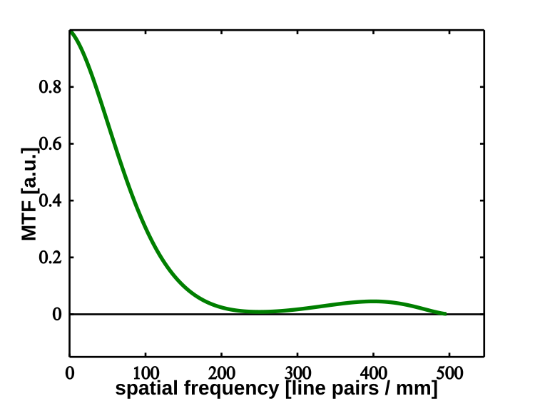

> *the Fourier transform of the point spread function, describing exactly how well an instrument transmits different spatial frequencies*

---

## core physical intuition

If you look at the sky as a complex tapestry of sine waves of varying spatial frequencies (broad blobs are low frequencies, sharp edges are high frequencies), any optical system acts as a filter. It cannot perfectly capture all details. 

The Optical Transfer Function (OTF) tells you precisely how this filtering happens. It is a complex-valued function. Its magnitude, the Modulation Transfer Function (MTF), tells you how much contrast is preserved at a given spatial frequency. Its argument, the Phase Transfer Function (PTF), tells you if those frequency components are shifted. Because an aperture has a finite size, there is always a hard cutoff frequency beyond which the system transmits absolutely zero information.

---

## key derivation & equations

The OTF is the 2D Fourier transform of the Point Spread Function (PSF):

$$ \mathrm{OTF}(\mathbf{u}) = \mathcal{F}\{\mathrm{PSF}(\mathbf{x})\} $$

where $\mathbf{u}$ represents the spatial frequency vector (usually measured in cycles per radian or cycles per arcsecond) and $\mathbf{x}$ is the spatial coordinate in the image plane.

For a monolithic circular aperture of diameter $D$, the absolute cutoff spatial frequency (the highest detail it can resolve) is:

$$ u_{\max} = \frac{D}{\lambda} $$

At this frequency and beyond, the OTF drops strictly to zero.

---

## astrophysical context

In single-dish astronomy, the OTF is a continuous, smoothly declining function out to $D/\lambda$. In astronomical interferometry, the array does not sample the OTF continuously. Instead, each pair of antennas (a baseline) measures the source structure at one very specific spatial frequency $(u,v)$. An interferometer essentially pokes discrete holes in the OTF plane. The entire goal of aperture synthesis is to collect enough discrete samples of the OTF to mathematically reconstruct the source brightness distribution.

---

## connections & zettel links

* parent moc: [Astronomical_Interferometry_MOC](../../04_Atlas/Astronomical_Interferometry_MOC.html)
* related zettels: [Point spread function](interf/Point%20spread%20function.html), [Abbe experiment and Fourier optics](interf/Abbe%20experiment%20and%20Fourier%20optics.html), [Aperture synthesis principle](interf/Aperture%20synthesis%20principle.html)
