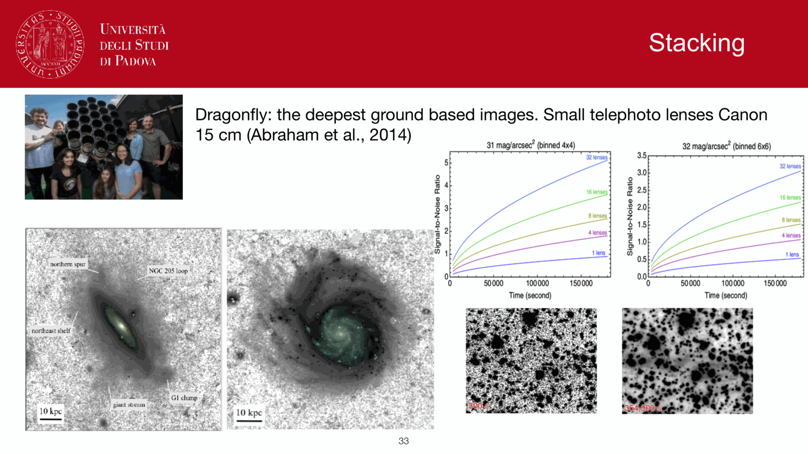
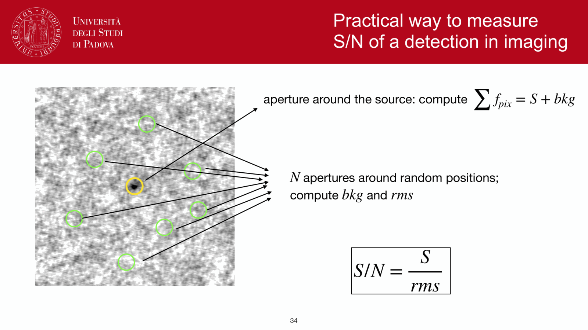

**PSF photometry** fits a model of the point-spread function to each source's pixel data, optimally weighting pixels and naturally handling source blending. essential for crowded fields where aperture photometry fails.

## the idea

the image of a star is the convolution of a delta function (the source) with the PSF. so the pixel counts in a region around a star are
$$D_{ij} = f \cdot P_{ij}(x_0, y_0) + S + \epsilon_{ij}$$
where $f$ is the total source flux, $P_{ij}(x_0, y_0)$ is the PSF model centered at $(x_0, y_0)$ evaluated at pixel $(i, j)$, $S$ is a local sky level, and $\epsilon_{ij}$ is noise.

the **PSF photometry** problem: solve for $f$, $x_0$, $y_0$, $S$ (and possibly a list of overlapping sources) by minimising 
$$\chi^2 = \sum_{ij} \frac{(D_{ij} - f P_{ij}(x_0, y_0) - S)^2}{\sigma_{ij}^2}$$

the optimisation simultaneously fits all detected sources in the field. **blending** is handled because overlapping PSF models compete in the fit.

## why it beats aperture in crowded fields

- **aperture** sums all flux in a circle, including contamination from nearby stars and uneven sky.
- **PSF fit** subtracts the model contribution of each star *while accounting for the others*, leaving only the genuine source flux.

in a globular cluster, where the local stellar density is hundreds of sources per square arcsecond, only PSF photometry produces clean magnitudes. classic examples: DAOPHOT (Stetson 1987), ALLFRAME, DOLPHOT.

## key requirements

### a good PSF model

usually built empirically:
1. select bright isolated stars in the image.
2. measure their actual pixel-level profiles.
3. average and subtract a smooth functional model (analytic Moffat or Gaussian + residuals).
4. allow spatial variation across the chip if necessary.

*HST* has a precomputed library of PSFs; ground-based images usually need per-image fitting.

### a clean detection list

you need to know where the sources are before fitting. typical workflow:
1. SExtractor detection on the image.
2. PSF photometry on each detected source.
3. iterative re-detection on the residual image to find sources hidden by bright neighbours.

## SNR advantage

with a well-constrained PSF, the SNR per source improves over aperture photometry by a factor depending on PSF shape and noise regime; typically $20$ to $40\%$ in sky-limited photometry. roughly: PSF photometry weights each pixel by its information content, which in a Gaussian PSF goes like the square of the PSF amplitude.

## limitations

- **PSF model accuracy**: errors in the PSF cause systematic photometry errors. PSF stability is critical (atmosphere, focus, telescope tracking).
- **highly variable PSF**: spatially or temporally; need sub-image PSFs.
- **galaxies**: not point sources, PSF photometry inappropriate. use surface-brightness fitting (galfit, profit) instead.

## standard packages

- **astropy.photutils.psf** in python
- **DAOPHOT II** (Stetson, IRAF era, fortran).
- **DOLPHOT** for HST + JWST imaging.
- **SExtractor + PSFEx** combo for survey pipelines.

## see also

- [[Aperture photometry]]
- [[Point Spread Function (PSF)]]
- [[The CCD equation]]
- [[CCD calibration steps]]
- [[Color-magnitude diagrams of clusters]]
- [[Photometric standard stars]]

---

## observational astrophysics course slides (Prof. Paolo Cassata)

*Point Spread Function (PSF) fitting for crowded stellar fields.*

*Mathematical PSF models (Gaussian, Moffat, empirical lookup tables).*

## Linked References

- [[Aperture photometry]]
- [[CCD detectors and SNR]]
- [[Linearity and saturation]]
- [[Python and IRAF tools for photometry]]
- [[Sersic profile]]
- [[Spectrum reduction pipeline]]
- [[The CCD equation]]
- [[Observational_Astrophysics_MOC]]

