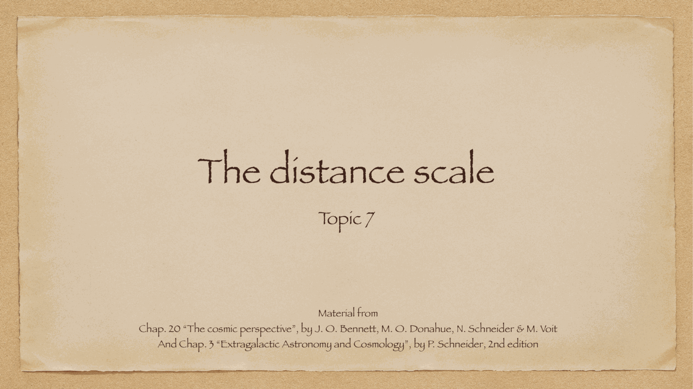
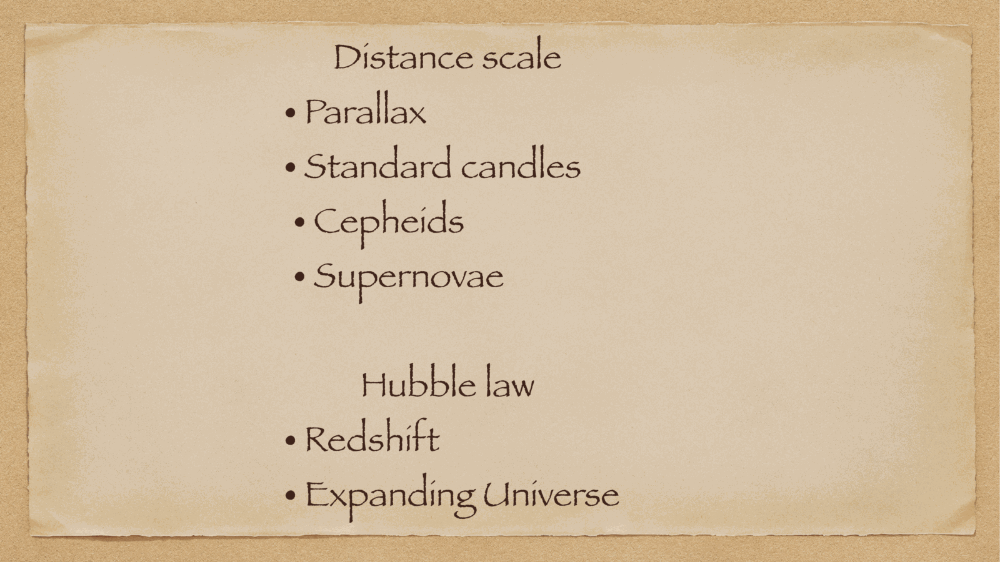
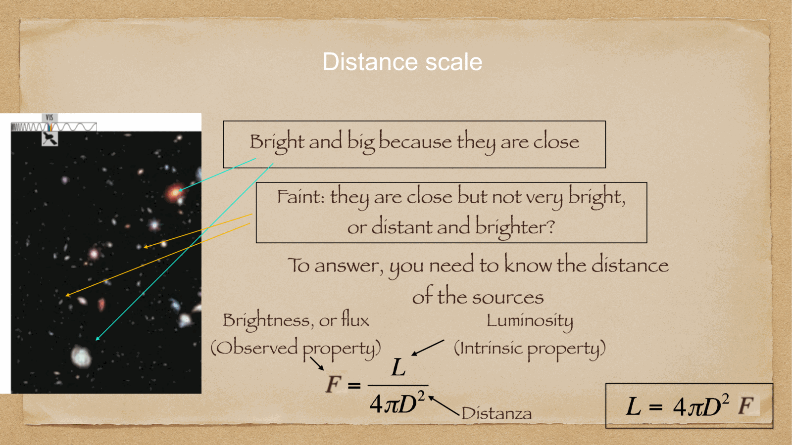
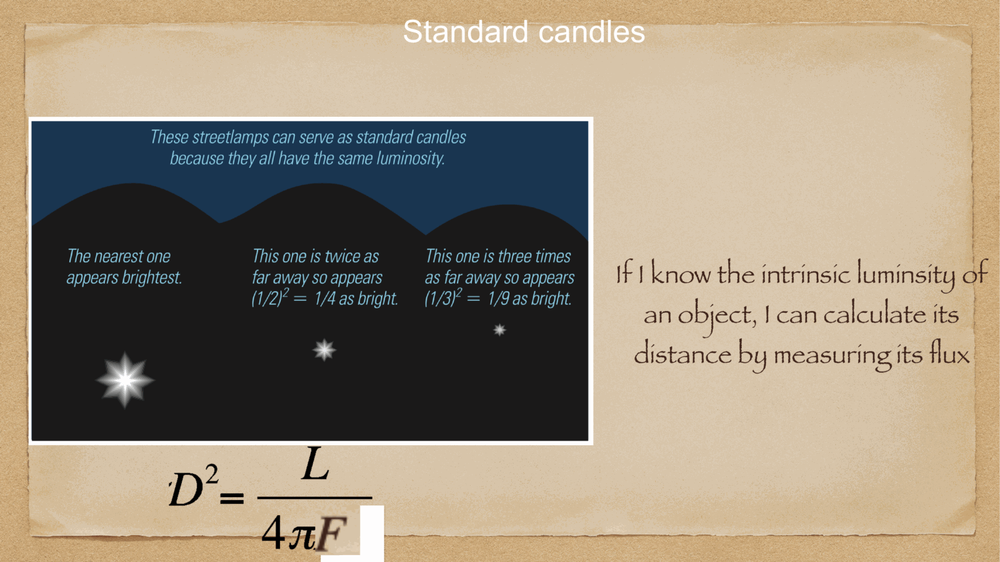
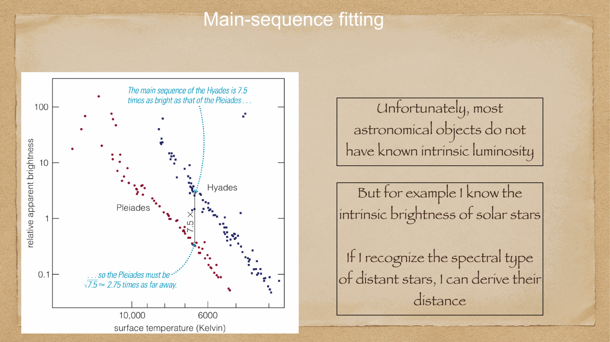
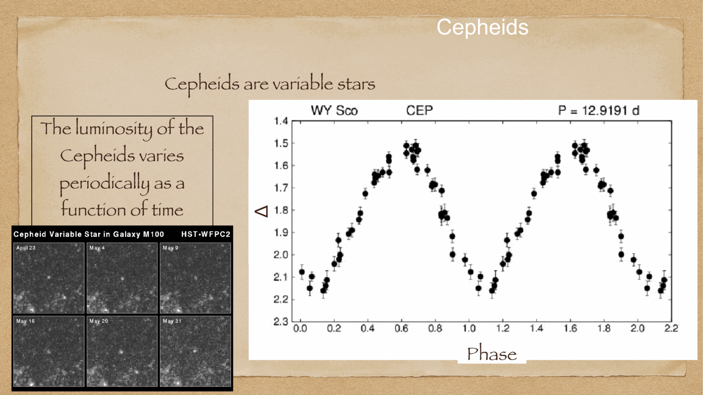

measuring astronomical distances is one of the most challenging and foundational tasks in astrophysics. because the cosmos cannot be probed with physical measuring rods, astronomers construct the **Cosmic Distance Ladder** (la scala delle distanze cosmiche): an interconnected chain of overlapping geometric, photometric, and cosmological methods where each rung calibrates the next.

---

## the architecture of the Cosmic Distance Ladder

no single method can span the vast gulf of cosmic space from nearby planets to distant quasars:
1. **Solar System baseline (Radar Ranging)**: radio pulses reflected off Venus and Mercury directly measure the astronomical unit ($1$ AU $= 149,597,870,700$ m) to millimeter precision.
2. **Nearby Stars (Trigonometric Parallax)**: uses Earth's $2$ AU orbital diameter as a baseline to measure distances geometrically out to $\sim 10$ kpc (ESA Gaia).
3. **Star Clusters (Main Sequence Fitting)**: calibrates the absolute magnitudes of main sequence stars in nearby clusters (Hyades, Pleiades) anchored by Gaia parallaxes.
4. **Nearby Galaxies (Primary Standard Candles — Cepheid Variables)**: bright pulsating stars whose luminosities are calibrated by parallax, detectable out to $\sim 30$ Mpc with HST.
5. **Cosmological Distances (Secondary Standard Candles — Type Ia Supernovae & Tully-Fisher)**: luminous explosions visible out to $z > 1$ ($d > 3000$ Mpc).
6. **Hubble Flow**: cosmological expansion velocity $v = H_0 d$.

---

## the concept of a Standard Candle (candela standard)

a **standard candle** is any astronomical source whose intrinsic luminosity $L$ (or absolute magnitude $M$) is known through an independent physical law or calibration:

measuring the received apparent flux $F$ (or apparent magnitude $m$) allows astronomers to invert the inverse-square law to determine distance $d$:

$$F = \frac{L}{4\pi d^2} \implies \boxed{\, d = \sqrt{\frac{L}{4\pi F}} \,}$$

or equivalently via the **distance modulus**:
$$\boxed{\, \mu = m - M = 5 \log_{10} d - 5 \implies d(\text{pc}) = 10^{\frac{m - M + 5}{5}} \,}$$

### requirements for an ideal standard candle:
1. **high luminosity**: must be bright enough to be detected at immense extragalactic distances.
2. **minimal intrinsic dispersion**: luminosity must be tightly predictable from observable parameters.
3. **well-understood physics**: clear physical mechanism governing energy output.
4. **robust local calibration**: must exist in nearby environments where geometric parallax can calibrate its zero-point.

---

## see also

- [[Fundamentals_Astrophysics_Cosmology_MOC]]
- [[Annual stellar parallax]]
- [[Cepheids and supernovae]]
- [[Type Ia supernovae as standard candles]]
- [[Hubble's law and cosmological redshift]]
- [[Magnitudes and photometric systems]]

## Linked References

- [[Annual stellar parallax]]
- [[Cepheids and supernovae]]
- [[Hubble's law and cosmological redshift]]
- [[Interstellar absorption]]
- [[Magnitudes and photometric systems]]
- [[Radiation quantities and inverse square law]]
- [[Type Ia supernovae as standard candles]]
- [[Fundamentals_Astrophysics_Cosmology_MOC]]

