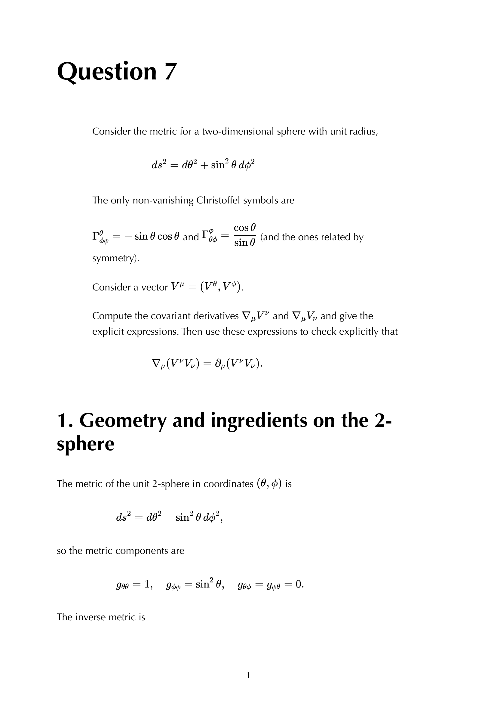

# Parallel transport and holonomy

---

### General Relativity Mathematical & Oral Defense Panel

*Question 7 Oral Exam Model Solution: Parallel transport of a vector along a latitude circle $\theta = \theta_0$ on $S^2$, covariant derivative equation $\nabla_{\dot{\gamma}} V^\mu = 0$, and derivation of the holonomy angle $\Delta\phi = 2\pi(1 - \cos\theta_0)$.*

*Cambridge Lecture Diagram: Holonomy on curved manifolds: non-commutativity of covariant derivatives and the Riemann curvature tensor definition.*

## Linked References

- [[General_Relativity_MOC]]

