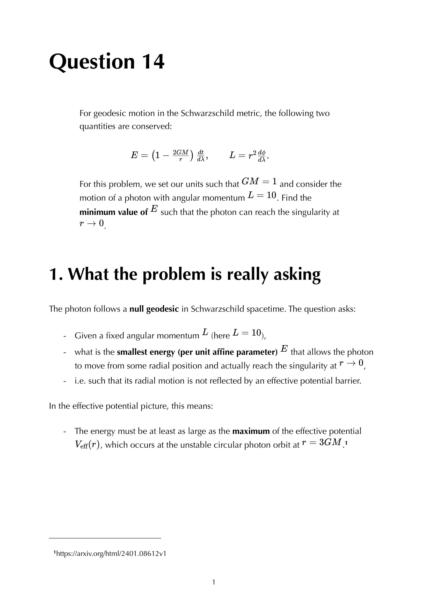


# Perihelion precession of Mercury

---

### General Relativity Mathematical & Oral Defense Panel

*Question 14 Oral Exam Model Solution: Relativistic Binet equation for planetary orbits $\frac{d^2 u}{d\phi^2} + u = \frac{GM}{L^2} + 3GM u^2$, perturbative derivation of the perihelion advance $\Delta\phi = \frac{6\pi GM}{c^2 a(1-e^2)}$, and verification of Mercury 43 arcsec/century.*


  <h4 class="backlinks-title">Linked References (1)</h4>
  <ul class="backlinks-list">
    <li class="backlink-item-wrap"><a href="../../04_Atlas/General_Relativity_MOC.html" class="backlink-item">General_Relativity_MOC</a></li>
  </ul>

