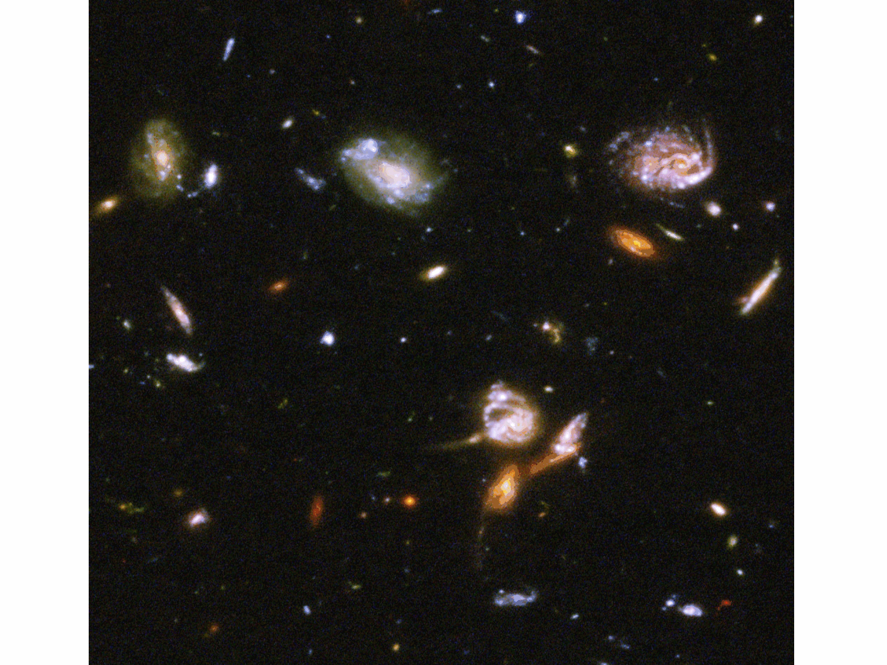
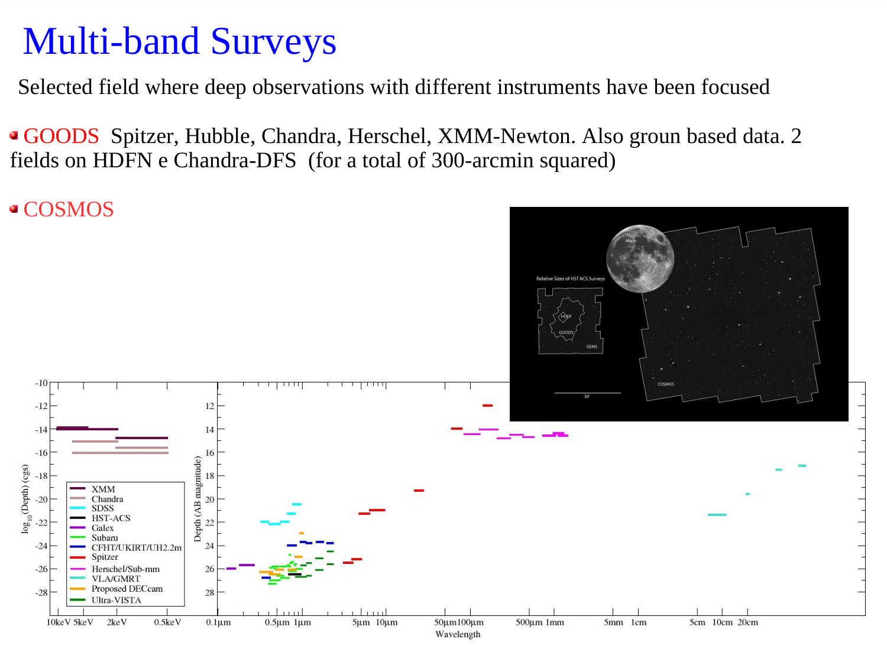
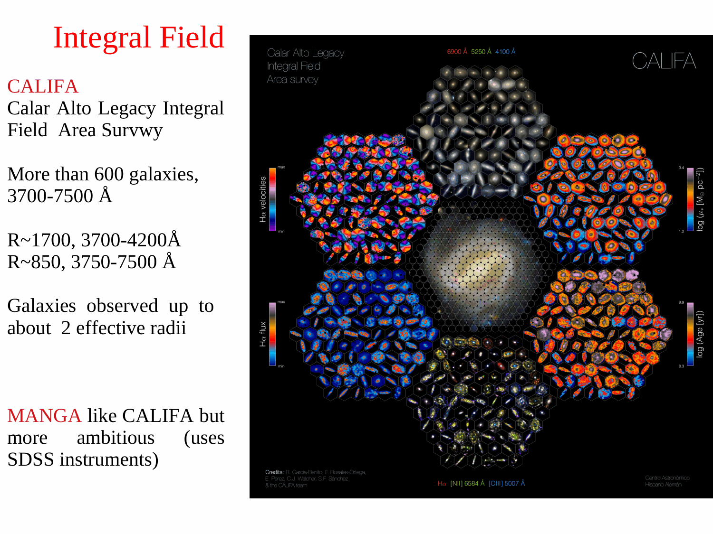
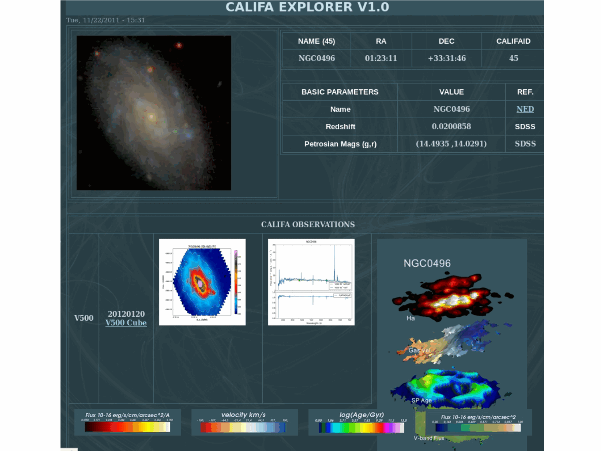
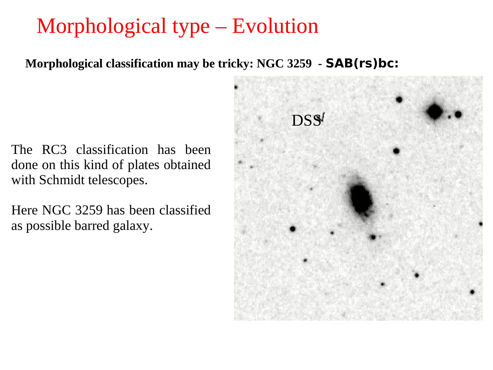
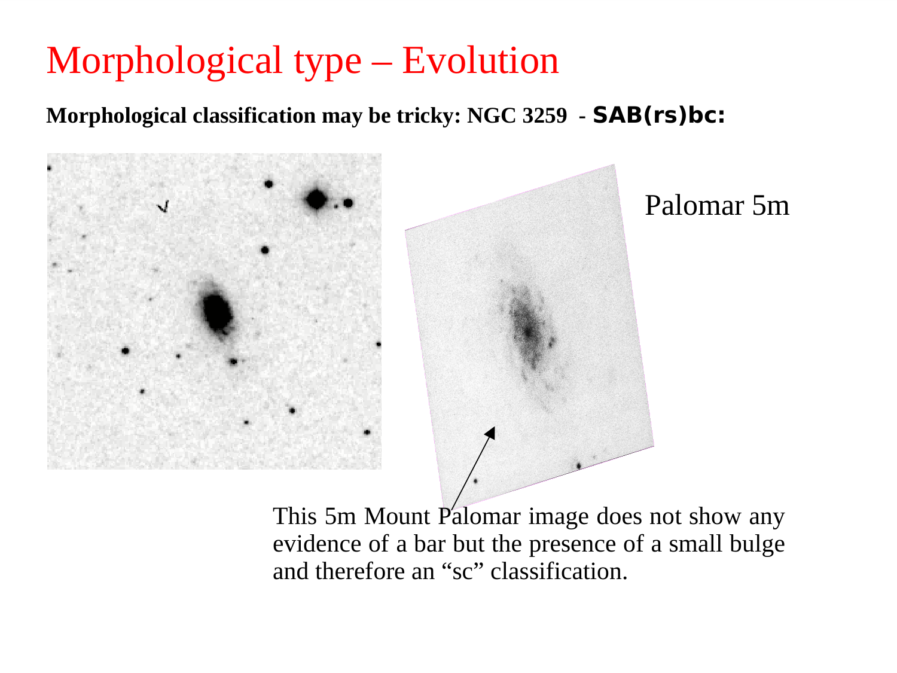

# The Petrosian Radius and Petrosian Photometry

## 1. Physical Motivation - Overcoming Cosmological Dimming

In extragalactic astronomy, measuring the total flux and spatial extent of a galaxy is complicated because galaxies lack sharp physical boundaries. Their surface brightness profiles fade smoothly into the Poisson noise of the night sky background.

Traditional size metrics suffer from severe systematic biases.
1. **Fixed Isophotal Radii** - Defining a galaxy size by a fixed surface brightness boundary (such as the Holmberg radius $R_{25}$ at $\mu_B = 25.0\,\mathrm{mag\,arcsec^{-2}}$) fails across cosmic time because cosmological expansion dims surface brightness by $(1+z)^4$ (the Tolman effect). Consequently, identical galaxies observed at higher redshifts appear systematically smaller and fainter, as outer regions drop below the isophotal threshold.
2. **Model-Dependent Profile Fitting** - Fitting Sersic or de Vaucouleurs profiles requires high signal-to-noise ratios and is prone to degeneracies when fitting overlapping components or irregular galaxies.

To solve this dilemma, Petrosian (1976) introduced a model-independent photometric radius defined by the shape of the light profile itself.

---

## 2. Unbroken Mathematical Formulation - The Petrosian Ratio

### Definition of the Petrosian Ratio $\eta(r)$
For an azimuthally averaged surface brightness profile $I(r)$, the **Petrosian ratio** $\eta(r)$ at radius $r$ is defined as the ratio of the local surface brightness at $r$ to the mean surface brightness enclosed within the circular aperture of radius $r$.

$$\boxed{\eta(r) \equiv \frac{I(r)}{\langle I(<r) \rangle} = \frac{I(r)}{\frac{2}{r^2} \int_0^r I(r') \, r' \, dr'}}$$

### Boundary Behavior of $\eta(r)$
1. At the galactic center ($r \to 0$), assuming a regular central core.
   $$\lim_{r \to 0} \langle I(<r) \rangle = I(0) \implies \eta(0) = 1$$
2. For any monotonically decreasing galaxy surface brightness profile ($dI/dr < 0$), the local surface brightness falls faster than the cumulative interior average. Therefore.
   $$\frac{d\eta}{dr} < 0$$
   The function $\eta(r)$ decreases smoothly and monotonically from $\eta(0) = 1$ toward $\lim_{r \to \infty} \eta(r) = 0$.

### Definition of the Petrosian Radius $r_P$
The **Petrosian radius** $r_P$ is defined as the unique radius at which $\eta(r)$ drops to a specified threshold value $\eta_P$.

$$\eta(r_P) = \eta_P$$

In the Sloan Digital Sky Survey (SDSS; Blanton et al. 2001; Strauss et al. 2002), the canonical threshold is.

$$\eta_P = 0.20$$

Physically, $r_P$ is the radius where the local surface brightness has fallen to exactly $20\%$ of the mean surface brightness within that radius.

---

## 3. Mathematical Proof of Cosmological Invariance (The Tolman Test)

In an expanding Friedmann-Robertson-Walker spacetime, the bolometric surface brightness of an astronomical source undergoes cosmological dimming.

$$I_{\rm obs}(r) = \frac{I_{\rm emit}(r)}{(1+z)^4}$$

For bandpass surface brightness, including the spectral K-correction $K(z)$ and passive evolutionary correction $E(z)$.

$$I_{\rm obs}(r, z) = I_{\rm emit}(r) \, (1+z)^{-4} \, 10^{-0.4 [K(z) + E(z)]} \equiv I_{\rm emit}(r) \cdot \mathcal{D}(z)$$

where $\mathcal{D}(z)$ is a spatial constant independent of radius $r$.

Now evaluate the observed Petrosian ratio at redshift $z$.

$$\eta_{\rm obs}(r, z) = \frac{I_{\rm obs}(r, z)}{\frac{2}{r^2} \int_0^r I_{\rm obs}(r', z) \, r' \, dr'} = \frac{I_{\rm emit}(r) \cdot \mathcal{D}(z)}{\frac{2}{r^2} \int_0^r \left[ I_{\rm emit}(r') \cdot \mathcal{D}(z) \right] r' \, dr'}$$

Factoring the cosmological dimming term $\mathcal{D}(z)$ out of the integral.

$$\eta_{\rm obs}(r, z) = \frac{\mathcal{D}(z) \cdot I_{\rm emit}(r)}{\mathcal{D}(z) \cdot \left[ \frac{2}{r^2} \int_0^r I_{\rm emit}(r') \, r' \, dr' \right]} = \frac{I_{\rm emit}(r)}{\langle I_{\rm emit}(<r) \rangle} = \eta_{\rm emit}(r)$$

The cosmological dimming factor cancels out identically in numerator and denominator.
Therefore, the physical radius $r_P$ where $\eta(r) = 0.20$ is **strictly independent of redshift**.

---

## 4. Unbroken Mathematical Derivation for Characteristic Profiles

### 1. The Exponential Disk Profile ($n = 1$)
Spiral galaxy disks follow an exponential radial surface brightness profile.

$$I(r) = I_0 e^{-r/h}$$

where $h$ is the disk scale length.

Compute the enclosed mean surface brightness.

$$\langle I(<r) \rangle = \frac{2}{r^2} \int_0^r I_0 e^{-r'/h} \, r' \, dr'$$

Perform integration by parts on $\int_0^r r' e^{-r'/h} dr'$.
Let $u = r' \implies du = dr'$, and $dv = e^{-r'/h} dr' \implies v = -h e^{-r'/h}$.

$$\int_0^r r' e^{-r'/h} dr' = \left[ -h r' e^{-r'/h} \right]_0^r + h \int_0^r e^{-r'/h} dr' = -h r e^{-r/h} - h^2 \left[ e^{-r'/h} \right]_0^r = h^2 \left[ 1 - \left(1 + \frac{r}{h}\right) e^{-r/h} \right]$$

Define the dimensionless radial variable $x \equiv r/h$. The mean interior surface brightness is.

$$\langle I(<x) \rangle = \frac{2 I_0 h^2}{r^2} \left[ 1 - (1 + x) e^{-x} \right] = \frac{2 I_0}{x^2} \left[ 1 - (1 + x) e^{-x} \right]$$

Now construct the Petrosian ratio $\eta(x)$.

$$\eta(x) = \frac{I_0 e^{-x}}{\frac{2 I_0}{x^2} \left[ 1 - (1 + x) e^{-x} \right]} = \frac{x^2 e^{-x}}{2 \left[ 1 - (1 + x) e^{-x} \right]} = \frac{x^2}{2 \left[ e^x - (1 + x) \right]}$$

Set $\eta(x_P) = 0.20$.

$$\frac{x_P^2}{2 [e^{x_P} - 1 - x_P]} = 0.20 \implies x_P^2 = 0.40 [e^{x_P} - 1 - x_P]$$

Solving this transcendental equation yields.

$$x_P = \frac{r_P}{h} \approx 3.6224$$

Recalling that the half-light effective radius of an exponential disk is $R_e \approx 1.6784 h$, we obtain.

$$r_P \approx 2.158 \, R_e$$

#### Enclosed Flux Fractions
The total luminosity of an exponential disk is $L_{\rm tot} = 2\pi I_0 h^2$.
The cumulative flux enclosed within radius $r$ is.

$$F(<r) = 2\pi \int_0^r I(r') r' dr' = 2\pi I_0 h^2 \left[ 1 - (1 + x) e^{-x} \right] = L_{\rm tot} \left[ 1 - (1 + x) e^{-x} \right]$$

- **Enclosed Flux within $r_P$ ($x = 3.622$)** -
  $$\frac{F(<r_P)}{L_{\rm tot}} = 1 - (1 + 3.622) e^{-3.622} \approx 1 - 4.622(0.0267) \approx 0.8765 \quad (87.7\%)$$
- **Enclosed Flux within the Petrosian Aperture $2 r_P$ ($x = 7.245$)** -
  $$\frac{F(<2 r_P)}{L_{\rm tot}} = 1 - (1 + 7.245) e^{-7.245} \approx 1 - 8.245(0.00071) \approx 0.9941 \quad (99.4\%)$$
For an exponential disk, the standard SDSS aperture of $2 r_P$ captures more than $99\%$ of the total galaxy light.

### 2. The de Vaucouleurs Profile ($n = 4$)
For elliptical galaxies described by $I(r) = I_e \exp\{-7.6692 [(r/R_e)^{1/4} - 1]\}$.
Numerical solving of $\eta(r_P) = 0.20$ gives.

$$r_P \approx 2.15 \, R_e$$

- **Enclosed Flux within $r_P$** -
  $$\frac{F(<r_P)}{L_{\rm tot}} \approx 0.55 \quad (55\%)$$
- **Enclosed Flux within $2 r_P$** -
  $$\frac{F(<2 r_P)}{L_{\rm tot}} \approx 0.82 \quad (82\%)$$

### The Aperture Flux Discrepancy on the Oral Exam
Why does the Petrosian flux within $2 r_P$ recover $99\%$ of the light for late-type spirals, but only $82\%$ for giant ellipticals?
Because de Vaucouleurs profiles have high Sersic indices ($n=4$), which produce very extended power-law wings. A significant fraction ($18\%$) of the total stellar light resides in the faint outer envelope beyond $2 r_P$.
In SDSS, this effect causes the raw Petrosian magnitudes of luminous ellipticals to be systematically fainter by $\sim 0.2\,\mathrm{mag}$ compared to model magnitudes derived from 2D profile fitting.

---

## 5. SDSS Petrosian Parameters and Definitions

In the SDSS photometric pipeline (Stoughton et al. 2002; Blanton et al. 2001).
1. **Petrosian Flux ($F_P$)** - The flux measured inside a circular aperture of radius $2 r_P$.
   $$F_P = 2\pi \int_0^{2 r_P} I(r) \, r \, dr$$
2. **Petrosian Magnitude ($m_P$)** - Calibrated on the AB magnitude system.
   $$m_P = -2.5 \log_{10}(F_P) + \text{zeropoint}$$
3. **Petrosian Radii ($r_{50}$ and $r_{90}$)** - Radii enclosing $50\%$ and $90\%$ of the total Petrosian flux $F_P$.
4. **Concentration Index ($C$)** - Defined as.
   $$C \equiv \frac{r_{90}}{r_{50}}$$
   Used in SDSS to separate early-type galaxies ($C > 2.6$) from late-type galaxies ($C < 2.6$).

---

## 6. Blackboard Observational Blueprint

When illustrating the Petrosian radius on the blackboard.

```text
       Petrosian Ratio eta(r)
         ^
     1.0 | *
         |   *
     0.8 |     *
         |       *
     0.6 |         *
         |           *
     0.4 |             *
         |               *
     0.2 + - - - - - - - - * - - - - - - - - - - - - -  Threshold eta = 0.20
         |                   *
     0.0 +===+===============+===+===============+======> Radius r
         0  1 h             r_P 4 h             2*r_P
                           (3.62 h)            (7.24 h)

       Enclosed Flux Fraction F(<r) / L_tot
         ^
     1.0 |                                       ======== 99.4% (Exponential Disk)
         |                             - - - - - - - - -  82.0% (de Vaucouleurs)
     0.8 |                   * * * * *
         |                 *
     0.5 |        * * * *
         +===+===============+===+===============+======> Radius r
         0  1 h             r_P                 2*r_P
```

### Key Blackboard Features
- **Top Panel** - Vertical axis $\eta(r)$ from $0$ to $1.0$; horizontal axis radius $r$. Show monotonic decline starting at $(0, 1.0)$, crossing the horizontal dashed line $\eta = 0.20$ at $r_P \approx 3.62 h$ for an exponential disk.
- **Bottom Panel** - Curve of growth $F(<r)/L_{\rm tot}$ showing asymptotic saturation. Mark $F(<r_P) \approx 88\%$ and $F(<2 r_P) \approx 99.4\%$ for spirals; mark $F(<2 r_P) \approx 82\%$ for ellipticals.
- **Cosmological Proof** - Write the cancellation $\eta(r, z) = \frac{\mathcal{D}(z) I_0}{\mathcal{D}(z) \langle I_0 \rangle} = \eta_0(r)$ clearly on the side.

---

## 7. Textbook and Course Citations

- **Prof. Alessandro Pizzella Course Dispensa**
  - File - `dispense_LF1_1_eng-1.pdf`
  - Chapter 2, Section 2.2 "The Petrosian System", pages 12-16 (mathematical definition of $\eta(r)$, $(1+z)^4$ cancellation proof, SDSS $2 r_P$ aperture, and enclosed light fractions).
- **Student Synthesis Document**
  - File - `Astrophysics_of_Galaxies.tex`
  - Section 3 "SDSS Photometry and Petrosian Parameters", pages 8-9 (explicit integration for exponential disks, $r_P \approx 3.62 h$, and concentration index).
- **Mo, van den Bosch & White (2010), *Galaxy Formation and Evolution***
  - File - `Houjun Mo, Frank van den Bosch, Simon White - Galaxy Formation and Evolution (2010, Cambridge University Press) - libgen.li.pdf`
  - Chapter 2, Section 2.2.2 "Aperture Photometry", pages 60-63.
- **Primary Literature References**
  - Petrosian, V. 1976, ApJ, 209, L1.
  - Blanton, M. R., et al. 2001, AJ, 121, 2358.
  - Strauss, M. A., et al. 2002, AJ, 124, 1810.

---

## 8. See Also

- [[Sersic profile]]
- [[De Vaucouleurs and exponential profiles]]
- [[CAS galaxy classification]]
- [[Color bimodality of galaxies]]
- [[SDSS overview]]
- [[Astrophysics_of_Galaxies_MOC]]

---

## 9. Astrophysics of Galaxies Figures and Slides (Prof. Alessandro Pizzella)


*Petrosian (1976) photometric radius - aperture definition independent of cosmological surface brightness dimming (1+z)^4.*


*Petrosian ratio eta(r) - ratio of local surface brightness at radius r to average surface brightness inside r.*


*Standard SDSS Petrosian radius - radius r_P where eta(r_P) = 0.2.*


*Petrosian flux - total flux enclosed within 2 * r_P (recovers ~98% of light for exponential disk, ~80% for de Vaucouleurs).*

---

## 10. Lecture Slides and Reference Figures (Prof. Alessandro Pizzella)














## Linked References

- [[CAS galaxy classification]]
- [[De Vaucouleurs and exponential profiles]]
- [[Low surface brightness galaxies]]
- [[Luminosity function definition]]
- [[SDSS overview]]
- [[Schechter function in magnitudes]]
- [[Sersic profile]]
- [[Astrophysics_of_Galaxies_MOC]]


