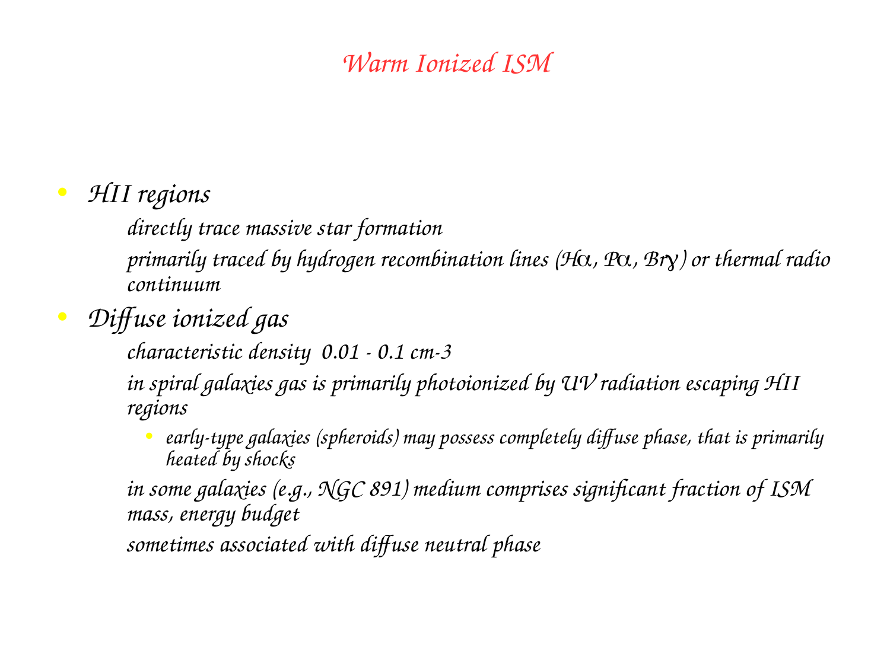
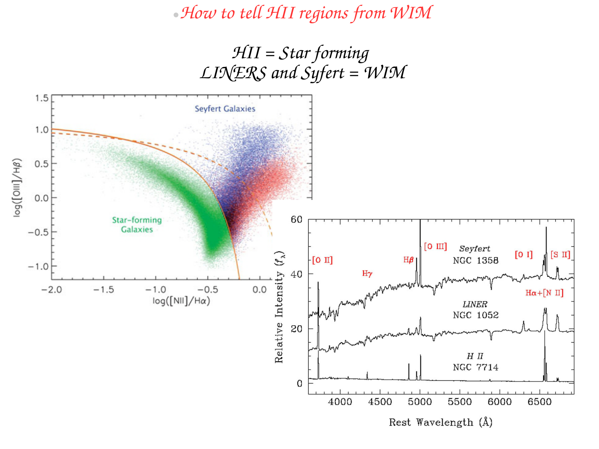
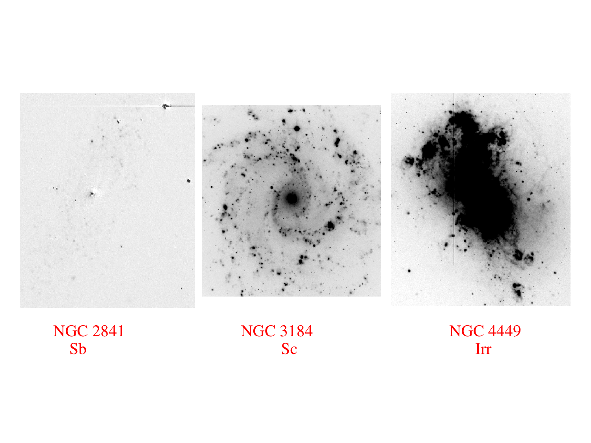

# Photodissociation regions PDRs

Photodissociation regions (PDRs, also termed photon-dominated regions) are the predominantly neutral boundary layers of the interstellar medium where far-ultraviolet radiation (FUV, with photon energies $6 \text{ eV} < h\nu < 13.6 \text{ eV}$) completely governs the thermal balance, chemistry, and structural state of the gas. Located at the interfaces between ionized H II regions and dense molecular clouds, PDRs host the critical transition of hydrogen from atomic ($H^0$) to molecular ($H_2$) form, and of carbon from singly ionized ($C^+$) to neutral ($C^0$) and ultimately to carbon monoxide ($CO$). Gas heating in PDRs is driven primarily by the photoelectric ejection of electrons from polycyclic aromatic hydrocarbons (PAHs) and small dust grains, while cooling is dominated by far-infrared fine-structure forbidden lines, most prominently $[C\text{ II}]\ 158\ \mu\text{m}$ and $[O\text{ I}]\ 63\ \mu\text{m}$. Far-infrared and sub-millimeter line emission from PDRs accounts for up to $1\%$ of the total bolometric luminosity of star-forming galaxies, making PDR diagnostics indispensable for tracing the cold gas mass, star formation activity, and ISM structure across cosmic time from the Milky Way to $z > 7$.

---

## 1. Physical Environment and Incident Radiation Field

### Spectral Energy Regime of PDR Radiation
A PDR is defined by the selective exclusion of Lyman continuum ionizing photons ($h\nu \ge 13.6$ eV). Ionizing radiation from massive OB stars is absorbed within the Strömgren sphere at the ionization front. However, non-ionizing FUV photons in the energy range
$$6 \text{ eV} < h\nu < 13.6 \text{ eV} \quad (912 \text{ \AA} < \lambda < 2066 \text{ \AA})$$
escape the H II region and penetrate deeply into the surrounding neutral gas, because the photoionization cross section of neutral hydrogen drops to zero for $h\nu < 13.6$ eV. 

### Radiation Field Normalization (The Habing Unit)
The intensity of the incident FUV radiation field is conventionally parameterized by the dimensionless Habing parameter $G_0$ (Habing 1968), defined relative to the local interstellar radiation field (ISRF) in the solar neighborhood
$$G_0 \equiv \frac{u_{\rm FUV}}{u_{\rm Habing}} = \frac{1}{5.29 \times 10^{-14} \text{ erg cm}^{-3}} \int_{912 \text{ \AA}}^{2400 \text{ \AA}} u_\lambda d\lambda$$
In terms of one-sided directional FUV energy flux
$$F_{\rm Habing} = 1.6 \times 10^{-3} \text{ erg cm}^{-2} \text{ s}^{-1} \approx 1.6 \times 10^{-6} \text{ W m}^{-2}$$
Alternatively, the Draine field $\chi$ (Draine 1978) is related via $\chi \approx 1.71 G_0$.
The physical environment of a PDR is fully characterized by two master parameters
1. The incident FUV radiation intensity $G_0$ (ranging from $G_0 \sim 1$ in the diffuse ISM to $G_0 \sim 10^3 - 10^5$ in intense starbursts and adjacent to O-stars).
2. The total hydrogen gas volume density $n_H = n(H) + 2n(H_2)$ (ranging from $10 \text{ cm}^{-3}$ in diffuse clouds to $10^4 - 10^7 \text{ cm}^{-3}$ in dense cloud edges).

The physical structure is governed by the ratio $G_0 / n_H$, which determines the ionization state, chemical transition depths, and gas temperature.

---

## 2. Complete Mathematical Physics of Molecular Photodissociation and Self-Shielding

### The Solomon Two-Step Photodissociation of $H_2$
Unlike many diatomic molecules, molecular hydrogen cannot undergo direct single-photon photodissociation from its ground electronic state ($X^1\Sigma_g^+$) because the dipole transition from the bound ground state directly into the unbound continuum is quantum mechanically forbidden.
Instead, photodissociation proceeds through the two-step Solomon process (Stecher & Williams 1967)
1. Step 1 (Resonant Electronic Excitation) - An FUV photon in the Lyman band ($B^1\Sigma_u^+ \leftarrow X^1\Sigma_g^+$ at $912 - 1108$ \AA) or Werner band ($C^1\Pi_u \leftarrow X^1\Sigma_g^+$ at $912 - 1008$ \AA) is resonantly absorbed by an $H_2$ molecule in a discrete vibrational level of the ground electronic state
$$H_2(X^1\Sigma_g^+, v''=0) + h\nu_{\rm LW} \to H_2^*(B^1\Sigma_u^+ \text{ or } C^1\Pi_u, v')$$
2. Step 2 (Spontaneous Radiative Decay) - The excited electronic state has a brief lifetime ($\tau \sim 10^{-9}$ s) and decays spontaneously back to the ground electronic state ($X^1\Sigma_g^+$) via dipole emission. The branching ratio is governed by the Franck-Condon factors
   - Bound decay ($\sim 85-90\%$ probability) - Decays to a bound vibration-rotation level of the ground state, emitting ultraviolet and near-infrared fluorescent lines (such as the $H_2$ 1-0 S(1) transition at $2.1218\ \mu\text{m}$). The molecule survives intact.
   - Unbound dissociative decay ($\sim 10-15\%$ probability) - Decays into the vibrational continuum of the ground electronic state. The two hydrogen atoms fly apart with excess kinetic energy
$$H_2^* \to H(1s) + H(1s) + \Delta E_{\rm kin}$$

### Unbroken Derivation of $H_2$ Self-Shielding and Transition Depth
In an unshielded radiation field, the unattenuated photodissociation rate of $H_2$ is
$$R_{\rm diss, 0} \approx 3.4 \times 10^{-11} G_0 \text{ s}^{-1}$$
As radiation penetrates into the cloud, two processes attenuate the dissociating flux
1. Continuous dust absorption, characterized by dust optical depth $\tau_{\rm dust} \approx 2.5 A_V / 1.086 \approx 2.3 A_V$.
2. Resonant line absorption by $H_2$ molecules themselves. Because the Lyman-Werner bands consist of narrow absorption lines, the line centers rapidly become optically thick at very low column densities ($N(H_2) \sim 10^{14} \text{ cm}^{-2}$). This phenomenon is known as self-shielding.

The effective photodissociation rate at depth is
$$R_{\rm diss}(N) = R_{\rm diss, 0} \times \Theta[N(H_2)] \times e^{-2.5 A_V}$$
where $\Theta[N(H_2)]$ is the dimensionless $H_2$ self-shielding function (Draine & Bertoldi 1996)
$$\Theta[N(H_2)] \approx \frac{0.965}{\left(1 + \frac{x}{b_5}\right)^2} + \frac{0.035}{(1 + x)^{0.5}} \exp\left[-8.5 \times 10^{-4}(1 + x)^{0.5}\right]$$
where $x \equiv N(H_2) / (10^{14} \text{ cm}^{-2})$ and $b_5 \equiv b / (10^5 \text{ cm s}^{-1})$ is the Doppler broadening parameter. For large column densities, $\Theta \propto N(H_2)^{-0.75}$.

#### Equilibrium Condition at the $H \to H_2$ Front
In steady state, the rate of $H_2$ photodissociation per unit volume must balance the rate of $H_2$ formation on the surfaces of dust grains
$$n(H_2) R_{\rm diss}(N) = R_{\rm form} n_H n(H)$$
where the dust grain catalytic formation rate is $R_{\rm form} \approx 3 \times 10^{-17} \text{ cm}^3 \text{ s}^{-1}$.
At the transition boundary where hydrogen is half atomic and half molecular ($n(H) \approx 2 n(H_2) \approx n_H / 2$)
$$\frac{n_H}{4} R_{\rm diss, 0} \Theta[N(H_2)] e^{-\tau_{\rm dust}} = R_{\rm form} n_H \left(\frac{n_H}{2}\right)$$
Cancelling $n_H$
$$\Theta[N(H_2)] e^{-\tau_{\rm dust}} = \frac{2 R_{\rm form} n_H}{R_{\rm diss, 0}} \approx \frac{2 \times (3 \times 10^{-17}) n_H}{3.4 \times 10^{-11} G_0} \approx 1.8 \times 10^{-6} \left(\frac{n_H}{G_0}\right)$$
Because $\Theta[N(H_2)]$ drops by four orders of magnitude between $N(H_2) = 10^{14}$ and $10^{18} \text{ cm}^{-2}$, this condition is satisfied at an extraordinarily small visual extinction
$$A_V(H/H_2) \approx 0.1 - 1.0 \text{ mag}$$
The transition from atomic hydrogen to molecular hydrogen occurs abruptly in a thin surface sheet.

---

## 3. Chemical Stratification - The Onion-Skin Model

Because different atomic and molecular species possess distinct ionization potentials, dissociation energies, and self-shielding properties, a PDR naturally organizes into a chemically stratified, layered structure as visual extinction $A_V$ increases into the cloud.

```
+========================================================================================+
| Layer Zone   | Visual Depth (Av) | Hydrogen State | Carbon State   | Dominant Coolant  |
+========================================================================================+
| 1. Surface   | Av < 0.1 mag      | H+ (Ionized)   | C+ (Ionized)   | [O III], [N II]   |
| 2. Outer PDR | 0.1 < Av < 1.5    | H0 (Atomic)    | C+ (Ionized)   | [C II] 158 um     |
| 3. Intermed. | 1.5 < Av < 3.5    | H2 (Molecular) | C+ / C0        | [C II], [O I]     |
| 4. Deep PDR  | 3.5 < Av < 6.0    | H2 (Molecular) | C0 / CO        | [O I] 63 um       |
| 5. Core      | Av > 6.0 mag      | H2 (Molecular) | CO (Molecular) | CO (J=1-0, 2-1)   |
+========================================================================================+
```

### Carbon Photoionization and the $C^+ \to C^0 \to CO$ Transition
1. Carbon First Ionization - Carbon has an ionization potential of $I_C = 11.26 \text{ eV} < 13.6 \text{ eV}$. Photons with energies between $11.26$ eV and $13.6$ eV penetrate past the Strömgren ionization front without being absorbed by atomic hydrogen. Consequently, carbon remains completely singly ionized as $C^+$ throughout the outer layers of the PDR.
2. CO Photodissociation - The carbon monoxide molecule is photodissociated by FUV photons with energies between $11.09$ eV and $13.6$ eV. Unlike $H_2$, the cosmic abundance of carbon is much lower ($C/H \approx 1.4 \times 10^{-4}$), so $CO$ self-shielding is weaker. $CO$ requires significant dust extinction ($A_V \ge 2-4$ mag) before dust grains attenuate the dissociating photons.
3. The CO-Dark Molecular Gas Reservoir - Because $H_2$ self-shields at $A_V \approx 0.1 - 1.0$ mag while $CO$ cannot survive until $A_V \approx 2 - 4$ mag, there exists a vast intermediate layer of the cloud where hydrogen is fully molecular ($H_2$) but carbon remains $C^+$ or neutral $C^0$. In this regime, no $CO$ rotational emission is produced! This component is designated CO-dark molecular gas and accounts for $30\\%$ to $60\\%$ of the total molecular gas mass in low-metallicity galaxies. It is detected directly via $[C\text{ II}]\ 158\ \mu\text{m}$ emission.

---

## 4. Complete Thermal Balance - Heating and Cooling Mechanics

The equilibrium gas temperature $T_{\rm gas}(A_V)$ is determined at every depth by the exact local balance between volumetric heating and cooling rates
$$\Gamma_{\rm tot}(A_V) = \Lambda_{\rm tot}(A_V, T_{\rm gas})$$

### Gas Heating Mechanisms
1. Photoelectric Heating from Dust Grains and PAHs
   The dominant heating source in PDRs. When an FUV photon ($h\nu > W$, where $W \approx 4 - 6$ eV is the work function) is absorbed by a dust grain or PAH molecule, an energetic photoelectron is ejected. The electron thermalizes with the gas via inelastic Coulomb collisions.
   The volumetric photoelectric heating rate is
   $$\Gamma_{\rm PE} \approx 1.0 \times 10^{-24} \epsilon_{\rm PE} n_H G_0 e^{-1.8 A_V} \quad [\text{erg cm}^{-3} \text{ s}^{-1}]$$
   The photoelectric efficiency $\epsilon_{\rm PE}$ depends on the grain charging parameter $\gamma = G_0 T^{1/2} / n_e$. For neutral grains, $\epsilon_{\rm PE} \sim 1 - 3\\%$; for positively charged grains (high $\gamma$), the work function increases and efficiency drops to $\sim 0.1\\%$.
2. $H_2$ Photodissociation Heating - Each dissociative transition through the Solomon process releases $\sim 0.4$ eV of kinetic energy directly to the two ejected hydrogen atoms.
3. $H_2$ Collisional De-excitation (FUV Pumping) - After bound UV absorption, cascade through vibrational levels can be collisionally de-excited in dense gas ($n_H > 10^4 \text{ cm}^{-3}$), converting vibrational energy into thermal motion.
4. Cosmic Ray Heating - Dominates in the deep, dark core ($A_V > 10$), where cosmic ray protons ionize $H_2$ ($\Gamma_{\rm CR} \approx 2 \times 10^{-27} n_H \text{ erg cm}^{-3} \text{ s}^{-1}$).

### Gas Cooling via Fine-Structure Forbidden Lines
1. $[C\text{ II}]\ 158\ \mu\text{m}$ Line Cooling
   The singly ionized carbon ion ($C^+$) has a $2p\ ^2P$ ground state split by spin-orbit coupling into two fine-structure levels
   - Lower level $^2P_{1/2}$ (statistical weight $\omega = 2$)
   - Upper level $^2P_{3/2}$ (statistical weight $\omega = 4$)
   The transition wavelength is $\lambda = 157.74\ \mu\text{m}$ ($\nu = 1900.5$ GHz), corresponding to an excitation energy of
   $$\Delta E / k_B = 91.2 \text{ K}$$
   The spontaneous Einstein transition probability is $A_{21} = 2.36 \times 10^{-6} \text{ s}^{-1}$.
   The critical density for collisions with atomic hydrogen at $T = 100$ K is
   $$n_{\rm crit}(C^+) \approx 3.0 \times 10^3 \text{ cm}^{-3}$$
   Because $\Delta E / k_B$ is readily excited at $T \sim 50 - 300$ K, and carbon is an abundant element in its dominant ionization state, $[C\text{ II}]\ 158\ \mu\text{m}$ is the single most powerful cooling line of the neutral interstellar medium.
2. $[O\text{ I}]\ 63\ \mu\text{m}$ Line Cooling
   Neutral oxygen ($O^0$) has an ionization potential of $13.62 \text{ eV} > 13.6 \text{ eV}$, so it remains neutral throughout the PDR. Its $2p^4\ ^3P$ ground state is split into three levels ($^3P_2, ^3P_1, ^3P_0$).
   The $^3P_1 \to\ ^3P_2$ transition at $\lambda = 63.18\ \mu\text{m}$ has an excitation energy of
   $$\Delta E / k_B = 227.7 \text{ K}$$
   The spontaneous transition probability is $A = 8.95 \times 10^{-5} \text{ s}^{-1}$, yielding a critical density of
   $$n_{\rm crit}(O^0) \approx 4.7 \times 10^5 \text{ cm}^{-3}$$
   $[O\text{ I}]\ 63\ \mu\text{m}$ replaces $[C\text{ II}]$ as the primary coolant in warm, dense PDR environments ($n_H > 10^4 \text{ cm}^{-3}, G_0 > 10^3$).

---

## 5. Blackboard Blueprint and Observational Graph Literacy

```
             PDR ONION-SKIN CHEMICAL STRATIFICATION (BLACKBOARD SKETCH)
   Incident FUV
    Radiation      IONIZATION          H -> H2            C+ -> C -> CO
   (6-13.6 eV)       FRONT           TRANSITION            TRANSITION
      ===>             |                 |                     |
      ===>             |                 |                     |
                       v                 v                     v
   +===============+=======+=================+=====================+==============+
   | H II REGION   |  H I  | CO-DARK GAS     |   TRANSITION ZONE   | MOLECULAR    |
   | Fully Ionized |  Zone | (H2 + C+)       |   (H2 + C0 + CO)    | CLOUD CORE   |
   | H+, He+, C++  |  H0   | H2 molecular    |   CO forming        | H2, CO, Dust |
   | T ~ 10,000 K  |  C+   | C+ persists     |   Dust extinction   | T ~ 10-20 K  |
   +===============+=======+=================+=====================+==============+
   Av = 0         0.01    0.1               1.0                   4.0            10.0
   
   Dominant        [O III] [C II] 158 um     [C II] 158 um         CO J=1->0
   Cooling - [N II]  [O I]  63 um      [O I]  63 um          CO J=2->1

             GAS TEMPERATURE AND RELATIVE ABUNDANCES VS DEPTH Av
   Relative Abundance / log10(T)
     +1.0 +--[T_gas ~ 10^3 K]
          |   \\
     +0.5 +    \\   n(H0)/n_H
          |     \\  ........           n(H2)/n_H
      0.0 +======\\ - ========\\======================== (Molecular Fraction ~ 1)
          |       \\ - \\
     -0.5 +        \\ - \\         n(CO)/n_C
          |         \\ - \\       ............
     -1.0 +          \\ - [T ~ 100 K]    /
          |           \\ - /
     -1.5 +            \\ - /
          +===+=========+==\\========+===========+===========+
             0.1          1.0                  5.0         10.0
                                Visual Extinction Av (mag)
```

### Blackboard Presentation Script for the Oral Examination
1. Draw the horizontal axis representing cloud depth in units of visual extinction $A_V$ from $0$ to $10$ magnitudes. Draw the incoming FUV radiation arrow ($6 - 13.6$ eV) on the left.
2. Mark the three spatial boundaries
   - Ionization front at $A_V \\approx 0.01$ (boundary of Strömgren sphere).
   - $H \\to H_2$ transition at $A_V \\approx 0.1 - 1.0$ mag, driven by $H_2$ self-shielding in the Lyman-Werner bands.
   - $C^+ \\to C^0 \\to CO$ transition at $A_V \\approx 2 - 4$ mag, requiring substantial dust extinction.
3. Explicitly highlight the CO-dark molecular gas zone between $A_V \\sim 0.5$ and $A_V \\sim 3$. Explain to Prof. Pizzella that in this layer, hydrogen is fully molecular ($H_2$), but carbon is singly ionized ($C^+$), meaning it emits $[C\\text{ II}]\\ 158\\ \\mu\\text{m}$ rather than $CO(J=1\\to 0)$.
4. Draw the temperature curve $T_{\\rm gas}(A_V)$, showing a drop from $T \\sim 10^4$ K in the H II region to $T \\sim 300-1000$ K at the PDR surface, and down to $T \\approx 10-20$ K in the dark interior.
5. Write down the two primary cooling lines - $[C\\text{ II}]\\ 158\\ \\mu\\text{m}$ ($^2P_{3/2} \\to\\ ^2P_{1/2}$, $\\Delta E / k_B = 91.2$ K, $n_{\\rm crit} \\approx 3000\\text{ cm}^{-3}$) and $[O\\text{ I}]\\ 63\\ \\mu\\text{m}$ ($^3P_1 \\to\\ ^3P_2$, $\\Delta E / k_B = 228$ K, $n_{\\rm crit} \\approx 5 \\times 10^5\\text{ cm}^{-3}$).

---

## 6. Exact Textbook and Literature Provenance

- Course Lecture Slides
  - `gal_ism-24..27` - PDR physical structure, FUV photon penetration, chemical stratification, and $[C\\text{ II}]$ cooling.
- Houjun Mo, Frank van den Bosch, Simon White, *Galaxy Formation and Evolution* (2010)
  - Chapter 9 - Star Formation in Galaxies (pages 440-450) - Molecular cloud chemistry, $H_2$ formation on dust grains, and PDR heating mechanisms.
- Primary Literature
  - Tielens & Hollenbach (1985, ApJ 291, 722) - *Photodissociation regions. I. Basic model*.
  - Hollenbach & Tielens (1999, Rev. Mod. Phys. 71, 173) - *Photodissociation regions in the interstellar medium of galaxies*.
  - Draine & Bertoldi (1996, ApJ 468, 269) - *Structure of Persistent Shocked PDRs and H2 Self-Shielding*.
  - Wolfire et al. (2003, ApJ 587, 278) - *The Neutral Hydrogen Critical Surface Density and Thermal Equilibrium*.
  - Wolfire et al. (2010, ApJ 716, 1191) - *The Dark Molecular Gas in the Galaxy*.

---

## 7. Cross-References and Related Notes

- [[Molecular clouds]] - Giant Molecular Clouds, CO kinematics, and Larson scaling relations
- [[H I regions]] - 21 cm line emission and two-phase thermal equilibrium
- [[H II region spectroscopy]] - Photoionized nebulae and Strömgren spheres
- [[Schmidt-Kennicutt law]] - Empirical relation between gas surface density and star formation rate
- [[Astrophysics_of_Galaxies_MOC]] - Master Map of Content for course

---

## 8. Course Slides and Figures


*Figure 1 - PDR onion-skin stratification diagram from Tielens & Hollenbach (1985).*


*Figure 2 - Fine-structure energy level diagrams for C II and O I.*


*Figure 3 - Heating and cooling rates as a function of depth into the cloud.*


## Linked References

- [[Cooling curve]]
- [[H II region spectroscopy]]
- [[Intergalactic medium]]
- [[Molecular clouds]]
- [[Astronomical_Spectroscopy_MOC]]
- [[Astrophysics_of_Galaxies_MOC]]


