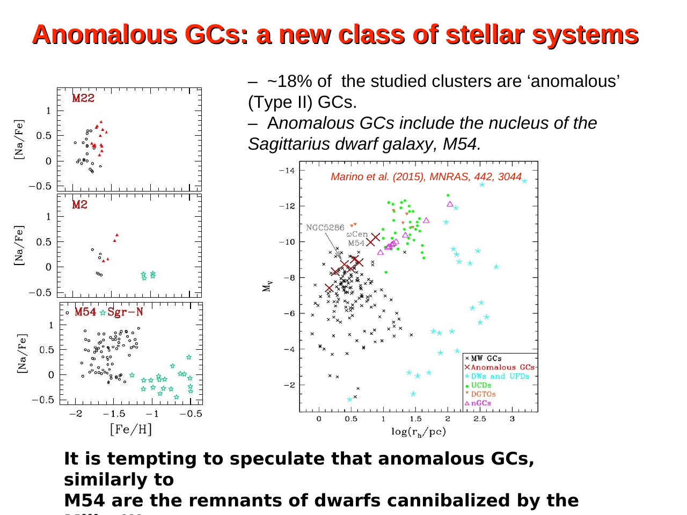
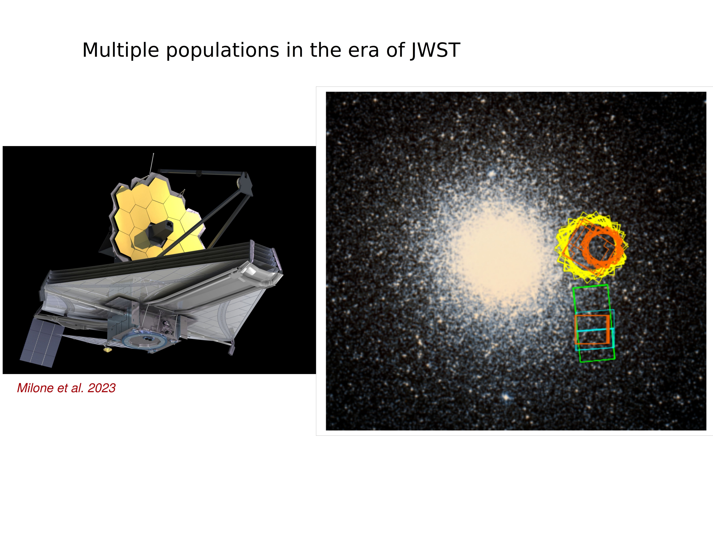
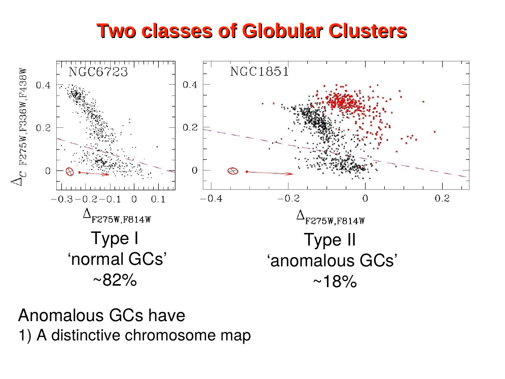
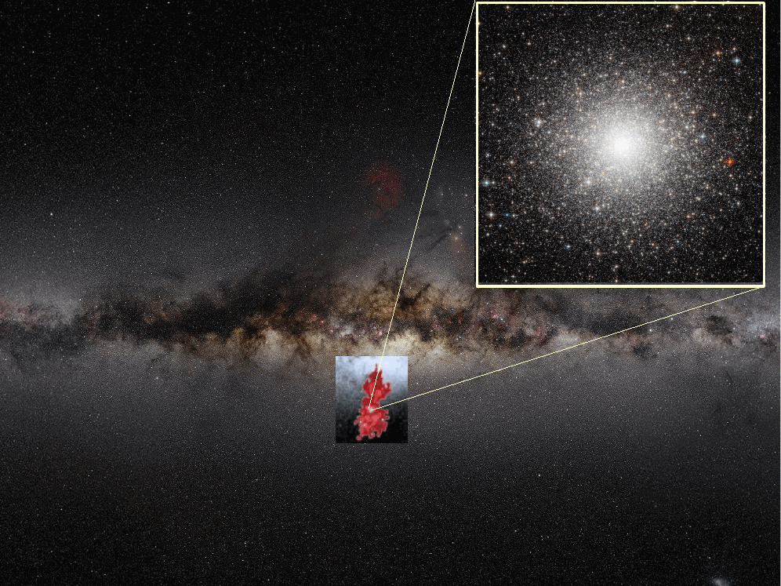
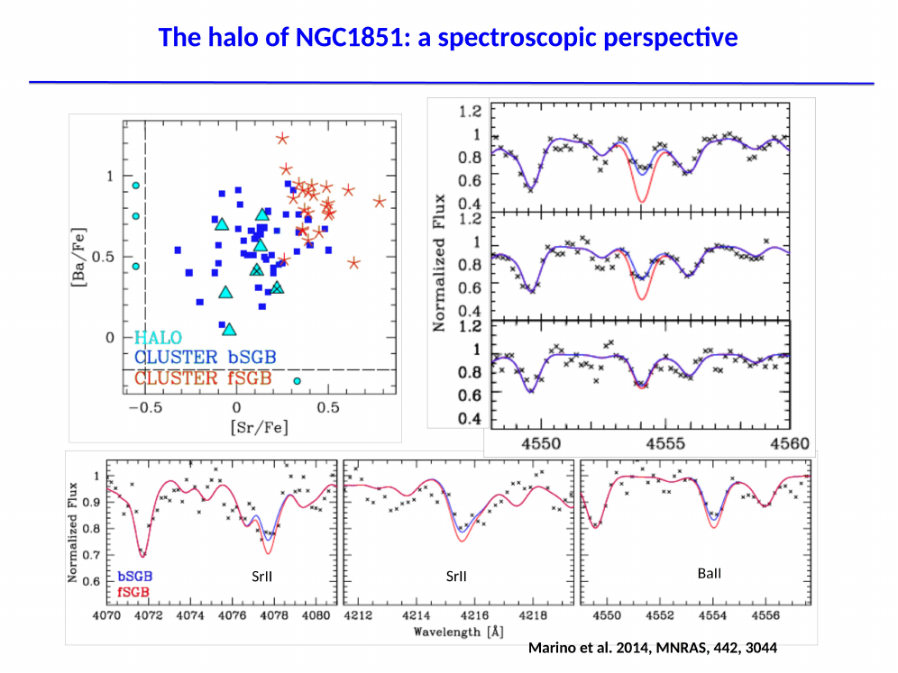
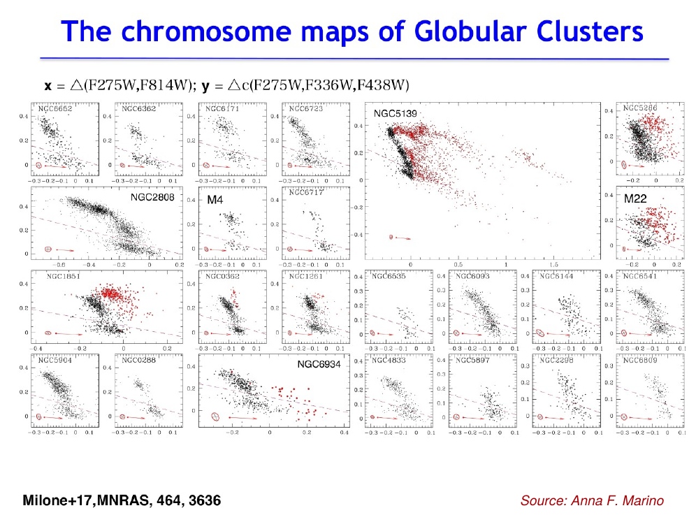

the chromosome map is the diagnostic plot of multiple populations + Milone's signature contribution to the field. introduced by milone et al. 2015 + refined into a survey-wide instrument by milone et al. 2017 (the HST UV Legacy Survey of GCs, ApJ 836:14, with piotto, marino, bedin, anderson, brown, cassisi + collaborators). it takes a CMD + a color-color diagram + folds them into a single 2D plot whose two axes orthogonally separate populations by helium + nitrogen.

*classic chromosome map from Milone et al. 2017: 1G stars cluster around (0,0); 2G stars displaced upward + leftward.*

## construction

the chromosome map is built from five HST passbands: F275W (NUV), F336W (U), F438W (~B), F606W (V), F814W (I). it uses two pseudo-colors:

**vertical axis** (sensitive to He + light elements globally):
$$\Delta_{F275W,\, F814W}$$
defined as the rectified, dereddened color of each star in $F275W - F814W$ relative to the fiducial RGB (or MS). long baseline → strong sensitivity to $T_\text{eff}$ shifts induced by He enhancement.

**horizontal axis** (sensitive to N via NH+CN, anti-correlated with O via OH):
$$\Delta_{C\,F275W,\, F336W,\, F438W} \equiv (F275W - F336W) - (F336W - F438W)$$
this is a "magic triplet" pseudo-color centered on the OH (F275W), NH (F336W), + CN+CH (F438W) absorption regions. it is essentially a high-contrast nitrogen index. N-rich 2G stars have stronger NH absorption + weaker OH/CH, shifting them along this axis.

each star is plotted in $(\Delta_C, \Delta_{F275W,F814W})$ + the cluster's populations appear as compact knots or elongated streams.

## what the map shows

for a typical [Type I GC](Type%20I%20and%20Type%20II%20GCs.html):
- a **1G clump** at $\Delta_C \approx 0$, near the bottom of the He axis: primordial composition
- a **2G stream** extending to higher $\Delta_C$ + higher $\Delta_{F275W,F814W}$: enhanced N + He
- the 2G is often itself substructured, with discrete sub-populations 2Ga, 2Gb (sometimes more)

the populations are typically **discrete** rather than smoothly continuous: distinct knots are visible in clusters like NGC 6752, NGC 2808, NGC 6121 (M4). this discreteness is itself a constraint on polluter models, since it suggests either episodic accretion of polluter ejecta or quantized dilution levels.

from Milone et al. 2015 (ApJ 808, 51), the chemical definition:
- **1G stars** display chemical abundances comparable to those of **field stars** with the same metallicity: normal Na, O, C, N, Mg, He.
- **2G stars** display anomalous abundances: enhanced Na, N, He; depleted O, C, Mg. these are the products of hot proton-capture nucleosynthesis in a previous polluter generation.

the 2G fraction $N_{2G}/N_\text{tot}$ is read directly off the map. it averages ~65% across the survey + correlates strongly with cluster mass (see [Mass dependence of multiple populations](Mass%20dependence%20of%20multiple%20populations.html)).

## why two axes + not one

historically Na-O was the diagnostic, but it requires expensive high-resolution spectroscopy on bright giants. the chromosome map's power is that it works **photometrically**, on every star down to several mag below the MS turn-off, in clusters out to ~50 kpc, including some in M31 + the Magellanic Clouds.

the orthogonality of the axes matters. ΔF275W,F814W tracks He primarily because of the long baseline + the structural effect of He on stellar atmospheres ([Stellar atmosphere structure](Stellar%20atmosphere%20structure.html)). ΔC isolates nitrogen via molecular absorption. a star can be N-rich without being He-rich (modest 2G) or both (extreme 2G), + the map separates these cases. this lets milone's group identify substructure within the 2G + define discrete populations 2Ga, 2Gb, 2Gc.

## the HST UV Legacy Survey of GCs

milone, piotto et al. 2017 published chromosome maps for 57 galactic GCs from a coordinated HST treasury program. key results:

1. **multiple populations are universal** in massive GCs: every cluster with $M > 10^{4.5}\, M_\odot$ shows a chromosome map split
2. **Type I vs Type II classification**: ~83% of clusters are Type I (single 1G + 2G); ~17% are Type II with additional structure on a parallel + redder sequence indicating Fe + s-process variations
3. **2G fraction scales with cluster mass**: $N_{2G}/N_\text{tot} \approx 0.4 + 0.1 \log_{10}(M / 10^5 M_\odot)$ approximately
4. **maximum He spread $\Delta Y_\text{max}$ scales with mass**: more massive clusters host more extreme He-enhanced sub-populations
5. **internal kinematics differ**: 2G is centrally concentrated + dynamically cooler in many clusters

## using the map for individual clusters

for a given cluster, the chromosome map is the basis for:
- counting sub-populations + defining their boundaries
- spectroscopic follow-up: select 1G + 2G targets cleanly for FLAMES / MUSE / MIKE confirmation
- constraining polluter models: discrete vs continuous distribution, He spread, N spread
- studying spatial + kinematic differences between populations using gaia or HST proper motions
- finding [Type II GCs](Type%20I%20and%20Type%20II%20GCs.html) (NGC 1851, M22, M2, NGC 6934, $\omega$ Cen)

## extensions

milone et al. 2018 + marino et al. 2019 extended the chromosome map to:
- include F410M (replacing F438W where available) for sharper N sensitivity
- add JWST NIRCam filters for clusters with high reddening (e.g. terzan 5, liller 1, bulge GCs)
- map populations on the [Asymptotic giant branch AGB](Asymptotic%20giant%20branch%20AGB.html) + HB, where He effects are amplified

the chromosome map is also being applied to extragalactic GCs (LMC, SMC, M31) via HST + JWST, confirming MPs are universal in old massive clusters across galaxies.

## reference papers

- **Milone et al. 2015, ApJ 808, 51** — first chromosome maps (NGC 2808).
- **Milone et al. 2015, MNRAS 455, 3009** — refined chromosome map construction.
- **Milone et al. 2017, MNRAS 464, 3636** — HST UV Legacy Survey: chromosome maps for $\sim 57$ GCs, Type I/II classification.
- **Marino, Milone et al. 2019** — chemical patterns on chromosome maps: spectroscopic validation of photometric populations.

## why it is the centerpiece of modern GC astrophysics

before the chromosome map, multiple populations were a complicated patchwork of spectroscopic anti-correlations, MS splits, + HB anomalies that were hard to compare cluster-to-cluster. the chromosome map is a single picture that compresses all of this into one diagnostic. it made the field quantitative + cluster-comparable, + it is the entry point for almost every current investigation of GC formation + evolution.

## see also

- [Multiple populations in GCs discovery](Multiple%20populations%20in%20GCs%20discovery.html)
- [Na O anticorrelation](Na%20O%20anticorrelation.html)
- [CN CH MgAl anticorrelations](CN%20CH%20MgAl%20anticorrelations.html)
- [Helium spread in GCs](Helium%20spread%20in%20GCs.html)
- [Type I and Type II GCs](Type%20I%20and%20Type%20II%20GCs.html)
- [Mass dependence of multiple populations](Mass%20dependence%20of%20multiple%20populations.html)
- [Polluter scenarios for second-generation GC stars](Polluter%20scenarios%20for%20second-generation%20GC%20stars.html)
- [GC formation models with MPs](GC%20formation%20models%20with%20MPs.html)
- [Multiple populations in extragalactic GCs](Multiple%20populations%20in%20extragalactic%20GCs.html)
- [Color-magnitude diagrams of clusters](Color-magnitude%20diagrams%20of%20clusters.html)
- [Stellar atmosphere structure](Stellar%20atmosphere%20structure.html)
- [Stellar_Astrophysics_MOC](../../04_Atlas/Stellar_Astrophysics_MOC.html)

---

## Complete Lecture Slide Panels & Observational Evidence (Lecture 17 — Multiple Stellar Populations II: Chromosome Maps)

> **Context**: *The Chromosome Map (Delta_F275W,F814W vs Delta_C_F275W,F336W,F438W), orthogonal separation of 1G and 2G stars, and Type I vs Type II anomalous GCs.*

The following slides from Prof. Antonino Milone's lecture series provide the direct observational, photometric, and theoretical foundations for this topic:

*Figure P17-01: LAntonino_p17_01.png — Observational data, CMD morphology, and diagnostics from Lecture 17 — Multiple Stellar Populations II: Chromosome Maps.*

*Figure P17-02: LAntonino_p17_02.png — Observational data, CMD morphology, and diagnostics from Lecture 17 — Multiple Stellar Populations II: Chromosome Maps.*

*Figure P17-03: LAntonino_p17_03.png — Observational data, CMD morphology, and diagnostics from Lecture 17 — Multiple Stellar Populations II: Chromosome Maps.*

*Figure P17-04: LAntonino_p17_04.png — Observational data, CMD morphology, and diagnostics from Lecture 17 — Multiple Stellar Populations II: Chromosome Maps.*

*Figure P17-05: LAntonino_p17_05.png — Observational data, CMD morphology, and diagnostics from Lecture 17 — Multiple Stellar Populations II: Chromosome Maps.*

*Figure P17-06: LAntonino_p17_06.png — Observational data, CMD morphology, and diagnostics from Lecture 17 — Multiple Stellar Populations II: Chromosome Maps.*

*Figure P17-07: LAntonino_p17_07.png — Observational data, CMD morphology, and diagnostics from Lecture 17 — Multiple Stellar Populations II: Chromosome Maps.*

*Figure P17-08: LAntonino_p17_08.png — Observational data, CMD morphology, and diagnostics from Lecture 17 — Multiple Stellar Populations II: Chromosome Maps.*

*Figure P17-09: LAntonino_p17_09.png — Observational data, CMD morphology, and diagnostics from Lecture 17 — Multiple Stellar Populations II: Chromosome Maps.*

*Figure P17-10: LAntonino_p17_10.png — Observational data, CMD morphology, and diagnostics from Lecture 17 — Multiple Stellar Populations II: Chromosome Maps.*

*Figure P17-11: LAntonino_p17_11.png — Observational data, CMD morphology, and diagnostics from Lecture 17 — Multiple Stellar Populations II: Chromosome Maps.*

*Figure P17-12: LAntonino_p17_12.png — Observational data, CMD morphology, and diagnostics from Lecture 17 — Multiple Stellar Populations II: Chromosome Maps.*

*Figure P17-13: LAntonino_p17_13.png — Observational data, CMD morphology, and diagnostics from Lecture 17 — Multiple Stellar Populations II: Chromosome Maps.*

*Figure P17-14: LAntonino_p17_14.png — Observational data, CMD morphology, and diagnostics from Lecture 17 — Multiple Stellar Populations II: Chromosome Maps.*

*Figure P17-15: LAntonino_p17_15.png — Observational data, CMD morphology, and diagnostics from Lecture 17 — Multiple Stellar Populations II: Chromosome Maps.*

*Figure P17-16: LAntonino_p17_16.png — Observational data, CMD morphology, and diagnostics from Lecture 17 — Multiple Stellar Populations II: Chromosome Maps.*

*Figure P17-17: LAntonino_p17_17.png — Observational data, CMD morphology, and diagnostics from Lecture 17 — Multiple Stellar Populations II: Chromosome Maps.*

*Figure P17-18: LAntonino_p17_18.png — Observational data, CMD morphology, and diagnostics from Lecture 17 — Multiple Stellar Populations II: Chromosome Maps.*

*Figure P17-19: LAntonino_p17_19.png — Observational data, CMD morphology, and diagnostics from Lecture 17 — Multiple Stellar Populations II: Chromosome Maps.*

*Figure P17-20: LAntonino_p17_20.png — Observational data, CMD morphology, and diagnostics from Lecture 17 — Multiple Stellar Populations II: Chromosome Maps.*

*Figure P17-21: LAntonino_p17_21.png — Observational data, CMD morphology, and diagnostics from Lecture 17 — Multiple Stellar Populations II: Chromosome Maps.*

*Figure P17-22: LAntonino_p17_22.png — Observational data, CMD morphology, and diagnostics from Lecture 17 — Multiple Stellar Populations II: Chromosome Maps.*

*Figure P17-23: LAntonino_p17_23.png — Observational data, CMD morphology, and diagnostics from Lecture 17 — Multiple Stellar Populations II: Chromosome Maps.*

*Figure P17-24: LAntonino_p17_24.png — Observational data, CMD morphology, and diagnostics from Lecture 17 — Multiple Stellar Populations II: Chromosome Maps.*

*Figure P17-25: LAntonino_p17_25.png — Observational data, CMD morphology, and diagnostics from Lecture 17 — Multiple Stellar Populations II: Chromosome Maps.*

*Figure P17-26: Lecture17_p15-15.png — Observational data, CMD morphology, and diagnostics from Lecture 17 — Multiple Stellar Populations II: Chromosome Maps.*

*Figure P17-27: Lecture17_p25-25.png — Observational data, CMD morphology, and diagnostics from Lecture 17 — Multiple Stellar Populations II: Chromosome Maps.*

*Figure P17-28: Lecture17_p35-35.png — Observational data, CMD morphology, and diagnostics from Lecture 17 — Multiple Stellar Populations II: Chromosome Maps.*

*Figure P17-29: Lecture17_p5-05.png — Observational data, CMD morphology, and diagnostics from Lecture 17 — Multiple Stellar Populations II: Chromosome Maps.*

  <h4 class="backlinks-title">Linked References (14)</h4>
  <ul class="backlinks-list">
    <li class="backlink-item-wrap"><a href="CN%20CH%20MgAl%20anticorrelations.html" class="backlink-item">CN CH MgAl anticorrelations</a></li>
    <li class="backlink-item-wrap"><a href="Differential%20reddening%20maps.html" class="backlink-item">Differential reddening maps</a></li>
    <li class="backlink-item-wrap"><a href="Effects%20of%20differential%20reddening%20on%20CMD%20analysis.html" class="backlink-item">Effects of differential reddening on CMD analysis</a></li>
    <li class="backlink-item-wrap"><a href="GC%20formation%20models%20with%20MPs.html" class="backlink-item">GC formation models with MPs</a></li>
    <li class="backlink-item-wrap"><a href="Helium%20spread%20in%20GCs.html" class="backlink-item">Helium spread in GCs</a></li>
    <li class="backlink-item-wrap"><a href="Mass%20dependence%20of%20multiple%20populations.html" class="backlink-item">Mass dependence of multiple populations</a></li>
    <li class="backlink-item-wrap"><a href="Multiple%20populations%20in%20GCs%20discovery.html" class="backlink-item">Multiple populations in GCs discovery</a></li>
    <li class="backlink-item-wrap"><a href="Multiple%20populations%20in%20extragalactic%20GCs.html" class="backlink-item">Multiple populations in extragalactic GCs</a></li>
    <li class="backlink-item-wrap"><a href="Na%20O%20anticorrelation.html" class="backlink-item">Na O anticorrelation</a></li>
    <li class="backlink-item-wrap"><a href="Polluter%20scenarios%20for%20second-generation%20GC%20stars.html" class="backlink-item">Polluter scenarios for second-generation GC stars</a></li>
    <li class="backlink-item-wrap"><a href="Stellar%20Astrophysics%20research%20citations%20index.html" class="backlink-item">Stellar Astrophysics research citations index</a></li>
    <li class="backlink-item-wrap"><a href="Type%20I%20and%20Type%20II%20GCs.html" class="backlink-item">Type I and Type II GCs</a></li>
    <li class="backlink-item-wrap"><a href="eMSTO%20and%20multiple%20populations%20connection.html" class="backlink-item">eMSTO and multiple populations connection</a></li>
    <li class="backlink-item-wrap"><a href="../../04_Atlas/Stellar_Astrophysics_MOC.html" class="backlink-item">Stellar_Astrophysics_MOC</a></li>
  </ul>

