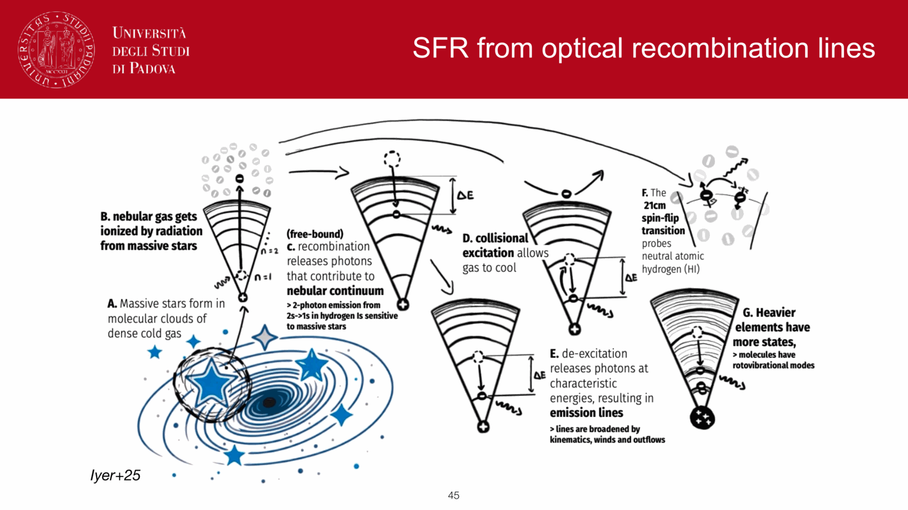
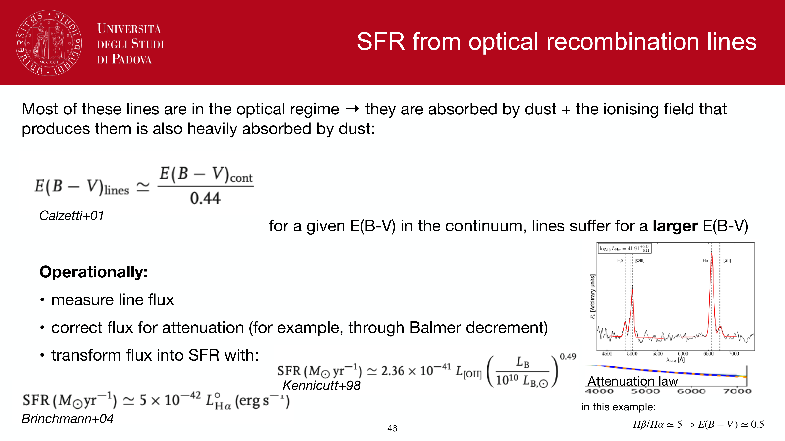
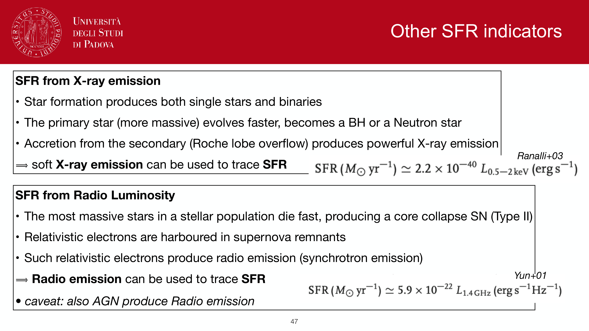
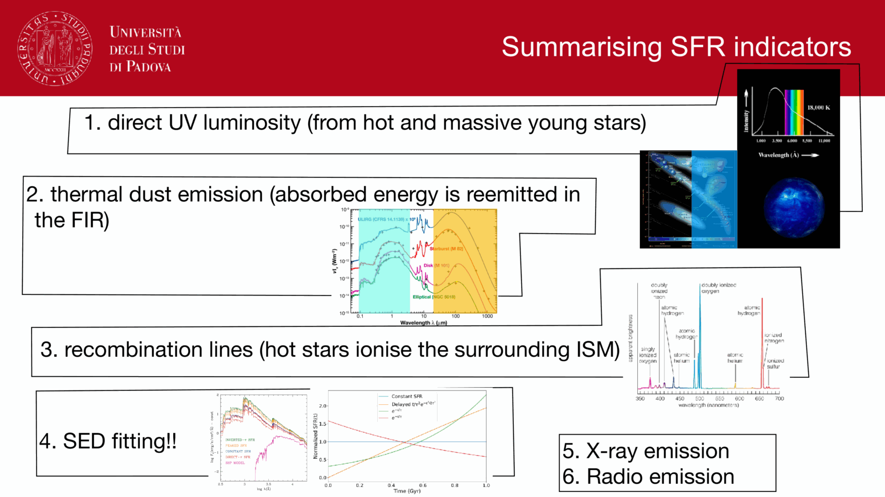
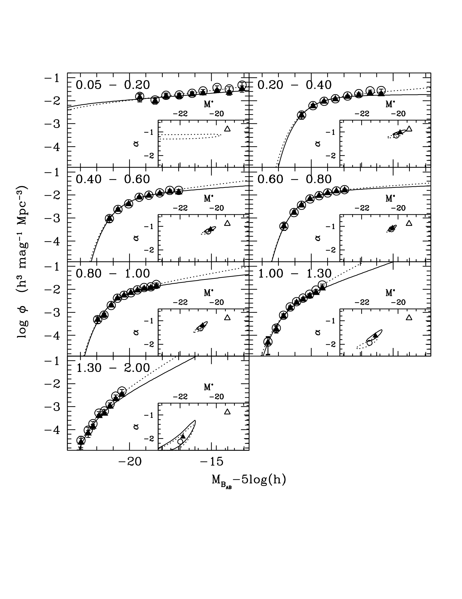


**photometric redshifts (photo-$z$)** are statistical estimates of galaxy redshifts derived from multi-band imaging rather than slit spectroscopy. While astronomical spectroscopy requires tens of minutes to hours per object on 8–10m telescopes, wide-field imaging surveys (such as DES, Vera C. Rubin / LSST, and *Euclid*) image hundreds of millions of galaxies simultaneously. Accurate photo-$z$ techniques are fundamental to cosmic shear weak lensing, large-scale galaxy clustering, and the determination of galaxy luminosity and stellar mass functions.

---

### physical mechanism: spectral discontinuities

photo-$z$ estimation relies on tracing prominent spectral breaks as they shift through a series of broadband filters:

1. **the $4000$ Å break and balmer break ($z \lesssim 1.5$)**:
   - in intermediate-age and old stellar populations, the **$4000$ Å break** ($D_n4000$) arises from heavy metal line blanketing (chiefly Fe, Ca) in the atmospheres of cool stars.
   - in populations dominated by A-type stars ($\sim 100\text{--}800$ Myr), the **Balmer break** at $3646$ Å marks the photoionization threshold from the $n = 2$ state of hydrogen.
   - as redshift increases from $z = 0$ to $z \sim 1.5$, this break shifts from the $u$-band through $g, r, i,$ and into the near-infrared $z$ and $Y$ bands, inducing sharp, characteristic steps in adjacent color pairs (e.g., $u-g$, $g-r$, $r-i$).

2. **the lyman break and lyman-$\alpha$ forest ($z \gtrsim 3$)**:
   - the **Lyman limit** at $\lambda_{\rm rest} = 912$ Å is the photoionization threshold of neutral hydrogen ($n = 1 \to \infty$). All ionizing flux blueward of $912$ Å is completely absorbed by intervening and interstellar neutral gas.
   - between $912$ Å and $1216$ Å (Ly$\alpha$), line absorption by intergalactic neutral hydrogen clouds (the **Lyman-$\alpha$ forest**) strongly suppresses the continuum (Madau 1995 attenuation).
   - galaxies "drop out" (vanish) in the filter immediately blueward of $(1+z) \cdot 912$ Å:
     - **$u$-dropouts**: select galaxies at $z \sim 3$
     - **$g$-dropouts**: select galaxies at $z \sim 4$
     - **$r$-dropouts**: select galaxies at $z \sim 5$
     - **$i$-dropouts**: select galaxies at $z \sim 6$

---

### methodologies: template fitting vs machine learning

#### 1. template fitting (frequentist and bayesian)
- constructs synthetic photometry by convolving a representative library of galaxy SED templates (ellipticals, spirals, starbursts, AGNs) with instrumental filter throughput curves $T_i(\lambda)$ across a redshift grid $z \in [0, 10]$:
  $$F_i^{\rm model}(z, T) = A \int f_\lambda^T\left(\frac{\lambda}{1+z}\right)\,T_i(\lambda)\,\frac{\lambda}{hc}\,d\lambda$$
- canonical codes: **EAZY** (Brammer et al. 2008), **BPZ** (Benítez 2000), **LePHARE** (Arnouts & Ilbert), **HyperZ** (Bolzonella et al. 2000).

#### 2. empirical and machine learning regressors
- trains supervised non-linear models (Random Forests, Support Vector Machines, Deep Neural Networks, Self-Organizing Maps) directly on a "training set" of galaxies possessing both multi-band photometry and high-confidence spectroscopic redshifts ($z_{\rm spec}$).
- advantage: completely independent of SPS modeling uncertainties, dust laws, or photometric zeropoint calibration errors.
- limitation: cannot extrapolate beyond the parameter space of the spectroscopic training set, which is systematically incomplete at faint magnitudes ($i > 24$).
- canonical codes: **ANNz**, **TPZ**, **GPz**.

---

### bayesian formulation: the benítez (2000) prior

in pure $\chi^2$ template fitting, catastrophic degeneracies occur frequently (e.g., a dusty star-forming galaxy at $z \sim 0.3$ has colors virtually identical to an unreddened Lyman-break galaxy at $z \sim 3$). 

Benítez (2000) introduced a Bayesian framework combining the photometric likelihood with an empirical prior on the joint redshift-type distribution conditioned on apparent magnitude $m_0$:

$$p(z, T | \{F_i\}, m_0) = \frac{\mathcal{L}(\{F_i\} | z, T)\, p(z, T | m_0)}{p(\{F_i\} | m_0)}$$

where:
- $\mathcal{L}(\{F_i\} | z, T) \propto \exp(-\frac{1}{2}\chi^2(z, T))$ is the photometric likelihood.
- $p(z, T | m_0) = p(T | m_0)\, p(z | T, m_0)$ expresses the physical prior that bright galaxies ($m_0 < 20$) are predominantly low-redshift systems, while very high redshifts ($z > 3$) are exponentially improbable for bright apparent magnitudes.
- the Benítez prior suppresses catastrophic redshift outliers by more than a factor of $\sim 3$ compared to maximum-likelihood fitting alone.

---

### performance metrics and failure modes

photo-$z$ quality is quantified by two standard metrics evaluated against spectroscopic control samples:
1. **normalized median absolute deviation ($\sigma_{\rm NMAD}$)**:
   $$\sigma_{\rm NMAD} = 1.48 \times \mathrm{median}\left( \frac{|\Delta z - \mathrm{median}(\Delta z)|}{1 + z_{\rm spec}} \right), \qquad \Delta z \equiv z_{\rm phot} - z_{\rm spec}$$
   state-of-the-art surveys achieve $\sigma_{\rm NMAD} \sim 0.015\text{--}0.03$ for bright galaxies with $\ge 8$ filters, and $\sim 0.05$ for faint surveys.
2. **catastrophic outlier fraction ($\eta$)**:
   defined as the fraction of galaxies where $\frac{|\Delta z|}{1 + z_{\rm spec}} > 0.15$. Typically $\eta \sim 1\text{--}5\%$.

#### primary failure mechanisms:
- **break confusion**: the $4000$ Å break at $z \sim 0.3$ confused with the Lyman break at $z \sim 3$.
- **strong emission lines**: young starbursts with extreme equivalent-width $[\mathrm{O\,III}]\,\lambda 5007$ or $\mathrm{H}\alpha$ emission entering a broadband filter mimic a continuum break.
- **dust-reddening ambiguity**: severe dust extinction $A_V > 2$ reddens the rest-frame UV continuum of a low-$z$ starburst to mimic an unreddened high-$z$ galaxy.

---

## see also

- [Observational_Astrophysics_MOC](../../04_Atlas/Observational_Astrophysics_MOC.html)
- [Stellar_Astrophysics_MOC](../../04_Atlas/Stellar_Astrophysics_MOC.html)
- [SED fitting basics](./SED%20fitting%20basics.html)
- [Stellar population synthesis](./Stellar%20population%20synthesis.html)
- [Single stellar population SSP](./Single%20stellar%20population%20SSP.html)
- [Age-metallicity degeneracy](./Age-metallicity%20degeneracy.html)
- [Dust attenuation in synthetic populations](./Dust%20attenuation%20in%20synthetic%20populations.html)
- [Star formation history of a population](./Star%20formation%20history%20of%20a%20population.html)
- [Stellar mass estimation in unresolved populations](./Stellar%20mass%20estimation%20in%20unresolved%20populations.html)

---

## observational astrophysics course slides (Prof. Paolo Cassata)

*Photometric redshift (photo-z) principles: tracking 4000 A break and Lyman break through filters.*

*Template fitting method (EAZY, BPZ, LePhare) using optimized galaxy SED libraries.*

*Luminosity and redshift priors (Benitez 2000 Bayesian photo-z).*

*Catastrophic photo-z outliers: confusion between 4000 A break and Lyman break (z ~ 0.3 vs z ~ 3).*

*Photometric redshift precision sigma_z / (1 + z) and outlier rates using LePhare template fitting (Ilbert et al. 2005).*


  <h4 class="backlinks-title">Linked References (18)</h4>
  <ul class="backlinks-list">
    <li class="backlink-item-wrap"><a href="../../04_Atlas/Astrophysics_of_Galaxies_MOC.html" class="backlink-item">Astrophysics_of_Galaxies_MOC</a></li>
    <li class="backlink-item-wrap"><a href="./Color%20indices.html" class="backlink-item">Color indices</a></li>
    <li class="backlink-item-wrap"><a href="./Deep-field%20surveys.html" class="backlink-item">Deep-field surveys</a></li>
    <li class="backlink-item-wrap"><a href="./K-correction.html" class="backlink-item">K-correction</a></li>
    <li class="backlink-item-wrap"><a href="./Multi-object%20spectroscopy%20MOS.html" class="backlink-item">Multi-object spectroscopy MOS</a></li>
    <li class="backlink-item-wrap"><a href="../../04_Atlas/Observational_Astrophysics_MOC.html" class="backlink-item">Observational_Astrophysics_MOC</a></li>
    <li class="backlink-item-wrap"><a href="../../04_Atlas/Observational_Cosmology_MOC.html" class="backlink-item">Observational_Cosmology_MOC</a></li>
    <li class="backlink-item-wrap"><a href="../../02_Literature/Lectures/Observational_Cosmology/Pablo_02_Statistical_properties_of_galaxies.html" class="backlink-item">Pablo_02_Statistical_properties_of_galaxies</a></li>
    <li class="backlink-item-wrap"><a href="../../02_Literature/Lectures/Observational_Cosmology/Pablo_05_Galaxies_at_cosmological_distances.html" class="backlink-item">Pablo_05_Galaxies_at_cosmological_distances</a></li>
    <li class="backlink-item-wrap"><a href="./Photo-z%20biases%20and%20catastrophic%20outliers.html" class="backlink-item">Photo-z biases and catastrophic outliers</a></li>
    <li class="backlink-item-wrap"><a href="./Photometric%20system%20conversion%20and%20color%20terms.html" class="backlink-item">Photometric system conversion and color terms</a></li>
    <li class="backlink-item-wrap"><a href="./Protocluster%20detection%20techniques.html" class="backlink-item">Protocluster detection techniques</a></li>
    <li class="backlink-item-wrap"><a href="./Redshift%20distribution%20of%20flux-limited%20samples.html" class="backlink-item">Redshift distribution of flux-limited samples</a></li>
    <li class="backlink-item-wrap"><a href="./SDSS%20overview.html" class="backlink-item">SDSS overview</a></li>
    <li class="backlink-item-wrap"><a href="./SED%20fitting%20basics.html" class="backlink-item">SED fitting basics</a></li>
    <li class="backlink-item-wrap"><a href="./Spectroscopic%20redshift%20from%20line%20shifts.html" class="backlink-item">Spectroscopic redshift from line shifts</a></li>
    <li class="backlink-item-wrap"><a href="./Surface%20brightness%20dimming.html" class="backlink-item">Surface brightness dimming</a></li>
    <li class="backlink-item-wrap"><a href="./UV%20SFR%20tracer.html" class="backlink-item">UV SFR tracer</a></li>
  </ul>

