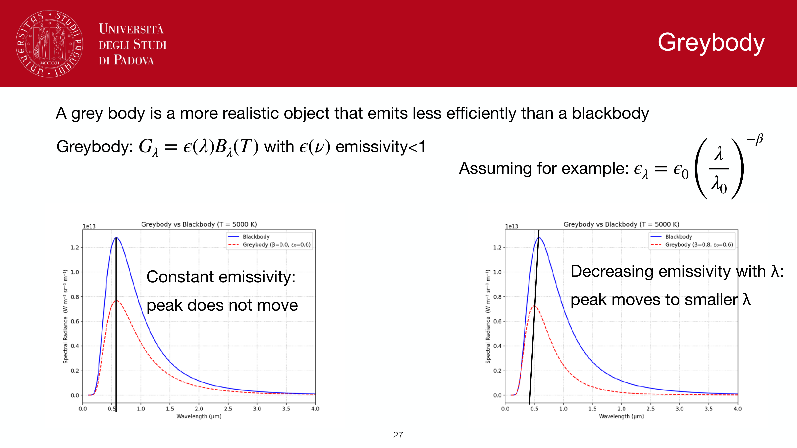
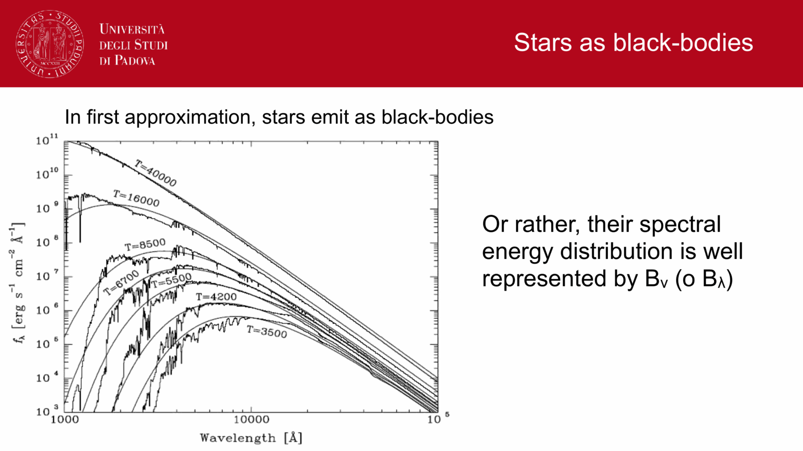
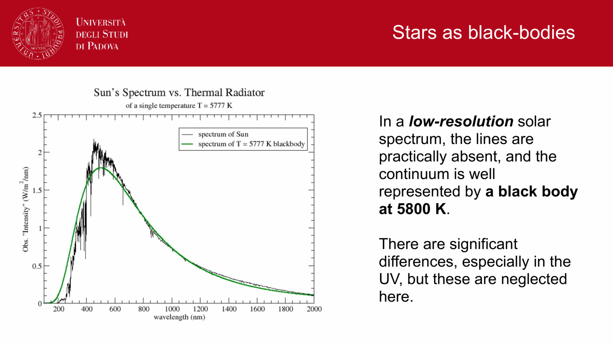
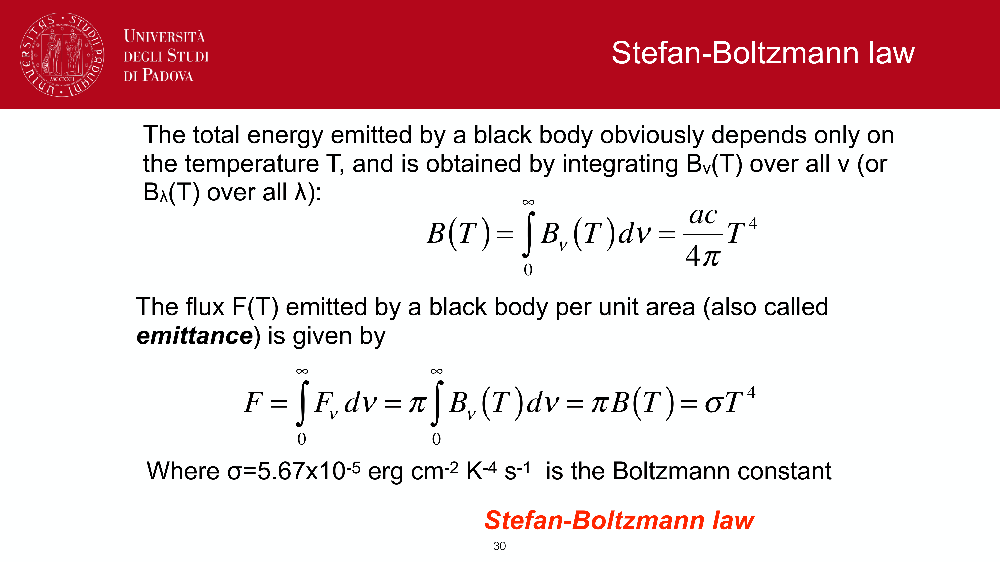
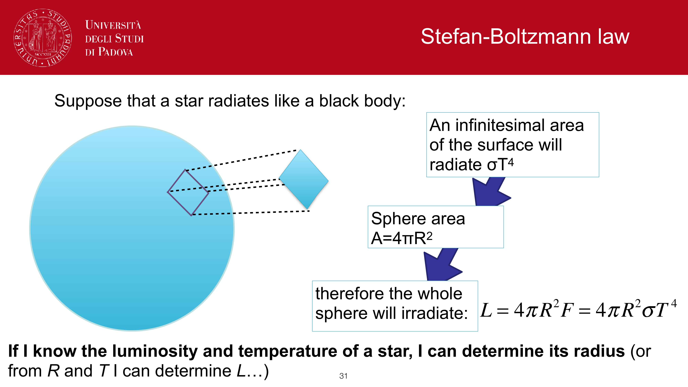
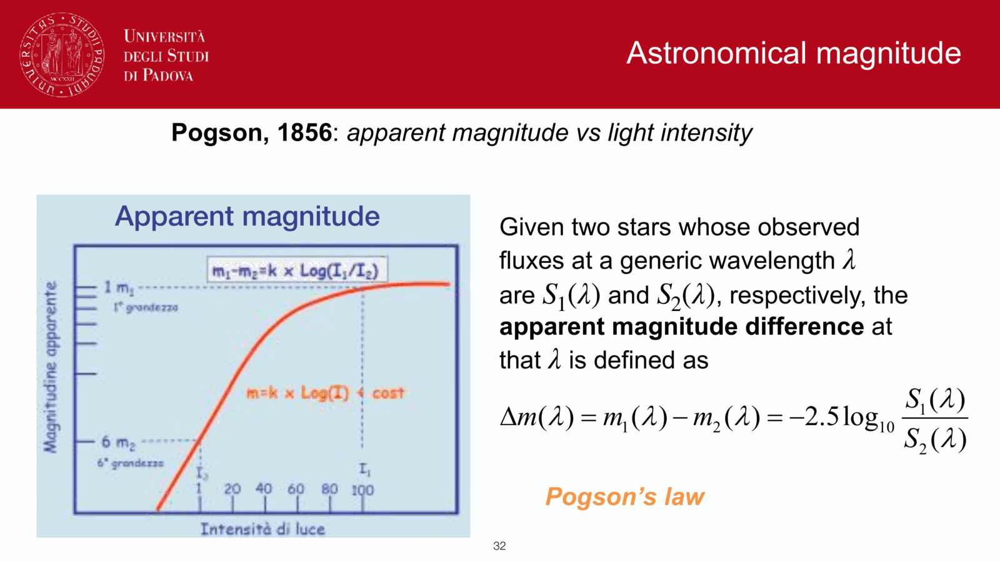


three forms of the same physics: the Planck law for blackbody spectral radiance, Wien's displacement law for its peak, and Stefan-Boltzmann for its integrated power. answer to the obs3 exam-answer draft.

## the Planck law

the spectral radiance of a blackbody at temperature $T$:
$$B_\nu(T) = \frac{2h\nu^3}{c^2}\,\frac{1}{e^{h\nu/k_BT} - 1}$$

or equivalently in wavelength:
$$B_\lambda(T) = \frac{2hc^2}{\lambda^5}\,\frac{1}{e^{hc/\lambda k_BT} - 1}$$

(use Jacobian $\lvert d\nu/d\lambda\rvert = c/\lambda^2$ to convert.)

a one-parameter family: knowing $T$ tells you the entire spectrum. units: erg s$^{-1}$ cm$^{-2}$ sr$^{-1}$ Hz$^{-1}$ (or per cm$^{-1}$ if in $\lambda$).

derivation in a few lines: at thermal equilibrium photons follow a Bose-Einstein distribution with $\mu = 0$, integrate over phase space (see [Cosmic_inventory_photons_derivation](./Cosmic_inventory_photons_derivation.html)).

### two limits of the Planck law

- **Rayleigh-Jeans** ($h\nu \ll k_BT$): $B_\nu \approx 2\nu^2 k_BT/c^2$, classical limit. used in radio astronomy.
- **Wien** ($h\nu \gg k_BT$): $B_\nu \approx (2h\nu^3/c^2)\,e^{-h\nu/k_BT}$, exponential cutoff. used at the high-frequency tail.

these were the original 19th-century formulae, each correct in its limit but failing in the other (the "ultraviolet catastrophe"). Planck's interpolation in 1900 introduced the quantum.

## Wien's displacement law

the peak of $B_\nu(T)$ at frequency $\nu_{\rm max}$ satisfies $\nu_{\rm max}/T = $ const, and similarly for $\lambda_{\rm max}$:
$$\boxed{\, \lambda_{\rm max} T = b = 2.898 \times 10^{-3}\,\text{m K}\,}$$

so increasing $T$ shifts the peak to **shorter wavelengths**. examples:
- $T = 3$ K (CMB): $\lambda_{\rm max} = 1$ mm.
- $T = 300$ K (room): $\lambda_{\rm max} = 10\,\mu$m.
- $T = 6000$ K (Sun): $\lambda_{\rm max} = 480$ nm (visible peak, why our eyes evolved here).
- $T = 30\,000$ K (O star): $\lambda_{\rm max} = 100$ nm (deep UV).

the peak in $\nu$ vs in $\lambda$ corresponds to slightly different temperatures (different definitions of "peak"); the constant differs by a factor.

## Stefan-Boltzmann

integrating $B_\nu(T)$ over all frequencies and over a hemisphere of solid angle (factor of $\pi$ for a Lambertian emitter):
$$F_{\rm tot} = \int_0^\infty\!\int B_\nu(T) \cos\theta\, d\Omega\, d\nu = \pi\int B_\nu(T)\, d\nu = \sigma_{SB}\, T^4$$

with the Stefan-Boltzmann constant
$$\sigma_{SB} = \frac{2\pi^5 k_B^4}{15 h^3 c^2} = 5.67 \times 10^{-8}\,\text{W m}^{-2}\,\text{K}^{-4}$$

so the **flux per unit surface** of a blackbody scales as $T^4$. for a star of radius $R$:
$$L = 4\pi R^2 \sigma_{SB}\, T_{\rm eff}^4$$

with $T_{\rm eff}$ defined by this relation (the "effective temperature"). this is the workhorse formula linking observables (luminosity, radius, temperature) for stars.

## why hot massive stars dominate luminosity

the Stefan-Boltzmann scaling $L \propto R^2 T^4$ is much steeper in $T$ than in $R$. on the main sequence, $R$ scales weakly with mass while $T$ scales strongly:
$$L \propto M^{3.5}$$
(approximately, for $M > M_\odot$).

so even though massive stars are rare ([Initial mass function](./Initial%20mass%20function.html)), their per-star luminosity is enormous. integrated over an SSP, the bolometric light is dominated by the most massive stars currently alive.

at UV wavelengths the dominance is even more extreme: only the very hottest stars contribute, because the Wien tail of cooler stars is exponentially suppressed.

quantitative example for a Salpeter IMF in an SSP:
- 1\% of stars by number have $M > 10\,M_\odot$.
- but they contribute $\sim 50$ to $90$\% of the bolometric light (depending on age) and $\sim 99$\% of the UV light.

this is the answer to obs3.pdf and the foundation of UV-based SFR tracers (see [UV SFR tracer](./UV%20SFR%20tracer.html)).

## see also

- [Blackbody radiation and Stefan-Boltzmann](./Blackbody%20radiation%20and%20Stefan-Boltzmann.html)
- [Cosmic_inventory_photons_derivation](./Cosmic_inventory_photons_derivation.html) — full derivation of $\rho_\gamma$ and $n_\gamma$
- [Why hot massive stars dominate luminosity](./Why%20hot%20massive%20stars%20dominate%20luminosity.html)
- [Initial mass function](./Initial%20mass%20function.html)
- [Stellar scaling relations](./Stellar%20scaling%20relations.html)
- [Bolometric correction and effective temperature](./Bolometric%20correction%20and%20effective%20temperature.html)
- [Specific intensity flux luminosity](./Specific%20intensity%20flux%20luminosity.html)

---

## observational astrophysics course slides (Prof. Paolo Cassata)

*Wien displacement law: lambda_max * T = 2.8978 x 10^(-3) m K.*

*Peak frequency nu_max = 2.821 * k_B T / h (note difference between lambda and nu peaks).*

*Mathematical derivation of Wien displacement law by setting d B_lambda / d lambda = 0.*

*Transcendental equation x e^x / (e^x - 1) = 5 and solution x = 4.965.*

*Full derivation of Stefan-Boltzmann integral using Riemann zeta function.*

*Summary of thermal radiation laws.*


  <h4 class="backlinks-title">Linked References (4)</h4>
  <ul class="backlinks-list">
    <li class="backlink-item-wrap"><a href="./Bolometric%20correction%20and%20effective%20temperature.html" class="backlink-item">Bolometric correction and effective temperature</a></li>
    <li class="backlink-item-wrap"><a href="../../04_Atlas/Observational_Astrophysics_MOC.html" class="backlink-item">Observational_Astrophysics_MOC</a></li>
    <li class="backlink-item-wrap"><a href="./Thermal%20continuum%20from%20stellar%20photosphere.html" class="backlink-item">Thermal continuum from stellar photosphere</a></li>
    <li class="backlink-item-wrap"><a href="./Why%20hot%20massive%20stars%20dominate%20luminosity.html" class="backlink-item">Why hot massive stars dominate luminosity</a></li>
  </ul>

