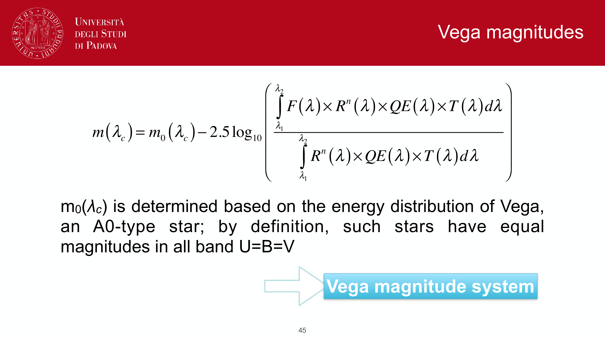
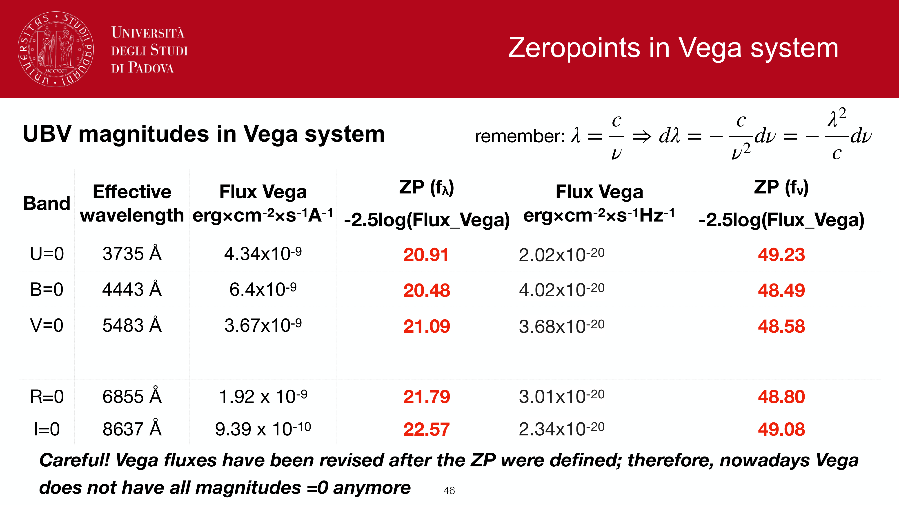
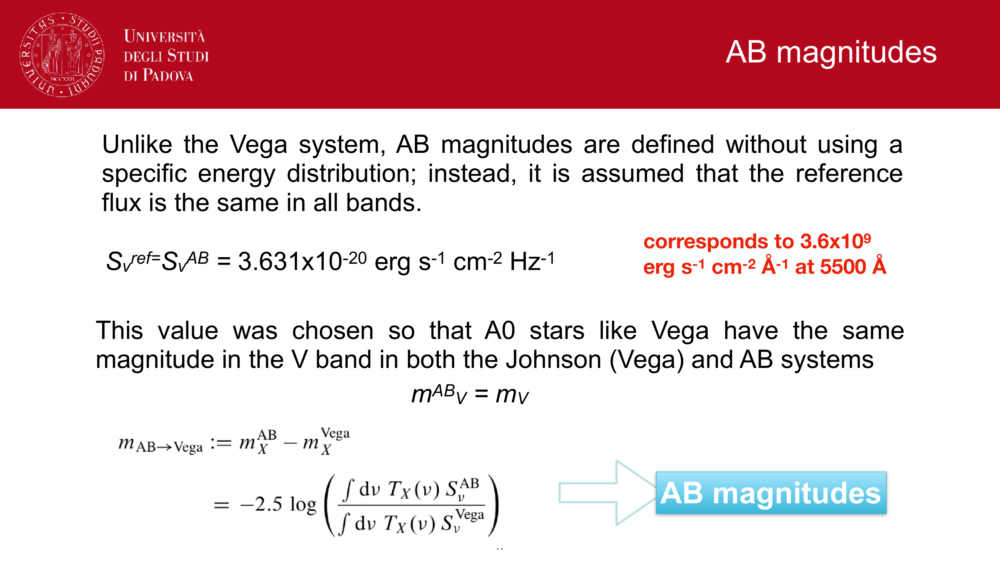
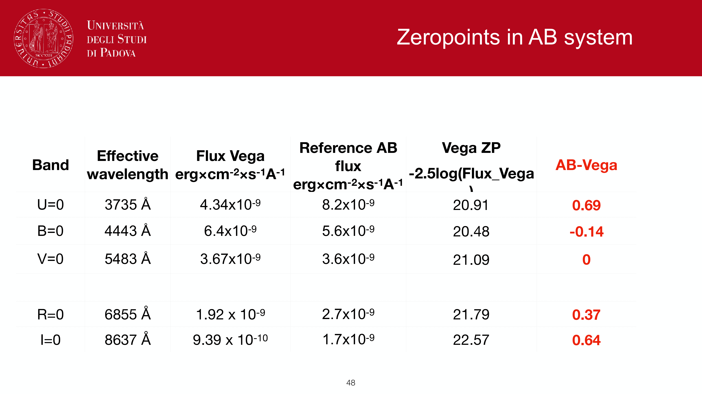
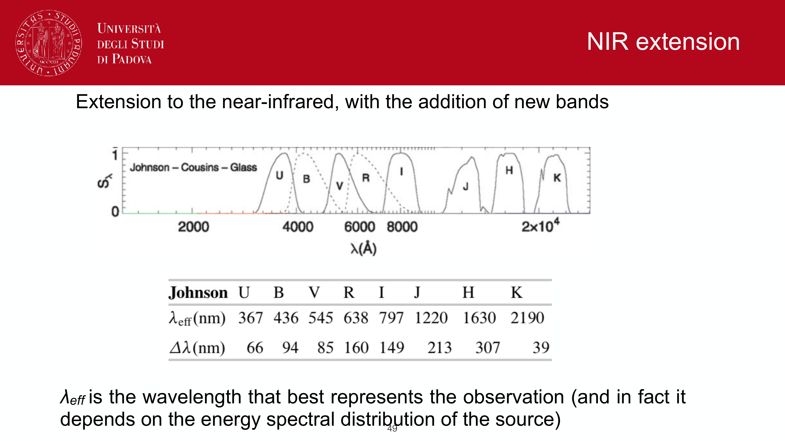
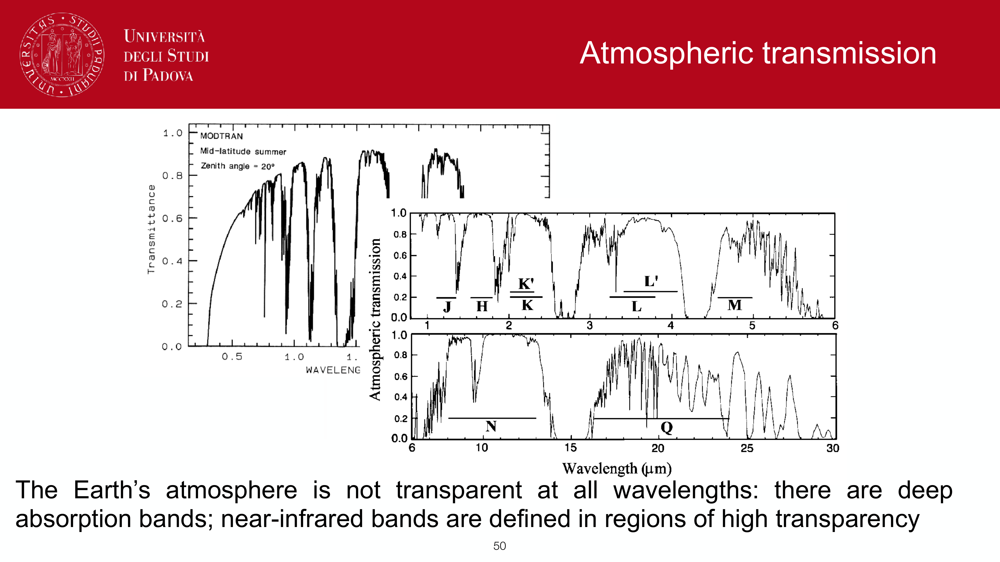
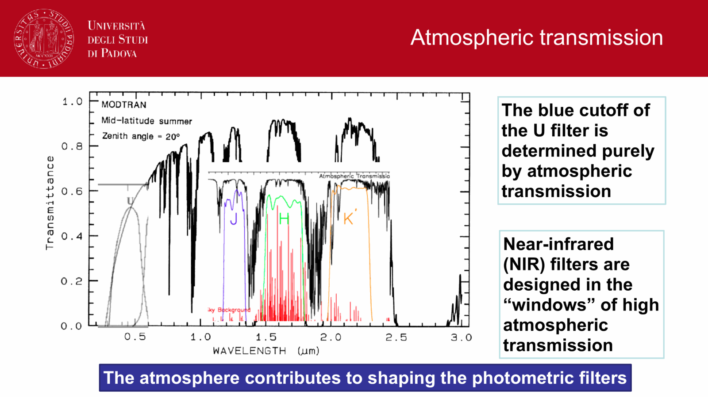
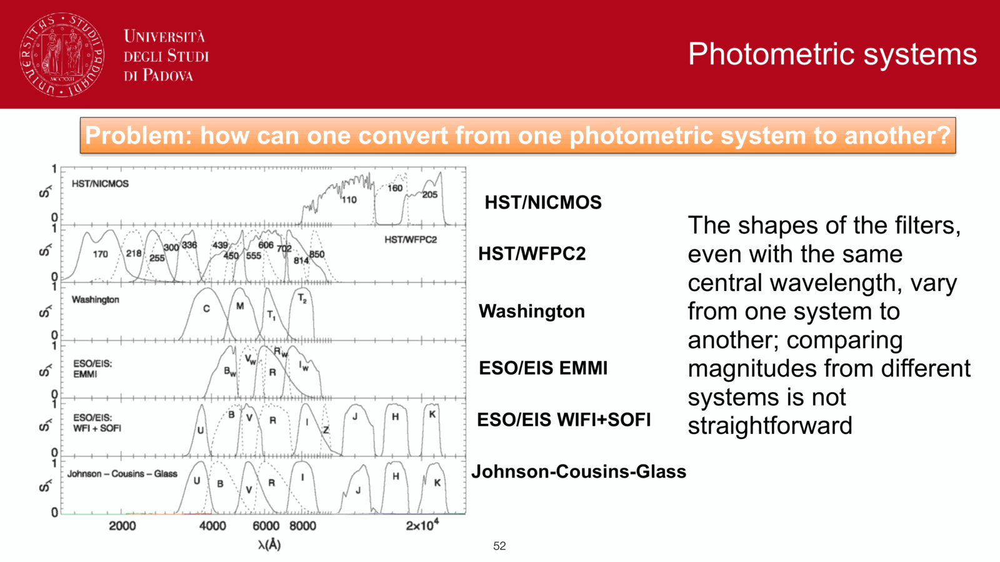


Norman Pogson's 1856 definition fixed the magnitude scale to a precise logarithmic relation between flux ratios. answer to obs4.pdf.

## Pogson's law

for two sources with fluxes $F_1$ and $F_2$:
$$\boxed{\, m_1 - m_2 = -2.5 \log_{10}\!\left(\frac{F_1}{F_2}\right) \,}$$

equivalently:
$$\frac{F_1}{F_2} = 10^{-(m_1 - m_2)/2.5}$$

interpretation:
- the minus sign means **brighter source = smaller magnitude** (a backward convention from Hipparchus's six-step scale).
- a $\Delta m = 1$ magnitude difference corresponds to a flux ratio of $10^{0.4} \approx 2.512$.
- $\Delta m = 5$ corresponds to $10^{2} = 100$.

historical: Hipparchus ranked stars from $1$ (brightest) to $6$ (faintest naked-eye). Pogson chose $2.512^5 = 100$ as the exact factor between magnitudes $1$ and $6$, giving the modern definition.

## benchmark conversions

| $\Delta m$ | flux ratio |
|---|---|
| 0.01 | 1.0093 ($\sim 1\%$) |
| 0.1 | 1.096 ($\sim 10\%$) |
| 1 | 2.512 |
| 2 | 6.31 |
| 5 | 100 |
| 10 | $10^4$ |
| 20 | $10^8$ |
| 25 | $10^{10}$ |

so each $5$ magnitudes is a factor $100$ in flux. $25$ mag faint = $10^{10}$ times less flux than a $0$-mag standard.

## the small-magnitude approximation

for percent-level photometry I often need to convert a small magnitude residual to a fractional flux change. take the differential of Pogson:
$$dm = -2.5 \cdot \frac{1}{\ln 10}\,\frac{dF}{F} = -1.0857\,\frac{dF}{F}$$

so
$$\boxed{\, dm \approx -1.086\,\frac{dF}{F}\quad\text{or}\quad \frac{dF}{F} \approx -0.921\,dm\,}$$

useful checks:
- $dm = 0.01$ corresponds to $\lvert dF/F\rvert \approx 0.92\%$.
- $dm = 0.001$ (mmag) corresponds to $\sim 0.092\%$ ($\sim 1$ part in 1000).

this is why mmag photometry is the gold standard for transit detection and asteroseismology: $dm = 1$ mmag is a $\sim 1$/$1000$ flux change, comparable to a Jupiter transit across a Sun-like star.

## absolute vs apparent magnitude

- **apparent magnitude** $m$: what an observer measures; depends on distance.
- **absolute magnitude** $M$: what would be measured at $d = 10$ pc; intrinsic.
- **distance modulus** $\mu = m - M = 5\log_{10}(d/10\,\text{pc})$. see [Distance modulus](./Distance%20modulus.html).

for the Sun: $m_V \approx -26.74$ (very bright apparent), $M_V = +4.83$ (modest absolute). the $\mu = -31.57$ tells you the Sun is **very close**.

## why the strange $-2.5$ factor

historical accident; people used logs and chose a coefficient that made Hipparchus's $1$st through $6$th magnitude scale work out to exactly $100\times$ in flux. there is nothing physically magical about $2.5$; it is just $5/2$. the entire system is a pre-instrument hack from when magnitudes were eyeball estimates.

## see also

- [Magnitudes and photometric systems](./Magnitudes%20and%20photometric%20systems.html)
- [Distance modulus](./Distance%20modulus.html)
- [Specific intensity flux luminosity](./Specific%20intensity%20flux%20luminosity.html)
- [Color indices](./Color%20indices.html)
- [Filter systems and bandpasses](./Filter%20systems%20and%20bandpasses.html)
- [Atmospheric extinction](interf/Atmospheric%20extinction.html)

---

## observational astrophysics course slides (Prof. Paolo Cassata)

*Norman Pogson 1856: physiological response of human eye and logarithmic magnitude scale.*

*Pogson formula: m1 - m2 = -2.5 log10(F1 / F2).*

*Step of Delta m = 1 corresponds to flux ratio 10^(0.4) = 2.511886...*

*Step of Delta m = 5 corresponds to exact flux ratio of 100:1.*

*Obs4 exam question: Small-variation approximation derivation.*

*Taylor expansion: dm = -2.5 * (1 / ln 10) * (dF / F) = -1.0857 * (dF / F).*

*Application: 1% flux change corresponds to approximately 0.0109 mag change.*

*Photometric error propagation using Pogson small-variation formula.*


  <h4 class="backlinks-title">Linked References (5)</h4>
  <ul class="backlinks-list">
    <li class="backlink-item-wrap"><a href="./Color%20indices.html" class="backlink-item">Color indices</a></li>
    <li class="backlink-item-wrap"><a href="./Distance%20modulus.html" class="backlink-item">Distance modulus</a></li>
    <li class="backlink-item-wrap"><a href="./Filter%20systems%20and%20bandpasses.html" class="backlink-item">Filter systems and bandpasses</a></li>
    <li class="backlink-item-wrap"><a href="../../04_Atlas/Observational_Astrophysics_MOC.html" class="backlink-item">Observational_Astrophysics_MOC</a></li>
    <li class="backlink-item-wrap"><a href="./Photometric%20system%20conversion%20and%20color%20terms.html" class="backlink-item">Photometric system conversion and color terms</a></li>
  </ul>

