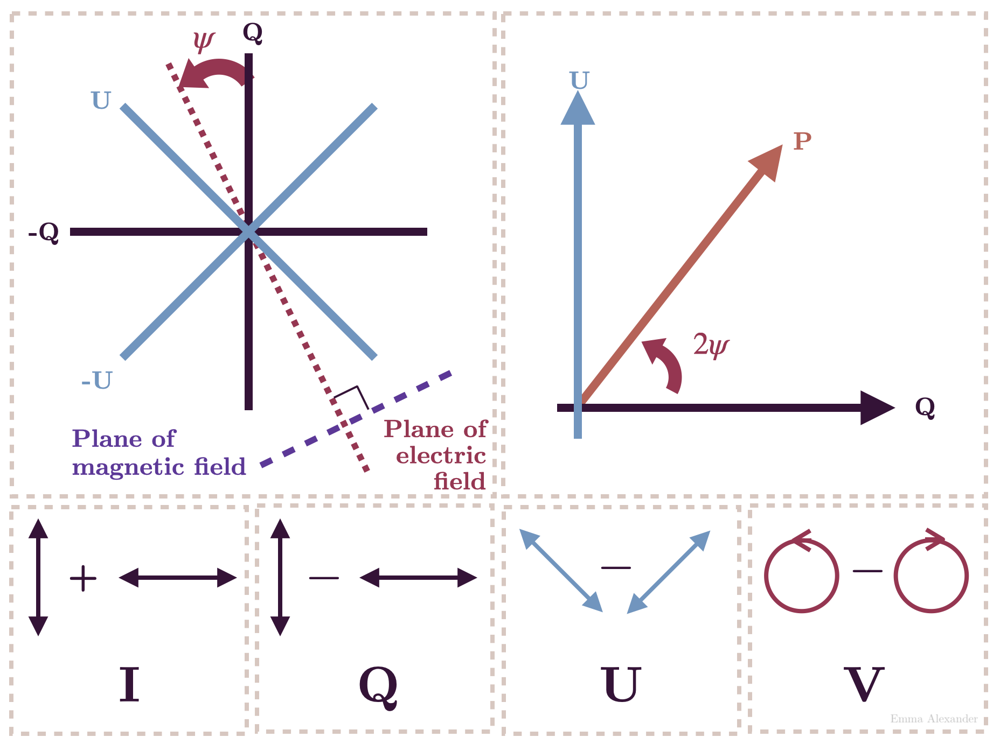

> Interferometers map cosmic magnetic fields by cross-correlating differently polarized antenna feeds to measure all four Stokes parameters.

---

## core physical intuition

Light is an electromagnetic wave that carries polarization information, which is a direct tracer of magnetic fields in space. To capture this, radio antennas are equipped with two distinct feeds that are sensitive to orthogonal polarizations, either right and left circular or horizontal and vertical linear.

An interferometer can cross-correlate these feeds against each other across baselines. By correlating a right-circular feed on one antenna with a left-circular feed on another, the instrument extracts the polarized portion of the signal. When you combine all four possible cross-correlations, you completely determine the polarization state of the incoming light, allowing you to reconstruct maps of the magnetic field geometry and track how the polarization rotates as it travels through magnetized plasma in space.

---

## key derivation & equations

For antennas equipped with Right (R) and Left (L) circular polarization feeds, the four Stokes parameters are constructed from the cross-correlations
$$I = \frac{1}{2}(RR + LL)$$
$$V = \frac{1}{2}(RR - LL)$$
$$Q = \frac{1}{2}(RL + LR)$$
$$U = \frac{i}{2}(RL - LR)$$

Linear polarization is characterized by $Q$ and $U$. As this linearly polarized light travels through a magnetized plasma, the plane of polarization rotates due to the Faraday effect. The observed polarization angle $\chi$ depends on the wavelength $\lambda$
$$\chi = \chi_0 + RM \cdot \lambda^2$$
where $RM$ is the rotation measure, proportional to the integral of the magnetic field along the line of sight.

---

## astrophysical context

Polarization imaging is a crucial capability of arrays like ALMA and the VLA. It is used to trace the twisted magnetic field lines in active galactic nucleus jets, the magnetic support of star-forming molecular clouds, and the orientation of dust grains in protoplanetary disks. Famously, Event Horizon Telescope polarimetry of M87 revealed the highly ordered, spiraling magnetic field structure actively feeding the supermassive black hole near the event horizon.

---

## connections & zettel links

* parent moc: [[Astronomical_Interferometry_MOC]]
* related zettels: [[Calibration overview]], [[Imaging artifacts]], [[AGN and supermassive black holes]], [[Radiation mechanisms in astronomy and interferometers]]
