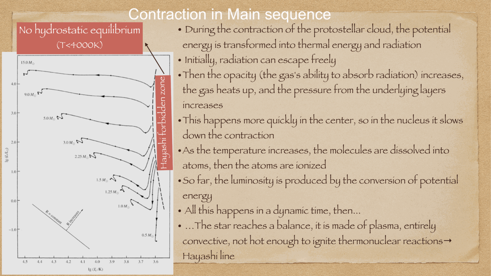
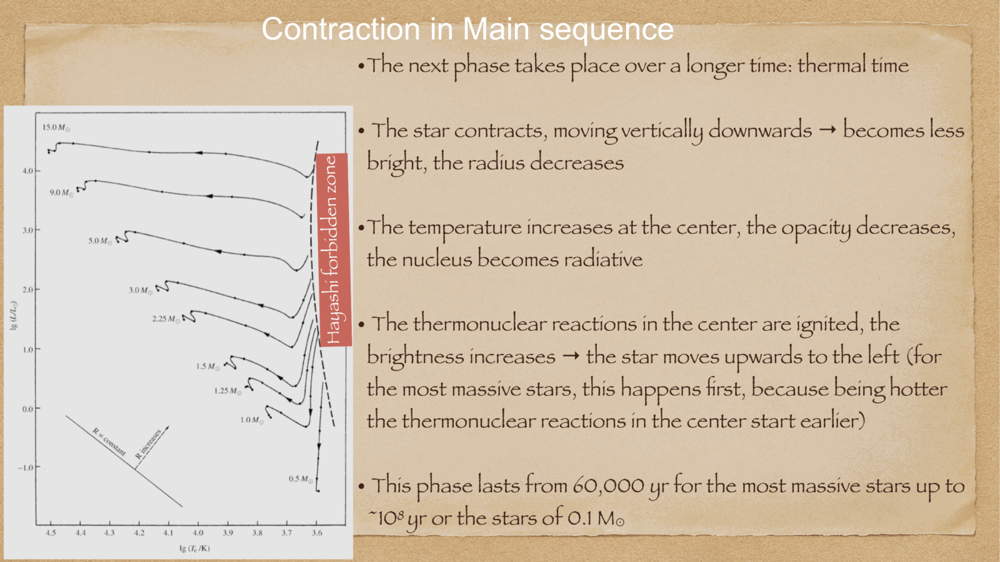
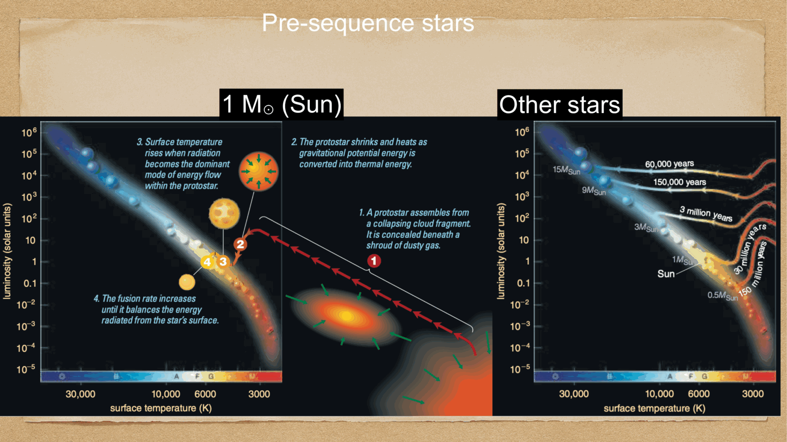
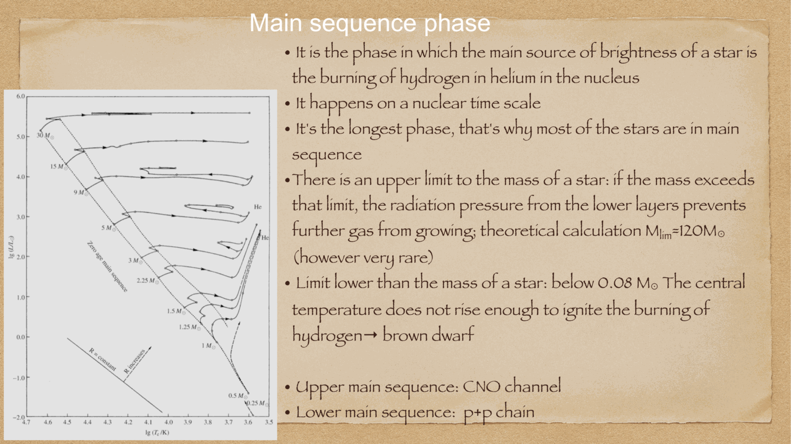


after a dense protostellar core fragments out of a molecular cloud, it undergoes pre-main sequence (PMS) contraction until central temperatures and pressures reach conditions sufficient for stable hydrogen fusion.

---

## the phases of pre-main sequence evolution

### 1. isothermal free-fall collapse:
the core collapses rapidly on the dynamical timescale $t_{\text{ff}} \approx 10^5$ yr. dust efficiently radiates away compressional heat in the far-infrared ($T \approx 10-20$ K).

### 2. hydrostatic protostar and the Hayashi track:
once the core becomes optically thick, trapped radiation heats the gas, establishing hydrostatic equilibrium. the object is now a **protostar**, embedded in an infalling circumstellar envelope and rotating accretion disk (observed in sub-mm by ALMA).

Chushiro Hayashi (1961) showed that a fully convective star has a nearly constant effective temperature:
$$T_{\text{eff}} \approx 3000 - 4500 \text{ K}$$
the protostar contracts along a nearly vertical path downward in the HR diagram called the **Hayashi track**:
- radius $R$ decreases substantially.
- $T_{\text{eff}} \approx \text{constant}$.
- luminosity $L = 4\pi R^2 \sigma T_{\text{eff}}^4$ plunges by orders of magnitude.
- energy transport is **100% convective**.

### 3. the Henyey track:
for stars with $M \gtrsim 0.5 M_\odot$, central temperature eventually rises sufficiently that core opacity drops (Kramer's opacity $\kappa \propto \rho T^{-7/2}$). convection ceases in the interior, and a **radiative core** develops.

the star turns horizontally to the left on the HR diagram along the **Henyey track**:
- luminosity $L \approx \text{constant}$.
- effective temperature $T_{\text{eff}}$ increases steadily as the surface heats up.
- radius continues to contract.

*(very low mass stars, $M < 0.5 M_\odot$, remain fully convective and follow the Hayashi track all the way down to the main sequence without a Henyey phase).*

### 4. arrival at the Zero-Age Main Sequence (ZAMS):
when the central core reaches $T_c \approx 10^7$ K and $\rho_c \sim 100$ g/cm$^3$, thermonuclear fusion of hydrogen via the pp-chain (or CNO cycle) ignites. nuclear energy generation perfectly matches the surface luminosity loss ($L_{\text{nuc}} = L$). 

gravitational contraction ceases, the star achieves complete thermal and hydrostatic equilibrium, and settles onto the **Zero-Age Main Sequence (ZAMS)**.

---

## see also

- [Fundamentals_Astrophysics_Cosmology_MOC](../../04_Atlas/Fundamentals_Astrophysics_Cosmology_MOC.html)
- [Jeans theory and protostellar formation](./Jeans%20theory%20and%20protostellar%20formation.html)
- [HR diagram](./HR%20diagram.html)
- [Stellar scaling relations](./Stellar%20scaling%20relations.html)
- [Stellar evolution timescales](./Stellar%20evolution%20timescales.html)


  <h4 class="backlinks-title">Linked References (3)</h4>
  <ul class="backlinks-list">
    <li class="backlink-item-wrap"><a href="../../04_Atlas/Fundamentals_Astrophysics_Cosmology_MOC.html" class="backlink-item">Fundamentals_Astrophysics_Cosmology_MOC</a></li>
    <li class="backlink-item-wrap"><a href="./Jeans%20theory%20and%20protostellar%20formation.html" class="backlink-item">Jeans theory and protostellar formation</a></li>
    <li class="backlink-item-wrap"><a href="./Stellar%20evolution%20timescales.html" class="backlink-item">Stellar evolution timescales</a></li>
  </ul>

