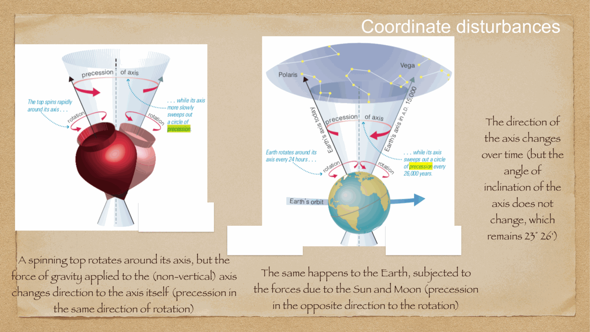
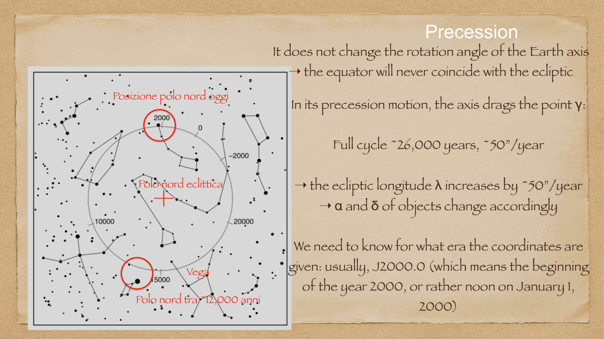
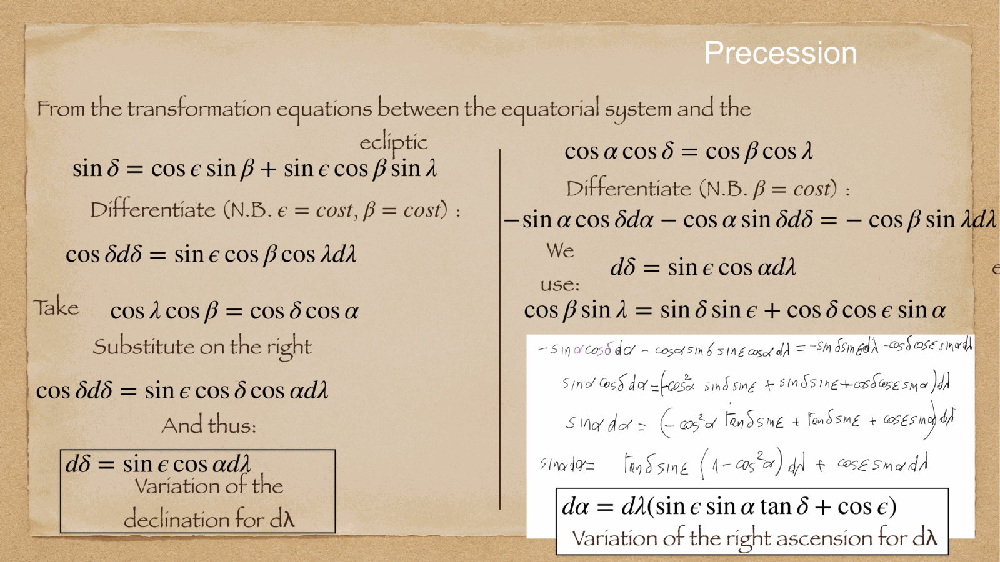
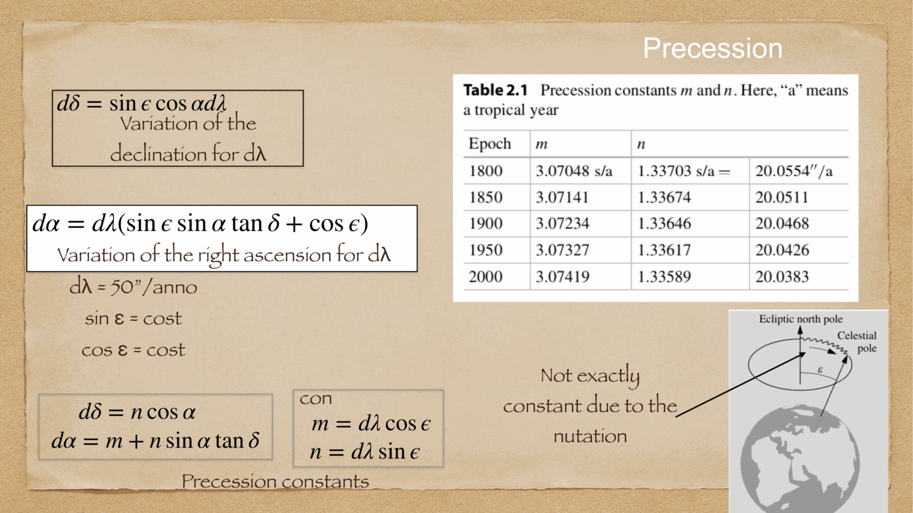
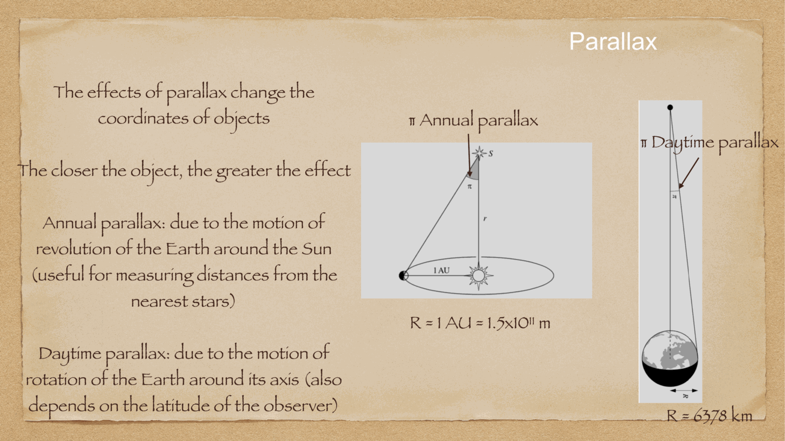

Earth's rotation axis is not permanently fixed in space. because Earth is not a perfect sphere but an **oblate spheroid** (equatorial radius $R_{eq} \approx 6378$ km $>$ polar radius $R_{pol} \approx 6357$ km), the gravitational tug of the Moon and the Sun on the equatorial bulge exerts a torque that causes the rotational axis to undergo both a steady secular conical motion (**precession**) and smaller periodic wobbles (**nutation**).

---

## luni-solar precession of the equinoxes

the ecliptic plane is inclined by $\varepsilon \approx 23.4^\circ$ to the equatorial plane. the gravitational force from the Sun and the Moon acts unequally on the near and far sides of Earth's equatorial bulge. this creates a restoring torque $\vec{\tau}$ trying to pull the equatorial plane into alignment with the orbital plane.

because Earth possesses rapid rotational angular momentum $\vec{L}$, this external torque does not tip the axis over, but causes it to precess gyroscopically:
$$\frac{d\vec{L}}{dt} = \vec{\tau}_{\text{ext}}$$

### characteristics of precession:
- **period**: one full cycle of the celestial pole around the ecliptic pole takes **$P \approx 25,770$ years** (often called the *Platonic Year* or *Great Year*).
- **angular radius**: the rotation axis traces out a cone of half-angle equal to the obliquity $\varepsilon \approx 23^\circ 27'$ centered on the North Ecliptic Pole.
- **direction**: clockwise when viewed from the North Ecliptic Pole (retrograde relative to Earth's orbital motion).
- **drift rate**: the vernal equinox $\gamma$ shifts westward along the ecliptic at a rate of:
  $$\dot{\lambda}_{\text{prec}} \approx 50.3'' / \text{year} \approx 1^\circ \text{ every } 71.6 \text{ years}$$

### consequences of precession:
1. **shift of the pole star**: currently the North Celestial Pole lies within $0.7^\circ$ of $\alpha$ Ursae Minoris (**Polaris**). in 3000 BCE it was near Thuban ($\alpha$ Draconis); in 14,000 CE it will be near **Vega** ($\alpha$ Lyrae), some $47^\circ$ away from today's Polaris!
2. **secular change of equatorial coordinates**: because the vernal equinox $\gamma$ defines the origin $\alpha = 0$, and the equator defines $\delta = 0$, both right ascension and declination change continuously with time:
   $$\Delta\alpha \approx m + n\sin\alpha\tan\delta$$
   $$\Delta\delta \approx n\cos\alpha$$
   where $m \approx 3.075$ s/yr and $n \approx 1.336$ s/yr $\approx 20.0''$/yr.
3. **need for astronomical epochs**: all precision star catalogs must specify their reference epoch (e.g. **B1950.0** or the modern standard **J2000.0**, referring to 1 January 2000 at 12:00 TT). to point a telescope today, catalog coordinates must be precessed to the epoch of observation.

---

## nutation

superimposed on the secular precessional cone is a small, periodic nodding motion called **nutation**, discovered by James Bradley in 1748.

### physical origin:
the Moon's orbital plane is not identical to the ecliptic, but tilted by $i_{\text{Moon}} \approx 5^\circ 09'$. furthermore, the gravitational torque from the Sun causes the **nodes of the Moon's orbit to regress** with a period of **$18.6$ years**. this changing orbital geometry causes the net torque on Earth's bulge to oscillate periodically.

### parameters of nutation:
- **principal period**: $18.6$ years (the lunar nodal precession period).
- **nutation in obliquity** $\Delta\varepsilon$: amplitude $\approx 9.2''$.
- **nutation in longitude** $\Delta\psi$: amplitude $\approx 17.2''$.
- the true celestial pole traces a small nutation ellipse ($9.2'' \times 17.2''$) around the mean precessing pole.

---

## hierarchy of coordinate definitions

to resolve astronomical positions with milliarcsecond (mas) accuracy:
1. **mean position**: coordinates corrected for proper motion and parallax, referenced to the mean equinox and equator of a standard epoch (e.g. J2000.0).
2. **true position**: coordinates corrected for both precession and nutation to the instantaneous equinox of date.
3. **apparent position**: the actual direction of incoming photons after applying stellar aberration and atmospheric refraction.

---

## see also

- [[Fundamentals_Astrophysics_Cosmology_MOC]]
- [[Equatorial system]]
- [[Ecliptic system]]
- [[Atmospheric refraction]]
- [[Aberration of light]]
- [[Annual stellar parallax]]
- [[Time keeping in astronomy]]

## Linked References

- [[Aberration of light]]
- [[Atmospheric refraction]]
- [[Ecliptic system]]
- [[Fundamentals_Astrophysics_Cosmology_MOC]]

