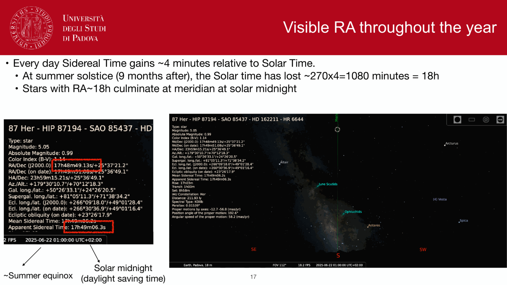
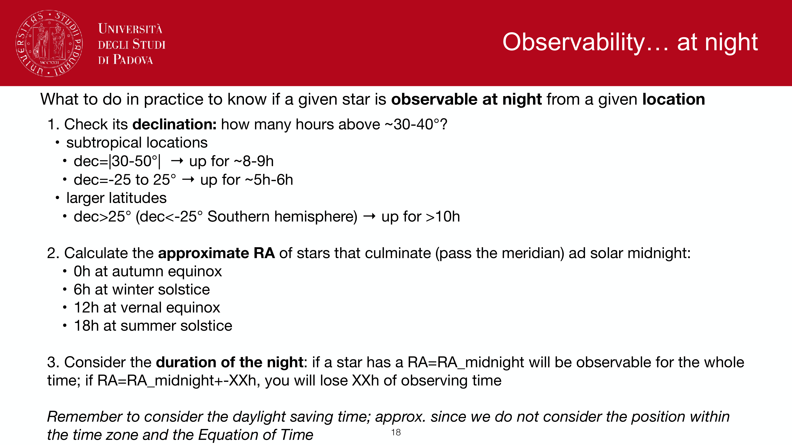
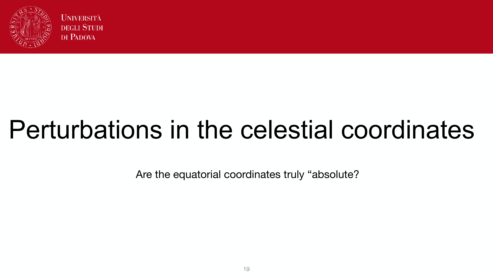
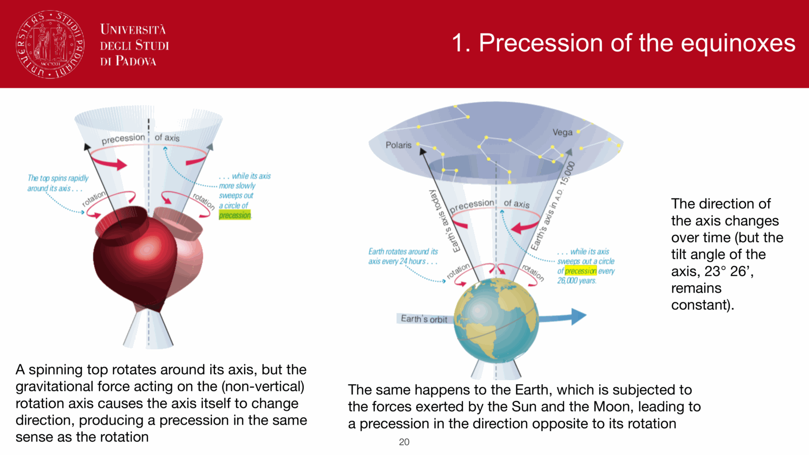
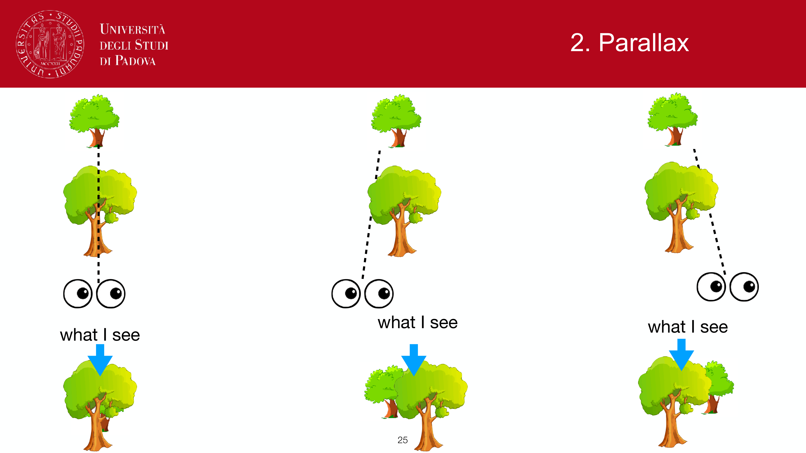
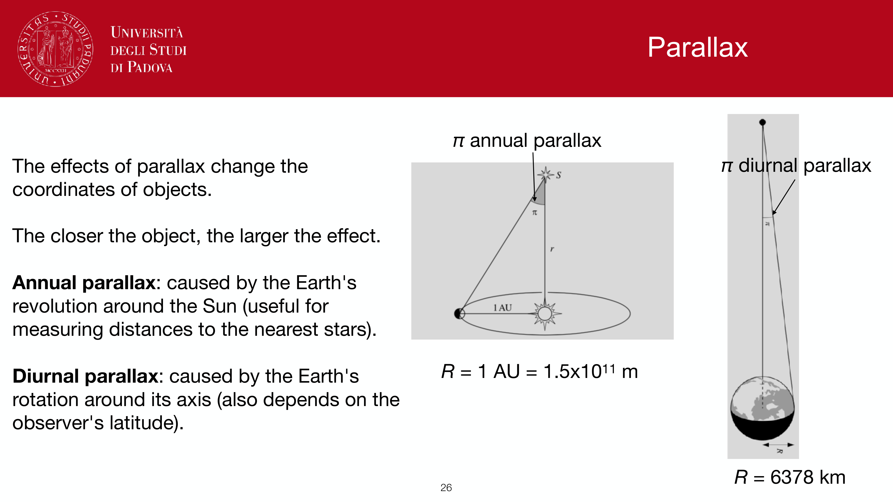
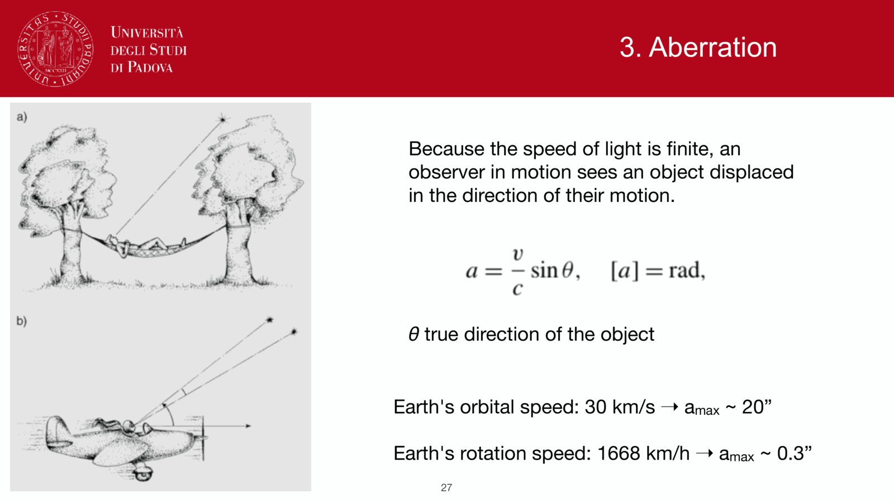
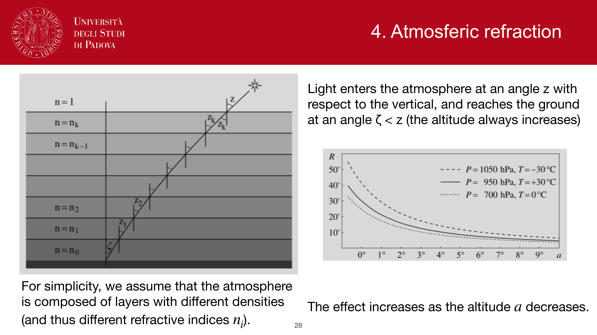

on top of the equatorial coordinate frame ([Equatorial system](Equatorial%20system.html)) sit four small but unavoidable corrections. any precision astrometry, target acquisition, or ephemeris computation has to account for them. each is geometric and well-understood.

## precession of the equinoxes

the Earth's rotation axis is not fixed in space. solar and lunar gravitational torques on Earth's equatorial bulge cause the rotation axis to precess around the ecliptic pole on a $\sim 26\,000$ year cycle. amplitude:
$$\dot\alpha \approx 50''/\text{yr}, \quad \dot\delta \approx \text{a few}''/\text{yr}$$

**consequence**: catalog positions are *epoch-dependent*. I quote a star's coordinates as J2000.0 (or J1950.0 historically); to point a telescope at it tonight I have to precess to the current epoch. precession matrices are tabulated (IAU 2006).

historical detection: Hipparchus, $\sim 130$ BCE, comparing his star catalog with Timocharis's two centuries earlier.

## nutation

a small wobble superimposed on the long-period precession, dominated by the $18.6$-year Saros cycle of lunar-node motion. amplitude $\sim 9''$ in longitude and $\sim 9''$ in obliquity, with shorter-period harmonics.

**consequence**: the ecliptic and equatorial poles are not perfectly fixed even after precession is removed. for arcsecond-level work, nutation must be applied on top of precession.

## stellar aberration

light arriving from a distant source seems displaced toward the direction of the observer's motion. for Earth's orbit (velocity $v \approx 30$ km/s), the aberration angle is
$$\theta_{\rm ab} \approx v/c \approx 20''$$
in the direction of Earth's instantaneous velocity, with annual variation tracing a small ellipse on the sky.

**consequence**: discovered by Bradley (1729) when looking for parallax. it provided the first direct evidence of Earth's orbital motion, predating Bessel's parallax by a century. has nothing to do with the source's distance.

aberration $\neq$ parallax. aberration is geometric (motion of the observer); parallax is geometric (displacement of the observer's location). aberration is $\sim 20''$ for any star, parallax is $\le 1''$ and falls with distance.

## annual stellar parallax

apparent shift of a nearby star against distant background as Earth orbits the Sun. for a star at distance $d$:
$$p = \frac{1\,\text{AU}}{d}$$
maximum amplitude $p \le 0.76''$ (Proxima Centauri, $1.3$ pc). decreases linearly with distance. defines the parsec: $d({\rm pc}) = 1/p({\rm arcsec})$.

**consequence**: must be removed for precision astrometry of background stars; *measured* for foreground stars, where it is the only fully geometric distance method. see [Distance ladder derivations](Distance%20ladder%20derivations.html) and [Annual stellar parallax](Annual%20stellar%20parallax.html).

## ordering and magnitudes

| effect | timescale | typical amplitude |
|---|---|---|
| precession | $26\,000$ yr | $50''/$yr |
| nutation | months to years | $\le 9''$ |
| aberration | annual | $20''$ |
| parallax | annual | $\le 1''$ |

the order in which they are applied to a catalog position to get an apparent position: precession $\to$ nutation $\to$ aberration $\to$ parallax. Telescope control systems do this automatically.

## see also

- [Equatorial system](Equatorial%20system.html)
- [Time keeping in astronomy](Time%20keeping%20in%20astronomy.html)
- [Annual stellar parallax](Annual%20stellar%20parallax.html)
- [Distance ladder derivations](Distance%20ladder%20derivations.html)
- [Atmospheric refraction](interf/Atmospheric%20refraction.html)
- [Spherical trigonometry](Spherical%20trigonometry.html)

---

## observational astrophysics course slides (Prof. Paolo Cassata)

*General precession of the equinoxes: 50.3 arcsec/yr.*

*Lunisolar torque on Earth oblate equatorial bulge.*

*Nutation: periodic 18.6 yr wobble from lunar orbit regression.*

*Mathematical transformation for precession and nutation matrix.*

*Stellar aberration: finite speed of light and Earth orbital velocity.*

*Aberration constant kappa = v_orb / c = 20.4955 arcsec.*

*Annual aberration ellipse vs diurnal aberration.*

*Comparison of astrometric displacements: precession vs nutation vs aberration vs parallax.*

  <h4 class="backlinks-title">Linked References (4)</h4>
  <ul class="backlinks-list">
    <li class="backlink-item-wrap"><a href="AU%20calibration%20parallax%20and%20parsec.html" class="backlink-item">AU calibration parallax and parsec</a></li>
    <li class="backlink-item-wrap"><a href="Time%20keeping%20in%20astronomy.html" class="backlink-item">Time keeping in astronomy</a></li>
    <li class="backlink-item-wrap"><a href="interf/Atmospheric%20refraction.html" class="backlink-item">Atmospheric refraction</a></li>
    <li class="backlink-item-wrap"><a href="../../04_Atlas/Observational_Astrophysics_MOC.html" class="backlink-item">Observational_Astrophysics_MOC</a></li>
  </ul>

