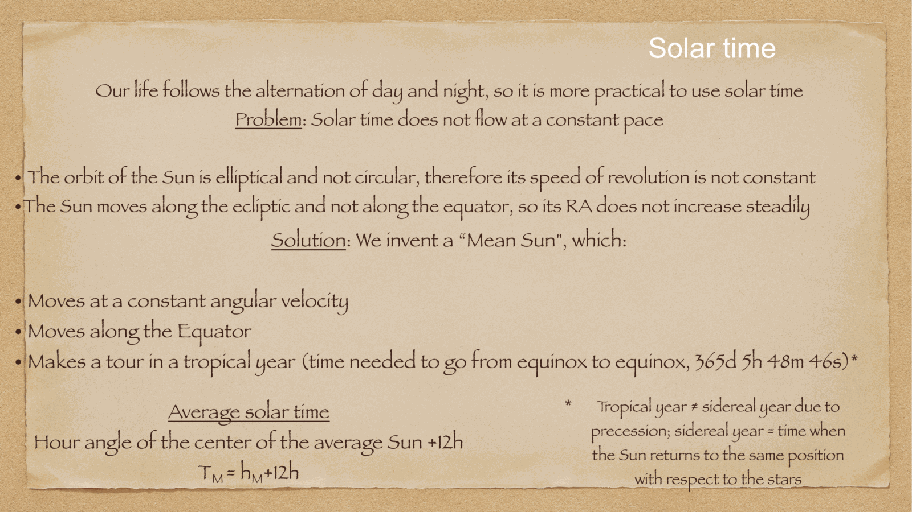
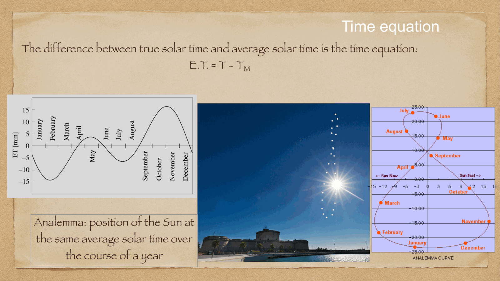
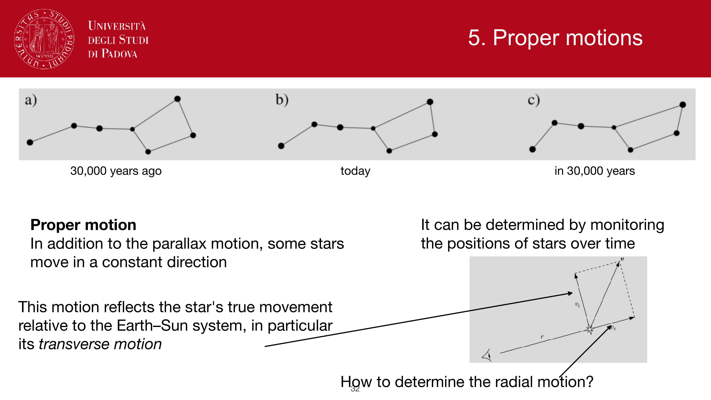
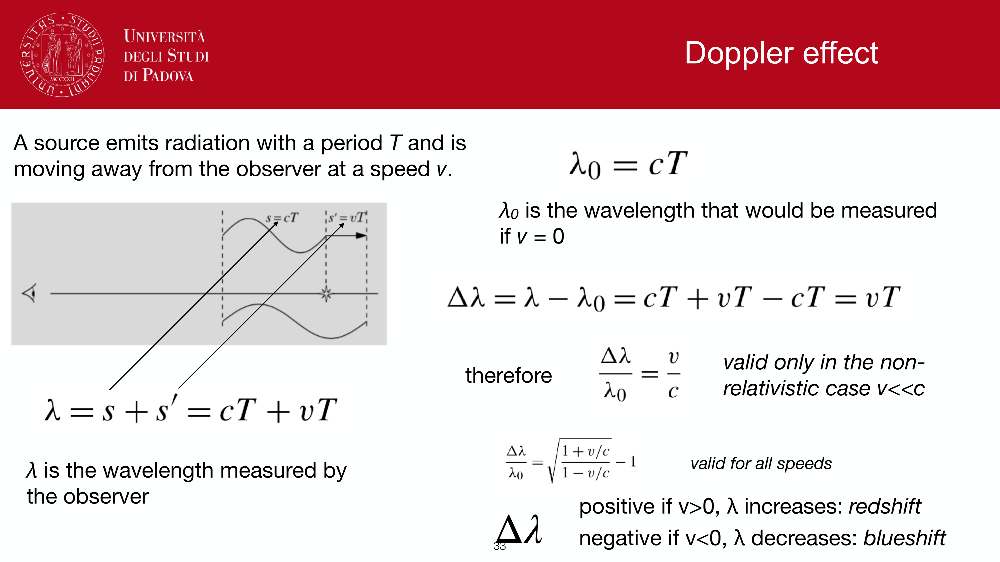


in addition to the periodic reflex motions of parallax and aberration caused by Earth's orbit, stars have intrinsic physical motion through three-dimensional space relative to the solar system: their **space velocity** $\vec{v}$.

the projection of this 3D space velocity onto the plane of the sky is observed as an angular drift called **proper motion** (moto proprio).

---

## definitions and the velocity triangle

the space velocity vector $\vec{v}$ of a star relative to the Sun is decomposed into two orthogonal components:
1. **radial velocity** $v_r$: along the line of sight.
2. **tangential velocity** $v_t$: perpendicular to the line of sight, in the plane of the sky.

$$v = \sqrt{v_r^2 + v_t^2}$$

### 1. radial velocity $v_r$:
measured directly in physical units (km/s) from the Doppler shift of spectral absorption/emission lines:
$$z = \frac{\lambda_{\text{obs}} - \lambda_0}{\lambda_0} \approx \frac{v_r}{c} \implies v_r = c \left(\frac{\Delta\lambda}{\lambda_0}\right)$$
- $v_r > 0$ (redshift): star is receding from the Sun.
- $v_r < 0$ (blueshift): star is approaching the Sun.

### 2. proper motion $\mu$ and tangential velocity $v_t$:
**proper motion** $\mu$ is the annual angular displacement of the star on the celestial sphere, usually measured in arcseconds per year ($''/\text{yr}$) or milliarcseconds per year (mas/yr).

it is resolved into equatorial components:
$$\mu = \sqrt{\mu_\alpha^2 \cos^2\delta + \mu_\delta^2}$$
where $\mu_\alpha = d\alpha/dt$ and $\mu_\delta = d\delta/dt$.

the physical **tangential velocity** $v_t$ depends on both the proper motion $\mu$ and the distance $d$:
$$v_t = d \cdot \mu$$

converting units ($d$ in pc, $\mu$ in $''/\text{yr}$, $v_t$ in km/s):
$$v_t = \left(d \times 3.0857 \times 10^{13}\text{ km}\right) \left(\mu \times \frac{\pi}{180 \times 3600}\text{ rad}\right) \left(\frac{1}{3.1557 \times 10^7\text{ s}}\right)$$
$$\boxed{\, v_t = 4.7404 \, d(\text{pc}) \, \mu(''/\text{yr}) \approx 4.74 \, \frac{\mu(''/\text{yr})}{p(''/\text{yr})} \text{ km/s} \,}$$

---

## records and physical significance

- **Barnard's Star**: fastest known proper motion of any star, discovered by E. E. Barnard in 1916.
  $$\mu = 10.36'' / \text{year}, \quad p = 0.547'' \implies d = 1.83 \text{ pc}$$
  $$v_t = 4.74 \times 1.83 \times 10.36 \approx 89.8 \text{ km/s}, \quad v_r = -110.8 \text{ km/s}$$
  $$v = \sqrt{89.8^2 + (-110.8)^2} \approx 142.6 \text{ km/s}$$
- **kinematics of Galactic populations**:
  - **Population I stars (thin disk)**: small random velocities ($\sigma_v \sim 10-20$ km/s), circular orbits in the disk plane.
  - **Population II stars (halo & globular clusters)**: high proper motions and large velocity dispersions ($\sigma_v \sim 100-200$ km/s), plunge through the disk on highly eccentric orbits. high-proper-motion star searches historically discovered the halo population and halo subdwarfs.

---

## see also

- [Fundamentals_Astrophysics_Cosmology_MOC](../../04_Atlas/Fundamentals_Astrophysics_Cosmology_MOC.html)
- [Annual stellar parallax](./Annual%20stellar%20parallax.html)
- [Stellar kinematics measurements](./Stellar%20kinematics%20measurements.html)
- [Milky Way structure](./Milky%20Way%20structure.html)
- [Stellar populations I II III](./Stellar%20populations%20I%20II%20III.html)
- [Aberration of light](./Aberration%20of%20light.html)

---

## observational astrophysics course slides (Prof. Paolo Cassata)

*Proper motion mu (arcsec/yr) and tangential velocity v_t = 4.74 mu d.*

*Radial velocity v_r from Doppler shift and total space velocity v = sqrt(v_r^2 + v_t^2).*


  <h4 class="backlinks-title">Linked References (4)</h4>
  <ul class="backlinks-list">
    <li class="backlink-item-wrap"><a href="./Aberration%20of%20light.html" class="backlink-item">Aberration of light</a></li>
    <li class="backlink-item-wrap"><a href="./Annual%20stellar%20parallax.html" class="backlink-item">Annual stellar parallax</a></li>
    <li class="backlink-item-wrap"><a href="../../04_Atlas/Fundamentals_Astrophysics_Cosmology_MOC.html" class="backlink-item">Fundamentals_Astrophysics_Cosmology_MOC</a></li>
    <li class="backlink-item-wrap"><a href="../../04_Atlas/Observational_Astrophysics_MOC.html" class="backlink-item">Observational_Astrophysics_MOC</a></li>
  </ul>

