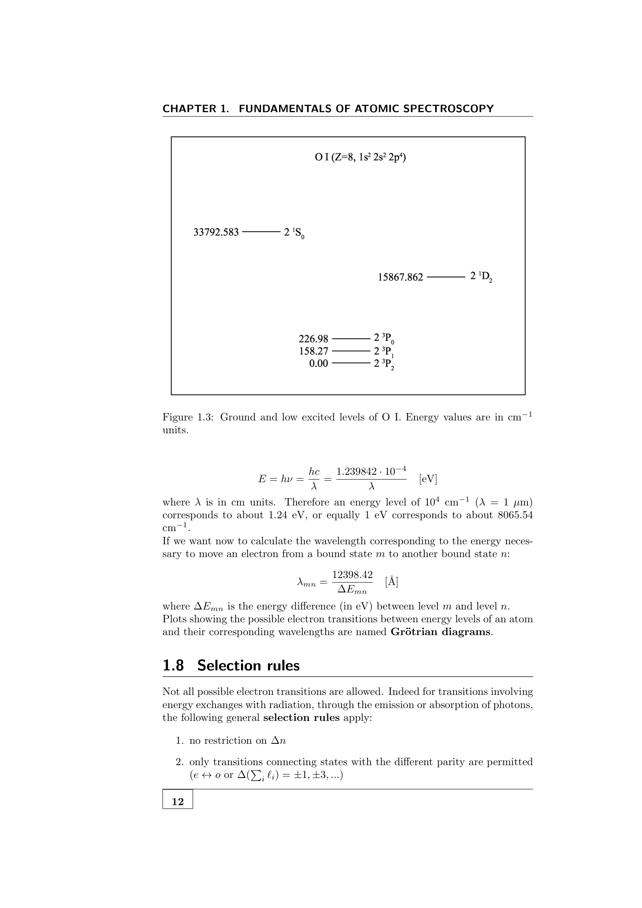
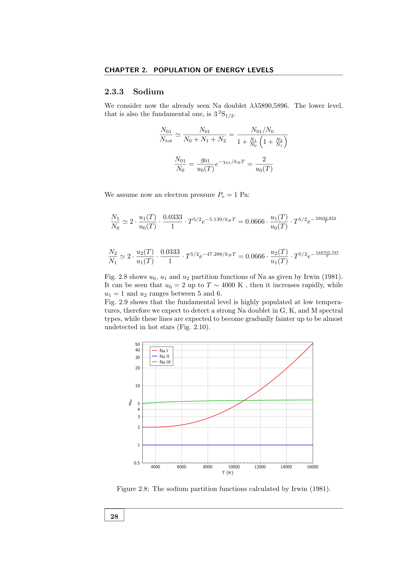

to label every atomic state I need a set of quantum numbers. for a single-electron atom or one valence electron, four numbers suffice. for multi-electron atoms, additional couplings give $L$, $S$, $J$.

## single-electron quantum numbers

an electron in a hydrogenic atom is labelled by:

- **$n$ (principal)**: $n = 1, 2, 3, \dots$. sets the energy level, $E_n = -13.6/n^2$ eV in hydrogen.
- **$\ell$ (azimuthal / angular momentum)**: $\ell = 0, 1, 2, \dots, n-1$. spectroscopic letters: s, p, d, f, g, h, ....
- **$m_\ell$ (magnetic)**: $-\ell \le m_\ell \le \ell$. spatial orientation of the orbital.
- **$s$ (spin)**: $\pm 1/2$. intrinsic spin angular momentum.

related: total angular momentum quantum number for one electron, $j = \ell + s$ (with $-j \le m_j \le j$).

magnitudes:
$$\lvert \vec L\rvert = \sqrt{\ell(\ell+1)}\,\hbar, \quad \lvert \vec S\rvert = \sqrt{s(s+1)}\,\hbar, \quad \lvert \vec J\rvert = \sqrt{j(j+1)}\,\hbar$$

## Pauli exclusion

no two electrons in the same atom can have the same set $(n, \ell, m_\ell, s)$. consequence: no more than $2(2\ell+1)$ electrons per shell of given $(n, \ell)$.

## electron configurations

write down the occupied shells, e.g. for Na ($Z = 11$):
$$1s^2\,2s^2\,2p^6\,3s^1$$
the **core** ($1s^2 2s^2 2p^6$) has all closed shells; the **valence electron** ($3s^1$) controls the spectrum.

## multi-electron coupling: LS vs jj

once you have multiple valence electrons, their angular momenta can couple in two extreme regimes:

### Russell-Saunders (LS coupling)
spin-spin and orbit-orbit couplings dominate over spin-orbit:
$$\vec L = \sum_i \vec\ell_i, \quad \vec S = \sum_i \vec s_i, \quad \vec J = \vec L + \vec S$$
appropriate for **light atoms** ($Z \lesssim 30$). this is what 99% of stellar spectroscopy uses.

### jj coupling
spin-orbit dominates: $\vec j_i = \vec\ell_i + \vec s_i$ for each electron, then $\vec J = \sum_i \vec j_i$. appropriate for heavy atoms ($Z \gtrsim 80$).

most astronomical spectra use LS notation; jj is reserved for the heaviest elements (Pb, Bi, etc.).

## the result: term states and term symbols

in LS coupling, the state of an atom with multiple electrons is fully described by $L, S, J$. each $(L, S)$ pair is called a **term**, and is split into $J$-sublevels by spin-orbit coupling. notation:
$$n^{(2S+1)}L_J^{p}$$
read as "principal $n$, multiplicity $2S+1$, term letter $L$, sublevel $J$, parity $p$" (see [[Atomic term symbols]]).

## examples

- **H ground**: $1s^1$, $L = 0$, $S = 1/2$, $J = 1/2$ $\to$ $1\,^2S_{1/2}^e$.
- **Na ground**: valence electron $3s^1$, same as H above $\to$ $3\,^2S_{1/2}^e$.
- **He ground**: $1s^2$, $L = 0$, $S = 0$, $J = 0$ $\to$ $1\,^1S_0^e$.
- **C ground**: $2p^2$, $^3P_0$ via Hund's rules.

## see also

- [[Russell-Saunders LS coupling]]
- [[jj coupling]]
- [[Atomic term symbols]]
- [[Hund's rules]]
- [[Selection rules]]
- [[Statistical weight g]]
- [[Pauli principle and electron configurations]]
- [[Hydrogen spectral series]]
- [[Helium energy levels]]

---

### Astronomical Spectroscopy Diagnostic Panels

*Russell-Saunders LS coupling vector diagram: orbital angular momentum $\vec{L} = \sum \vec{\ell}_i$ and spin $\vec{S} = \sum \vec{s}_i$ coupling into total angular momentum $\vec{J} = \vec{L} + \vec{S}$.*

*Grotrian energy level diagram of neutral and singly-ionized atoms, illustrating allowed electric dipole (E1) transitions.*

## Linked References

- [[Atomic term symbols]]
- [[Energy level diagrams Grotrian]]
- [[Equivalent vs nonequivalent electrons]]
- [[Helium energy levels]]
- [[Hund's rules]]
- [[Pauli principle and electron configurations]]
- [[Russell-Saunders LS coupling]]
- [[Selection rules]]
- [[Sodium and alkalis]]
- [[Statistical weight g]]
- [[jj coupling]]
- [[Astronomical_Spectroscopy_MOC]]

