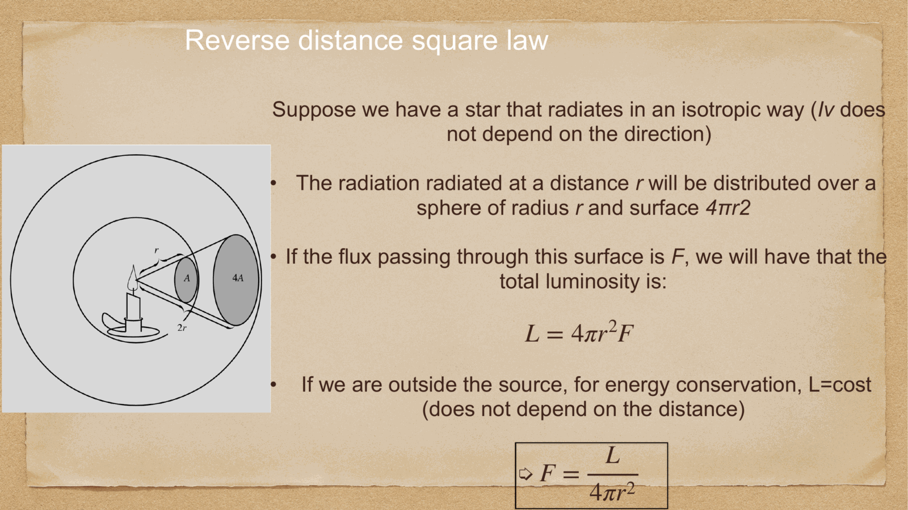
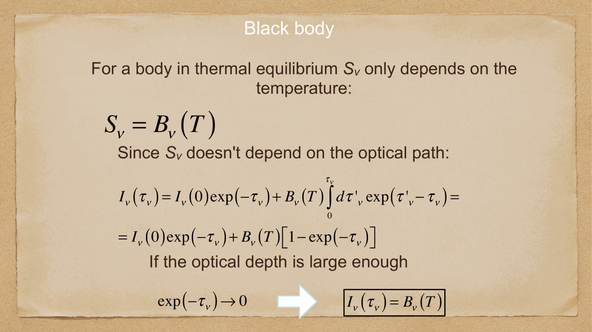
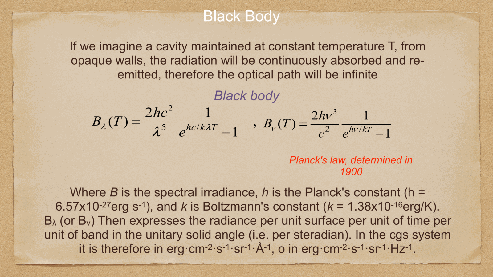
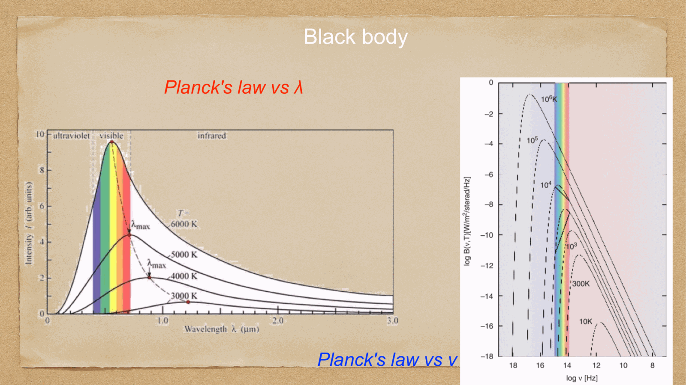
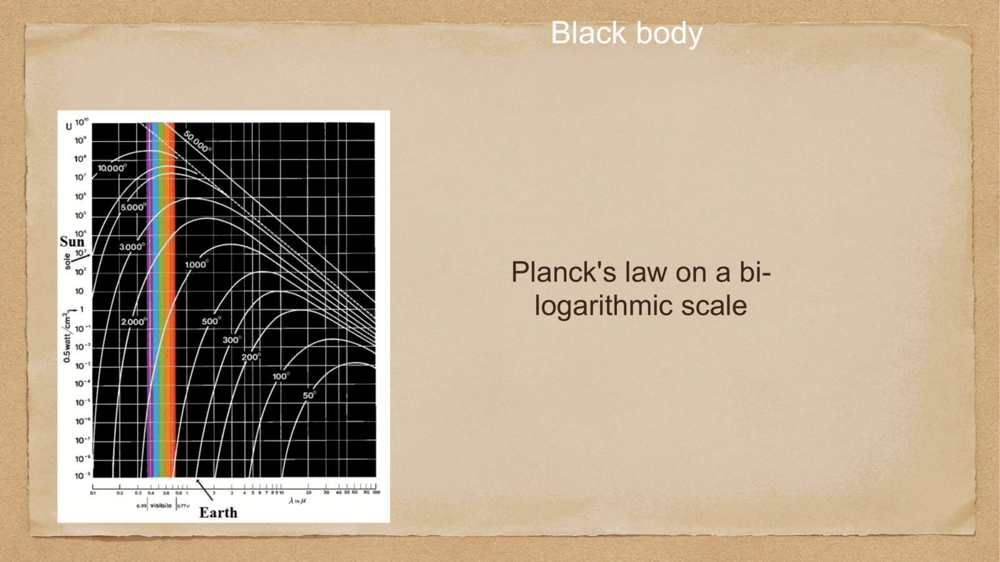


to describe how energy flows from astrophysical sources through space to an observer's telescope, astronomy relies on four fundamental radiometric quantities: **luminosity**, **flux**, **specific intensity**, and **energy density**.

---

## 1. specific intensity (radiance) $I_\nu$

**specific intensity** $I_\nu$ (or brightness $B_\nu$) is the fundamental microphysical description of a radiation field. it measures the energy $dE_\nu$ flowing in frequency interval $[
u, 
u + d
u]$ through an area $dA$, during time $dt$, within solid angle $d\Omega$, at an angle $\theta$ relative to the surface normal $\hat{n}$:

$$\boxed{\, dE_\nu = I_\nu(\vec{r}, \hat{n}, t) \, \cos\theta \, dA \, dt \, d\nu \, d\Omega \,}$$

- **SI units**: $\text{W} \cdot \text{m}^{-2} \cdot \text{Hz}^{-1} \cdot \text{sr}^{-1}$ (or $\text{erg} \cdot \text{s}^{-1} \cdot \text{cm}^{-2} \cdot \text{Hz}^{-1} \cdot \text{sr}^{-1}$).

### the invariance of specific intensity along a ray:
in vacuum (or any transparent medium without absorption, emission, or scattering), Liouville's theorem for photon phase-space density guarantees that:
$$\boxed{\, \frac{dI_\nu}{ds} = 0 \implies I_\nu = \text{constant along a ray} \,}$$

**profound astrophysical consequence**: the surface brightness of an extended resolved object (like the surface of the Sun, the Moon, or a nearby galaxy) does **not** depend on distance! as distance $d$ increases, the received flux from each square arcsecond drops as $1/d^2$, but the physical area subtended by one square arcsecond grows as $d^2$, perfectly canceling out.

---

## 2. radiative flux and flux density $F_\nu$

the **spectral flux density** (or net flux) $F_\nu$ is the net energy flowing through a unit area per unit time per unit frequency:
$$F_\nu = \int_{4\pi} I_\nu \cos\theta \, d\Omega$$

in radio astronomy, flux density is measured in **Janskys** (Jy):
$$1\text{ Jy} = 10^{-26} \text{ W m}^{-2}\text{ Hz}^{-1} = 10^{-23} \text{ erg s}^{-1}\text{ cm}^{-2}\text{ Hz}^{-1}$$

the **total bolometric flux** $F$ is integrated over all frequencies:
$$\boxed{\, F = \int_0^\infty F_\nu \, d\nu \qquad [\text{W m}^{-2}] \,}$$

---

## 3. luminosity $L$ and the inverse-square law

the **luminosity** $L$ is the total intrinsic energy emitted by a source per unit time in all directions:
$$L = \oint_{\text{closed surface}} F \, dA \qquad [\text{Watts or erg/s}]$$

for a spherical star of radius $R$ emitting uniformly with surface flux $F_{\text{surf}}$:
$$\boxed{\, L = 4\pi R^2 F_{\text{surf}} \,}$$

solar luminosity benchmark:
$$L_\odot \approx 3.828 \times 10^{26} \text{ W} = 3.828 \times 10^{33} \text{ erg/s}$$

### the inverse-square law:
conservation of energy through concentric spherical shells of radius $d$ centered on an isotropic source gives:
$$L = 4\pi d^2 F(d) \implies \boxed{\, F = \frac{L}{4\pi d^2} \,}$$

this $1/d^2$ geometric fall-off is the fundamental basis for all **standard candles** in the cosmic distance ladder.

---

## 4. radiation energy density $u$ and radiation pressure $P_{\text{rad}}$

the energy density of the radiation field $u_\nu$ (energy per unit volume per unit frequency) is related to the specific intensity by:
$$u_\nu = \frac{1}{c} \int_{4\pi} I_\nu \, d\Omega$$

for an isotropic radiation field ($I_\nu$ independent of direction):
$$u_\nu = \frac{4\pi}{c} I_\nu, \qquad u = \int_0^\infty u_\nu \, d\nu = \frac{4\pi}{c} I$$

### radiation pressure:
photons carry momentum $p = E/c$. the momentum flux transferred to a surface normal to the beam yields the **radiation pressure**:
$$P_{\text{rad}} = \frac{1}{c} \int_{4\pi} I_\nu \cos^2\theta \, d\Omega$$

for an isotropic radiation field:
$$\boxed{\, P_{\text{rad}} = \frac{1}{3} u \,}$$

in the hot cores of massive stars ($M \gtrsim 20 M_\odot$) and in the radiation-dominated early universe, radiation pressure $P_{\text{rad}} = \frac{1}{3} a T^4$ dominates over gas thermal pressure $P_{\text{gas}} = n k_B T$.

---

## see also

- [Fundamentals_Astrophysics_Cosmology_MOC](../../04_Atlas/Fundamentals_Astrophysics_Cosmology_MOC.html)
- [Electromagnetic radiation basics](./Electromagnetic%20radiation%20basics.html)
- [Blackbody radiation and Stefan-Boltzmann](./Blackbody%20radiation%20and%20Stefan-Boltzmann.html)
- [Magnitudes and photometric systems](./Magnitudes%20and%20photometric%20systems.html)
- [Parallax and standard candles](./Parallax%20and%20standard%20candles.html)


  <h4 class="backlinks-title">Linked References (3)</h4>
  <ul class="backlinks-list">
    <li class="backlink-item-wrap"><a href="./Blackbody%20radiation%20and%20Stefan-Boltzmann.html" class="backlink-item">Blackbody radiation and Stefan-Boltzmann</a></li>
    <li class="backlink-item-wrap"><a href="./Electromagnetic%20radiation%20basics.html" class="backlink-item">Electromagnetic radiation basics</a></li>
    <li class="backlink-item-wrap"><a href="../../04_Atlas/Fundamentals_Astrophysics_Cosmology_MOC.html" class="backlink-item">Fundamentals_Astrophysics_Cosmology_MOC</a></li>
  </ul>

