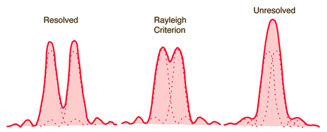


The **Rayleigh criterion** defines the minimum angular separation at which two point sources can be considered **resolved** by a telescope
	it is the standard definition of the **diffraction limit**

The criterion states:
	two point sources are just resolved when the **central maximum** of one source's Airy disk
		coincides with the **first diffraction minimum** of the other source's Airy disk

Left: two point sources well resolved. Centre: Rayleigh limit — the first minimum of one coincides with the maximum of the other. Right: unresolved — the two maxima blend into one.

---

## Derivation from diffraction theory

For a circular aperture of diameter $D$, the **Fraunhofer diffraction pattern** of a point source is the **Airy pattern**:
$$I(\theta) = I_0 \left[\frac{2 J_1(\pi D \sin\theta / \lambda)}{\pi D \sin\theta / \lambda}\right]^2$$

where $J_1$ is the first-order Bessel function of the first kind

The **first zero** of $J_1(x)$ occurs at $x = 1.22\pi$, giving:
$$\sin\theta_{min} = 1.22 \frac{\lambda}{D}$$

For small angles ($\sin\theta \approx \theta$):
$$\boxed{\theta_{min} = 1.22 \frac{\lambda}{D}}$$

where $\theta_{min}$ is in **radians**

Converting to arcseconds:
$$\theta_{min}~[\text{arcsec}] = 1.22 \times \frac{\lambda~[\text{m}]}{D~[\text{m}]} \times \frac{180 \times 3600}{\pi} \approx \frac{0.25~[\mu\text{m}]}{D~[\text{m}]}$$

---

## The Airy disk

The **Airy disk** is the bright central spot of the diffraction pattern
	it contains $\approx 84\%$ of the total energy
	its radius is $\theta_{min} = 1.22\lambda/D$

Around the Airy disk: alternating dark and bright rings
	the first bright ring contains about 7% of the energy
	successive rings contain less and less

At the Rayleigh limit, the central maximum of one source falls exactly in the first dark ring of the other
	the combined intensity profile shows a shallow **saddle point** between the two peaks

---

## Examples

| Telescope | $D$ | $\lambda$ | $\theta_{min}$ |
|---|---|---|---|
| Human eye | 8 mm (dark-adapted) | 550 nm | $17''$ |
| Binoculars | 50 mm | 550 nm | $2.8''$ |
| HST | 2.4 m | 550 nm | $0.057''$ |
| VLT (optical) | 8.2 m | 550 nm | $0.017''$ |
| Chandra (X-ray) | 1.2 m effective | 0.5 nm (2.5 keV) | $\sim 0.5''$ (mirror-limited) |

---

## Limitations of the Rayleigh criterion

The Rayleigh criterion is a **convention**, not a hard physical law
	it was chosen because it corresponds to a clearly identifiable feature (the first zero)
		other criteria exist:
			**Sparrow criterion**: the combined profile is flat (no saddle), more applicable when contrast is poor
			**Houston criterion**: $\theta = \lambda/D$ (no 1.22 factor)

For **real optical telescopes**:
	the resolution is often **seeing-limited** (ground-based): $\theta \approx \lambda/r_0 \gg \lambda/D$
		not diffraction-limited unless very small aperture or space-based

For **X-ray telescopes**:
	the diffraction limit is completely negligible
		at $E = 1$ keV ($\lambda = 1.24$ nm), a 1-m aperture gives $\theta_{diff} \sim 0.0003''$
	the actual angular resolution (HPD $\sim 0.5''$ for Chandra) is entirely limited by mirror **figure errors and roughness**
	see [Angular Resolution](./Angular%20Resolution.html) and [Point Spread Function (PSF)](./Point%20Spread%20Function%20%28PSF%29.html)


  <h4 class="backlinks-title">Linked References (9)</h4>
  <ul class="backlinks-list">
    <li class="backlink-item-wrap"><a href="./Adaptive%20optics%20overview.html" class="backlink-item">Adaptive optics overview</a></li>
    <li class="backlink-item-wrap"><a href="interf/Adaptive%20optics%20overview.html" class="backlink-item">Adaptive optics overview</a></li>
    <li class="backlink-item-wrap"><a href="./Atmospheric%20seeing.html" class="backlink-item">Atmospheric seeing</a></li>
    <li class="backlink-item-wrap"><a href="interf/Atmospheric%20seeing.html" class="backlink-item">Atmospheric seeing</a></li>
    <li class="backlink-item-wrap"><a href="../../04_Atlas/Lab_High-Energy_MOC.html" class="backlink-item">Lab_High-Energy_MOC</a></li>
    <li class="backlink-item-wrap"><a href="./Point%20Spread%20Function%20%28PSF%29.html" class="backlink-item">Point Spread Function (PSF)</a></li>
    <li class="backlink-item-wrap"><a href="./Point%20spread%20function.html" class="backlink-item">Point spread function</a></li>
    <li class="backlink-item-wrap"><a href="./Single%20slit%20diffraction.html" class="backlink-item">Single slit diffraction</a></li>
    <li class="backlink-item-wrap"><a href="./Telescope%20resolving%20power.html" class="backlink-item">Telescope resolving power</a></li>
  </ul>

