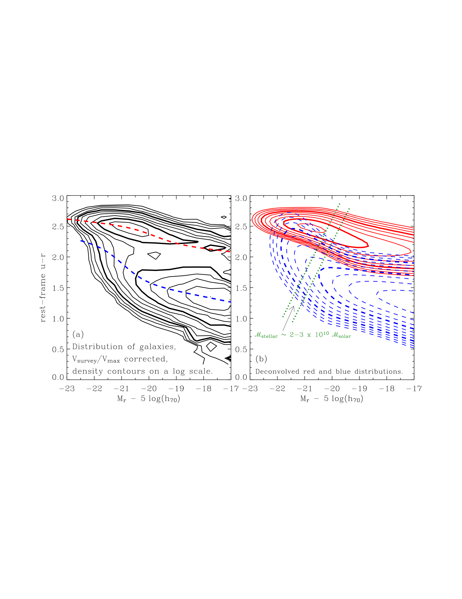
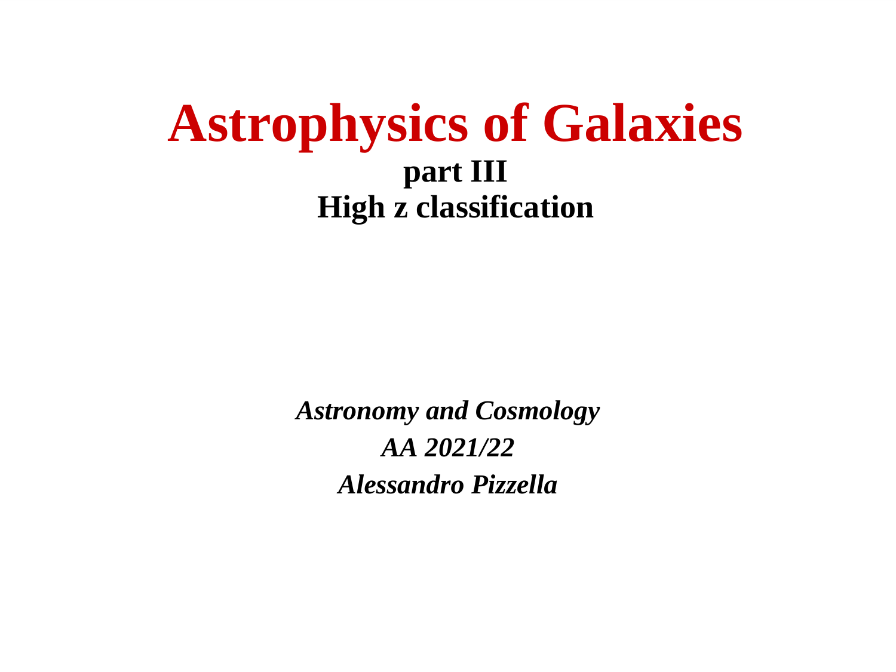
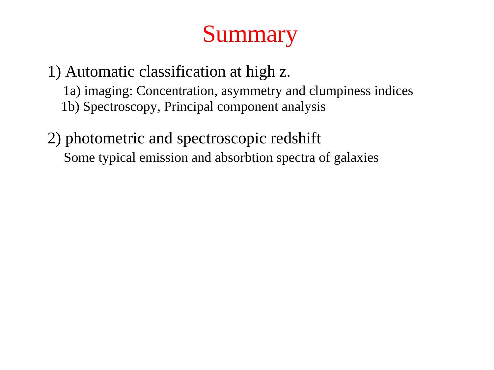
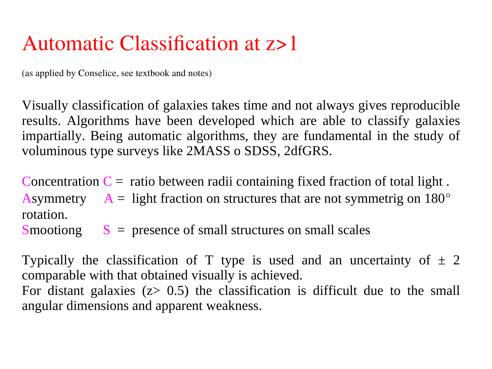
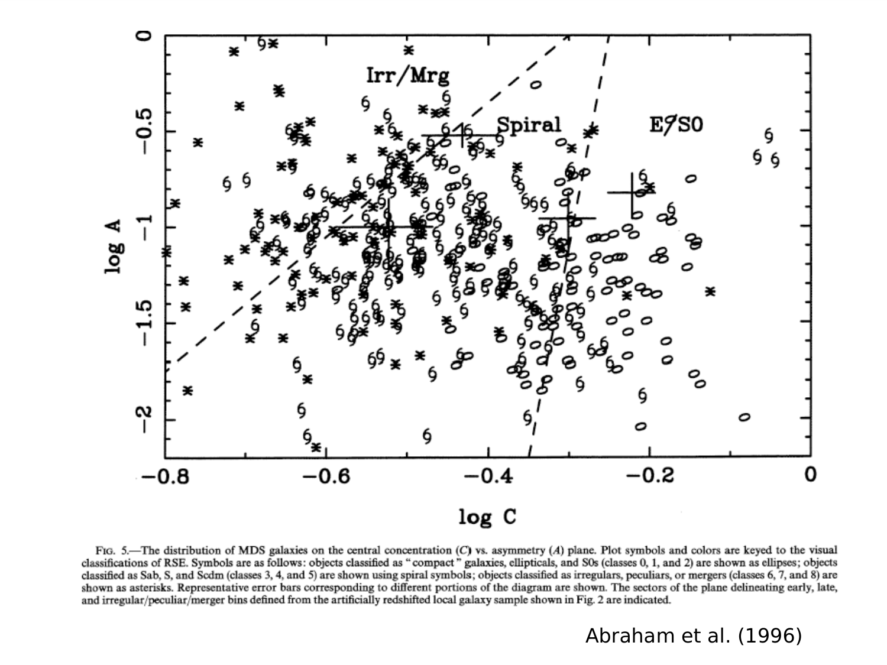
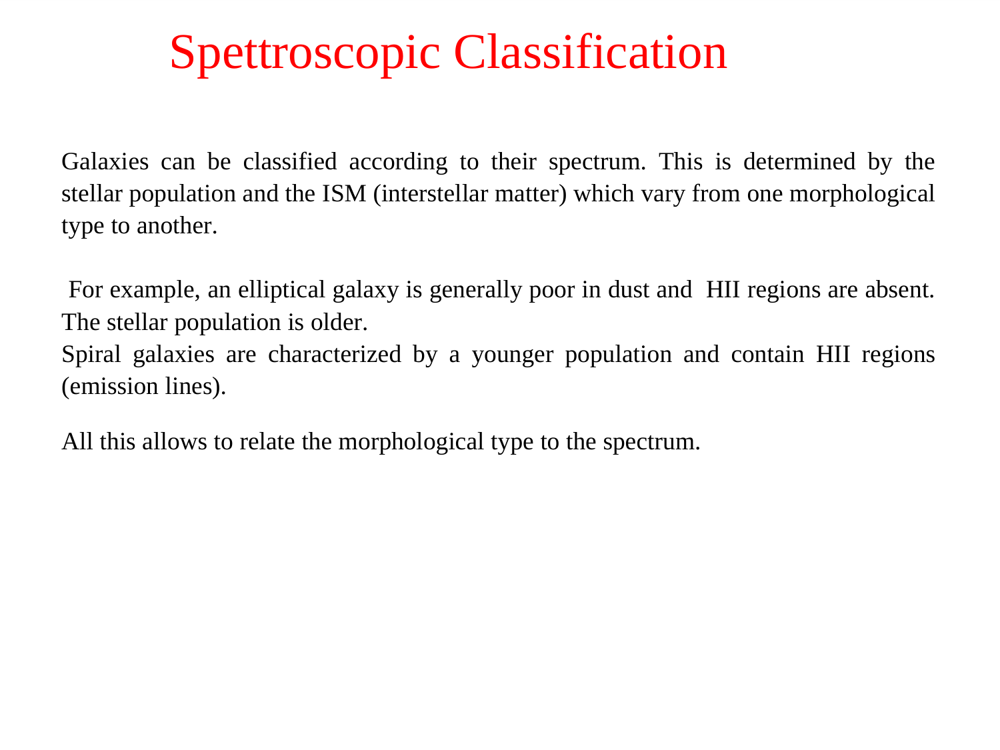
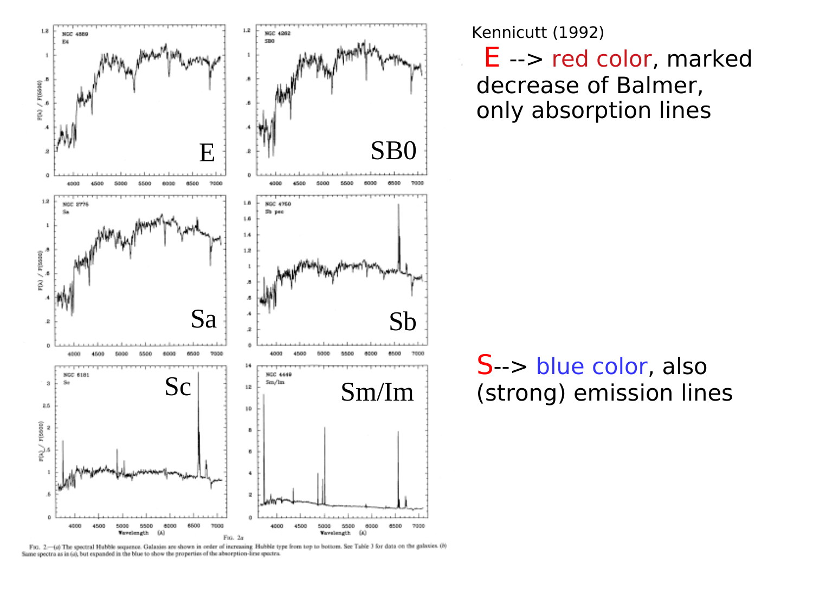


# red sequence and blue cloud

up: [Pablo_02_Statistical_properties_of_galaxies](../../02_Literature/Lectures/Observational_Cosmology/Pablo_02_Statistical_properties_of_galaxies.html) · [Color bimodality of galaxies](./Color%20bimodality%20of%20galaxies.html)

## the two populations

the [Color bimodality of galaxies](./Color%20bimodality%20of%20galaxies.html) resolves into two well-defined locii in the color-magnitude diagram (CMD):

- **red sequence**: a tight, slightly tilted line of red galaxies, scatter $\sim 0.05$ mag in $u-r$. these are mostly ellipticals and S0s, plus the bulges of early-type spirals. essentially passive: little or no ongoing star formation, old stellar populations ($\gtrsim 5$ Gyr), often dust-poor.
- **blue cloud**: a broader, more diffuse population running roughly parallel but $\sim 1$ mag bluer in $u-r$. these are spirals and irregulars, with active star formation, younger luminosity-weighted ages ($\sim 1$–$3$ Gyr), and variable dust.

## the tilt of the red sequence

the red sequence is *not* horizontal in the CMD. brighter (more massive) ellipticals are *redder*. this is the **mass-metallicity relation**: more massive galaxies retain more of their metals against SN winds, so they have higher metallicity stellar populations, which are intrinsically redder for any age.

slope is $\Delta(u-r)/\Delta M_r \approx -0.05$ in SDSS bands. the tightness of the relation puts a strong upper limit on the spread of formation times of cluster ellipticals.

## the blue cloud is broader

because star-forming galaxies have a much larger dust spread and more variable star-formation histories, the blue cloud has $\sim 0.2$ mag scatter in $u-r$ at fixed $M_r$. the blue cloud also has a slight tilt (more massive blue galaxies are redder), but it is dominated by dust attenuation, not metallicity.

## what fills the valley

galaxies in the [Green valley and quenching tracks](./Green%20valley%20and%20quenching%20tracks.html) valley are not zero-density; they are real, transitioning objects. the *valley* is just where the residence time is short (Gyr or less), so at any snapshot you find few of them.

## connections

- physics of the transition: [Green valley and quenching tracks](./Green%20valley%20and%20quenching%20tracks.html)
- environment correlation: [Galaxy color, density and morphology](./Galaxy%20color%2C%20density%20and%20morphology.html)
- in the LF: [LF by morphology and SED](./LF%20by%20morphology%20and%20SED.html) (red-sequence LF is steeper at faint end, blue-cloud LF dominates at $L < L^*$)
- mass version: [Stellar mass function](./Stellar%20mass%20function.html) (passive and star-forming SMFs each Schechter-like, with crossover near $M^*$)

## key references

- Baldry et al. 2004
- Strateva et al. 2001 (early SDSS color separation, $u-r = 2.22$ cut)
- Bell et al. 2004 (red sequence buildup since $z \sim 1$)

---

## astrophysics of galaxies figures and slides (Prof. Alessandro Pizzella)

*Color-Magnitude Diagram from Baldry et al. (2004) showing clear Red Sequence and Blue Cloud bimodality.*

*The bimodal galaxy distribution in color-magnitude space (u - r vs M_r).*

*Red Sequence: early-type, passively evolving, massive galaxies with old stellar populations.*

*Blue Cloud: late-type, disk-dominated, star-forming galaxies with young stellar populations.*

---

## lecture slides and reference figures (Prof. Alessandro Pizzella)



  <h4 class="backlinks-title">Linked References (11)</h4>
  <ul class="backlinks-list">
    <li class="backlink-item-wrap"><a href="../../04_Atlas/Astrophysics_of_Galaxies_MOC.html" class="backlink-item">Astrophysics_of_Galaxies_MOC</a></li>
    <li class="backlink-item-wrap"><a href="./Color%20bimodality%20of%20galaxies.html" class="backlink-item">Color bimodality of galaxies</a></li>
    <li class="backlink-item-wrap"><a href="./Color%20indices.html" class="backlink-item">Color indices</a></li>
    <li class="backlink-item-wrap"><a href="./Galaxy%20color%2C%20density%20and%20morphology.html" class="backlink-item">Galaxy color, density and morphology</a></li>
    <li class="backlink-item-wrap"><a href="./Galaxy%20main%20sequence%20of%20star%20formation.html" class="backlink-item">Galaxy main sequence of star formation</a></li>
    <li class="backlink-item-wrap"><a href="./Green%20valley%20and%20quenching%20tracks.html" class="backlink-item">Green valley and quenching tracks</a></li>
    <li class="backlink-item-wrap"><a href="../../04_Atlas/Observational_Cosmology_MOC.html" class="backlink-item">Observational_Cosmology_MOC</a></li>
    <li class="backlink-item-wrap"><a href="./PCA%20spectral%20classification%20of%20galaxies.html" class="backlink-item">PCA spectral classification of galaxies</a></li>
    <li class="backlink-item-wrap"><a href="../../02_Literature/Lectures/Observational_Cosmology/Pablo_02_Statistical_properties_of_galaxies.html" class="backlink-item">Pablo_02_Statistical_properties_of_galaxies</a></li>
    <li class="backlink-item-wrap"><a href="./Post-starburst%20galaxies.html" class="backlink-item">Post-starburst galaxies</a></li>
    <li class="backlink-item-wrap"><a href="./Quenching%20and%20passive%20galaxies%20at%20high%20z.html" class="backlink-item">Quenching and passive galaxies at high z</a></li>
  </ul>

