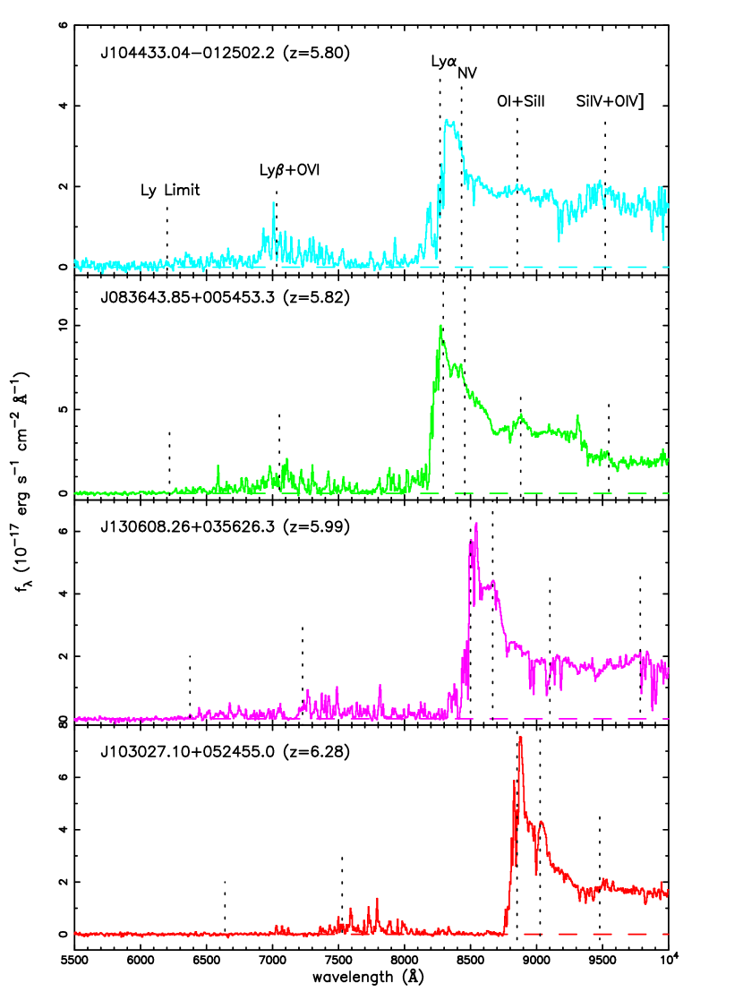
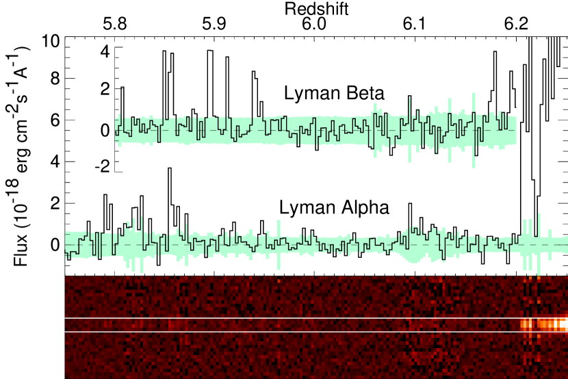
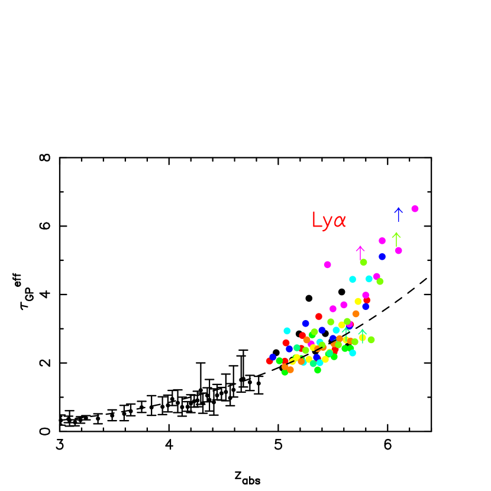
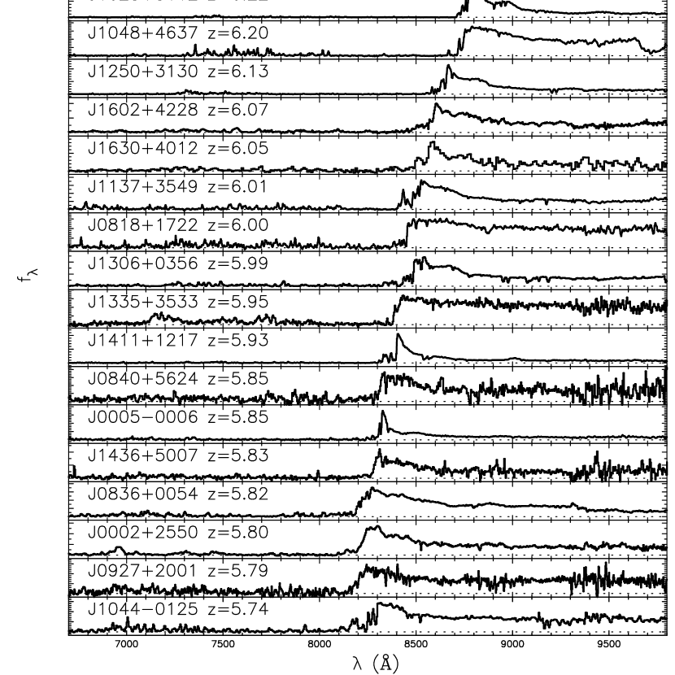
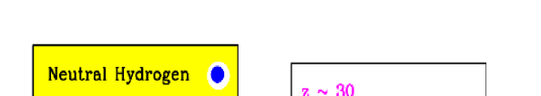
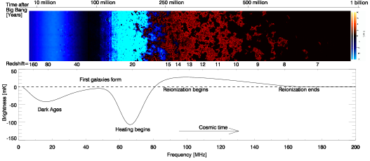
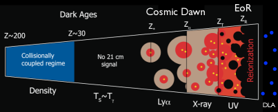
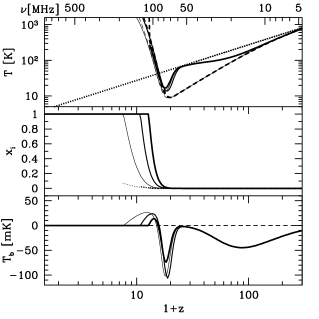

**reionisation** is the process by which the universe transitions from neutral H to (re-)ionised H, driven by the first ionising sources (early stars + AGN) at $z \sim 6$ to $20$. ends the **cosmic Dark Ages**.

## the timeline

| event | $z$ | $T$ | age |
|---|---|---|---|
| recombination | $\sim 1100$ | $0.26$ eV | $380\,000$ yr |
| Dark Ages | $\sim 1100$ to $\sim 20$ | | $0.4$ Myr to $200$ Myr |
| first stars (Pop III) | $\sim 20$ to $30$ | | $\sim 100$ to $200$ Myr |
| reionisation (epoch) | $\sim 6$ to $15$ | | $\sim 0.4$ Gyr to $1$ Gyr |
| reionisation complete | $\sim 6$ | | $\sim 1$ Gyr |

after recombination, the universe is mostly neutral H, no ionising photons around. the **Dark Ages**: no luminous sources, only the residual CMB.

at $z \sim 20$ to $30$, the first **Pop III stars** form in dark-matter mini-halos. their hot, massive cores emit copious **ionising photons** (Lyman continuum, $\lambda < 912$ Å). these begin **photoionising** the surrounding IGM.

over $z \sim 6$ to $20$, reionisation proceeds from "bubbles" around individual sources to a fully ionised IGM. completion at $z \sim 6$.

## the observable consequences

### CMB optical depth $\tau$

photons from the CMB scatter off freed electrons after reionisation. the **optical depth** $\tau$ measures the integrated electron column:
$$\tau = \int n_e\,\sigma_T\,c\,dt$$

Planck measurement: $\tau = 0.054 \pm 0.007$. corresponds to a reionisation midpoint at $z_{\rm reion} \approx 7.7$.

### Gunn-Peterson trough

at $z \sim 6$, neutral H absorbs Lyman-α photons in QSO spectra, producing a **trough** ($> 99\%$ absorption). seen in QSOs at $z > 6$ from SDSS + ULAS samples. confirms reionisation completion at $z \sim 6$.

### Lyman-α forest

at $z = 2$ to $5$ (post-reionisation), residual neutral H along QSO sight lines produces a forest of narrow Ly-α absorption features. probes the IGM density distribution + structure formation.

see Lyman-α forest.

### 21 cm signal (in development)

the **redshifted 21 cm hyperfine line** from neutral H during the Dark Ages + reionisation traces the neutral fraction. observable from $\nu \sim 50$ to $200$ MHz radio bands. instruments: HERA, SKA-Low (in construction). will map reionisation in 3D.

current state: tentative detection by EDGES of an absorption signal at $z \sim 17$ (controversial).

## the sources

what reionised the universe? main candidates:
1. **massive stars** in early galaxies: Pop III + Pop II stars produce ionising photons. require copious ionising-photon production + escape from the host galaxy.
2. **AGN / quasars**: also produce ionising photons. but quasar number density at $z > 6$ may be too low.
3. **Pop III stars** specifically: very massive, very hot, produce a lot of ionising photons per unit mass.

current consensus: a mix, dominated by **young galaxies**. but the **escape fraction** $f_{\rm esc}$ of ionising photons from galaxies is poorly constrained (typical $f_{\rm esc} \sim 10\%$ to $20\%$). JWST is helping resolve this.

## helium reionisation

$H$ reionisation (above) is "first reionisation." at $z \sim 3$, $He^+$ is photoionised to $He^{2+}$ ("**second reionisation**" or **He II reionisation**), driven by hard quasar UV. observable in the He II Ly-α forest.

so the IGM has a complex temperature + ionisation history.

## the science cases

reionisation is a major science driver for:
- **JWST**: deep imaging + spectroscopy of $z = 6$-$15$ galaxies.
- **EHT, SKA, HERA**: 21 cm observations + AGN at high $z$.
- **future**: CMB-S4, Origins Space Telescope, others.

resolving when + how reionisation proceeded is a key open question of galaxy formation.

## see also

- [Photon decoupling and CMB](Photon%20decoupling%20and%20CMB.html)
- [Saha equation and recombination](Saha%20equation%20and%20recombination.html)
- Lyman-α forest
- [Intergalactic medium](Intergalactic%20medium.html)
- [ΛCDM current parameters](%CE%9BCDM%20current%20parameters.html)
- [Polarization E and B modes](Polarization%20E%20and%20B%20modes.html)
- [Cosmic_inventory_baryons](Cosmic_inventory_baryons.html)
- [Brief thermal history](Brief%20thermal%20history.html)
- [Observational_Cosmology_MOC](../../04_Atlas/Observational_Cosmology_MOC.html)

---

### Observational Cosmology Data Panels & Visual Evidence

*Becker et al. (2001) discovery spectra of $z \sim 6$ SDSS quasars: appearance of complete absorption trough shortward of Ly$\alpha$ emission.*

*High-resolution Keck/ESI spectrum of SDSS J1030+0524 at $z=6.28$, exhibiting complete transmission blackout ($\,\mathcal{T} = 0$) over $\Delta z \approx 0.3$, marking the end of the reionization epoch.*

*Fan et al. (2006) effective optical depth $\tau_{\rm eff}$ vs redshift from 19 high-z quasars, demonstrating rapid transition from power-law evolution to exponential saturation at $z > 5.7$.*

*Fan et al. (2006) composite spectra of 19 quasars spanning $5.74 < z < 6.42$, tracing the percolation and reionization of neutral hydrogen.*

*Barkana & Loeb (2001) physical timeline of cosmic reionization: overlap of ionized H II bubbles around first stars, minihalos, and quasars.*

*Pritchard & Loeb (2012) 21cm cosmological brightness temperature differential $\delta T_b$ history across Cosmic Dawn, Dark Ages, and Reionization.*

*Evolutionary regimes of the 21cm line: collisional coupling, Wouthuysen-Field Ly$\alpha$ coupling, X-ray heating, and ionization saturation.*

*Thermal decoupling: gas kinetic temperature $T_K$, CMB radiation temperature $T_\gamma$, and spin temperature $T_S$ as a function of redshift $z \in [10, 1000]$.*

  <h4 class="backlinks-title">Linked References (11)</h4>
  <ul class="backlinks-list">
    <li class="backlink-item-wrap"><a href="Brief%20thermal%20history.html" class="backlink-item">Brief thermal history</a></li>
    <li class="backlink-item-wrap"><a href="CMB%20Spectral%20Distortions%20-%20What%20They%20Are%20and%20Where%20They%20Come%20From.html" class="backlink-item">CMB Spectral Distortions - What They Are and Where They Come From</a></li>
    <li class="backlink-item-wrap"><a href="High-z%20galaxies%20with%20JWST.html" class="backlink-item">High-z galaxies with JWST</a></li>
    <li class="backlink-item-wrap"><a href="Intergalactic%20medium.html" class="backlink-item">Intergalactic medium</a></li>
    <li class="backlink-item-wrap"><a href="Lyman%20alpha%20SFR%20tracer.html" class="backlink-item">Lyman alpha SFR tracer</a></li>
    <li class="backlink-item-wrap"><a href="Lyman-alpha%20forest.html" class="backlink-item">Lyman-alpha forest</a></li>
    <li class="backlink-item-wrap"><a href="Missing%20baryons.html" class="backlink-item">Missing baryons</a></li>
    <li class="backlink-item-wrap"><a href="Polarization%20E%20and%20B%20modes.html" class="backlink-item">Polarization E and B modes</a></li>
    <li class="backlink-item-wrap"><a href="Recombination.html" class="backlink-item">Recombination</a></li>
    <li class="backlink-item-wrap"><a href="Transition%20epochs.html" class="backlink-item">Transition epochs</a></li>
    <li class="backlink-item-wrap"><a href="../../04_Atlas/Observational_Cosmology_MOC.html" class="backlink-item">Observational_Cosmology_MOC</a></li>
  </ul>

