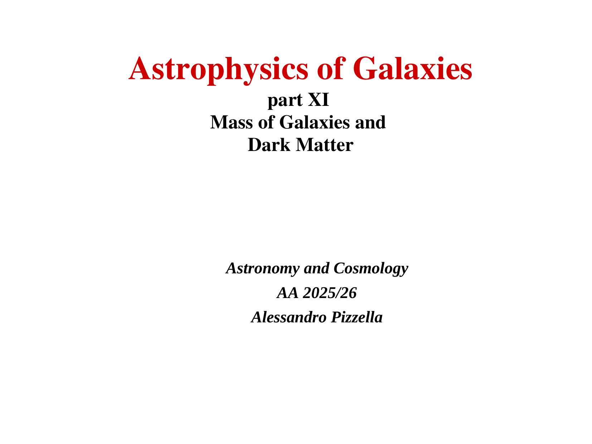
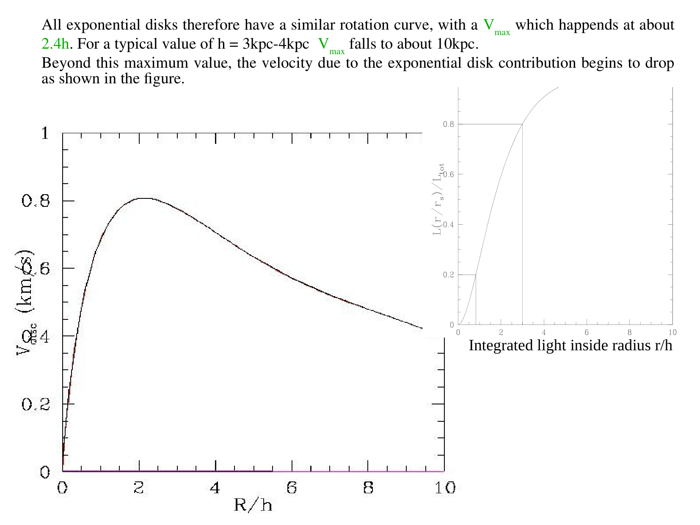
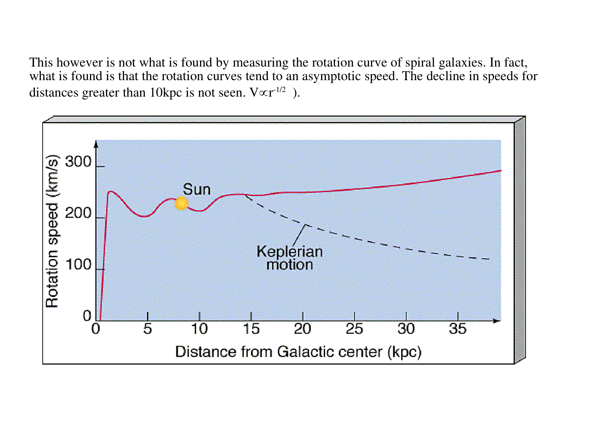

# Rotation curves

The rotation curve of a disk galaxy, $v_{\rm rot}(r)$, describes the mean azimuthal circular orbital speed of stars, neutral atomic gas ($H\text{ I}$), and molecular gas ($CO$) as a function of Galactocentric radial distance in the equatorial plane. While the luminous stellar distribution of spiral galaxies drops off exponentially ($I(R) \propto e^{-R/R_d}$), high-precision optical longslit spectroscopy and 21 cm H I aperture synthesis interferometry reveal that rotation curves do not exhibit the Keplerian decline ($v_{\rm rot} \propto r^{-1/2}$) expected from Newtonian gravity applied to visible matter. Instead, rotation curves stay approximately flat ($v_{\rm rot} \approx \text{const}$) out to the outermost observable radii (frequently $5 - 10$ disk scalelengths). The extraction of rotation curves from 2D velocity fields relies on the kinematic tilted-ring model, while stellar rotation curves require asymmetric drift corrections to account for radial velocity dispersion pressure support. The flat rotation curve phenomenon provided the foundational empirical evidence for extended, non-luminous dark matter halos in spiral galaxies.

---

## 1. Kinematic Extraction via the Tilted-Ring Model

A galaxy disk is generally inclined to the observer's line of sight by an inclination angle $i$ and oriented on the sky by a position angle $\phi_0$ (measured from North through East to the major axis).
To extract the true circular velocity $v_{\rm rot}(r)$ from a 2D line-of-sight velocity map $v_{\rm LOS}(x, y)$ (obtained from radio H I datacubes or IFU emission-line observations), Rogstad et al. (1974) and Begeman (1987) developed the tilted-ring model.

### Mathematical Geometry of the Tilted-Ring Model
The galaxy disk is decomposed into a set of concentric, circular rings of radius $r$ and width $\Delta r$. Each ring is parameterized by six independent kinematic and geometric parameters
- Kinematic center coordinates $(x_0, y_0)$
- Systemic recession velocity $v_{\rm sys}$
- Inclination angle $i(r)$ ($i = 0^\circ$ is face-on, $i = 90^\circ$ is edge-on)
- Position angle of the major axis $\phi_0(r)$
- Rotation velocity $v_{\rm rot}(r)$
- Expansion or radial inflow velocity $v_{\rm exp}(r)$

Let $(x, y)$ be the rectangular sky coordinates of a pixel. The corresponding disk plane coordinates $(r, \theta)$ satisfy the transformation equations
$$x - x_0 = -r \sin(\theta - \phi_0) \sin i$$
$$y - y_0 = r \cos(\theta - \phi_0)$$
Dividing the first equation by $\sin i$ and squaring both equations
$$r = \sqrt{\left(\frac{-(x - x_0)\sin\phi_0 + (y - y_0)\cos\phi_0}{\cos i}\right)^2 + \left[ -(x - x_0)\cos\phi_0 - (y - y_0)\sin\phi_0 \right]^2}$$
The angle $\psi$ in the disk plane relative to the major axis satisfies
$$\cos\psi = \frac{-(x - x_0)\sin\phi_0 + (y - y_0)\cos\phi_0}{r}$$
$$\sin\psi = \frac{-(x - x_0)\cos\phi_0 - (y - y_0)\sin\phi_0}{r \cos i}$$

### The Projected Line-of-Sight Velocity Field Equation
Under pure circular rotation ($v_{\rm exp} = 0$), the projected line-of-sight velocity observed at sky position $(x, y)$ is
$$v_{\rm LOS}(x, y) = v_{\rm sys} + v_{\rm rot}(r) \cos\psi \sin i$$
If radial inflow or expansion occurs, an additional orthogonal term enters
$$v_{\rm LOS}(x, y) = v_{\rm sys} + v_{\rm rot}(r) \cos\psi \sin i + v_{\rm exp}(r) \sin\psi \sin i$$
Along the major axis ($\psi = 0$ or $\pi$, where $\cos\psi = \pm 1$), the line-of-sight projection is maximized
$$v_{\rm LOS, major} = v_{\rm sys} \pm v_{\rm rot}(r) \sin i$$
Along the minor axis ($\psi = \pm \pi/2$, where $\cos\psi = 0$), the circular rotation projects to zero ($v_{\rm LOS} = v_{\rm sys}$).
Non-linear least squares optimization fits the tilted-ring parameters ring by ring, tracking warps where $i(r)$ and $\phi_0(r)$ vary with radius.

---

## 2. Asymmetric Drift Correction in Stellar Disks

When rotation curves are measured using stellar absorption lines rather than cold gas emission lines, the measured mean azimuthal streaming velocity $\bar{v}_\phi(r)$ is systematically slower than the true circular gravitational velocity $v_c(r)$. This discrepancy is termed asymmetric drift.

### Physical Origin
Cold gas clouds move on nearly circular orbits with negligible random velocity dispersion ($\sigma_{\rm gas} \sim 8 - 10 \text{ km s}^{-1} \ll v_{\rm rot}$), so $v_{\rm gas} \approx v_c$.
Stars, however, form a collisionless system possessing substantial random velocity dispersions in radial ($\sigma_R$), azimuthal ($\sigma_\phi$), and vertical ($\sigma_z$) directions. Because stellar density $\nu(R)$ and velocity dispersion $\sigma_R^2(R)$ drop with radius, more stars with apocenters outside $R$ visit radius $R$ than stars with pericenters inside $R$. This creates an outward pressure gradient support, requiring a lower azimuthal centrifugal velocity to maintain radial equilibrium.

### Complete Derivation of the Asymmetric Drift Equation
From the steady-state Axisymmetric Collisionless Boltzmann Equation in cylindrical coordinates $(R, \phi, z)$
$$\frac{\partial(\nu \langle v_R^2 \rangle)}{\partial R} + \frac{\partial(\nu \langle v_R v_z \rangle)}{\partial z} + \frac{\nu}{R} \left( \langle v_R^2 \rangle - \langle v_\phi^2 \rangle \right) = -\nu \frac{\partial\Phi}{\partial R}$$
Recall that the true circular velocity $v_c$ is governed purely by the radial gravitational potential gradient
$$v_c^2(R) \equiv R \frac{\partial\Phi}{\partial R}$$
The second moments decompose into mean streaming velocity and velocity dispersion
$$\langle v_R^2 \rangle = \sigma_R^2 \quad (\text{since } \bar{v}_R = 0)$$
$$\langle v_\phi^2 \rangle = \bar{v}_\phi^2 + \sigma_\phi^2$$
$$\langle v_R v_z \rangle = \sigma_{Rz}^2$$
Substituting these definitions into the Jeans equation
$$\frac{\partial(\nu \sigma_R^2)}{\partial R} + \frac{\partial(\nu \sigma_{Rz}^2)}{\partial z} + \frac{\nu}{R} \left( \sigma_R^2 - \bar{v}_\phi^2 - \sigma_\phi^2 \right) = -\nu \frac{v_c^2}{R}$$
Multiplying through by $\frac{R}{\nu}$ and rearranging to isolate $v_c^2 - \bar{v}_\phi^2$
$$v_c^2(R) - \bar{v}_\phi^2(R) = \sigma_R^2 \left[ \frac{\sigma_\phi^2}{\sigma_R^2} - 1 - \frac{\partial\ln(\nu \sigma_R^2)}{\partial\ln R} - \frac{R}{\sigma_R^2} \frac{\partial(\nu \sigma_{Rz}^2)}{\nu \partial z} \right]$$
Near the galactic midplane ($z = 0$), the cross-term $\frac{\partial(\nu \sigma_{Rz}^2)}{\partial z}$ vanishes due to reflection symmetry across the disk.
Using the epicyclic approximation, the ratio of azimuthal to radial dispersion is fixed by Oort's constants $A$ and $B$
$$\frac{\sigma_\phi^2}{\sigma_R^2} \approx \frac{-B}{A - B} = \frac{1}{2} \left( 1 + \frac{d\ln v_c}{d\ln R} \right)$$
For a flat rotation curve ($d\ln v_c / d\ln R = 0$), $\sigma_\phi^2 / \sigma_R^2 = 1/2$.
Assuming an exponential stellar disk $\nu(R) \propto e^{-R/R_d}$ and exponential dispersion profile $\sigma_R^2(R) \propto e^{-R/R_\sigma}$, the asymmetric drift correction $v_a \equiv v_c - \bar{v}_\phi$ is approximately
$$v_c^2 - \bar{v}_\phi^2 \approx \sigma_R^2 \left( \frac{R}{R_d} + \frac{R}{R_\sigma} - \frac{1}{2} \right)$$
Applying this correction is mandatory to reconstruct the true gravitational potential from stellar kinematic maps.

---

## 3. Systematic Rotation Curve Shapes across the Hubble Sequence

Extensive observational programs (Rubin et al. 1980, 1985; Persic, Salucci & Stel 1996; Sofue & Rubin 2001) establish that the radial shape of $v_{\rm rot}(r)$ correlates systematically with galaxy luminosity and Hubble morphological type.

```
+========================================================================================+
| Galaxy Type / Luminosity     | Inner Rise (r < 2 kpc) | Outer Curve Shape | Dominant Mass Component |
+========================================================================================+
| Massive Spirals (Sa, Sb)     | Extremely steep rise   | Perfectly flat to | Bulge in core, Dark     |
| L > L* (v_max > 220 km/s)    | Sharp central peak     | slightly declining| Matter at r > 2 R_d     |
| Intermediate Spirals (Sc)    | Moderate linear rise   | Broad flat        | Disk in middle, Dark    |
| L ~ L* (v_max ~ 150-200 km/s)| Reaches plateau ~ 2 Rd | plateau           | Matter dominant outer   |
| Dwarf Spirals / dIrr (Sm, Im)| Gentle solid-body rise | Continuously      | Dark Matter halo        |
| L < 0.1 L* (v_max < 100 km/s)| (v propto r)           | rising outwards   | dominates at all radii  |
+========================================================================================+
```

### The Universal Rotation Curve (URC)
Persic, Salucci & Stel (1996) synthesized over 1000 rotation curves into the Universal Rotation Curve parameterization, demonstrating that $v_{\rm rot}(r/R_{\rm opt})$ is an explicit monotonic function of galaxy luminosity. Faint galaxies have continuously rising rotation curves dominated by dark matter at all radii, while bright galaxies have flat curves with dark matter taking over beyond $R \sim 2 R_d$.

---

## 4. Blackboard Blueprint and Observational Graph Literacy

```
             2D VELOCITY FIELD SPIDER DIAGRAM (ISOVELOCITY CONTOURS)
   Declination y (arcmin)
      +4 +                      Line of Nodes
         |                     (Major Axis PA)
      +2 +                        \
         |                         \  Blueshifted (Approaching)
       0 +--------------------------(O)-------------------------- Minor Axis
         |                           \  Redshifted (Receding)    (v_LOS = v_sys)
      -2 +                            \
         |                             \
      -4 +
         +===+===========+===========+==\========+===========+
            -4          -2           0          +2          +4
                            Right Ascension x (arcmin)
         Contours - v_sys - 100, v_sys - 50, v_sys, v_sys + 50, v_sys + 100 km/s

             ROTATION CURVES ACROSS THE HUBBLE SEQUENCE
   Velocity v_rot (km/s)
     300 +      .-------------------------------------------------- Massive Sa Spiral
         |     /                                                    (v_flat ~ 250 km/s)
     200 +    /       .-------------------------------------------- Intermediate Sc Spiral
         |   /       /                                              (v_flat ~ 180 km/s)
     100 +  /       /         .------------------------------------ Dwarf dIrr
         | /       /         /  (Solid-body rise - v propto r)        (Continuously rising)
       0 +*=======+=========+======================================+
         0       2.0       4.0                                    10.0
                          Galactocentric Radius r (kpc)
```

### Blackboard Presentation Script for the Oral Examination
1. Draw the 2D spider diagram showing the isovelocity contours of an inclined rotating disk. Mark the kinematic center $(x_0, y_0)$, the major axis line of nodes where $\cos\psi = \pm 1$, and the minor axis where $v_{\rm LOS} = v_{\rm sys}$.
2. Write down the projected velocity formula $v_{\rm LOS}(x, y) = v_{\rm sys} + v_{\rm rot}(r) \cos\psi \sin i$. Explain how the tilted-ring model fits $v_{\rm rot}(r), i(r), \phi_0(r)$ ring by ring.
3. Write down the asymmetric drift equation $v_c^2 - \bar{v}_\phi^2 = \sigma_R^2 [\frac{\sigma_\phi^2}{\sigma_R^2} - 1 - \frac{\partial\ln(\nu\sigma_R^2)}{\partial\ln R}]$. Explain why stars rotate more slowly than gas due to radial velocity dispersion pressure support.
4. Draw the 1D rotation curve plot comparing a massive Sa spiral (steep inner rise to $250$ km/s and flat plateau) with a dwarf irregular (slow solid-body rise $v \propto r$ never reaching a plateau).
5. State the fundamental conclusion - The flat rotation curve requires total enclosed mass $M(<r) \propto r$ and density $\rho(r) \propto r^{-2}$, establishing the presence of an extended dark matter halo.

---

## 5. Exact Textbook and Literature Provenance

- Course Dispensa `dispense_DM_2_eng.pdf` (Prof. Alessandro Pizzella)
  - Section 1 - Dark Matter in Spiral Galaxies (pages 1-7, 21-30) - Rotation curve observations, tilted-ring models, and mass decomposition.
- Course Lecture Slides
  - `gal_dm-01..22` - Optical and H I rotation curves, spider diagrams, and tilted-ring parameters.
- Houjun Mo, Frank van den Bosch, Simon White, *Galaxy Formation and Evolution* (2010)
  - Chapter 2 - Observational Facts (pages 70-76) - Disk galaxy rotation curves and scaling relations.
  - Chapter 11 - Disk Galaxies (pages 517-534) - Mass models and asymmetric drift.
- James Binney & Michael Merrifield, *Galactic Astronomy* (1998)
  - Chapter 10 - Stellar Kinematics (pages 615-640) - Asymmetric drift derivation and epicyclic theory.
- Primary Literature
  - Rogstad, Lockhart & Wright (1974, ApJ 193, 309) - *Aperture-synthesis observations of H I in the galaxy M33*.
  - Begeman (1987, PhD Thesis, Groningen) - *H I rotation curves of spiral galaxies*.
  - Rubin, Ford & Thonnard (1980, ApJ 238, 471) - *Rotational properties of 21 Sc galaxies with a large range of luminosities and radii*.
  - Persic, Salucci & Stel (1996, MNRAS 281, 27) - *The universal rotation curve of spiral galaxies - I. The dark matter connection*.

---

## 6. Cross-References and Related Notes

- [[Dark matter rotation curves]] - Quadrature circular velocity halo deconstruction
- [[Tully-Fisher relation]] - Centrifugal scaling between luminosity and flat rotation speed
- [[Stellar kinematics measurements]] - pPXF method and LOSVD recovery
- [[Ionized gas kinematics]] - Emission-line velocity fields and beam smearing
- [[Astrophysics_of_Galaxies_MOC]] - Master Map of Content for course

---

## 7. Course Slides and Figures


*Figure 1 - Optical longslit spectra and H I 21 cm position-velocity diagrams of spiral galaxies.*


*Figure 2 - Spider diagram showing 2D line-of-sight velocity field and fitted tilted rings.*


*Figure 3 - Universal rotation curves across the Hubble sequence from Persic, Salucci & Stel (1996).*


## Linked References

- [[Galactic HI kinematics and Milky Way spiral structure]]
- [[Ionized gas kinematics]]
- [[Astrophysics_of_Galaxies_MOC]]


