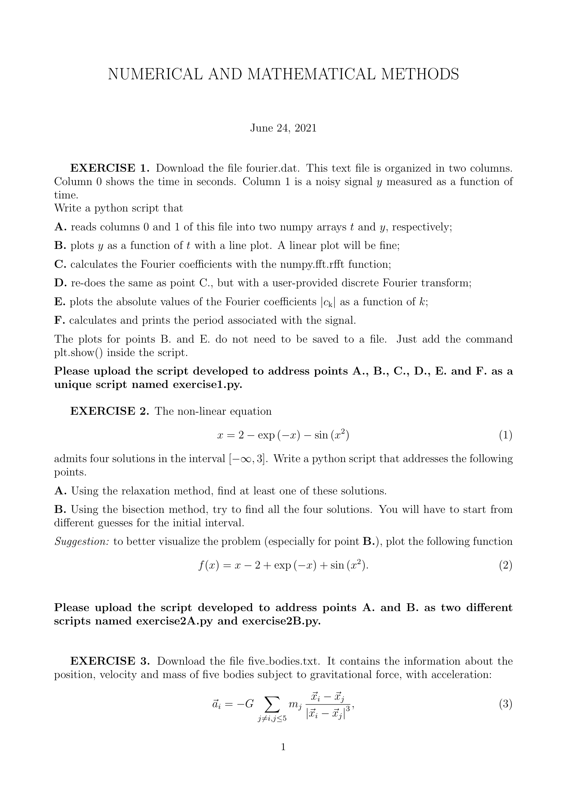


# Runge-Kutta 4 method

the workhorse general-purpose ODE integrator. four function evaluations per step, fourth-order accuracy ($O(h^4)$ global), no special structure assumed. when in doubt, RK4.

## the formulas

$$\mathbf{k}_1 = \mathbf{f}(\mathbf{y}_n, t_n)$$
$$\mathbf{k}_2 = \mathbf{f}(\mathbf{y}_n + \tfrac{h}{2}\mathbf{k}_1,\; t_n + \tfrac{h}{2})$$
$$\mathbf{k}_3 = \mathbf{f}(\mathbf{y}_n + \tfrac{h}{2}\mathbf{k}_2,\; t_n + \tfrac{h}{2})$$
$$\mathbf{k}_4 = \mathbf{f}(\mathbf{y}_n + h\mathbf{k}_3,\; t_n + h)$$
$$\mathbf{y}_{n+1} = \mathbf{y}_n + \tfrac{h}{6}(\mathbf{k}_1 + 2\mathbf{k}_2 + 2\mathbf{k}_3 + \mathbf{k}_4)$$

interpretation:
- $\mathbf{k}_1$: slope at the start (Euler-like)
- $\mathbf{k}_2$: slope at the midpoint, using $\mathbf{k}_1$ for the half-step prediction
- $\mathbf{k}_3$: slope at the midpoint again, this time using $\mathbf{k}_2$ for the prediction (a refinement)
- $\mathbf{k}_4$: slope at the endpoint, using $\mathbf{k}_3$ for the full step

then a weighted average $\tfrac{1}{6}(\mathbf{k}_1 + 2\mathbf{k}_2 + 2\mathbf{k}_3 + \mathbf{k}_4)$, giving more weight to the midpoint slopes (because they are more representative of the average behavior across the step).

## why $O(h^4)$

the weighted combination of slopes was carefully chosen by Runge and Kutta to match the Taylor expansion of the true solution through fourth order. the coefficients $(1, 2, 2, 1)/6$ are not arbitrary — they are determined by requiring that the local truncation error vanish at $h^2$, $h^3$, and $h^4$. local truncation $O(h^5)$, global $O(h^4)$.

## python implementation

```python
def rk4(f, y0, t0, t_end, h):
    n_steps = int((t_end - t0) / h)
    t = np.zeros(n_steps + 1)
    y = np.zeros((n_steps + 1, len(np.atleast_1d(y0))))
    t[0], y[0] = t0, y0
    for i in range(n_steps):
        k1 = f(y[i], t[i])
        k2 = f(y[i] + 0.5*h*k1, t[i] + 0.5*h)
        k3 = f(y[i] + 0.5*h*k2, t[i] + 0.5*h)
        k4 = f(y[i] + h*k3,     t[i] + h)
        y[i+1] = y[i] + (h/6) * (k1 + 2*k2 + 2*k3 + k4)
        t[i+1] = t[i] + h
    return t, y
```

## why RK4 is the default

at four function evaluations per step, RK4 hits a sweet spot in cost-vs-accuracy:

| method | evals per step | order | evals per unit accuracy |
|---|---|---|---|
| Euler | 1 | 1 | many |
| RK2 | 2 | 2 | fewer |
| **RK4** | **4** | **4** | **fewest for moderate accuracy** |
| RK5/RK6 | 6+ | 5/6 | better only for very high accuracy |

doubling $h$ in RK4 *halves* the work, but increases the error by factor 16. so for a 10× accuracy improvement at fixed cost, halving $h$ gives 16×, much better than RK2's 4×.

## RK4 vs adaptive integrators

`scipy.integrate.solve_ivp` defaults to **RK45** (Dormand-Prince), which is RK4 with an embedded RK5 estimate to control step size adaptively. for general-purpose work this is what I should use:

```python
from scipy.integrate import solve_ivp
sol = solve_ivp(f, (t0, t_end), y0, method='RK45', rtol=1e-8)
```

RK4 with a fixed step is easier to write from scratch (and required by some exam questions), but for production work the adaptive version is almost always better.

## limitations of RK4

- **not symplectic**: for Hamiltonian systems, RK4 has a small but non-zero energy drift. for integrations of $\sim 100$ orbital periods this is fine; for $\sim 10^9$ periods (like solar-system N-body), it is fatal. use [Leapfrog integrator](./Leapfrog%20integrator.html) or symplectic Hermite instead
- **wasted work for stiff problems**: stability constraint forces small $h$, drowning the high-order accuracy. use implicit methods (BDF, Radau)
- **fixed cost per step**: an adaptive scheme can use larger $h$ in smooth regions and smaller $h$ near close encounters, getting the same accuracy at lower total cost

## error estimation by step doubling

even without an embedded estimator, I can estimate the local error by running RK4 once with step $h$ and once with step $h/2$ (twice). the difference is approximately $15 \times \text{error}_{h/2}$ (since error scales as $h^4$ and $(h/2)^4 = h^4/16$). this Richardson-extrapolation idea generalizes to [Bulirsch-Stoer extrapolation](./Bulirsch-Stoer%20extrapolation.html).

## astrophysics use cases

- **planetary orbit integration** for moderate timescales (a few thousand orbits)
- **stellar atmosphere ODEs** along the radius (hydrostatic equilibrium, radiative transfer)
- **tidal evolution** of a binary system over Myr timescales
- **dust grain dynamics** in a stellar wind
- **isochrone integration** for stellar models

## see also

- [Euler method](./Euler%20method.html)
- [Runge-Kutta 2 midpoint method](./Runge-Kutta%202%20midpoint%20method.html)
- [Leapfrog integrator](./Leapfrog%20integrator.html)
- [Adaptive step size control](./Adaptive%20step%20size%20control.html)
- [Bulirsch-Stoer extrapolation](./Bulirsch-Stoer%20extrapolation.html)
- [Mathematical_Numerical_Methods_MOC](../../04_Atlas/Mathematical_Numerical_Methods_MOC.html)

---

### Numerical Methods & Algorithmic Diagnostics


*Runge-Kutta 4th order (RK4) geometric staging: evaluation of four sub-step slopes $k_1, k_2, k_3, k_4$ across interval $[t_n, t_{n+1}]$.*



*Official Exam Paper (24 June 2021): Staging equations and global truncation error scaling $\mathcal{O}(\Delta t^4)$ for gravitational orbits.*


<div class="backlinks-section">
  <h4 class="backlinks-title">Linked References (13)</h4>
  <ul class="backlinks-list">
    <li class="backlink-item-wrap"><a href="./Adaptive%20step%20size%20control.html" class="backlink-item">Adaptive step size control</a></li>
    <li class="backlink-item-wrap"><a href="./Built-in%20scipy%20integrators.html" class="backlink-item">Built-in scipy integrators</a></li>
    <li class="backlink-item-wrap"><a href="./Bulirsch-Stoer%20extrapolation.html" class="backlink-item">Bulirsch-Stoer extrapolation</a></li>
    <li class="backlink-item-wrap"><a href="./Energy%20conservation%20as%20a%20diagnostic.html" class="backlink-item">Energy conservation as a diagnostic</a></li>
    <li class="backlink-item-wrap"><a href="./Euler%20method.html" class="backlink-item">Euler method</a></li>
    <li class="backlink-item-wrap"><a href="./Fourth-order%20Hermite%20predictor-corrector.html" class="backlink-item">Fourth-order Hermite predictor-corrector</a></li>
    <li class="backlink-item-wrap"><a href="./Initial%20value%20vs%20boundary%20value%20problems.html" class="backlink-item">Initial value vs boundary value problems</a></li>
    <li class="backlink-item-wrap"><a href="./Leapfrog%20integrator.html" class="backlink-item">Leapfrog integrator</a></li>
    <li class="backlink-item-wrap"><a href="../../04_Atlas/Mathematical_Numerical_Methods_MOC.html" class="backlink-item">Mathematical_Numerical_Methods_MOC</a></li>
    <li class="backlink-item-wrap"><a href="./Modified%20midpoint%20method.html" class="backlink-item">Modified midpoint method</a></li>
    <li class="backlink-item-wrap"><a href="./Runge-Kutta%202%20midpoint%20method.html" class="backlink-item">Runge-Kutta 2 midpoint method</a></li>
    <li class="backlink-item-wrap"><a href="./Shooting%20method.html" class="backlink-item">Shooting method</a></li>
    <li class="backlink-item-wrap"><a href="./Systems%20of%20ODEs%20and%20higher-order%20ODEs.html" class="backlink-item">Systems of ODEs and higher-order ODEs</a></li>
  </ul>
</div>
