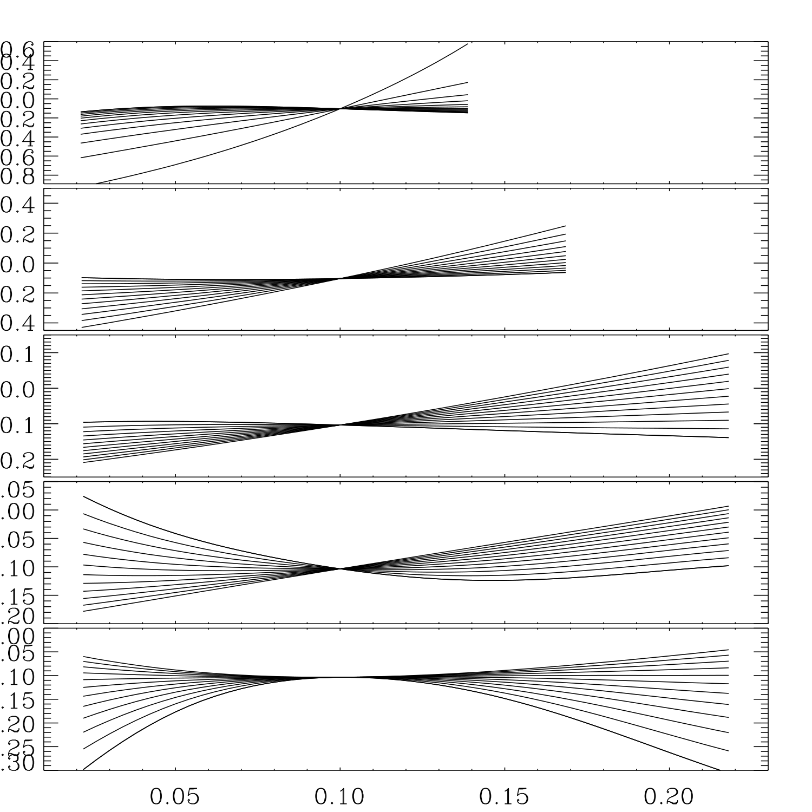
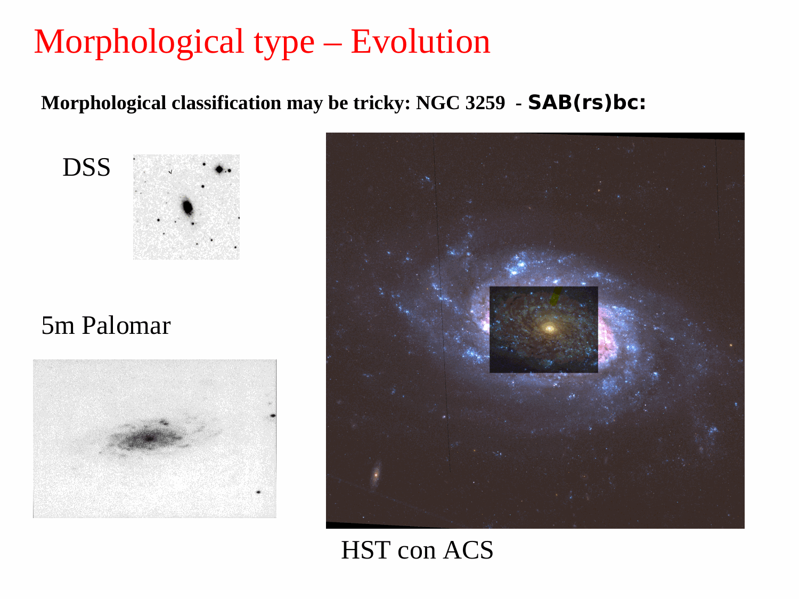
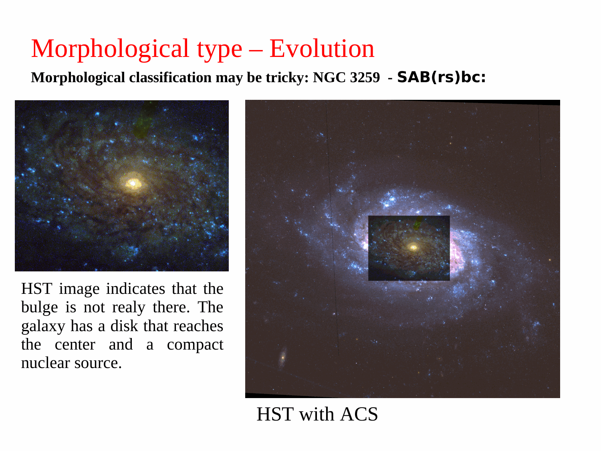
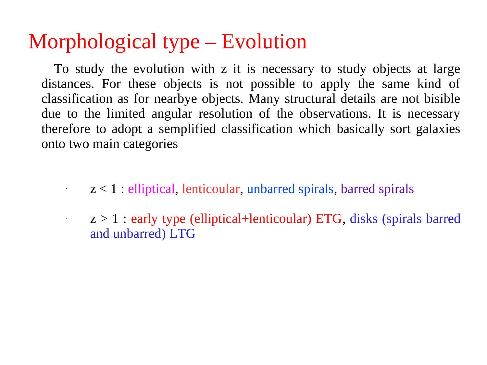
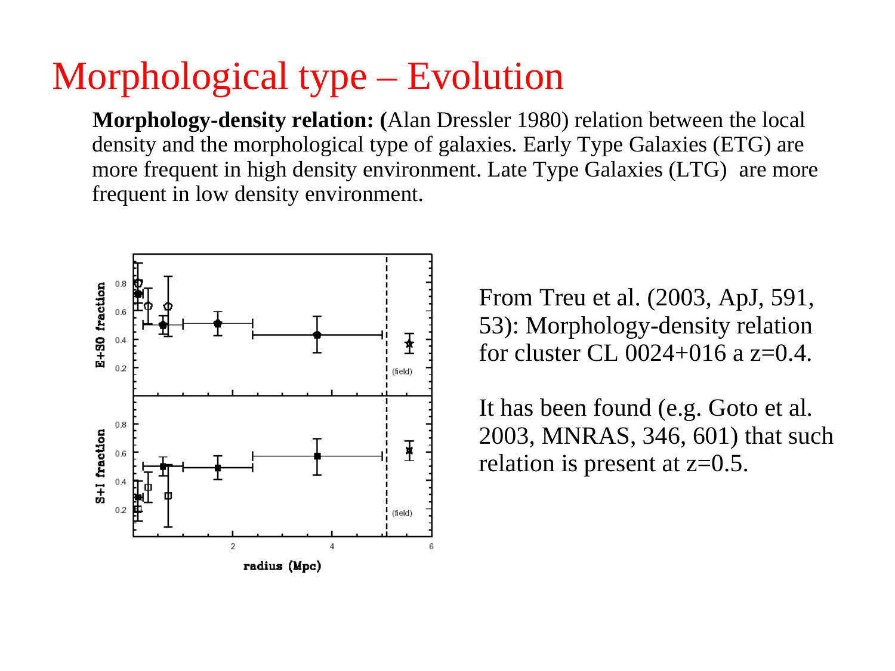
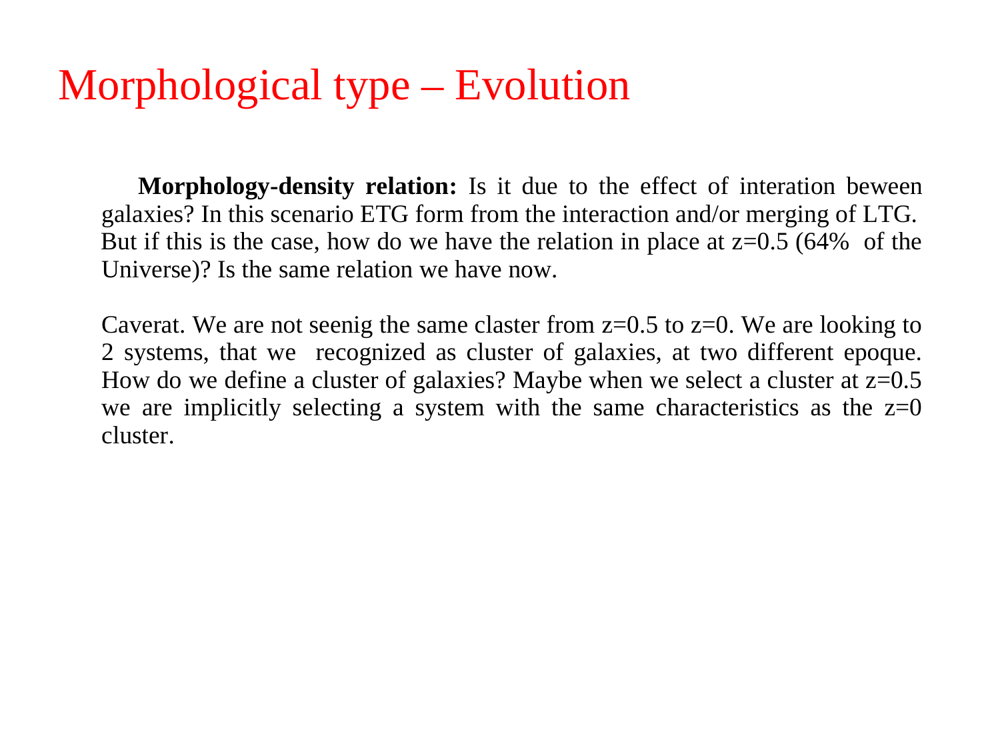
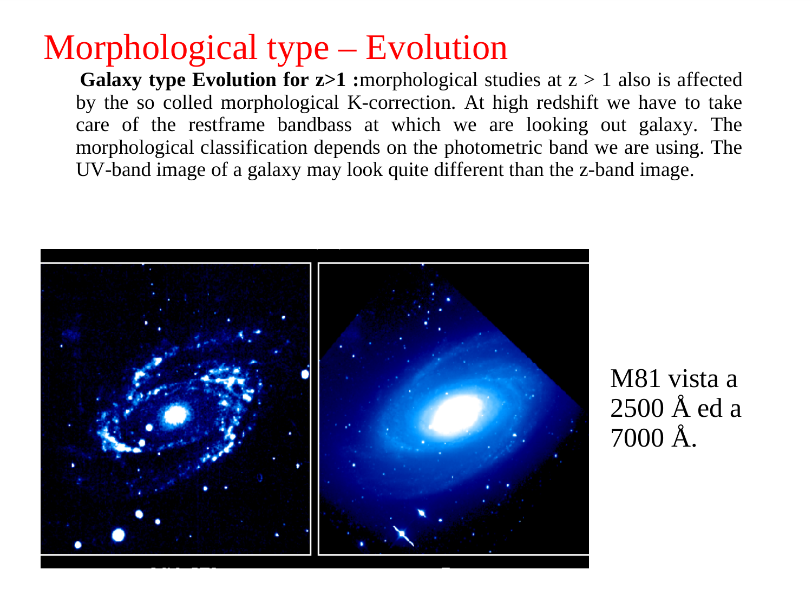
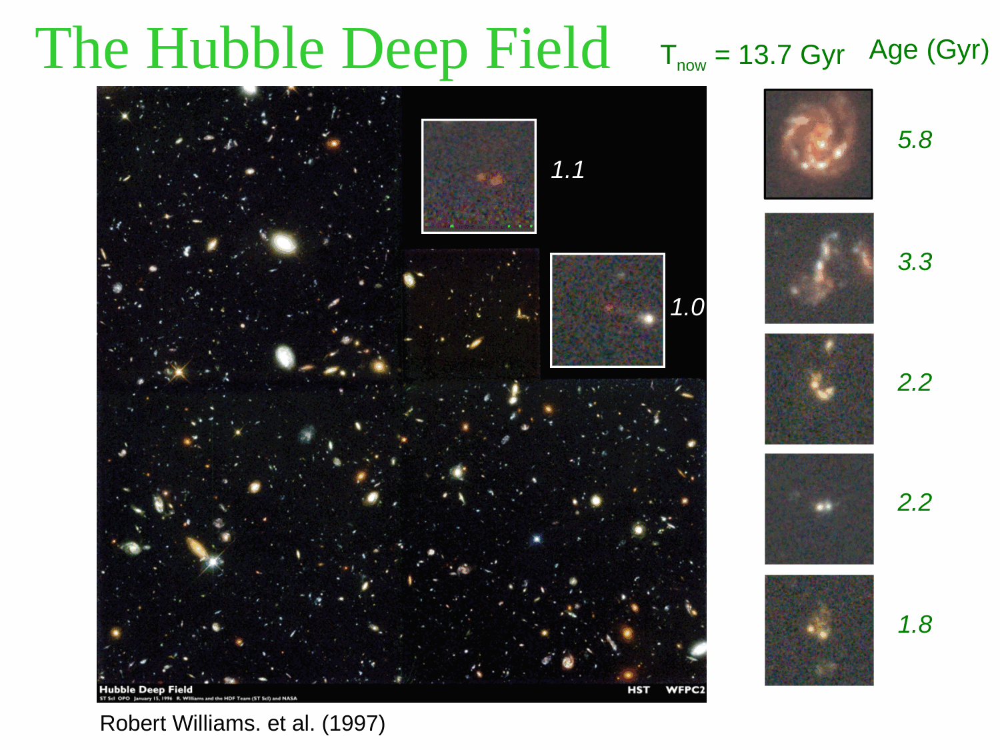
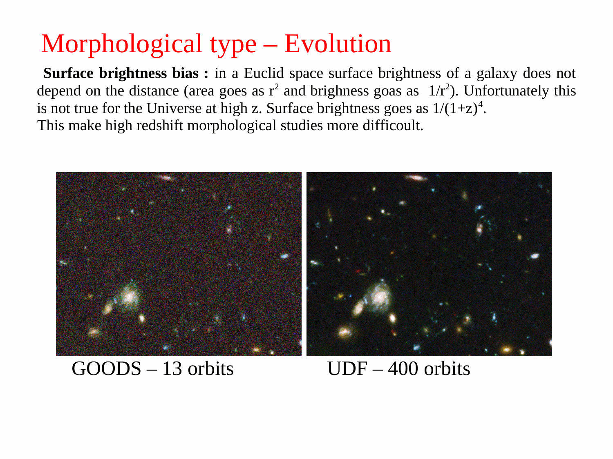


the **Sloan Digital Sky Survey (SDSS)** is the foundational dataset for modern galaxy science. began in 2000, ongoing through several phases (SDSS-I/II, BOSS/eBOSS, MaNGA, eROSITA partner). each phase added different data types.

## the survey

started with a $2.5$ m dedicated telescope at Apache Point, NM. main products:
- **photometric**: $\sim 1$ billion sources, all-sky-equivalent for the northern sky + parts south.
- **spectroscopic**: $\sim 5$ million galaxies + $\sim 500\,000$ quasars + $\sim 10^6$ stars.
- **imaging area**: $\sim 14\,000$ deg$^2$ ($\sim 1/3$ of the sky).
- **filters**: $u, g, r, i, z$ — the "Sloan filters" now standard worldwide.

## the SDSS photometric system

5 broadband filters covering $300$ nm to $1\,\mu$m:

| filter | central λ (nm) | width | purpose |
|---|---|---|---|
| $u$ | 354 | 60 | UV / near-UV |
| $g$ | 475 | 130 | blue |
| $r$ | 623 | 130 | red |
| $i$ | 763 | 130 | NIR |
| $z$ | 913 | 95 | far red |

photometric magnitudes are in the **AB system**: $m_{AB} = -2.5\log_{10}(F_\nu/3631\,\text{Jy})$.

## the photometric outputs

per galaxy, SDSS provides:
- **PSF magnitudes** $m^{\rm PSF}$: best for stars/point sources.
- **model magnitudes** $m^{\rm model}$: best for galaxies (fits a galaxy model).
- **Petrosian magnitudes** $m^{\rm petro}$: aperture-based, robust to profile shape. see [Petrosian radius](./Petrosian%20radius.html).
- **Petrosian half-light radius** $r_{50}$ + $r_{90}$ (radii enclosing 50% and 90% of Petrosian flux).
- **concentration index** $C = r_{90}/r_{50}$. proxy for morphology: $C \gtrsim 2.6$ = early-type, $C \lesssim 2.6$ = late-type.

## the spectroscopic outputs

per spectroscopic galaxy:
- **spectrum** at $R \approx 2000$, covering $3800$ to $9200$ Å.
- **redshift** $z$ + classification (galaxy / quasar / star).
- **emission line fluxes**: $H\alpha, H\beta, [OIII], [NII], [SII]$, etc.
- **stellar velocity dispersion** $\sigma_v$.
- **stellar population parameters** from spectral fitting.

modern data releases (DR17 and beyond) have $\sim 5$ million galaxy spectra. main galaxy sample limited to $r < 17.77$ ($z < 0.2$); LRGs to $z \sim 0.5$; BOSS/eBOSS quasars to $z = 2$ to $3$.

## the science output

among the most-cited results:
- **galaxy bimodality**: Baldry 2004's $u-r$ histogram showing red sequence + blue cloud.
- **mass-metallicity relation**: Tremonti 2004.
- **stellar mass function**: Kauffmann + Bell 2003.
- **galaxy merger statistics**: Lin 2004.
- **photometric redshifts**: SDSS's photo-z provides redshifts for $\sim 100$ million galaxies without spectroscopy.
- **AGN classification**: BPT diagrams from $H\alpha, H\beta, [OIII], [NII]$.
- **BAO + LSS**: BOSS, eBOSS pin cosmological parameters.

## the modern surveys building on SDSS

- **MaNGA** (SDSS-IV, 2014-2020): IFU spectroscopy of $\sim 10\,000$ nearby galaxies. spatially resolved data + kinematics.
- **APOGEE**: $\sim 10^6$ Galactic stars at NIR.
- **eBOSS**: extended BOSS for $0.5 < z < 1.5$ + quasars.
- **DESI** (2021-onward): $40 \times 10^6$ galaxies/quasars for cosmology. successor to SDSS.

## see also

- [Galaxy spectroscopy by type](./Galaxy%20spectroscopy%20by%20type.html)
- [Petrosian radius](./Petrosian%20radius.html)
- [Survey resources for Obs Astro](./Survey%20resources%20for%20Obs%20Astro.html)
- [Photometric redshifts](./Photometric%20redshifts.html)
- [Color bimodality of galaxies](./Color%20bimodality%20of%20galaxies.html)
- [Multi-object spectroscopy MOS](./Multi-object%20spectroscopy%20MOS.html)
- [Integral-field spectroscopy IFU](./Integral-field%20spectroscopy%20IFU.html)
- [BPT diagram](./BPT%20diagram.html)
- [Astrophysics_of_Galaxies_MOC](../../04_Atlas/Astrophysics_of_Galaxies_MOC.html)

---

## astrophysics of galaxies figures and slides (Prof. Alessandro Pizzella)

*K-corrections as a function of redshift across SDSS ugriz passbands (Blanton et al. 2003).*

*Sloan Digital Sky Survey (SDSS) 2.5m telescope at Apache Point Observatory.*

*SDSS photometric system: five broad bands u, g, r, i, z covering 3000 to 10000 A.*

*SDSS spectroscopic fiber plug plates (640 to 1000 fibers per plate, R ~ 2000).*

*Main Galaxy Sample (MGS): target selection r_petro < 17.77 mag.*

---

## lecture slides and reference figures (Prof. Alessandro Pizzella)



  <h4 class="backlinks-title">Linked References (7)</h4>
  <ul class="backlinks-list">
    <li class="backlink-item-wrap"><a href="../../04_Atlas/Astrophysics_of_Galaxies_MOC.html" class="backlink-item">Astrophysics_of_Galaxies_MOC</a></li>
    <li class="backlink-item-wrap"><a href="./CAS%20galaxy%20classification.html" class="backlink-item">CAS galaxy classification</a></li>
    <li class="backlink-item-wrap"><a href="./Deep-field%20surveys.html" class="backlink-item">Deep-field surveys</a></li>
    <li class="backlink-item-wrap"><a href="./Eigenspectra%20and%20spectral%20types.html" class="backlink-item">Eigenspectra and spectral types</a></li>
    <li class="backlink-item-wrap"><a href="./MaNGA%20survey.html" class="backlink-item">MaNGA survey</a></li>
    <li class="backlink-item-wrap"><a href="./PCA%20spectral%20classification%20of%20galaxies.html" class="backlink-item">PCA spectral classification of galaxies</a></li>
    <li class="backlink-item-wrap"><a href="./Petrosian%20radius.html" class="backlink-item">Petrosian radius</a></li>
  </ul>

