
**spectral energy distribution (SED) fitting** is the inverse modeling methodology that extracts physical galaxy parameters—stellar mass $M_*$, star formation rate (SFR), stellar age $\tau$, metallicity $Z$, dust attenuation $A_V$, and redshift $z$—from observed multi-wavelength photometric fluxes and integrated spectra. It links raw telescope observations to theoretical stellar evolution and galaxy formation physics.

---

### the forward model

the core of SED fitting is a forward model mapping a physical parameter vector $\mathbf{\theta} = \{M_*, \mathrm{SFR}, \tau, Z, A_V, z\}$ into synthetic photometric fluxes.

1. **intrinsic composite stellar spectrum**:
   an assumed star formation history $\psi(t)$ and chemical enrichment path $Z(t)$ are convolved with a single stellar population (SSP) library:
   $$L_\lambda^{\rm stars}(t) = \int_0^t \psi(t - \tau)\,L_\lambda^{\rm SSP}(\tau, Z(\tau))\,d\tau$$

2. **nebular emission**:
   ionizing photons produced by hot stars ($h\nu \ge 13.6$ eV) ionize surrounding gas, generating nebular emission lines and recombination continua ($L_\lambda^{\rm neb}$), modeled via photoionization codes (CLOUDY).

3. **dust attenuation and re-emission**:
   interstellar dust grains absorb and scatter ultraviolet and optical photons according to an effective attenuation curve $k(\lambda)$:
   $$L_\lambda^{\rm attenuated} = \left[ L_\lambda^{\rm stars} + L_\lambda^{\rm neb} \right] \cdot 10^{-0.4\,A_\lambda}$$
   by the **panchromatic energy balance principle**, the bolometric energy absorbed by dust at short wavelengths must equal the total infrared energy re-radiated thermally at $\lambda \approx 3\text{--}1000\,\mu\mathrm{m}$:
   $$L_{\rm dust}^{\rm abs} = \int_0^\infty \left(1 - 10^{-0.4\,A_\lambda}\right) \left[ L_\lambda^{\rm stars} + L_\lambda^{\rm neb} \right] d\lambda \equiv L_{\rm IR}^{\rm dust} = \int_0^\infty L_\lambda^{\rm IR, emit}\,d\lambda$$

4. **synthetic bandpass photometry**:
   the redshifted, dust-attenuated spectrum is passed through the normalized transmission curve $T_X(\lambda)$ of each photometric filter $X$:
   $$F_X^{\rm model}(\mathbf{\theta}) = \frac{\int \frac{\lambda}{hc} f_\lambda^{\rm model}(\lambda, \mathbf{\theta})\,T_X(\lambda)\,d\lambda}{\int \frac{\lambda}{hc} T_X(\lambda)\,d\lambda} = \frac{\int f_\nu^{\rm model}(\nu, \mathbf{\theta})\,\frac{T_X(\nu)}{\nu}\,d\nu}{\int \frac{T_X(\nu)}{\nu}\,d\nu}$$
   where $f_\nu^{\rm model} = \frac{1+z}{4\pi d_L^2(z)} L_{\nu / (1+z)}$.

---

### statistical inference: likelihood and bayesian posteriors

#### Gaussian likelihood
for uncorrelated observational photometric uncertainties $\sigma_X$, the likelihood function $\mathcal{L}(\mathbf{F}^{\rm obs} \mid \mathbf{\theta})$ is:

$$\ln \mathcal{L}(\mathbf{F}^{\rm obs} \mid \mathbf{\theta}) = -\frac{1}{2} \sum_{X=1}^{N_{\rm bands}} \left[ \left( \frac{F_X^{\rm obs} - F_X^{\rm model}(\mathbf{\theta})}{\sigma_X} \right)^2 + \ln(2\pi\sigma_X^2) \right] = -\frac{1}{2}\chi^2(\mathbf{\theta}) + \mathrm{const}$$

#### Bayesian posterior
Bayes' theorem yields the posterior probability distribution $p(\mathbf{\theta} \mid \mathbf{F}^{\rm obs})$:

$$p(\mathbf{\theta} \mid \mathbf{F}^{\rm obs}) = \frac{\mathcal{L}(\mathbf{F}^{\rm obs} \mid \mathbf{\theta})\,p(\mathbf{\theta})}{\int \mathcal{L}(\mathbf{F}^{\rm obs} \mid \mathbf{\theta})\,p(\mathbf{\theta})\,d\mathbf{\theta}}$$

where $p(\mathbf{\theta})$ incorporates physical priors:
- $M_*$: flat in $\log M_*$ (or informed by the galaxy stellar mass function).
- age $\tau$: uniform prior over $[1\,{\rm Myr}, t_{\rm Hubble}(z)]$, enforcing that stars cannot be older than the age of the Universe at redshift $z$.
- $A_V$: positive prior (e.g., exponential $p(A_V) \propto e^{-A_V / \tau_V}$ or uniform $[0, 4]$).

---

### modern computational methodologies

1. **template-grid $\chi^2$ minimization (frequentist)**:
   - computes a fixed grid of pre-synthesized templates across discrete values of $(z, \tau, Z, A_V)$.
   - extremely fast ($\sim 10^4$ galaxies/minute); used for large photometric redshift catalogs and quick-look classification.
   - codes: **EAZY**, **FAST**, **HyperZ**, **LePHARE**.
2. **bayesian MCMC and nested sampling**:
   - explores continuous multi-dimensional parameter space using Markov Chain Monte Carlo (emcee) or nested sampling (dynesty, MultiNest).
   - maps full non-Gaussian posterior probability distributions, covariance matrices, and degeneracies.
   - codes: **Prospector**, **BAGPIPES**, **BEAGLE**, **Dense Basis**.
3. **panchromatic energy-balance codes**:
   - links UV-to-NIR stellar emission directly to mid-to-far-IR dust emission (PAHs, warm dust, cold dust modified blackbody) under strict energy conservation.
   - indispensable for dusty luminous and ultra-luminous infrared galaxies (LIRGs/ULIRGs).
   - codes: **MAGPHYS**, **CIGALE**.

---

### hierarchy of parameter precision and degeneracies

the physical properties extracted from SED fitting exhibit a strict hierarchy of reliability:

| physical property | typical precision | physical constraint | primary source of uncertainty |
|---|---|---|---|
| **stellar mass ($M_*$)** | $0.1\text{--}0.15$ dex | Normalization of NIR continuum (rest-frame $1\text{--}2\,\mu\mathrm{m}$) | Assumed IMF, TP-AGB prescription |
| **star formation rate (SFR)** | $0.2\text{--}0.3$ dex | Rest-frame UV continuum + mid/far-IR dust re-emission | Dust attenuation curve shape, SFH model flexibility |
| **dust attenuation ($A_V$)** | $\sim 0.1\text{--}0.2$ mag | Optical/UV spectral slope $\beta$ | Attenuation curve slope ($R_V$), bump at $2175$ Å |
| **metallicity ($Z$)** | $0.3\text{--}0.5$ dex | Absorption lines, subtle continuum slope variations | Severe **age-metallicity degeneracy** in broadband filters |
| **stellar age / SFH shape** | $0.3\text{--}0.6$ dex | Continuum breaks ($4000$ Å break, Balmer break) | "Outshining" effect (young stars drown old stars), degeneracies |

---

## see also

- [Observational_Astrophysics_MOC](../../04_Atlas/Observational_Astrophysics_MOC.html)
- [Stellar_Astrophysics_MOC](../../04_Atlas/Stellar_Astrophysics_MOC.html)
- [Stellar population synthesis](./Stellar%20population%20synthesis.html)
- [SPS code families](./SPS%20code%20families.html)
- [Single stellar population SSP](./Single%20stellar%20population%20SSP.html)
- [Star formation history of a population](./Star%20formation%20history%20of%20a%20population.html)
- [Photometric redshifts](./Photometric%20redshifts.html)
- [Age-metallicity degeneracy](./Age-metallicity%20degeneracy.html)
- [Stellar mass estimation in unresolved populations](./Stellar%20mass%20estimation%20in%20unresolved%20populations.html)
- [Age estimation in unresolved populations](./Age%20estimation%20in%20unresolved%20populations.html)
- [Dust attenuation in synthetic populations](./Dust%20attenuation%20in%20synthetic%20populations.html)
- [SFR tracers from population synthesis](./SFR%20tracers%20from%20population%20synthesis.html)

---

## observational astrophysics course slides (Prof. Paolo Cassata)

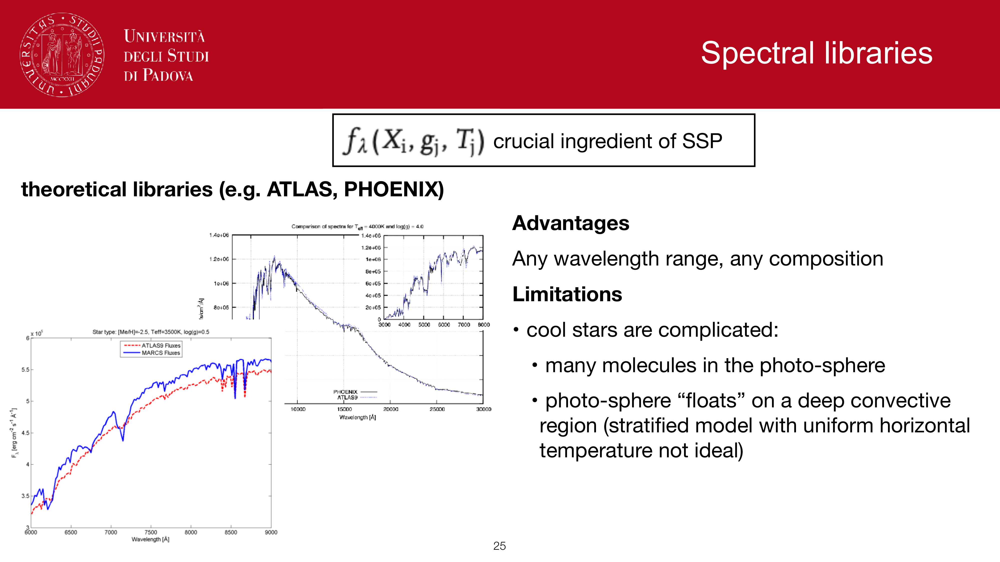
*Inverse modeling via SED fitting: inferring physical parameters (M_*, SFR, age, Z, A_V, z).*

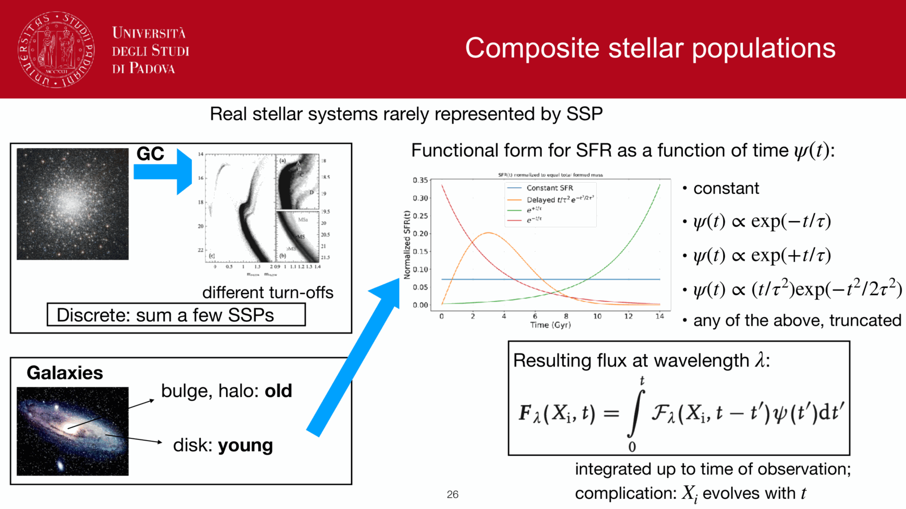
*Grid-based chi-square minimization vs Bayesian Markov Chain Monte Carlo (MCMC) sampling.*

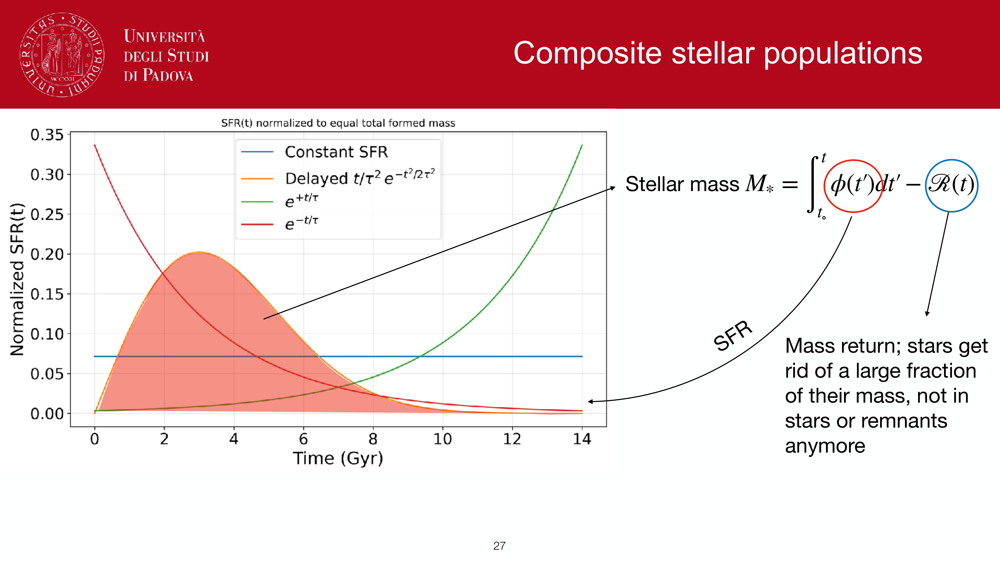
*Priors on age (t_age < age of Universe), metallicity, dust extinction.*

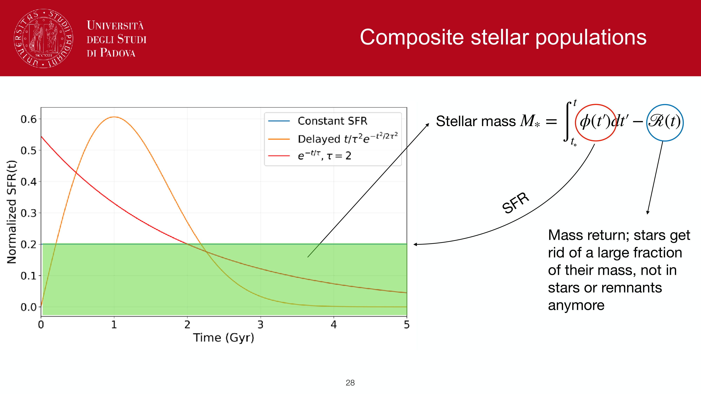
*Degeneracies in SED fitting: age-dust-metallicity degeneracy in broadband filters.*

*Dust attenuation laws: Calzetti starburst curve vs Charlot & Fall (2000) two-component model.*

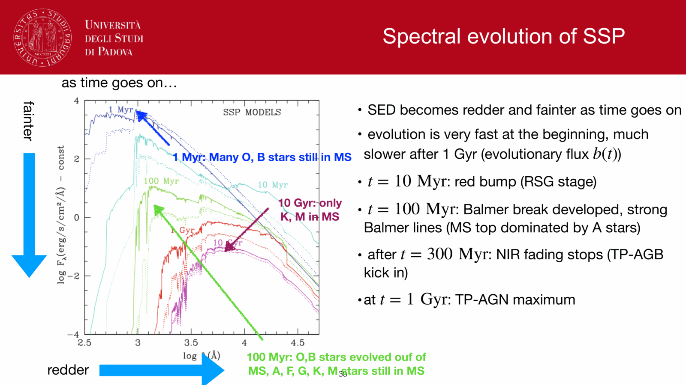
*Energy balance principle in SED fitting (MAGPHYS, CIGALE): L_dust,absorbed = L_dust,emitted.*

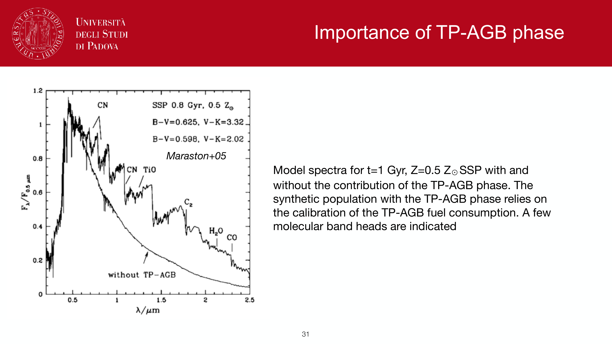
*Stellar mass estimation: stability of rest-frame NIR K-band and 3.6 um mass-to-light ratio.*

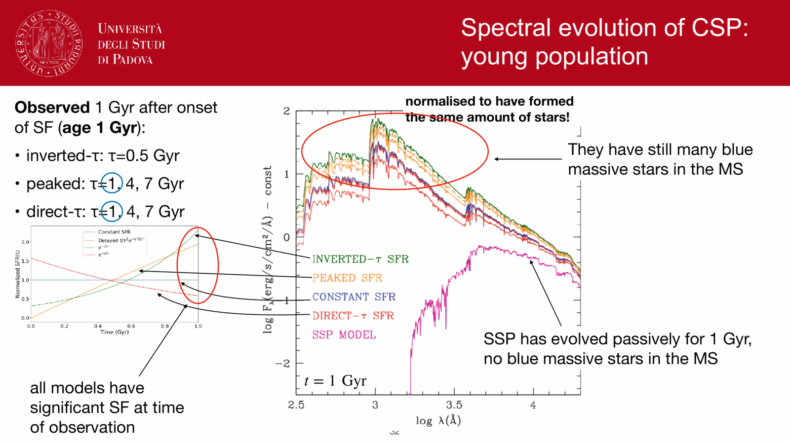
*M_* / L_K variation across stellar ages and SFHs.*

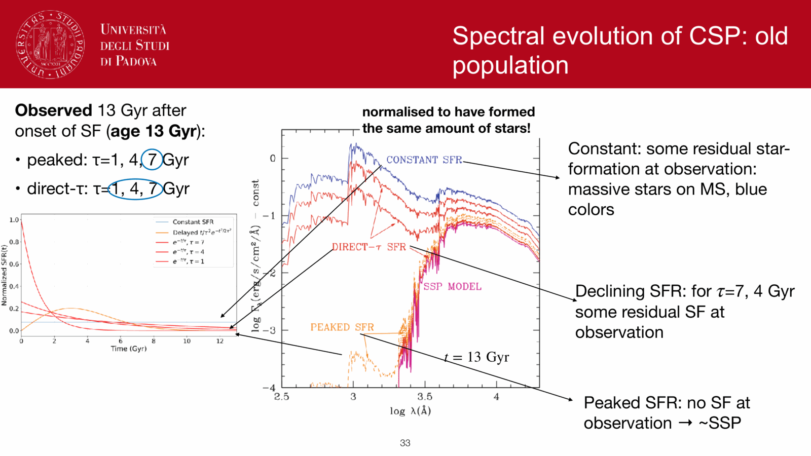
*Systematic uncertainties in stellar mass determinations (~0.2-0.3 dex due to IMF and SPS modeling).*

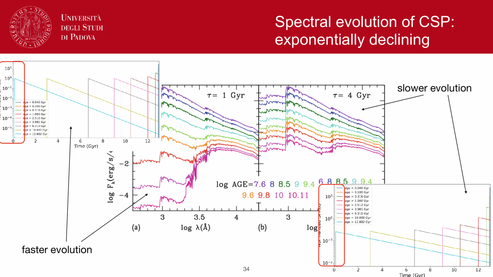
*SED fitting software packages: FAST, Prospector, CIGALE, Bagpipes.*

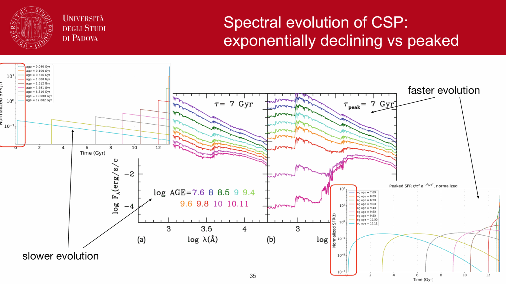
*Emission line contamination in broadband filters at high redshift.*

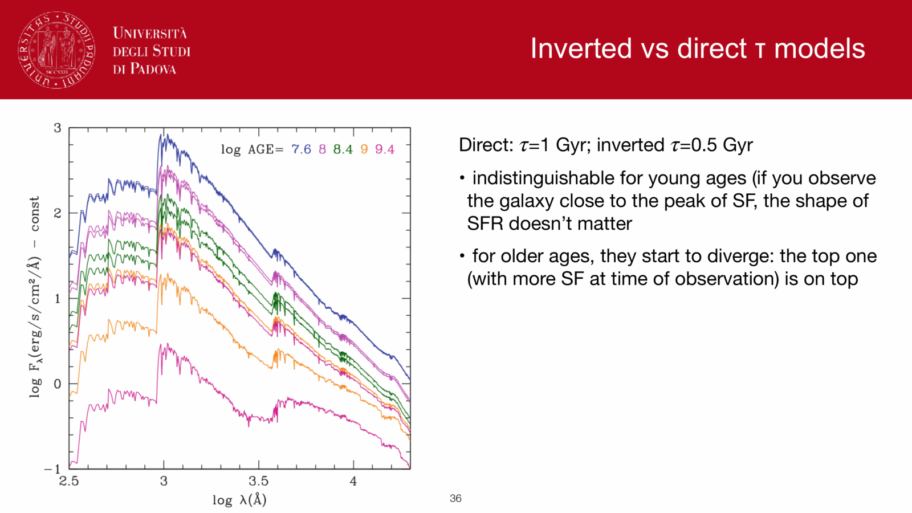
*Summary of SED fitting parameter inference.*


  <h4 class="backlinks-title">Linked References (14)</h4>
  <ul class="backlinks-list">
    <li class="backlink-item-wrap"><a href="./Age%20estimation%20in%20unresolved%20populations.html" class="backlink-item">Age estimation in unresolved populations</a></li>
    <li class="backlink-item-wrap"><a href="./Age-metallicity%20degeneracy.html" class="backlink-item">Age-metallicity degeneracy</a></li>
    <li class="backlink-item-wrap"><a href="./Dust%20attenuation%20in%20synthetic%20populations.html" class="backlink-item">Dust attenuation in synthetic populations</a></li>
    <li class="backlink-item-wrap"><a href="./IR%20SFR%20tracer.html" class="backlink-item">IR SFR tracer</a></li>
    <li class="backlink-item-wrap"><a href="./Lick%20indices.html" class="backlink-item">Lick indices</a></li>
    <li class="backlink-item-wrap"><a href="../../04_Atlas/Observational_Astrophysics_MOC.html" class="backlink-item">Observational_Astrophysics_MOC</a></li>
    <li class="backlink-item-wrap"><a href="./Photometric%20redshifts.html" class="backlink-item">Photometric redshifts</a></li>
    <li class="backlink-item-wrap"><a href="./SFR%20tracers%20from%20population%20synthesis.html" class="backlink-item">SFR tracers from population synthesis</a></li>
    <li class="backlink-item-wrap"><a href="./SPS%20code%20families.html" class="backlink-item">SPS code families</a></li>
    <li class="backlink-item-wrap"><a href="./Star%20formation%20history%20of%20a%20population.html" class="backlink-item">Star formation history of a population</a></li>
    <li class="backlink-item-wrap"><a href="./Stellar%20mass%20estimation%20in%20unresolved%20populations.html" class="backlink-item">Stellar mass estimation in unresolved populations</a></li>
    <li class="backlink-item-wrap"><a href="./Stellar%20population%20synthesis.html" class="backlink-item">Stellar population synthesis</a></li>
    <li class="backlink-item-wrap"><a href="./UV%20SFR%20tracer.html" class="backlink-item">UV SFR tracer</a></li>
    <li class="backlink-item-wrap"><a href="./UV%20luminosity%20function.html" class="backlink-item">UV luminosity function</a></li>
  </ul>

