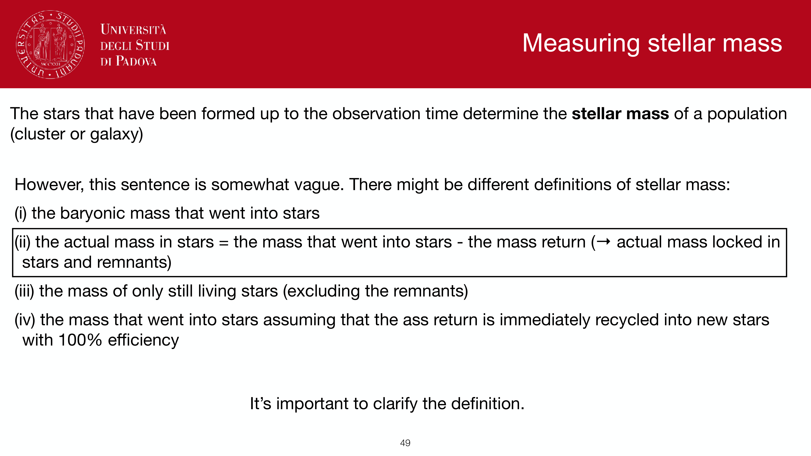
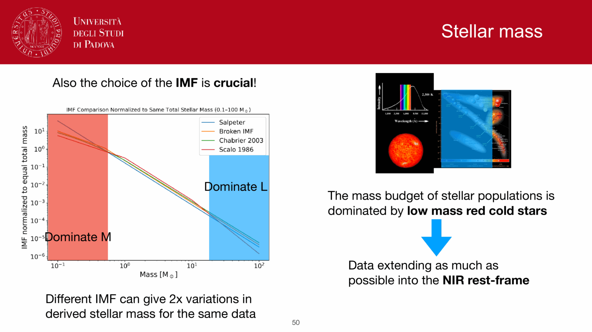
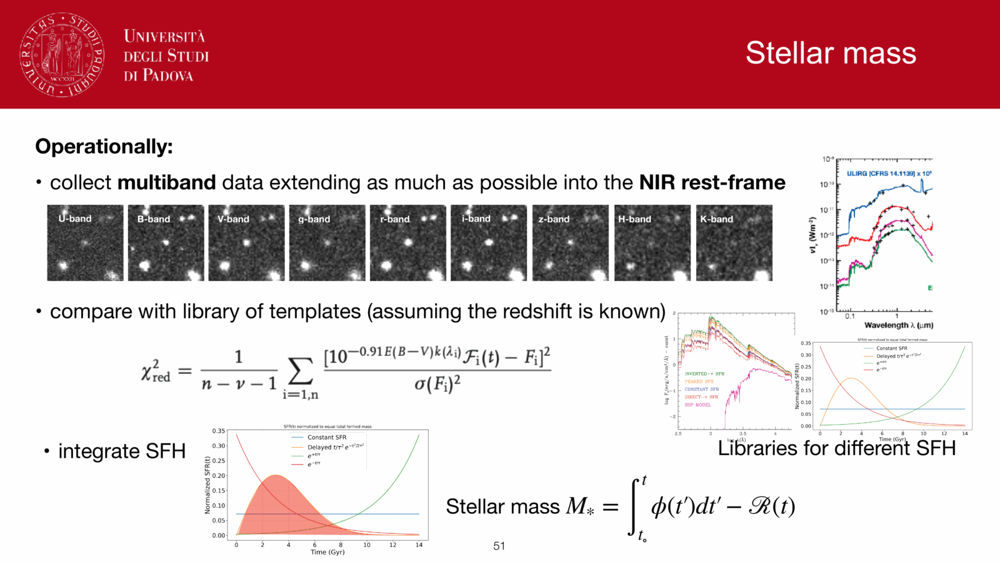

in unresolved stellar populations, individual stars cannot be counted. The **star formation rate (SFR)** of a galaxy must therefore be inferred from integrated light emitted in spectral regimes dominated by short-lived, massive stars ($M \gtrsim 3\text{--}60\,M_\odot$). Because stars of different masses possess distinct lifespans and radiation signatures, each observational SFR tracer probes star formation averaged over a characteristic evolutionary timescale and subject to specific dust attenuation physics.

---

### the three primary SFR tracers

#### 1. ultraviolet stellar continuum (unobscured star formation)
- **physical origin**: non-ionizing continuum ($1500\text{--}2800$ Å) radiated directly by the photospheres of hot O, B, and early A main-sequence stars ($M \gtrsim 3\text{--}5\,M_\odot$).
- **timescale**: $\tau \approx 10\text{--}100$ Myr, reaching a steady state after $\sim 100$ Myr of continuous star formation.
- **calibration (Kennicutt 1998; Madau & Dickinson 2014)**:
  $$\mathrm{SFR}_{\rm UV} [M_\odot/\mathrm{yr}] = 1.4 \times 10^{-28} L_\nu(\mathrm{UV})\,[\mathrm{erg\,s^{-1}\,Hz^{-1}}] \quad (\mathrm{Salpeter\ IMF})$$
  $$\mathrm{SFR}_{\rm UV} [M_\odot/\mathrm{yr}] = 0.88 \times 10^{-28} L_\nu(\mathrm{UV})\,[\mathrm{erg\,s^{-1}\,Hz^{-1}}] \quad (\mathrm{Chabrier\ IMF})$$
- **dust sensitivity**: extremely severe. Interstellar dust grains attenuate UV flux by $A_{1500} \approx 2.5\text{--}4.5 \times A_V$. Uncorrected UV fluxes systematically underestimate the true SFR by factors of $3\text{--}50$.

#### 2. $\mathrm{H}\alpha$ recombination line (instantaneous ionized star formation)
- **physical origin**: ionizing photons ($h\nu \ge 13.6$ eV, $\lambda \le 912$ Å) produced by very massive, short-lived O and early B stars ($M \ge 15\text{--}20\,M_\odot$) photoionize surrounding H II regions. Under Case B recombination, hydrogen atoms cascade down to the $n = 2$ state, emitting the $\mathrm{H}\alpha$ line at $\lambda = 6563$ Å.
- **timescale**: $\tau \le 10$ Myr, tracking the instantaneous star formation rate.
- **calibration (Kennicutt 1998; Hao et al. 2011)**:
  $$\mathrm{SFR}_{\mathrm{H}\alpha} [M_\odot/\mathrm{yr}] = 7.9 \times 10^{-42} L(\mathrm{H}\alpha)\,[\mathrm{erg\,s^{-1}}] \quad (\mathrm{Salpeter\ IMF})$$
  $$\mathrm{SFR}_{\mathrm{H}\alpha} [M_\odot/\mathrm{yr}] = 4.4 \times 10^{-42} L(\mathrm{H}\alpha)\,[\mathrm{erg\,s^{-1}}] \quad (\mathrm{Chabrier\ IMF})$$
- **dust correction**: determined spectroscopically from the **Balmer decrement** ($(\mathrm{H}\alpha/\mathrm{H}\beta)_{\rm obs}$ relative to Case B intrinsic value $2.86$).

#### 3. total infrared thermal emission (obscured star formation)
- **physical origin**: UV and optical starlight absorbed by interstellar dust grains is thermally re-emitted in the mid- and far-infrared ($8\text{--}1000\,\mu\mathrm{m}$) at equilibrium temperatures $T_{\rm dust} \approx 20\text{--}60$ K.
- **timescale**: $\tau \approx 10\text{--}100$ Myr.
- **calibration (Kennicutt 1998; Murphy et al. 2011)**:
  $$\mathrm{SFR}_{\rm IR} [M_\odot/\mathrm{yr}] = 4.5 \times 10^{-44} L_{\rm TIR}\,[\mathrm{erg\,s^{-1}}] \quad (\mathrm{Salpeter\ IMF})$$
  $$\mathrm{SFR}_{\rm IR} [M_\odot/\mathrm{yr}] = 2.8 \times 10^{-44} L_{\rm TIR}\,[\mathrm{erg\,s^{-1}}] \quad (\mathrm{Chabrier\ IMF})$$
- **dust sensitivity**: virtually immune to optical depth effects; directly captures obscured starbursts where $\gtrsim 99\%$ of star formation is hidden from UV/optical view (e.g., LIRGs and ULIRGs).

---

### the panchromatic energy balance: UV + IR hybrid tracer

because neither UV nor IR alone provides a complete inventory of star formation in normal star-forming galaxies, the most robust, model-independent estimator is the direct linear sum of the unobscured UV and obscured IR star formation:

$$\mathrm{SFR}_{\rm tot} = \mathrm{SFR}_{\rm UV,obs} + \mathrm{SFR}_{\rm IR}$$

using Chabrier IMF calibrations:
$$\mathrm{SFR}_{\rm tot} [M_\odot/\mathrm{yr}] = 10^{-28} \left[ 0.88\,L_\nu(\mathrm{UV}) + 2.8 \times 10^{-16}\,L_{\rm TIR} \right]$$

this formulation enforces global energy conservation: every UV photon emitted by young stars either escapes the galaxy (counted in $L_\nu(\mathrm{UV})$) or is absorbed and re-radiated by dust (counted in $L_{\rm TIR}$).

---

### secondary and high-redshift SFR tracers

- **$[\mathrm{O\,II}]\,\lambda 3727$ doublet**: collisionally excited nebular forbidden line. While metallicity- and excitation-dependent, it is the primary optical tracer for ground-based surveys at $1.2 \le z \le 1.6$ (the "redshift desert") where $\mathrm{H}\alpha$ shifts into the near-infrared.
- **$1.4$ GHz radio continuum**: non-thermal synchrotron radiation from relativistic electrons accelerated in core-collapse supernova remnants, plus thermal free-free emission from H II regions. Completely unaffected by dust; calibrated via the tight empirical **far-IR / radio correlation** (Helou 1985; Yun et al. 2001).
- **high-mass X-ray binaries (HMXBs)**: accretion onto neutron stars and black holes with massive O/B stellar companions emits hard X-rays ($2\text{--}10$ keV) on timescales $\sim 5\text{--}20$ Myr ($L_X \propto \mathrm{SFR}$).
- **far-infrared fine-structure lines ($[\mathrm{C\,II}]\,158\,\mu\mathrm{m}$, $[\mathrm{O\,III}]\,88\,\mu\mathrm{m}$)**: dominant cooling lines of the neutral and ionized ISM, observed by ALMA up to $z > 7$.

---

### comparative tracer summary

| tracer | characteristic timescale | dust sensitivity | primary systematic limitation | optimal observational regime |
|---|---|---|---|---|
| **$\mathrm{H}\alpha$** | $< 10$ Myr | Medium ($A_{\mathrm{H}\alpha} \approx 0.8 A_V$) | Underlying stellar absorption; $[N II]$ blend | Local Universe, JWST NIRSpec at $z \le 7$ |
| **UV ($1500$ Å)** | $\sim 10\text{--}100$ Myr | High ($A_{\rm UV} \approx 3\text{--}4 A_V$) | Extreme extinction uncertainty | Unobscured starbursts, LBGs at $z \ge 2$ |
| **TIR ($8\text{--}1000\,\mu\mathrm{m}$)** | $\sim 10\text{--}100$ Myr | Inverted (requires dust) | Dust heating by old stars ("cirrus"); AGN | LIRGs, ULIRGs, dusty spirals |
| **UV + IR** | $\sim 10\text{--}100$ Myr | Self-consistent | Requires panchromatic coverage | Benchmark single-galaxy measurements |
| **Radio ($1.4$ GHz)** | $\sim 100$ Myr | None | AGN synchrotron contamination | Obscured high-$z$ star formation |
| **$[\mathrm{O\,II}]\,\lambda 3727$** | $< 10$ Myr | Medium | Strong metallicity and ionization dependence | Redshift desert ($1.2 < z < 1.6$) |

---

### conversion across initial mass functions

all SFR calibrations scale linearly with the ratio of high-mass stars to total formed mass. Converting SFR values derived under different IMF assumptions requires simple multiplicative offsets:

$$\log_{10} \mathrm{SFR}_{\rm Chabrier} = \log_{10} \mathrm{SFR}_{\rm Salpeter} - 0.24$$
$$\log_{10} \mathrm{SFR}_{\rm Kroupa} = \log_{10} \mathrm{SFR}_{\rm Salpeter} - 0.20$$

---

## see also

- [[Observational_Astrophysics_MOC]]
- [[Stellar_Astrophysics_MOC]]
- [[UV SFR tracer]]
- [[H-alpha SFR tracer]]
- [[IR SFR tracer]]
- [[Initial mass function]]
- [[Star formation history of a population]]
- [[Dust attenuation in synthetic populations]]
- [[SED fitting basics]]
- [[Stellar mass estimation in unresolved populations]]
- [[SPS code families]]

---

## observational astrophysics course slides (Prof. Paolo Cassata)

*Obs5 / Obs7 exam question: Estimating Star Formation Rate across multi-wavelength regimes.*

*Kennicutt (1998) calibrations: UV continuum, H-alpha emission, Far-Infrared (FIR) dust emission.*

*H-alpha SFR tracer: SFR(M_Sun/yr) = 7.9 x 10^(-42) * L(H-alpha) (erg/s), tracing ~10 Myr massive O/B stars.*

## Linked References

- [[Dust attenuation in synthetic populations]]
- [[H-alpha SFR tracer]]
- [[IR SFR tracer]]
- [[SED fitting basics]]
- [[Star formation history of a population]]
- [[Stellar population synthesis]]
- [[UV SFR tracer]]
- [[Observational_Astrophysics_MOC]]

