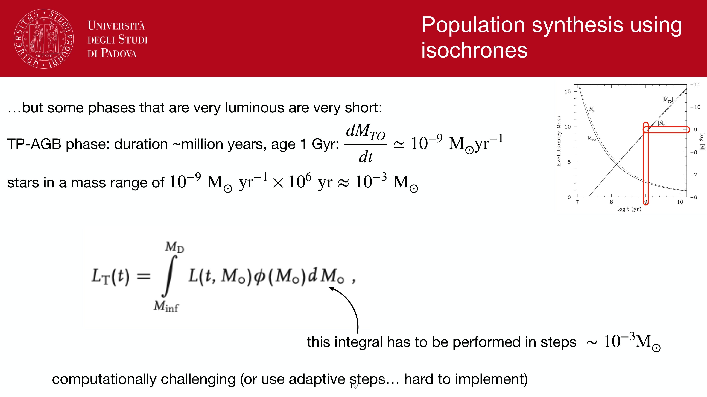
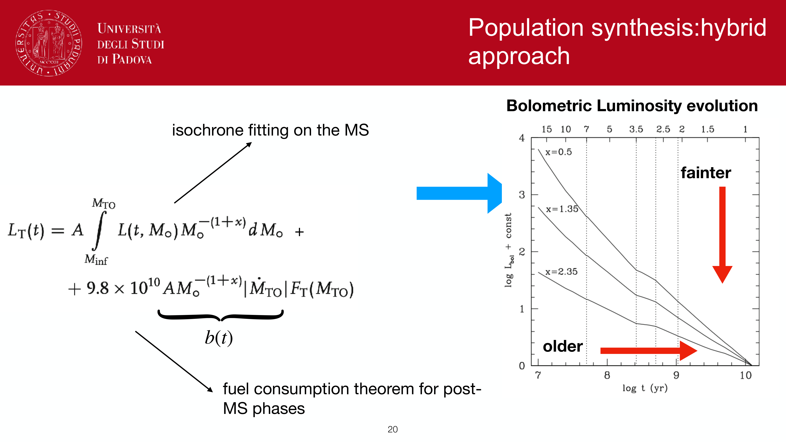
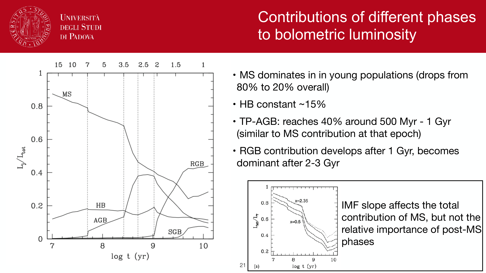
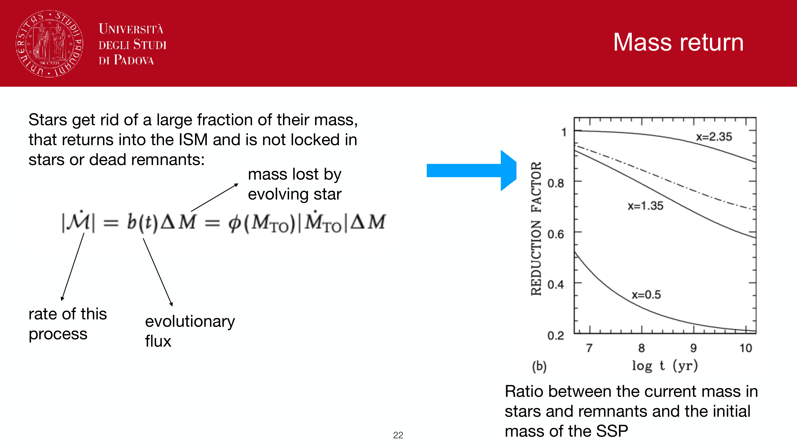
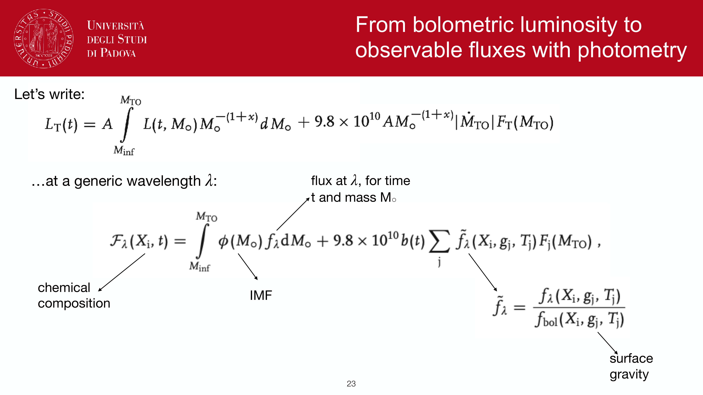
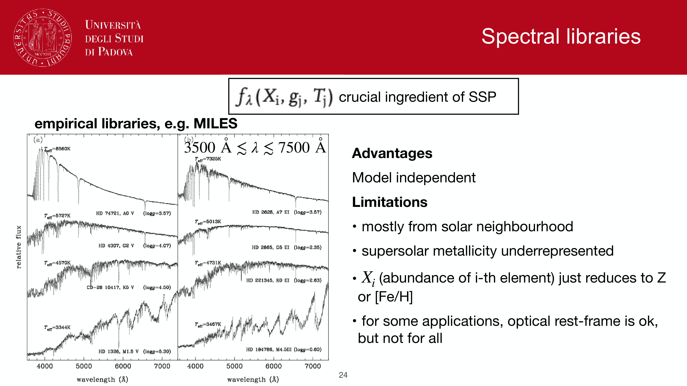


modern **stellar population synthesis (SPS) code families** translate theoretical stellar evolution into observable galaxy spectra. Because different codes make distinct physical assumptions regarding isochrone calculations, stellar atmospheric libraries, post-main sequence evolutionary phases (notably the thermally pulsing AGB), and binary interactions, systematic offsets of $\Delta \log M_* \sim 0.1\text{--}0.3$ dex and $\Delta \log \mathrm{SFR} \sim 0.1\text{--}0.2$ dex naturally arise between codes when fitting the exact same galaxy photometry.

---

### the primary SPS code libraries

#### 1. Bruzual & Charlot (BC03 / BC07)
- **architecture**: built on **Padova 1994** stellar evolutionary tracks, combined with empirical stellar libraries (**STELIB** at $R \approx 2000$, and later **MILES** at $R \approx 2000$) supplemented by the theoretical **BaSeL 3.1** library for hot stars and non-solar abundances.
- **evolutionary features**: treats the TP-AGB phase using canonical synthetic stellar evolution tracks.
- **role in astrophysics**: the community "gold standard" workhorse for over two decades; embedded inside classical SED-fitting tools including **FAST**, **MAGPHYS**, **HYPERZ**, and early versions of **CIGALE**.
- **limitations**: Padova isochrones underestimate the NIR luminosity contribution of carbon-rich TP-AGB stars at intermediate ages ($\tau \sim 0.5\text{--}1.5$ Gyr).

#### 2. Maraston (M05 / M11)
- **architecture**: relies on the **fuel consumption theorem** (Renzini & Buzzoni 1986), which calculates post-main sequence luminosities from the total nuclear fuel burned in each phase rather than integrating isochrones.
- **TP-AGB treatment**: heavily calibrates the TP-AGB phase against resolved globular and open star clusters in the Magellanic Clouds. Predicts up to $80\%$ of the bolometric NIR flux ($J, H, K$) is emitted by TP-AGB stars between $\tau \approx 0.2$ and $2$ Gyr.
- **impact**: in the late 2000s, fitting high-redshift ($z \sim 1.5\text{--}3$) galaxies with M05 yielded stellar masses up to a factor of $\sim 2$ lower than BC03, igniting the "TP-AGB controversy." Subsequent Spitzer/Herschel NIR and mid-IR rest-frame measurements showed the true TP-AGB impact lies midway between BC03 and M05.

#### 3. FSPS (Flexible Stellar Population Synthesis; Conroy et al. 2009, 2010)
- **architecture**: a fully modular, highly parameterized Fortran/C library wrapped in Python (`python-fsps`).
- **modularity**: enables the user to independently select:
  - isochrone grids: **MIST** (MESA isochrones, default), **Padova / PARSEC**, or **BaSTI**.
  - stellar libraries: **MILES**, **BaSeL**, or synthetic atmospheres.
  - TP-AGB parameterization: adjustable weight factors for fuel consumption in carbon and oxygen AGB stars.
  - custom dust attenuation curves (Charlot & Fall, Calzetti, Conroy flexible curve).
  - self-consistent nebular emission computed via integrated **CLOUDY** photoionization grids.
- **role in astrophysics**: current state-of-the-art engine powering Bayesian SED-fitting codes such as **Prospector**, **BAGPIPES**, and **BEAGLE**.

#### 4. Starburst99 (Leitherer et al. 1999, 2014)
- **architecture**: purpose-built for **young, massive, starbursting populations** ($\tau \le 100$ Myr).
- **specialized physics**:
  - tracks the production rate of hydrogen and helium ionizing photons: $Q(\mathrm{H}^0)$ ($h\nu \ge 13.6$ eV), $Q(\mathrm{He}^0)$ ($h\nu \ge 24.6$ eV), and $Q(\mathrm{He}^+)$ ($h\nu \ge 54.4$ eV).
  - incorporates **Geneva evolutionary tracks** with stellar rotation, tracking rotational mixing and enhanced mass loss in massive O and B stars.
  - detailed models of **Wolf-Rayet (WR)** stars and non-LTE expanding stellar wind atmospheres (Pauldrach, Hillier).
  - predicts mechanical energy and momentum injection rates ($dE_{\rm mech}/dt$, $dP/dt$) from stellar winds and core-collapse supernovae.
- **role in astrophysics**: the benchmark for calibrating nebular emission lines ($\mathrm{H}\alpha$, $[\mathrm{O\,III}]$), mechanical feedback into the ISM, and UV-based star formation rate tracers.

#### 5. BPASS (Binary Population and Spectral Synthesis; Eldridge & Stanway 2017)
- **architecture**: explicitly incorporates **interacting binary stellar evolution** across a dense grid of initial primary masses, secondary masses, and orbital separations.
- **physical mechanisms**: Roche lobe overflow, mass transfer, common envelope ejection, quasi-homogeneous evolution, and binary mergers.
- **observational impact**:
  - binary mass transfer strips hydrogen envelopes, producing hot helium stars that emit copious ionizing photons long after single O stars have exploded ($\tau \sim 10\text{--}100$ Myr).
  - produces Wolf-Rayet stars without requiring extreme stellar winds.
  - substantially boosts the ratio of ionizing to UV continuum flux at low metallicity ($Z \le 0.1\,Z_\odot$).
- **role in astrophysics**: indispensable for modeling **cosmic reionization**, low-metallicity dwarf galaxies, and early galaxies observed by **JWST** at $z > 6$.

---

### comparative synthesis matrix

| code | primary isochrones | stellar atmospheres | TP-AGB prescription | binary evolution | nebular emission | primary use case |
|---|---|---|---|---|---|---|
| **BC03** | Padova 1994 | STELIB / BaSeL 3.1 / MILES | Synthetic tracks | Single stars | External / optional | General galaxy SED fitting |
| **M05** | Cassisi / Padova | BaSeL / Pickles | Fuel Consumption Theorem | Single stars | External / optional | Intermediate-age NIR tests |
| **FSPS** | MIST / PARSEC / BaSTI | MILES / BaSeL / synthetic | Parametric fuel calibration | Optional | Integrated CLOUDY | Advanced Bayesian SED inference |
| **SB99** | Geneva (with rotation) | Lejeune / Pauldrach / Hillier | N/A ($\tau < 100$ Myr) | Single stars | Integrated CLOUDY | Starbursts, winds, ionizing budget |
| **BPASS** | Custom binary grid | WM-basic / CMFGEN / BaSeL | Track-based | Detailed binaries | Integrated CLOUDY | High-$z$ JWST, reionization, low-$Z$ |

---

### systematic impact on inferred galaxy parameters

when identical photometric catalogs are fit with different SPS codes:
1. **stellar mass ($M_*$)**:
   - M05 yields masses lower by $\sim 0.15\text{--}0.3$ dex relative to BC03 for post-starburst and $z \sim 2$ star-forming systems due to elevated TP-AGB NIR luminosity.
   - BPASS yields slightly lower masses for actively star-forming systems because binary channels provide additional luminosity per unit mass.
2. **star formation rate (SFR)**:
   - standard single-star calibrations (BC03, SB99) require a higher SFR to reproduce observed $\mathrm{H}\alpha$ luminosities compared to BPASS, where binaries maintain ionizing flux out to $50\text{--}100$ Myr.
3. **metallicity ($Z$)**:
   - empirical libraries (MILES) restrict fits to Milky Way solar-scaled $[\alpha/\mathrm{Fe}]$ ratios, artificially skewing metallicity and age fits in massive ellipticals.

---

## see also

- [Observational_Astrophysics_MOC](../../04_Atlas/Observational_Astrophysics_MOC.html)
- [Stellar_Astrophysics_MOC](../../04_Atlas/Stellar_Astrophysics_MOC.html)
- [Stellar population synthesis](./Stellar%20population%20synthesis.html)
- [Single stellar population SSP](./Single%20stellar%20population%20SSP.html)
- [SED fitting basics](./SED%20fitting%20basics.html)
- [Initial mass function](./Initial%20mass%20function.html)
- [Star formation history of a population](./Star%20formation%20history%20of%20a%20population.html)
- [Stellar mass estimation in unresolved populations](./Stellar%20mass%20estimation%20in%20unresolved%20populations.html)
- [Dust attenuation in synthetic populations](./Dust%20attenuation%20in%20synthetic%20populations.html)
- [H-alpha SFR tracer](./H-alpha%20SFR%20tracer.html)
- [UV SFR tracer](./UV%20SFR%20tracer.html)

---

## observational astrophysics course slides (Prof. Paolo Cassata)

*Comparison of modern SPS codes: Bruzual & Charlot (2003, BC03), Maraston (2005, M05), FSPS (Conroy).*

*Treatment of Thermally Pulsing Asymptotic Giant Branch (TP-AGB) stars in SPS models.*

*Fuel consumption theorem (Renzini & Buzzoni 1986) in Maraston models.*

*Impact of TP-AGB stars on NIR luminosity and derived stellar masses at z ~ 1-2.*

*Binary stellar evolution channels: BPASS code (Eldridge et al.) and Wolf-Rayet star production.*

*Stellar rotation in models (Geneva tracks) and extended main sequence lifetimes.*


  <h4 class="backlinks-title">Linked References (11)</h4>
  <ul class="backlinks-list">
    <li class="backlink-item-wrap"><a href="./Age-metallicity%20degeneracy.html" class="backlink-item">Age-metallicity degeneracy</a></li>
    <li class="backlink-item-wrap"><a href="./H-alpha%20SFR%20tracer.html" class="backlink-item">H-alpha SFR tracer</a></li>
    <li class="backlink-item-wrap"><a href="./Lick%20indices.html" class="backlink-item">Lick indices</a></li>
    <li class="backlink-item-wrap"><a href="../../04_Atlas/Observational_Astrophysics_MOC.html" class="backlink-item">Observational_Astrophysics_MOC</a></li>
    <li class="backlink-item-wrap"><a href="./SED%20fitting%20basics.html" class="backlink-item">SED fitting basics</a></li>
    <li class="backlink-item-wrap"><a href="./SFR%20tracers%20from%20population%20synthesis.html" class="backlink-item">SFR tracers from population synthesis</a></li>
    <li class="backlink-item-wrap"><a href="./Single%20stellar%20population%20SSP.html" class="backlink-item">Single stellar population SSP</a></li>
    <li class="backlink-item-wrap"><a href="./Star%20formation%20history%20of%20a%20population.html" class="backlink-item">Star formation history of a population</a></li>
    <li class="backlink-item-wrap"><a href="./Stellar%20mass%20estimation%20in%20unresolved%20populations.html" class="backlink-item">Stellar mass estimation in unresolved populations</a></li>
    <li class="backlink-item-wrap"><a href="./Stellar%20population%20synthesis.html" class="backlink-item">Stellar population synthesis</a></li>
    <li class="backlink-item-wrap"><a href="./Thermal%20continuum%20from%20stellar%20photosphere.html" class="backlink-item">Thermal continuum from stellar photosphere</a></li>
  </ul>

