
# schechter function in magnitudes

up: [Pablo_02_Statistical_properties_of_galaxies](../../02_Literature/Lectures/Observational_Cosmology/Pablo_02_Statistical_properties_of_galaxies.html) · [Schechter function](./Schechter%20function.html)

## the change of variable

we measure absolute magnitudes, not luminosities. so we want $\phi(M)\, dM$ instead of $\phi(L)\, dL$. with $M = -2.5 \log_{10}(L/L_0)$, so $L/L^* = 10^{-0.4(M - M^*)}$:

$$\boxed{\,\phi(M)\, dM = 0.4 \ln 10\, \phi^* \cdot \left[10^{-0.4(M - M^*)}\right]^{\alpha + 1} \exp\!\left[-10^{-0.4(M - M^*)}\right]\, dM\,}$$

i drop the absolute value sign on $dM$ because we are integrating over a positive range.

## what the parameters look like in $M$

- $M^*$ corresponds to $L^*$. typical optical values: $M^*_B \approx -20.5$, $M^*_K \approx -23.2$ (Vega), $M^*_r \approx -20.4$ (AB).
- $\phi^*$ is unchanged, still $\text{Mpc}^{-3}$.
- $\alpha$ is the same (slope in $\log L$).

## practical fitting

most LF papers fit Schechter parameters in magnitudes because:

1. magnitudes are the natural observable
2. errors in $m$ are roughly Gaussian, errors in $L$ are not
3. the bright-end exponential cutoff is more visually obvious in magnitude space (it falls off steeply on the bright side of $M^*$)

## the "Schechter in $\log L$" form

sometimes you see

$$\phi(\log L)\, d \log L = \ln 10 \cdot \phi^* \cdot (L/L^*)^{\alpha + 1} \exp(-L/L^*)\, d\log L$$

note: in $\log L$ space, the *effective* faint-end slope is $\alpha + 1$, not $\alpha$. this trips people up. an LF with $\alpha = -1$ is *flat* in $\phi(\log L)$ but power-law in $\phi(L)$.

## numerical sanity check

for $\alpha = -1.25$, $M^* = -20.5$ (B-band), $\phi^* = 1.6 \times 10^{-2}\, h^3\, \text{Mpc}^{-3}$:

- $\phi(M^*) \approx 0.4 \ln 10 \cdot \phi^* / e \approx 1.4 \times 10^{-3}\, \text{Mpc}^{-3}\,\text{mag}^{-1}$
- the LF rises by a factor of $\sim 3$ from $M = M^*$ to $M = M^* + 4$
- and falls by a factor of $\sim 100$ from $M = M^*$ to $M = M^* - 2$

these are the magnitudes of the slope to keep in mind.

## connections

- functional form: [Schechter function](./Schechter%20function.html)
- integrals: [Integrals of the Schechter function](./Integrals%20of%20the%20Schechter%20function.html)
- canonical numbers: [Schechter K-band luminosity function](./Schechter%20K-band%20luminosity%20function.html)

## key references

- Schechter 1976
- Lin et al. 1996 (LCRS LF in magnitudes, classic example)

---

## astrophysics of galaxies figures and slides (Prof. Alessandro Pizzella)

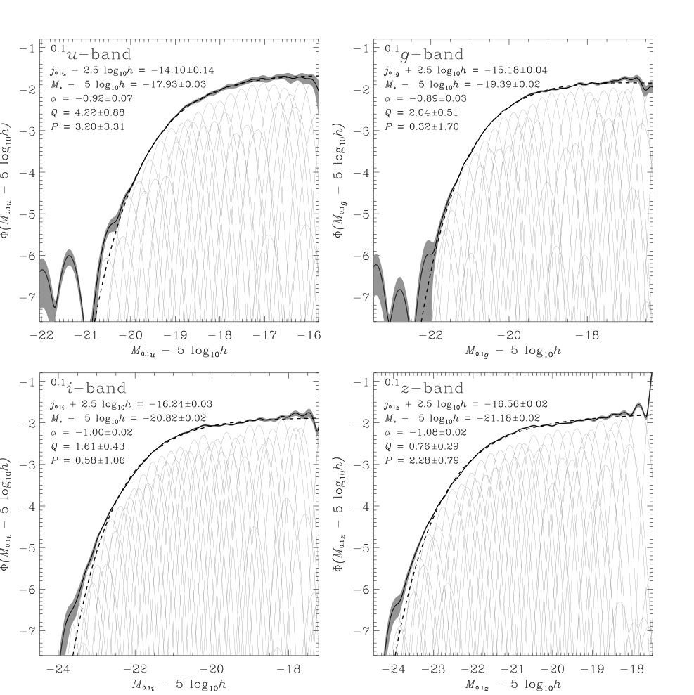
*Schechter luminosity functions across SDSS ugriz filter bands from Blanton et al. (2003).*

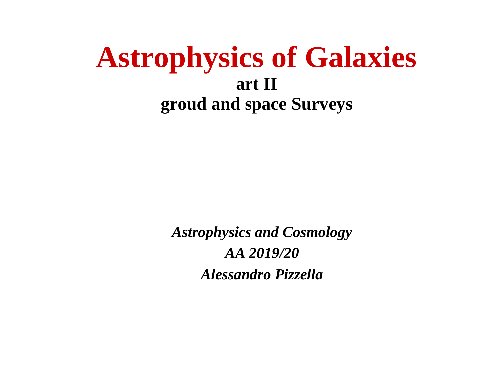
*Conversion from luminosity to absolute magnitude using Pogson formula.*

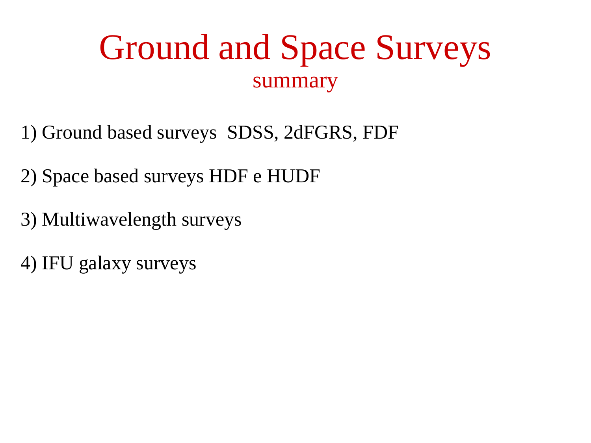
*Magnitude form: Phi(M) dM = 0.4 ln(10) * Phi* * 10^[0.4(alpha+1)(M* - M)] * exp[-10^[0.4(M* - M)]] dM.*

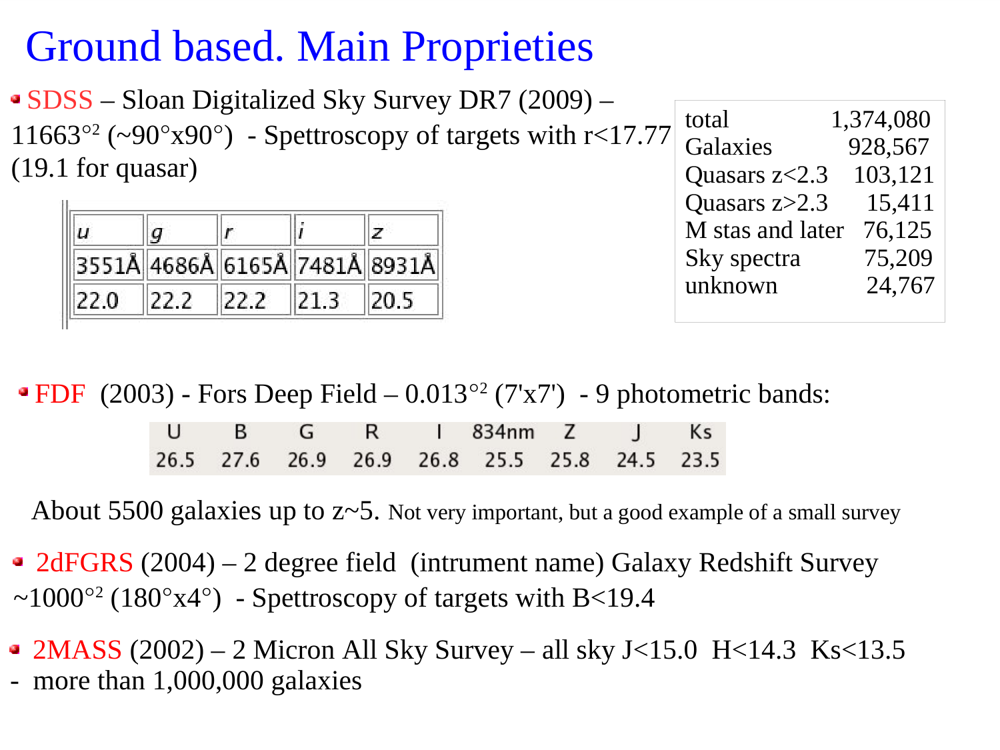
*Faint-end slope in magnitudes: d log Phi / dM = 0.4 * (alpha + 1).*

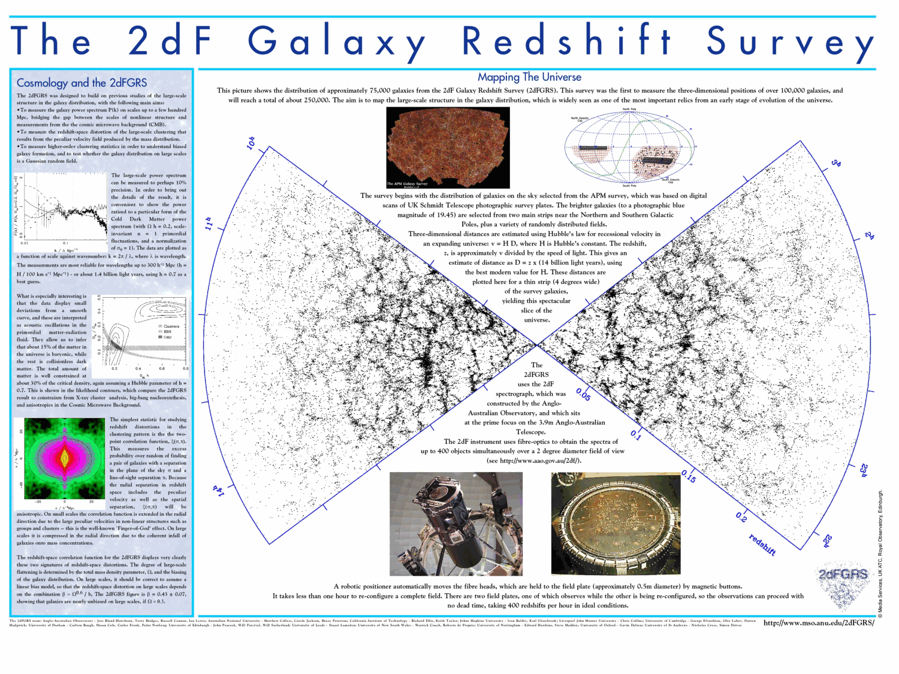
*Exponential drop at the bright end: M << M*.*

---

## lecture slides and reference figures (Prof. Alessandro Pizzella)

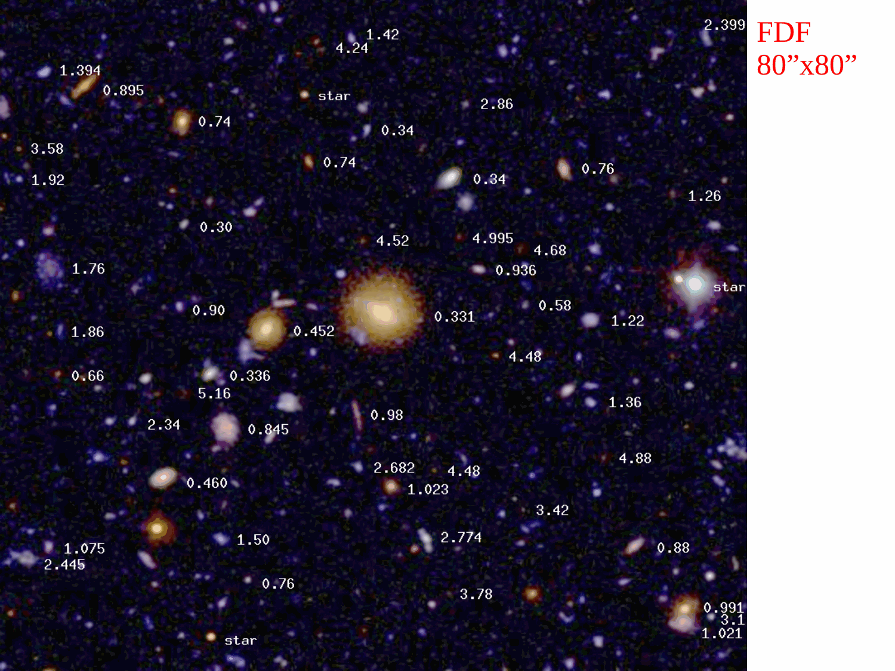

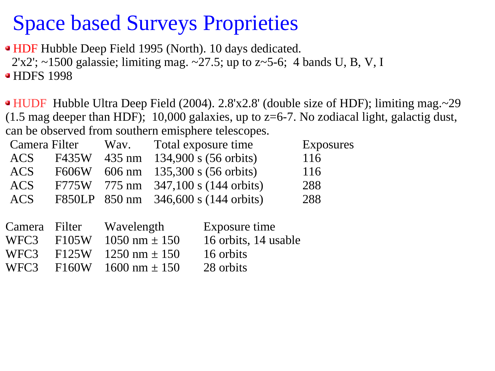

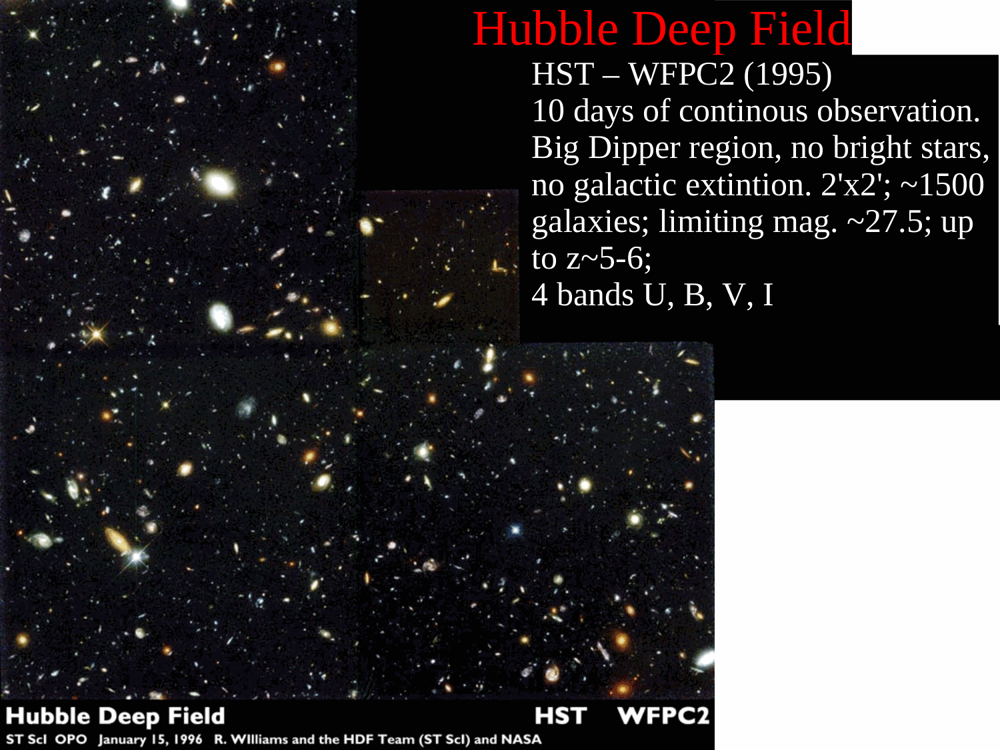

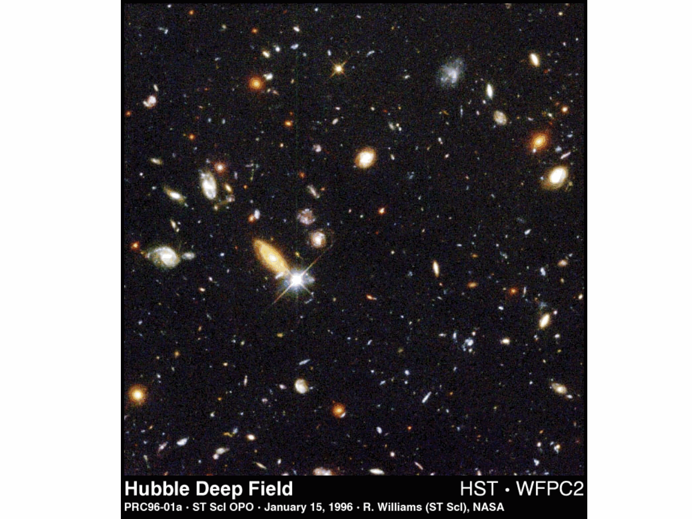

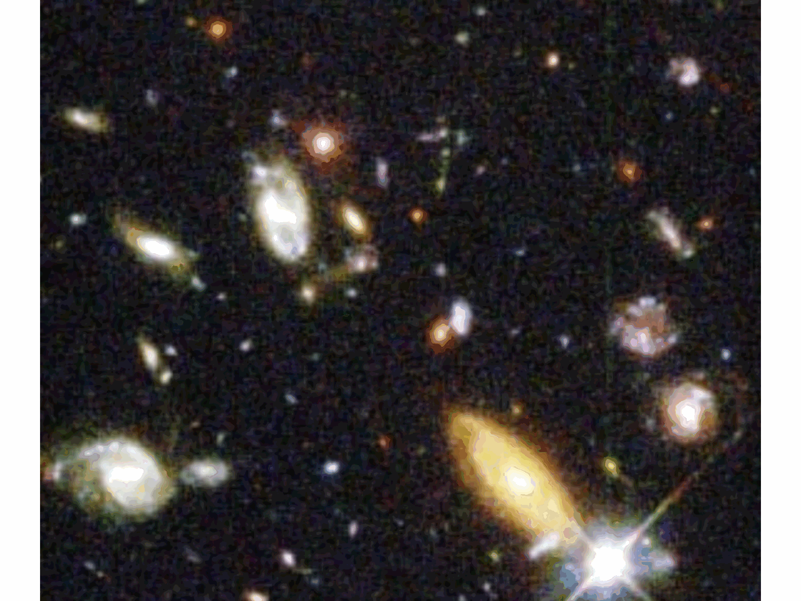

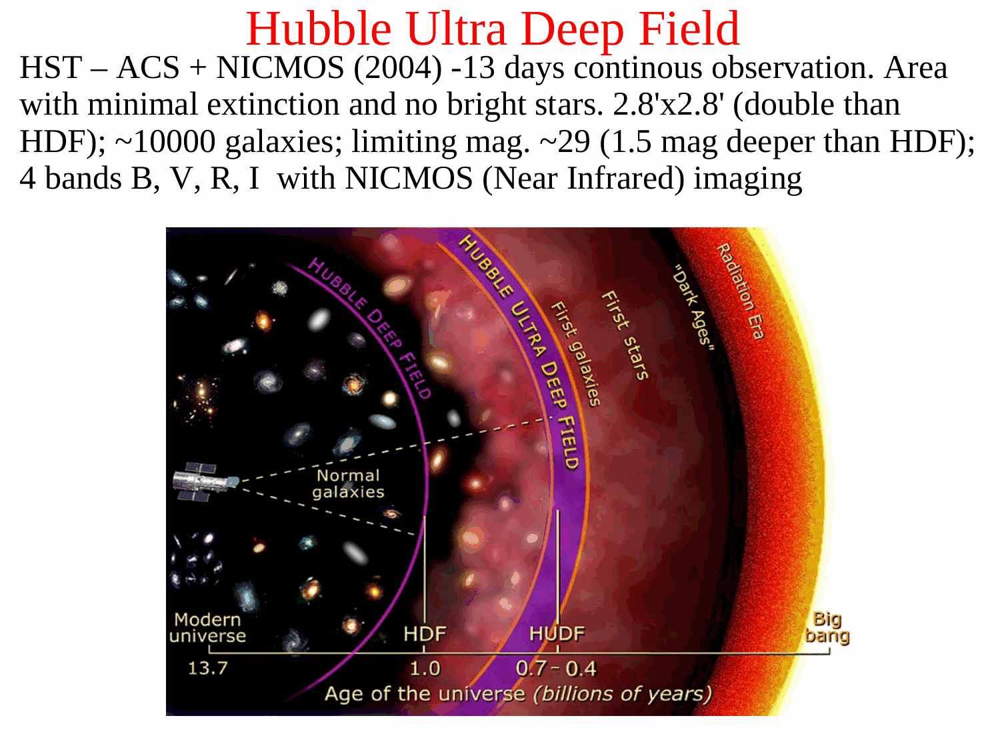

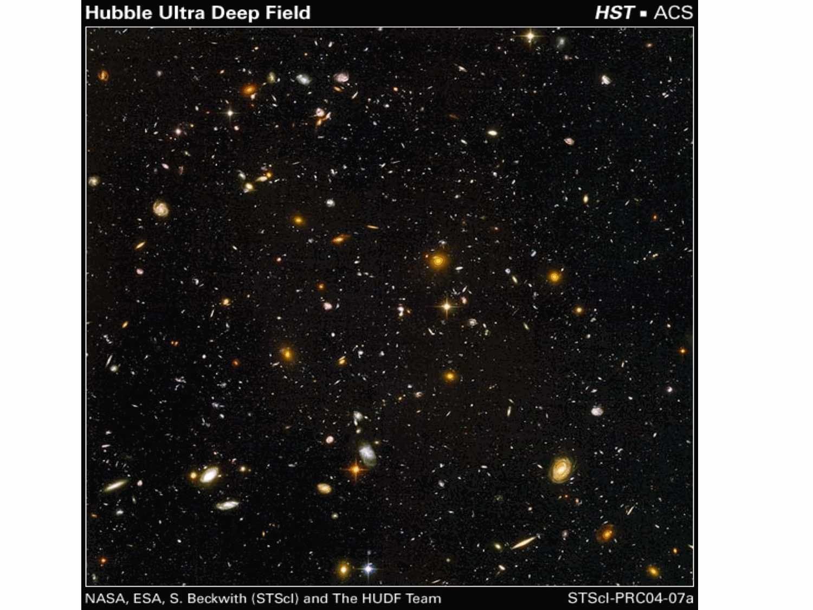

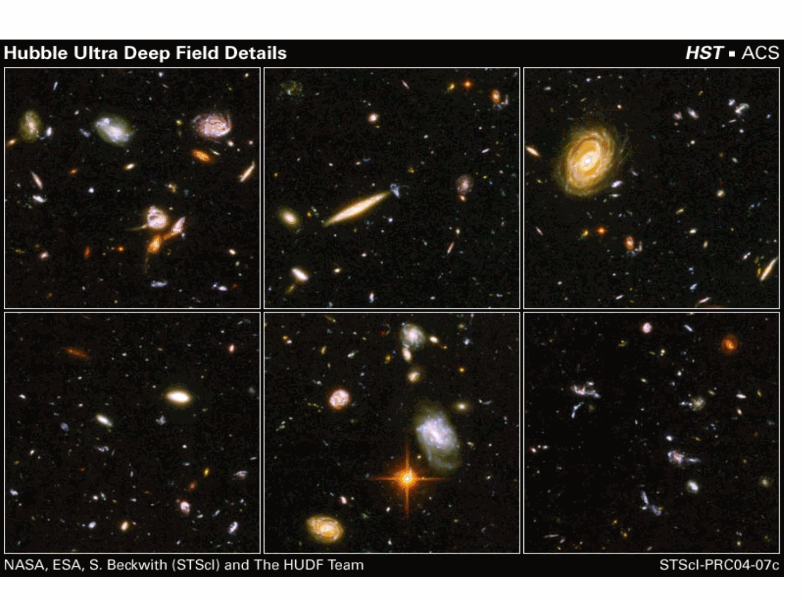


  <h4 class="backlinks-title">Linked References (6)</h4>
  <ul class="backlinks-list">
    <li class="backlink-item-wrap"><a href="../../04_Atlas/Astrophysics_of_Galaxies_MOC.html" class="backlink-item">Astrophysics_of_Galaxies_MOC</a></li>
    <li class="backlink-item-wrap"><a href="./Integrals%20of%20the%20Schechter%20function.html" class="backlink-item">Integrals of the Schechter function</a></li>
    <li class="backlink-item-wrap"><a href="../../04_Atlas/Observational_Cosmology_MOC.html" class="backlink-item">Observational_Cosmology_MOC</a></li>
    <li class="backlink-item-wrap"><a href="../../02_Literature/Lectures/Observational_Cosmology/Pablo_02_Statistical_properties_of_galaxies.html" class="backlink-item">Pablo_02_Statistical_properties_of_galaxies</a></li>
    <li class="backlink-item-wrap"><a href="./Schechter%20K-band%20luminosity%20function.html" class="backlink-item">Schechter K-band luminosity function</a></li>
    <li class="backlink-item-wrap"><a href="./Schechter%20function.html" class="backlink-item">Schechter function</a></li>
  </ul>

