# The Schmidt-Kennicutt Law

## 1. Empirical Power-Law Formulation

The **Schmidt-Kennicutt law** (Schmidt 1959; Kennicutt 1989, 1998) is the fundamental scaling relation connecting the star formation rate surface density $\Sigma_{\rm SFR}$ to the cold interstellar gas surface density $\Sigma_{\rm gas}$.

$$\boxed{\Sigma_{\rm SFR} = A \, \Sigma_{\rm gas}^N}$$

In the canonical calibration established by Kennicutt (1998) across normal spiral disks and circumnuclear starburst galaxies.

$$\Sigma_{\rm SFR} = (2.5 \pm 0.7) \times 10^{-4} \left( \frac{\Sigma_{\rm gas}}{M_\odot \, \mathrm{pc}^{-2}} \right)^{1.4 \pm 0.15} \, M_\odot \, \mathrm{yr}^{-1} \, \mathrm{kpc}^{-2}$$

where.
- $\Sigma_{\rm gas} \equiv \Sigma_{\rm HI} + \Sigma_{\rm H_2}$ represents the total cold neutral gas surface density (atomic hydrogen plus molecular hydrogen, corrected for helium abundance by a factor of $1.36$)
- $\Sigma_{\rm SFR}$ is determined from extinction-corrected $H\alpha$, far-infrared, or ultraviolet flux
- The power-law exponent $N \approx 1.4$ holds across five orders of magnitude in gas surface density ($1 \le \Sigma_{\rm gas} \le 10^5 \, M_\odot\,\mathrm{pc}^{-2}$)

---

## 2. Unbroken Mathematical Derivation - Free-Fall Collapse in Self-Gravitating Disks

Why does star formation follow an empirical power law with slope $N \approx 1.4$ to $1.5$?

### Step 1 - The Local Volumetric Star Formation Rate
In three dimensions, star formation in a self-gravitating gas cloud occurs on the characteristic gravitational collapse timescale, the **free-fall time** $t_{\rm ff}$.

$$\dot{\rho}_* = \epsilon_{\rm SF} \frac{\rho_{\rm gas}}{t_{\rm ff}}$$

where $\epsilon_{\rm SF} \approx 0.01 - 0.02$ is the dimensionless star formation efficiency per free-fall time.

### Step 2 - The Free-Fall Timescale
The gravitational free-fall time of a cloud with volume density $\rho_{\rm gas}$ is.

$$t_{\rm ff} = \sqrt{\frac{3\pi}{32 G \rho_{\rm gas}}} \propto \rho_{\rm gas}^{-1/2}$$

Substituting this expression into the volumetric star formation rate.

$$\dot{\rho}_* = \epsilon_{\rm SF} \sqrt{\frac{32 G}{3\pi}} \, \rho_{\rm gas}^{3/2} \propto \rho_{\rm gas}^{1.5}$$

### Step 3 - Projection to Disk Surface Density
Consider a gas disk in hydrostatic equilibrium perpendicular to the disk plane ($z$-direction). Balancing vertical gas velocity dispersion $\sigma_g$ against the vertical self-gravitational field yields the characteristic scale height.

$$H \approx \frac{\sigma_g^2}{\pi G \Sigma_{\rm gas}}$$

The midplane gas volume density is.

$$\rho_{\rm gas} \approx \frac{\Sigma_{\rm gas}}{2 H} \approx \frac{\pi G \Sigma_{\rm gas}^2}{2 \sigma_g^2}$$

Integrating the star formation rate vertically through the disk.

$$\Sigma_{\rm SFR} = \int_{-H}^H \dot{\rho}_* \, dz \approx 2 H \dot{\rho}_*$$

If the gas disk scale height $H$ is set primarily by an external stellar potential or varies slowly across the star-forming disk.

$$\Sigma_{\rm SFR} \propto H \rho_{\rm gas}^{1.5} \propto H \left(\frac{\Sigma_{\rm gas}}{2 H}\right)^{1.5} \propto \Sigma_{\rm gas}^{1.5}$$

This unbroken physical derivation produces an exponent $N = 1.5$, which matches the empirically observed slope $N = 1.40 \pm 0.15$ within $1\sigma$ experimental uncertainties.

---

## 3. The Orbital Dynamical Time Formulation (Silk-Elmegreen)

Alternatively, large-scale star formation in rotating galactic disks is regulated by global disk rotation and gravitational instability cycles. Kennicutt (1998) demonstrated that the relation can be formulated in terms of the galactic orbital frequency $\Omega$.

$$\boxed{\Sigma_{\rm SFR} = 0.017 \, \Sigma_{\rm gas} \, \Omega = 0.017 \, \frac{\Sigma_{\rm gas}}{t_{\rm orb}}}$$

where.

$$t_{\rm orb} \equiv \frac{2\pi}{\Omega} = \frac{2\pi R}{v_{\rm circ}(R)}$$

is the orbital period at radius $R$.
This formulation reveals that galaxies convert approximately $1.7\%$ of their available cold gas mass into stars during each galactic rotation period, irrespective of whether the galaxy is a quiescent dwarf or a luminous starburst.

---

## 4. The Star Formation Threshold and Toomre $Q$ Criterion

In the outer disks of spiral galaxies, the star formation rate does not decline smoothly; instead, it drops precipitously below a critical gas surface density threshold.

$$\Sigma_{\rm gas, thresh} \approx 5 - 10 \, M_\odot \, \mathrm{pc}^{-2}$$

### Mathematical Derivation via Toomre Instability
The stability of a differentially rotating thin gas disk against axisymmetrical gravitational perturbations is governed by the Toomre (1964) stability parameter.

$$Q_{\rm gas} \equiv \frac{\kappa \, \sigma_g}{\pi G \Sigma_{\rm gas}}$$

where.
- $\sigma_g \approx 6 - 8\,\mathrm{km\,s^{-1}}$ is the 1D gas velocity dispersion
- $\kappa$ is the epicyclic frequency.
  $$\kappa = \sqrt{R \frac{d\Omega^2}{dR} + 4\Omega^2}$$
  In a flat rotation curve region where $v_{\rm circ} = \mathrm{constant}$, $\Omega = v_{\rm circ}/R$, which simplifies to.
  $$\kappa = \sqrt{2} \, \Omega = \sqrt{2} \, \frac{v_{\rm circ}}{R}$$

### The Critical Surface Density Gate
- If $Q > 1$, shear from differential rotation and turbulent gas pressure stabilize the disk against collapse.
- If $Q < 1$, self-gravity overcomes rotation and pressure, driving runaway fragmentation into giant molecular clouds and stellar clusters.

Setting $Q = Q_{\rm crit} \approx 1$ gives the critical surface density.

$$\boxed{\Sigma_{\rm crit} = \frac{\kappa \, \sigma_g}{\pi G Q_{\rm crit}}}$$

For characteristic Milky Way parameters ($v_{\rm circ} \approx 220\,\mathrm{km\,s^{-1}}, \sigma_g \approx 6\,\mathrm{km\,s^{-1}}$).

$$\Sigma_{\rm crit}(R) \approx 6 \left( \frac{v_{\rm circ}}{220\,\mathrm{km\,s^{-1}}} \right) \left( \frac{10\,\mathrm{kpc}}{R} \right) \, M_\odot \, \mathrm{pc}^{-2}$$

At radii where $\Sigma_{\rm gas} < \Sigma_{\rm crit}$, the gas is gravitationally stable. The molecular fraction drops to zero, and star formation is abruptly truncated despite the presence of atomic hydrogen.

---

## 5. Gas Depletion Timescale

The **depletion timescale** $t_{\rm depl}$ is the time required to completely consume the existing cold gas reservoir at the current star formation rate.

$$t_{\rm depl} \equiv \frac{\Sigma_{\rm gas}}{\Sigma_{\rm SFR}}$$

### 1. Normal Spiral Disks
- Gas surface density - $\Sigma_{\rm gas} \sim 10 - 50 \, M_\odot \, \mathrm{pc}^{-2}$
- Depletion timescale -
  $$t_{\rm depl} \approx 1.5 - 2.0 \, \mathrm{Gyr}$$
- Because $t_{\rm depl}$ is far shorter than the Hubble time ($13.8\,\mathrm{Gyr}$), spiral galaxies must be sustained by continuous gas replenishment via cosmological accretion from the cosmic web.

### 2. Circumnuclear Starbursts and ULIRGs
- Gas surface density - $\Sigma_{\rm gas} \sim 10^3 - 10^5 \, M_\odot \, \mathrm{pc}^{-2}$
- Depletion timescale -
  $$t_{\rm depl} \approx 10^7 - 10^8 \, \mathrm{yr}$$
- Gas is consumed impulsively on a single dynamical timescale, terminating the starburst phase and triggering quenching.

---

## 6. Blackboard Observational Blueprint

When sketching the Schmidt-Kennicutt law on the blackboard.

```text
       log10(Sigma_SFR / [M_sun yr^-1 kpc^-2])
         ^
     4.0 |                                         * Starbursts & ULIRGs
         |                                       *
     2.0 |                                     *   Slope N ~ 1.4
         |                                   *
     0.0 |                         * * * * *  Normal Spirals
         |                       *
    -2.0 |                     *
         |                    |
    -4.0 |   - - - - - - - - -|  <=== Sharp threshold cutoff at Sigma_crit
         +=========+=========+=========+=========+=========+
        -1         0         1         2         3         4   log10(Sigma_gas / [M_sun pc^-2])
                             ^
                   Sigma_crit ~ 10 M_sun pc^-2 (Toomre Q ~ 1)
```

### Key Blackboard Features
- **Horizontal Axis** - Cold gas surface density $\log_{10} \Sigma_{\rm gas}$ in $M_\odot\,\mathrm{pc}^{-2}$ from $-1$ to $+4$
- **Vertical Axis** - Star formation rate surface density $\log_{10} \Sigma_{\rm SFR}$ in $M_\odot\,\mathrm{yr}^{-1}\,\mathrm{kpc}^{-2}$ from $-5$ to $+4$
- **Main Power Law** - Solid line spanning $\Sigma_{\rm gas} \sim 10$ to $10^4\,M_\odot\,\mathrm{pc}^{-2}$ with slope $N = 1.4$
- **Threshold Truncation** - Draw a steep vertical drop at $\Sigma_{\rm crit} \approx 10\,M_\odot\,\mathrm{pc}^{-2}$
- **Regime Annotations** - Mark normal spiral disks around $\log_{10}\Sigma_{\rm gas} \sim 1 - 1.5$; mark circumnuclear starbursts and ULIRGs at $\log_{10}\Sigma_{\rm gas} \sim 2.5 - 4.0$

---

## 7. Textbook and Course Citations

- **Prof. Alessandro Pizzella Course Dispensa**
  - File - `dispense_DM_2_eng.pdf`
  - Chapter 3, Section 3.2 "The Schmidt-Kennicutt Law", pages 31-35 (empirical relation, derivation from free-fall collapse, orbital time scaling, and Toomre $Q$ threshold).
- **Mo, van den Bosch & White (2010), *Galaxy Formation and Evolution***
  - File - `Houjun Mo, Frank van den Bosch, Simon White - Galaxy Formation and Evolution (2010, Cambridge University Press) - libgen.li.pdf`
  - Chapter 10, Section 10.3 "The Star Formation Law", pages 455-462 (comprehensive derivation of volumetric and surface laws, depletion timescales).
- **Binney & Merrifield (1998), *Galactic Astronomy***
  - File - `Binney J., Merrifield M. - Galactic Astronomy (1998, Princeton).pdf`
  - Chapter 9, Section 9.2, pages 550-560.
- **Primary Literature References**
  - Schmidt, M. 1959, ApJ, 129, 243.
  - Kennicutt, R. C. 1998, ApJ, 498, 541.
  - Bigiel, F., et al. 2008, AJ, 136, 2846 (resolved SK law).

---

## 8. See Also

- [[Madau plot]]
- [[Molecular clouds]]
- [[Tully-Fisher relation]]
- [[Dark matter rotation curves]]
- [[Galaxy main sequence of star formation]]
- [[Fundamental plane of ellipticals]]
- [[Astrophysics_of_Galaxies_MOC]]

---

## 9. Astrophysics of Galaxies Figures and Slides (Prof. Alessandro Pizzella)

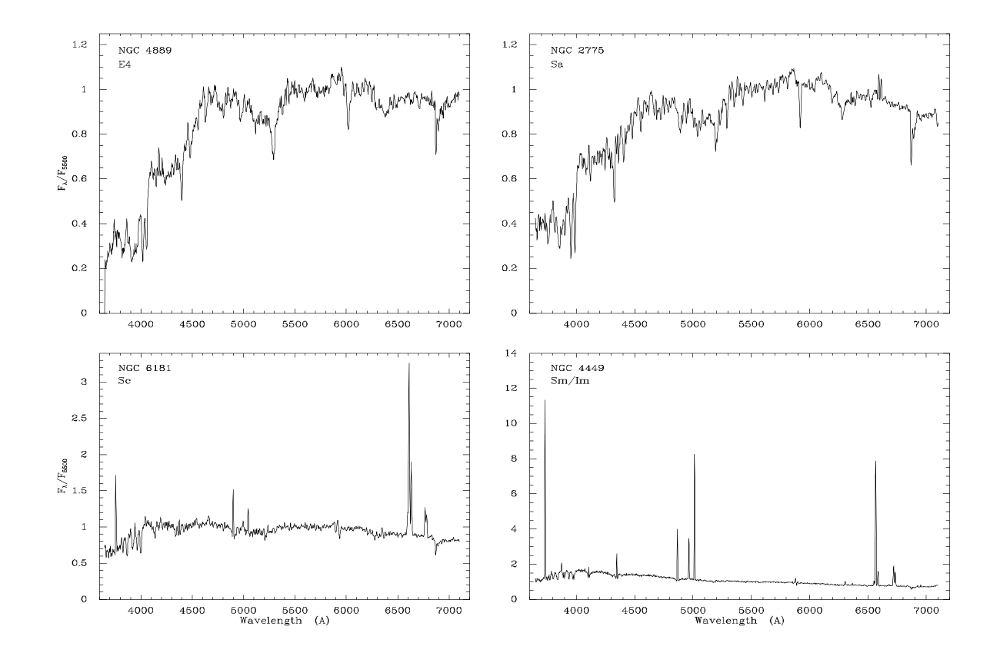
*Star formation rate surface density vs gas surface density from Kennicutt (1998).*

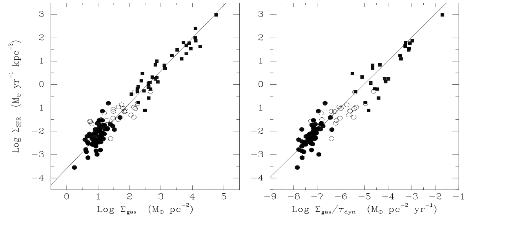
*The Kennicutt-Schmidt Law - Sigma_SFR proportional to Sigma_gas^N with N = 1.4 +/- 0.15.*

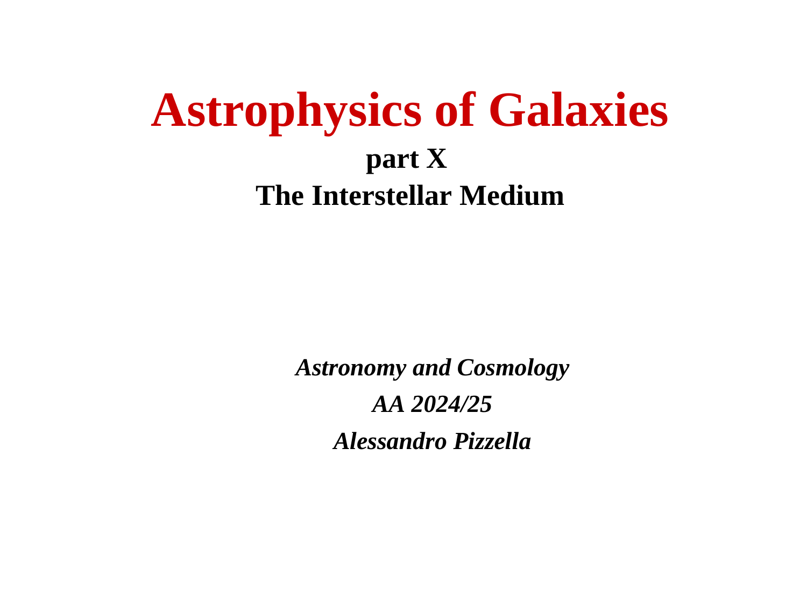
*Lecture 10 - The Interstellar Medium of Galaxies (Prof. Alessandro Pizzella).*

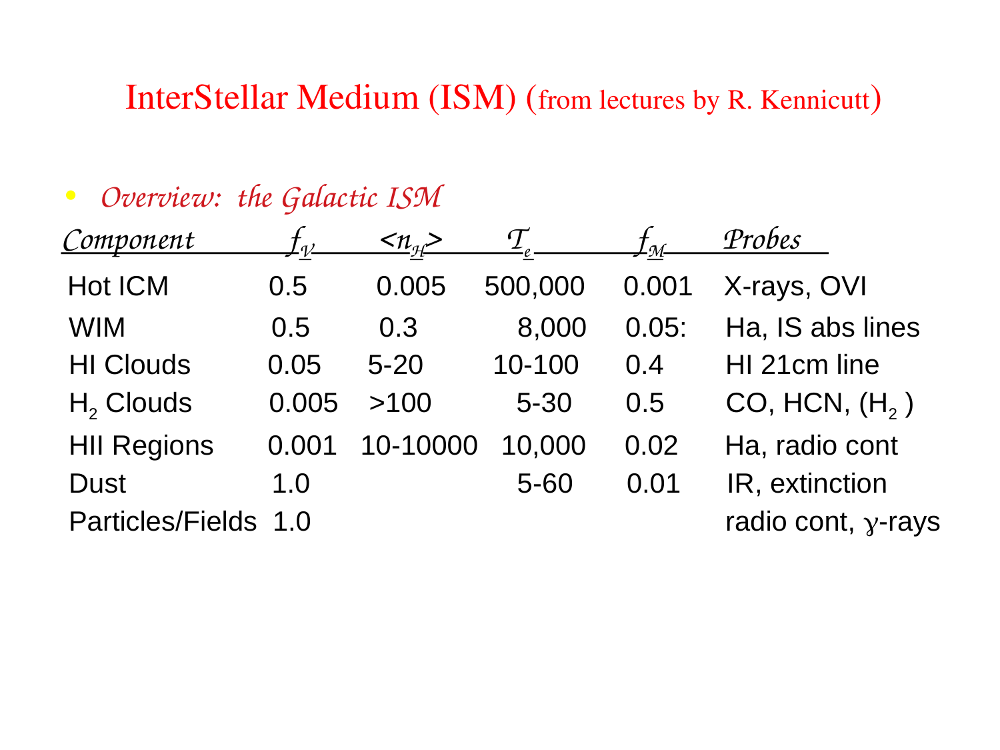
*Total gas surface density Sigma_gas = Sigma_HI + Sigma_H2.*

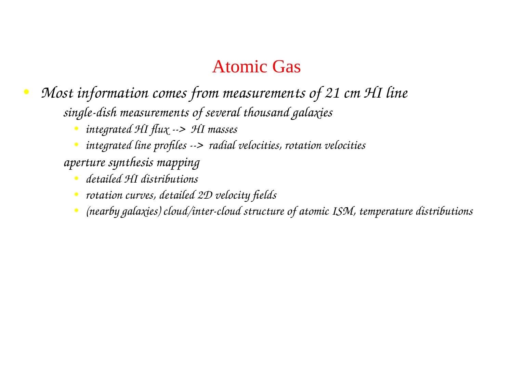
*Depletion timescale t_dep = Sigma_gas / Sigma_SFR ~ 1-2 Gyr in normal spirals.*

---

## 10. Lecture Slides and Reference Figures (Prof. Alessandro Pizzella)

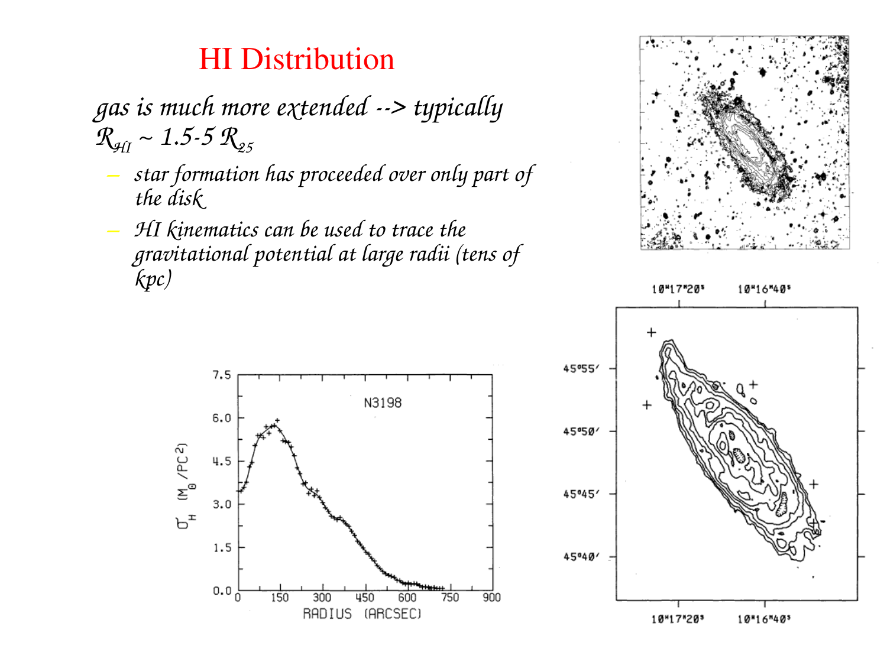

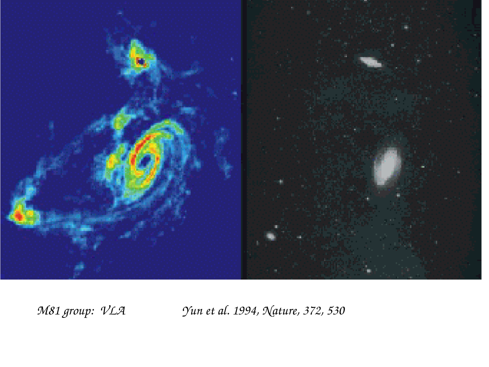

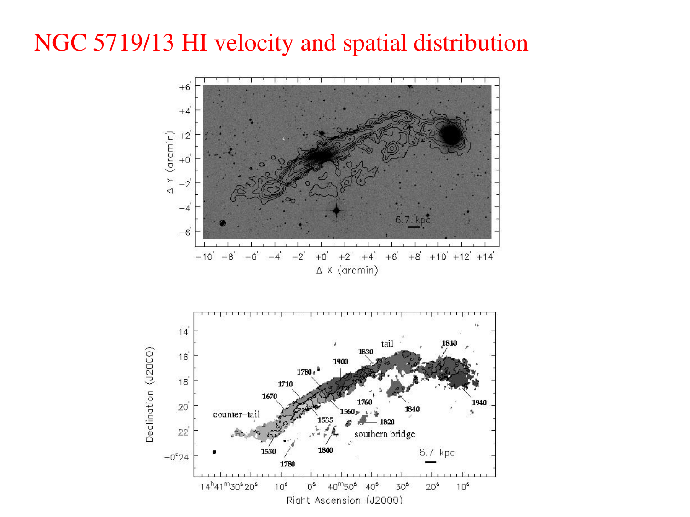

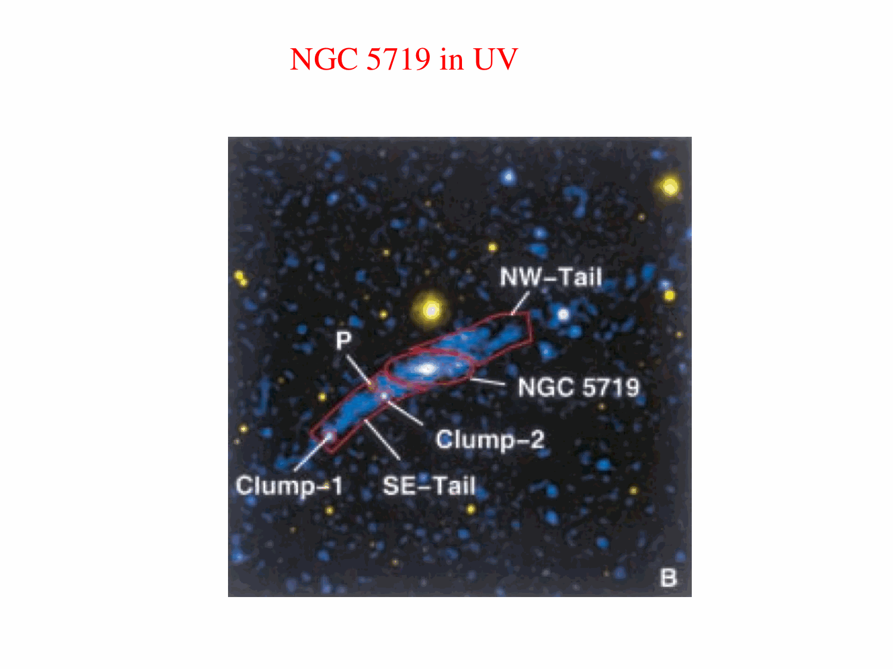

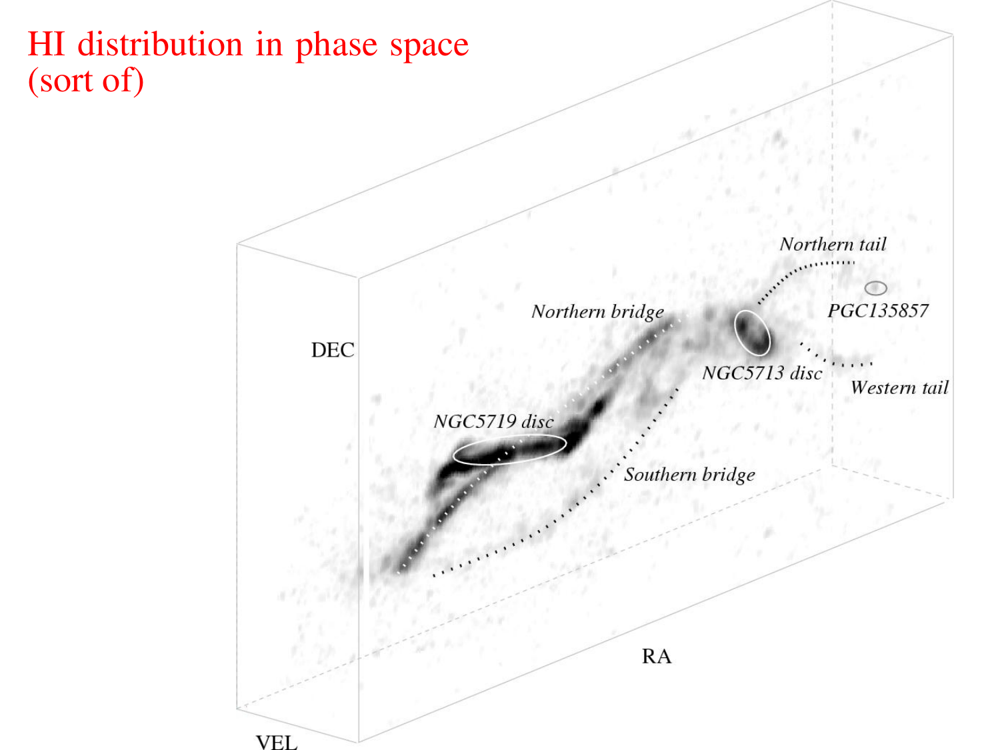

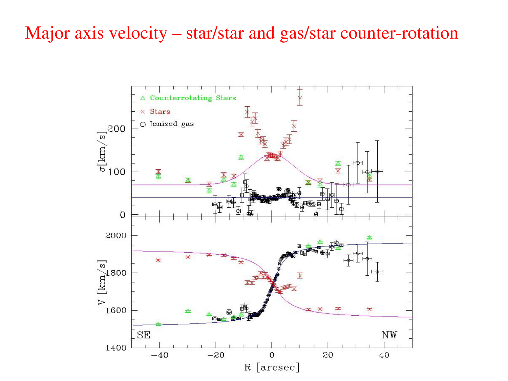

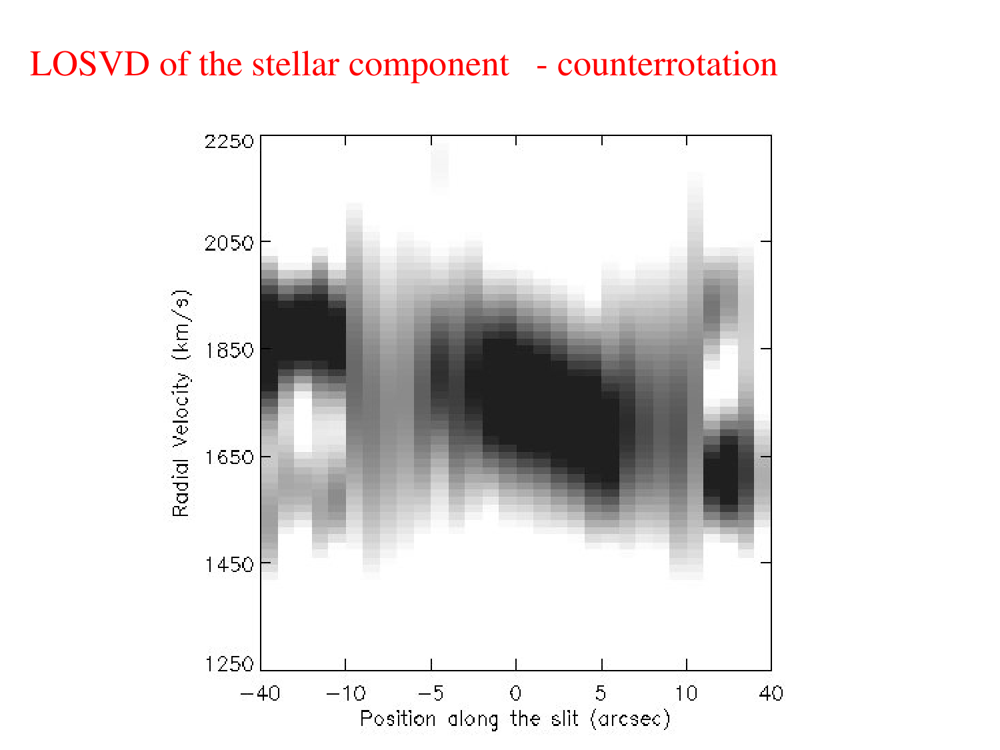

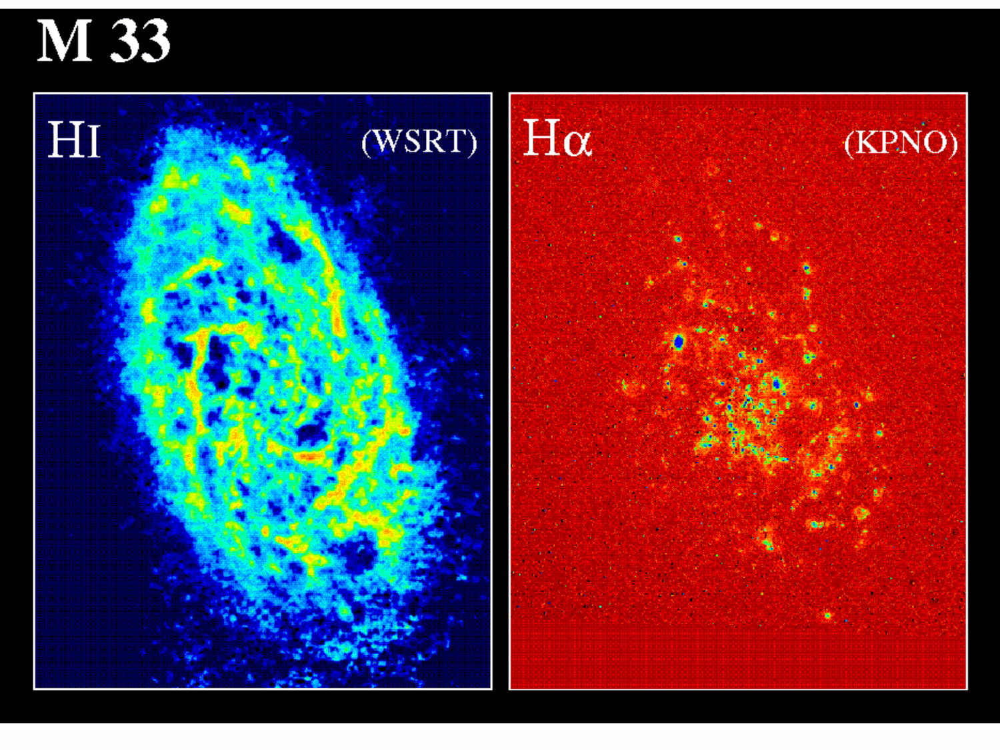

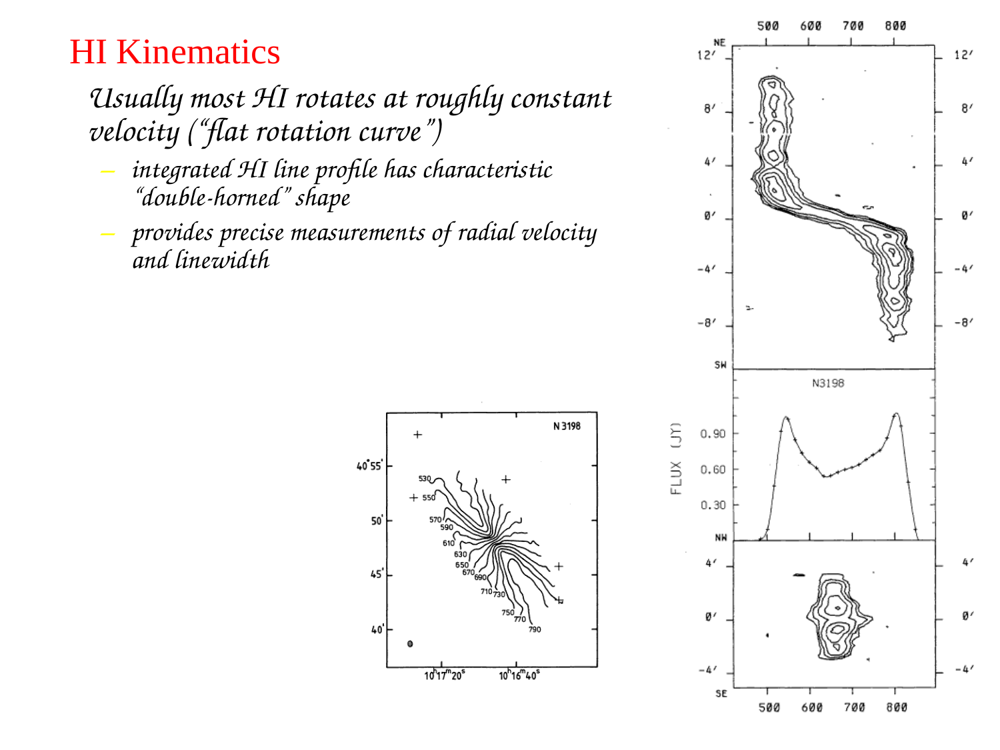


## Linked References

- [[Dark matter rotation curves]]
- [[Galaxy main sequence of star formation]]
- [[Galaxy morphology vs physical properties]]
- [[Green valley and quenching tracks]]
- [[H I regions]]
- [[H II region spectroscopy]]
- [[Low surface brightness galaxies]]
- [[Madau plot]]
- [[Molecular clouds]]
- [[Photodissociation regions PDRs]]
- [[UV luminosity function]]
- [[Astrophysics_of_Galaxies_MOC]]
- [[Observational_Cosmology_MOC]]


