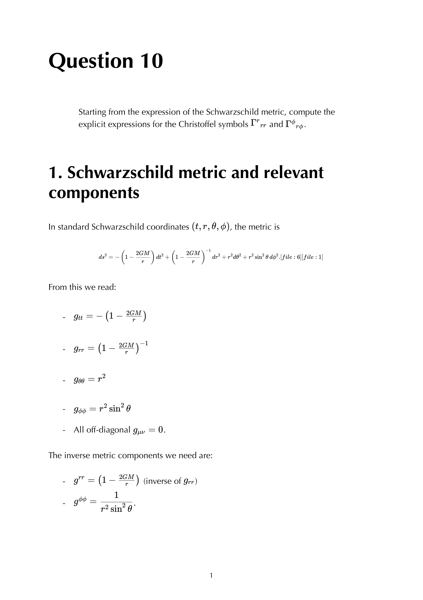


the **Schwarzschild metric** describes the spacetime outside a non-rotating, spherically-symmetric mass $M$. it's the simplest non-trivial vacuum solution of Einstein's equations (Schwarzschild 1916) and the model for stars, planets, and non-rotating black holes.

## the metric

$$\boxed{\, ds^2 = -\left(1 - \frac{2GM}{r}\right)dt^2 + \left(1 - \frac{2GM}{r}\right)^{-1}dr^2 + r^2 d\Omega^2 \,}$$

with $d\Omega^2 = d\theta^2 + \sin^2\theta\,d\phi^2$, the round-2-sphere metric. signature $(-, +, +, +)$.

setting $r_s = 2GM$ (the **Schwarzschild radius**), the coefficient becomes $1 - r_s/r$.

## key features

- **asymptotically flat**: at $r \to \infty$, $g \to \eta$ (Minkowski).
- **two killing vectors**: $\partial_t$ (static) and $\partial_\phi$ (axisymmetric, plus full sphere of rotations).
- **vacuum**: $R_{\mu\nu} = 0$ for $r > 0$.
- **two special radii**: $r = 0$ (true singularity) and $r = 2GM$ (event horizon, coordinate singularity).

## the assumptions (Birkhoff theorem)

Schwarzschild is the **unique** spherically-symmetric vacuum solution. **Birkhoff's theorem**: any spherically symmetric vacuum solution is asymptotically flat, static, and Schwarzschild. so a pulsating spherical star produces no GW outside it; the exterior is Schwarzschild at all times.

## physical predictions (all confirmed)

1. **gravitational redshift**: a photon climbing out of the gravitational well has its frequency reduced by factor $\sqrt{1 - 2GM/r_{\rm emit}}/\sqrt{1 - 2GM/r_{\rm obs}}$. measured in the Pound-Rebka experiment 1959 + GPS satellites + Mercury surface.
2. **perihelion precession** of Mercury: $43''$/century, the missing piece in Newtonian theory.
3. **light deflection**: $1.75''$ at the solar limb. confirmed by Eddington 1919.
4. **innermost stable circular orbit (ISCO)** at $r = 6GM$. inner edge of accretion disks; observable.
5. **photon sphere** at $r = 3GM$. unstable circular photon orbit; the bright ring in EHT images.
6. **event horizon** at $r = 2GM$. one-way membrane.

## limits

at large $r$: the metric reduces to flat plus a small Newtonian-potential perturbation, $g_{00} \approx -(1 + 2\Phi/c^2)$ with $\Phi = -GM/r$. this is how Schwarzschild reproduces Newtonian gravity in the weak-field limit.

at $r = 2GM$: the **horizon**. a one-way membrane, not a singularity (Riemann tensor is finite there). coordinate change to Eddington-Finkelstein or Kruskal removes the apparent singularity.

at $r = 0$: a **true curvature singularity**. Kretschmann scalar $R_{\mu\nu\rho\sigma}R^{\mu\nu\rho\sigma} = 48 G^2 M^2/r^6 \to \infty$. spacetime ends.

## scales

for typical objects (with $r_s = 2GM$):
- **Sun**: $r_s = 2.95$ km. solar surface at $7\times 10^5$ km, so we're far from BH regime.
- **Earth**: $r_s = 8.87$ mm.
- **stellar BH** ($10\,M_\odot$): $r_s = 30$ km.
- **galactic centre BH** (Sgr A$^\star$, $4 \times 10^6\,M_\odot$): $r_s = 1.2 \times 10^7$ km, slightly bigger than the Sun.
- **supermassive BH** (e.g. M87, $6.5\times 10^9\,M_\odot$): $r_s = 2 \times 10^{10}$ km, ~$120$ AU.

## see also

- [Birkhoff theorem](./Birkhoff%20theorem.html)
- [Schwarzschild Christoffels](./Schwarzschild%20Christoffels.html)
- [Schwarzschild horizon](./Schwarzschild%20horizon.html)
- [Schwarzschild effective potential](./Schwarzschild%20effective%20potential.html)
- [Circular orbits in Schwarzschild](./Circular%20orbits%20in%20Schwarzschild.html)
- [Photon sphere](./Photon%20sphere.html)
- [Radial infall](./Radial%20infall.html)
- [Photon trajectories and impact parameter](./Photon%20trajectories%20and%20impact%20parameter.html)
- [Perihelion precession](./Perihelion%20precession.html)
- [Light deflection](./Light%20deflection.html)
- [Eddington-Finkelstein and Kruskal](./Eddington-Finkelstein%20and%20Kruskal.html)
- Q11 - selected Schwarzschild Christoffels
- Q12 - circular orbits and orbital frequency
- Q13 - radial infall and proper time
- Q14 - photon trajectory and impact parameter
- [General_Relativity_MOC](../../04_Atlas/General_Relativity_MOC.html)
- [Ch 5 - The Einstein Equation](../../02_Literature/Book/Baumann%20GR/Ch%205%20-%20The%20Einstein%20Equation.html)
- [Ch 6 - Black Holes](../../02_Literature/Book/Baumann%20GR/Ch%206%20-%20Black%20Holes.html)

---

### General Relativity Mathematical & Oral Defense Panel

*Question 10 Oral Exam Model Solution: Schwarzschild metric in standard coordinates, explicit calculation of Christoffel symbols $\Gamma^r_{rr} = -\frac{GM}{r^2(1 - 2GM/r)}$ and $\Gamma^r_{\phi\phi} = -r(1 - 2GM/r)\sin^2\theta$.*

*Cambridge Lecture Diagram: Flamm paraboloid spatial embedding of the Schwarzschild geometry exterior to the event horizon.*


  <h4 class="backlinks-title">Linked References (23)</h4>
  <ul class="backlinks-list">
    <li class="backlink-item-wrap"><a href="./Birkhoff%20theorem.html" class="backlink-item">Birkhoff theorem</a></li>
    <li class="backlink-item-wrap"><a href="../../02_Literature/Book/Baumann%20GR/Ch%201%20-%20Gravity%20is%20Geometry.html" class="backlink-item">Ch 1 - Gravity is Geometry</a></li>
    <li class="backlink-item-wrap"><a href="../../02_Literature/Book/Baumann%20GR/Ch%203%20-%20A%20First%20Look%20at%20Geodesics.html" class="backlink-item">Ch 3 - A First Look at Geodesics</a></li>
    <li class="backlink-item-wrap"><a href="../../02_Literature/Book/Baumann%20GR/Ch%205%20-%20The%20Einstein%20Equation.html" class="backlink-item">Ch 5 - The Einstein Equation</a></li>
    <li class="backlink-item-wrap"><a href="../../02_Literature/Book/Baumann%20GR/Ch%206%20-%20Black%20Holes.html" class="backlink-item">Ch 6 - Black Holes</a></li>
    <li class="backlink-item-wrap"><a href="./Circular%20orbits%20in%20Schwarzschild.html" class="backlink-item">Circular orbits in Schwarzschild</a></li>
    <li class="backlink-item-wrap"><a href="./Eddington-Finkelstein%20and%20Kruskal.html" class="backlink-item">Eddington-Finkelstein and Kruskal</a></li>
    <li class="backlink-item-wrap"><a href="./Effective%20potential%20approach.html" class="backlink-item">Effective potential approach</a></li>
    <li class="backlink-item-wrap"><a href="./Einstein%20equations.html" class="backlink-item">Einstein equations</a></li>
    <li class="backlink-item-wrap"><a href="../../04_Atlas/General_Relativity_MOC.html" class="backlink-item">General_Relativity_MOC</a></li>
    <li class="backlink-item-wrap"><a href="./Gravitational%20lensing%20-%20intro.html" class="backlink-item">Gravitational lensing - intro</a></li>
    <li class="backlink-item-wrap"><a href="./Killing%20vectors%20and%20conserved%20quantities.html" class="backlink-item">Killing vectors and conserved quantities</a></li>
    <li class="backlink-item-wrap"><a href="./Light%20deflection.html" class="backlink-item">Light deflection</a></li>
    <li class="backlink-item-wrap"><a href="./Manifold%20metric%20and%20signature.html" class="backlink-item">Manifold metric and signature</a></li>
    <li class="backlink-item-wrap"><a href="./Newtonian%20limit%20of%20GR.html" class="backlink-item">Newtonian limit of GR</a></li>
    <li class="backlink-item-wrap"><a href="./Perihelion%20precession.html" class="backlink-item">Perihelion precession</a></li>
    <li class="backlink-item-wrap"><a href="./Photon%20sphere.html" class="backlink-item">Photon sphere</a></li>
    <li class="backlink-item-wrap"><a href="./Photon%20trajectories%20and%20impact%20parameter.html" class="backlink-item">Photon trajectories and impact parameter</a></li>
    <li class="backlink-item-wrap"><a href="./Radial%20infall.html" class="backlink-item">Radial infall</a></li>
    <li class="backlink-item-wrap"><a href="./Schwarzschild%20Christoffels.html" class="backlink-item">Schwarzschild Christoffels</a></li>
    <li class="backlink-item-wrap"><a href="./Schwarzschild%20effective%20potential.html" class="backlink-item">Schwarzschild effective potential</a></li>
    <li class="backlink-item-wrap"><a href="./Schwarzschild%20horizon.html" class="backlink-item">Schwarzschild horizon</a></li>
    <li class="backlink-item-wrap"><a href="./Trace-reversed%20Einstein%20equations.html" class="backlink-item">Trace-reversed Einstein equations</a></li>
  </ul>

