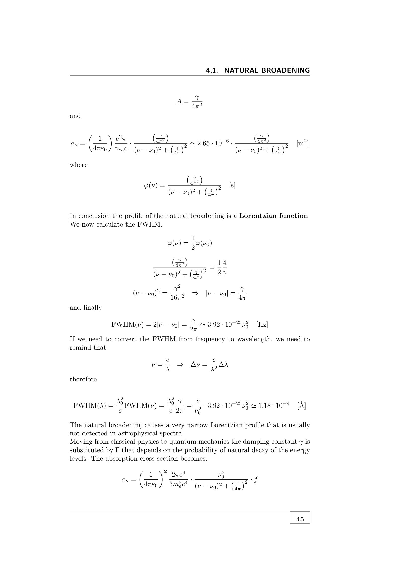

not every transition between two atomic states is allowed. **selection rules** determine which transitions occur via electric dipole (E1, the strongest), and which require weaker mechanisms (M1, E2, multi-photon). a frequent oral question.

## electric dipole (E1) selection rules

valid in LS coupling, electric dipole approximation:

1. **$\Delta n$**: any value (no restriction).
2. **parity must change**: $e \leftrightarrow o$. equivalently, $\Delta(\sum_i \ell_i) = \pm 1, \pm 3, \dots$.
3. **$\Delta \ell = \pm 1$** for the jumping electron (one-electron jump only).
4. **$\Delta L = 0, \pm 1$** but not $0 \to 0$.
5. **$\Delta J = 0, \pm 1$** but not $0 \to 0$.
6. **$\Delta M_J = 0, \pm 1$** but not $0 \to 0$ if $\Delta J = 0$.
7. **$\Delta S = 0$** (no spin flip; total spin is preserved in LS coupling).

so a permitted E1 transition is one that:
- changes parity.
- changes one electron's $\ell$ by $\pm 1$.
- preserves total spin $S$.
- changes $L$ by $0$ or $\pm 1$ (excluding $0 \to 0$).
- changes $J$ by $0$ or $\pm 1$ (excluding $0 \to 0$).

violations: forbidden lines.

## weaker mechanisms

### magnetic dipole (M1)
$\sim 10^5$ times weaker than E1.
- parity preserved (both states same parity).
- $\Delta L = 0$, $\Delta S = 0$, $\Delta J = 0, \pm 1$.

example: $[OIII]\,\lambda 4959, 5007$ ($^3P_{1,2} \to {^1\!}D_2$): both $^3P$ and $^1D$ are even-parity terms of the $2p^2$ configuration. parity-conserving M1 transition. since $A \sim 0.01\,\text{s}^{-1}$ vs $A \sim 10^8\,\text{s}^{-1}$ for permitted lines, these are **forbidden lines**, observable only at very low densities (no collisional de-excitation).

### electric quadrupole (E2)
$\sim 10^8$ times weaker than E1.
- parity preserved.
- $\Delta L = 0, \pm 1, \pm 2$ but not $0 \to 0$, $1/2 \to 1/2$, $0 \to 1$.
- $\Delta J = 0, \pm 1, \pm 2$ similar restrictions.

example: $[SII]$ doublet, partially M1 and partially E2.

### intersystem (semi-forbidden)
$\Delta S \ne 0$ via spin-orbit mixing of the LS-pure states. allowed when LS coupling is not pure (always the case to some extent in heavy atoms). $\sim 10^2$ to $10^5$ weaker than E1.

example: **C IV $\lambda 1909$** semi-forbidden line in AGN, **N III] $\lambda 1750$** in HII regions.

## why forbidden lines exist in nebulae but not labs

at laboratory densities ($n \sim 10^{19}$ cm$^{-3}$), an excited atom in a forbidden state is collisionally de-excited long before it can radiate (lifetime $\sim 1$ s). so the line is suppressed.

at nebular densities ($n \sim 10^2$ to $10^5$ cm$^{-3}$), collisional de-excitation rate is much smaller than the small radiative rate, so the forbidden-line photon escapes. hence "forbidden" lines are abundant and even **bright** in nebulae.

the **critical density** is $n_c = A_{ul}/q_{ul}$. below $n_c$, line is at full strength; above, it is suppressed. forbidden lines have very low $n_c$ ($\sim 10^4$ to $10^7$ cm$^{-3}$), hence the density-diagnostic role of $[SII]\,\lambda 6716/6731$ ratios.

## practical use on the exam

given a transition specified by initial and final term symbols, check:
1. parity flip? (if yes $\to$ E1 candidate).
2. $\Delta\ell = \pm 1$? (E1 requires single-electron jump).
3. $\Delta L, \Delta S, \Delta J$ within rules?

if any rule is violated, identify whether it's M1 (parity preserved + $\Delta L = 0$), E2 ($\Delta J$ up to $\pm 2$), or intersystem ($\Delta S \ne 0$).

## see also

- [Quantum numbers and atomic states](Quantum%20numbers%20and%20atomic%20states.html)
- [Atomic term symbols](Atomic%20term%20symbols.html)
- [Russell-Saunders LS coupling](Russell-Saunders%20LS%20coupling.html)
- [Forbidden vs permitted vs semiforbidden transitions](Forbidden%20vs%20permitted%20vs%20semiforbidden%20transitions.html)
- [Forbidden lines](Forbidden%20lines.html)
- [OIII forbidden lines](OIII%20forbidden%20lines.html)
- [SII forbidden lines](SII%20forbidden%20lines.html)
- [Critical density](Critical%20density.html)
- [Forbidden line diagnostics](Forbidden%20line%20diagnostics.html)

---

### Astronomical Spectroscopy Diagnostic Panels

*Electric dipole (E1) selection rules: $\Delta \ell = \pm 1$, $\Delta L = 0, \pm 1$ ($L=0 \not\to 0$), $\Delta J = 0, \pm 1$ ($J=0 \not\to 0$), $\Delta S = 0$, and strict parity change.*

  <h4 class="backlinks-title">Linked References (17)</h4>
  <ul class="backlinks-list">
    <li class="backlink-item-wrap"><a href="Absorption%20coefficient%20and%20oscillator%20strength.html" class="backlink-item">Absorption coefficient and oscillator strength</a></li>
    <li class="backlink-item-wrap"><a href="Atomic%20term%20symbols.html" class="backlink-item">Atomic term symbols</a></li>
    <li class="backlink-item-wrap"><a href="Energy%20level%20diagrams%20Grotrian.html" class="backlink-item">Energy level diagrams Grotrian</a></li>
    <li class="backlink-item-wrap"><a href="Forbidden%20lines.html" class="backlink-item">Forbidden lines</a></li>
    <li class="backlink-item-wrap"><a href="Forbidden%20vs%20permitted%20vs%20semiforbidden%20transitions.html" class="backlink-item">Forbidden vs permitted vs semiforbidden transitions</a></li>
    <li class="backlink-item-wrap"><a href="Helium%20energy%20levels.html" class="backlink-item">Helium energy levels</a></li>
    <li class="backlink-item-wrap"><a href="Hund%27s%20rules.html" class="backlink-item">Hund's rules</a></li>
    <li class="backlink-item-wrap"><a href="Magnesium%20and%20alkali%20earths.html" class="backlink-item">Magnesium and alkali earths</a></li>
    <li class="backlink-item-wrap"><a href="OIII%20forbidden%20lines.html" class="backlink-item">OIII forbidden lines</a></li>
    <li class="backlink-item-wrap"><a href="Quantum%20numbers%20and%20atomic%20states.html" class="backlink-item">Quantum numbers and atomic states</a></li>
    <li class="backlink-item-wrap"><a href="Russell-Saunders%20LS%20coupling.html" class="backlink-item">Russell-Saunders LS coupling</a></li>
    <li class="backlink-item-wrap"><a href="Rydberg-Ritz%20formula.html" class="backlink-item">Rydberg-Ritz formula</a></li>
    <li class="backlink-item-wrap"><a href="SII%20forbidden%20lines.html" class="backlink-item">SII forbidden lines</a></li>
    <li class="backlink-item-wrap"><a href="Sodium%20and%20alkalis.html" class="backlink-item">Sodium and alkalis</a></li>
    <li class="backlink-item-wrap"><a href="Two-photon%20emission.html" class="backlink-item">Two-photon emission</a></li>
    <li class="backlink-item-wrap"><a href="jj%20coupling.html" class="backlink-item">jj coupling</a></li>
    <li class="backlink-item-wrap"><a href="../../04_Atlas/Astronomical_Spectroscopy_MOC.html" class="backlink-item">Astronomical_Spectroscopy_MOC</a></li>
  </ul>

