two natural ways to define a "day," and they are not the same.

---

## sidereal day

the **sidereal day** is the interval after which the stars return to the same position in the sky.

equivalently: one full rotation of the Earth with respect to the fixed stars — i.e. with respect to the $\gamma$ point.

duration: $23$ h $56$ m $4$ s of solar time.

---

## solar day

the **solar day** is the interval after which the Sun returns to the same position in the sky.

duration: $24$ h, by definition.

---

## why the two differ

while the Earth spins on its axis, it is *also* moving around the Sun. so to bring the Sun back to the same apparent position requires the Earth to rotate slightly more than one full sidereal turn — by an extra $\sim 1°$ per day, since Earth advances about $1°$ in its orbit each day ($360°/365.25 \approx 0.986°$).

that extra little rotation takes about $4$ minutes:
$$\text{solar day} - \text{sidereal day} \approx 3\,\text{m}\,56\,\text{s}$$

so **sidereal time runs about 4 minutes faster per day than solar time**. over a year (365.25 solar days), this offset accumulates to exactly $24$ h — which is why the night sky on a given solar date repeats year after year.

---

## time units for $\alpha$ and $h$

both sidereal time and the hour angle $h$ change at the same rate — that's the whole point of measuring along the celestial equator. it is convenient to express them, and right ascension $\alpha$, in **time units**:

$$24\,\text{h} \leftrightarrow 360°, \qquad 1\,\text{h} \leftrightarrow 15°, \qquad 1\,\text{m} \leftrightarrow 15', \qquad 1\,\text{s} \leftrightarrow 15''$$

so $\alpha = 12$ h means $\alpha = 180°$, and the master relation $\Theta = h + \alpha$ adds time-format quantities directly.

---

## measuring sidereal time in practice

point the telescope at a star of known $(\alpha, \delta)$. read the hour angle $h$ off the hours wheel of the equatorial mount. then
$$\Theta = h + \alpha$$
gives the local sidereal time at that instant.

a sidereal clock at the observatory then keeps track of $\Theta$ continuously. solar clocks are no good for astronomy because they drift by 4 minutes a day.

---

## see also

- [Fundamentals_Astrophysics_Cosmology_MOC](../../04_Atlas/Fundamentals_Astrophysics_Cosmology_MOC.html)
- [Spherical_astronomy_complete](Spherical_astronomy_complete.html)
- [Equatorial system](Equatorial%20system.html)
- Culmination and rise/set

---

## observational astrophysics course slides (Prof. Paolo Cassata)

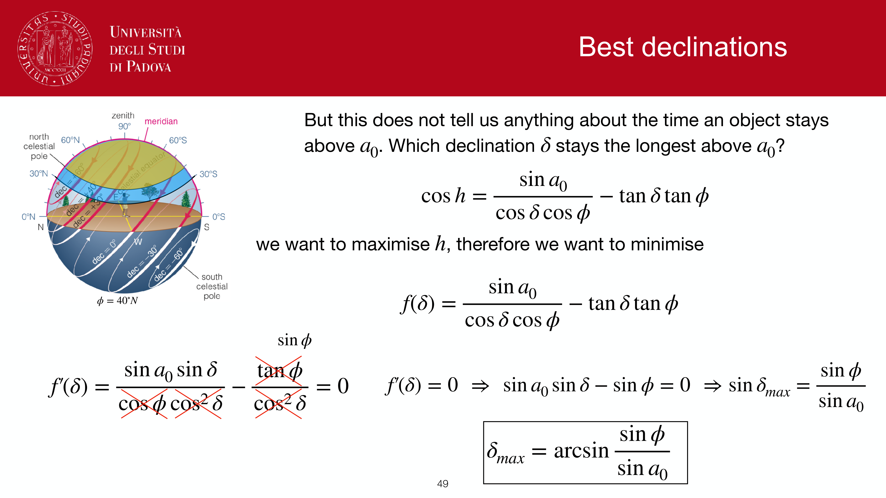
*Sidereal day vs solar day: Earth orbital progression around the Sun.*

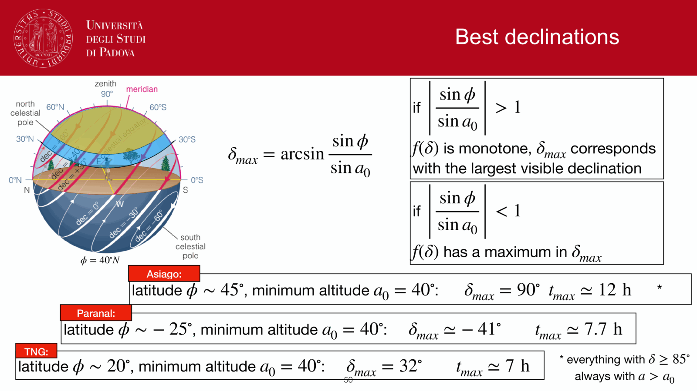
*Sidereal day duration: 23h 56m 04.09s (3m 56s shorter than solar day).*

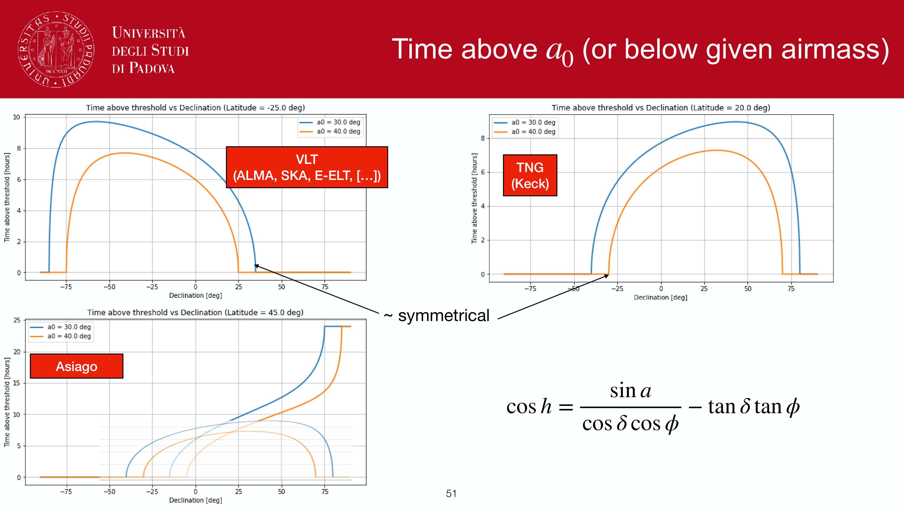
*Apparent solar time vs mean solar time.*

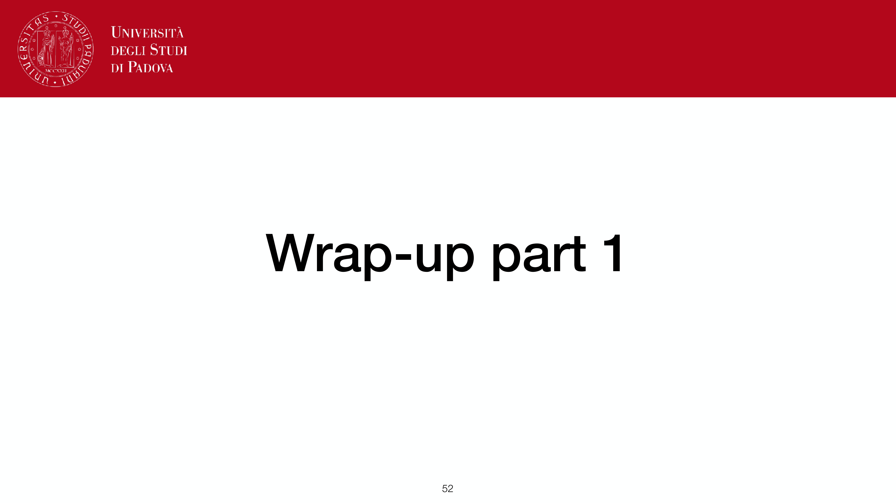
*The Equation of Time (EoT) due to orbital eccentricity and obliquity.*

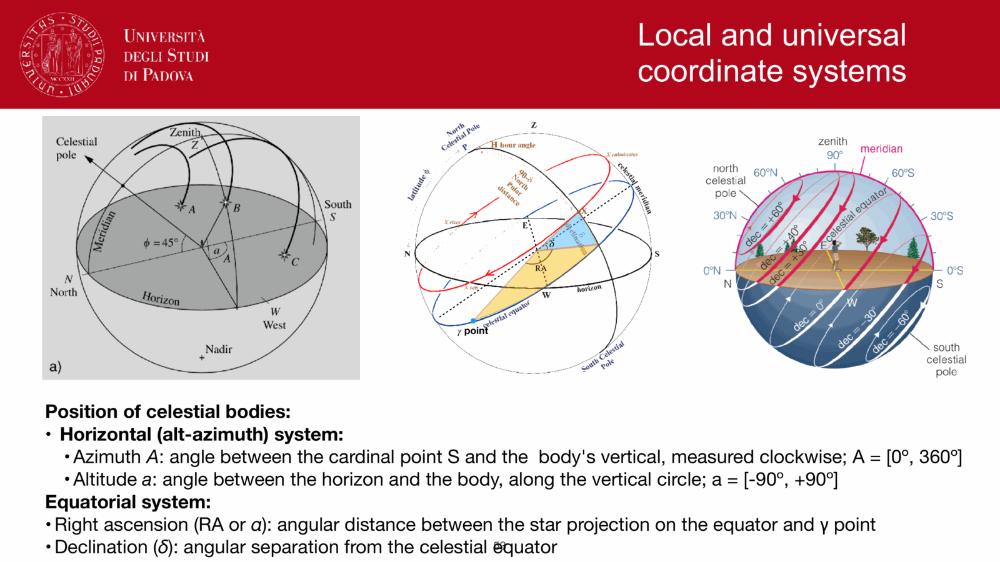
*Local time vs Universal Time (UT).*

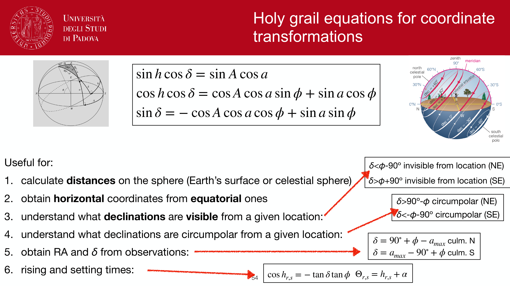
*Greenwich Mean Time (GMT) and definition of time zones.*

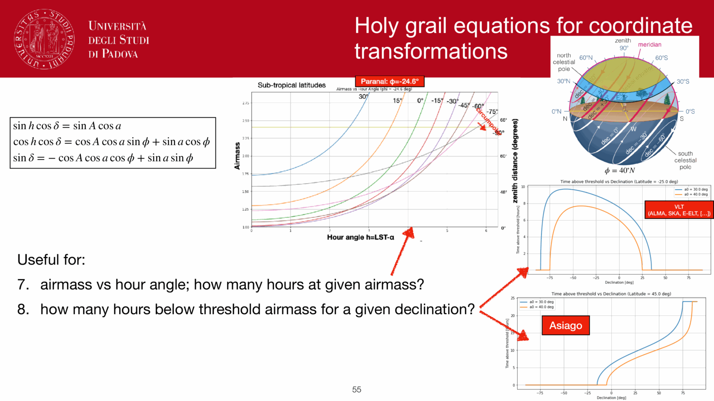
*Local Sidereal Time (LST) calculation from UTC and longitude.*

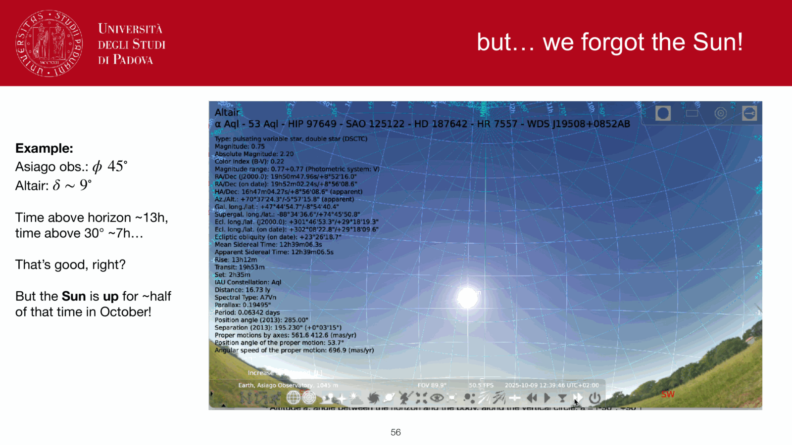
*Solar vs sidereal clock rate difference: 1.0027379.*

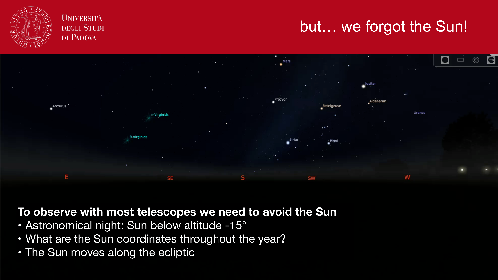
*Practical observation planning using LST and hour angle.*

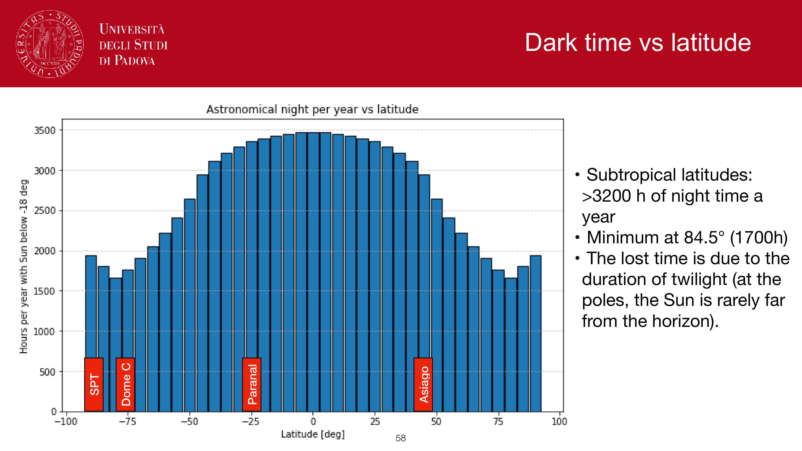
*Airmass vs hour angle curves throughout an observing night.*

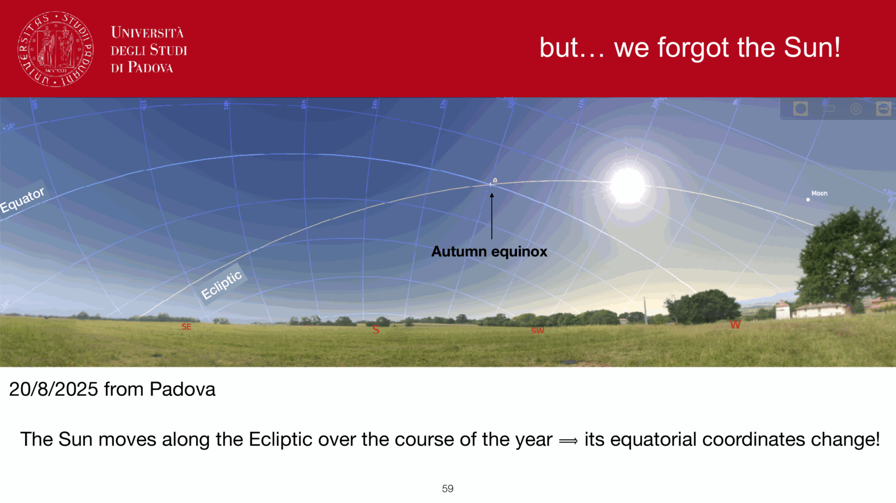
*Summary of time systems in observational astronomy.*

  <h4 class="backlinks-title">Linked References (4)</h4>
  <ul class="backlinks-list">
    <li class="backlink-item-wrap"><a href="Equatorial%20system.html" class="backlink-item">Equatorial system</a></li>
    <li class="backlink-item-wrap"><a href="Time%20keeping%20in%20astronomy.html" class="backlink-item">Time keeping in astronomy</a></li>
    <li class="backlink-item-wrap"><a href="../../04_Atlas/Fundamentals_Astrophysics_Cosmology_MOC.html" class="backlink-item">Fundamentals_Astrophysics_Cosmology_MOC</a></li>
    <li class="backlink-item-wrap"><a href="../../04_Atlas/Observational_Astrophysics_MOC.html" class="backlink-item">Observational_Astrophysics_MOC</a></li>
  </ul>

