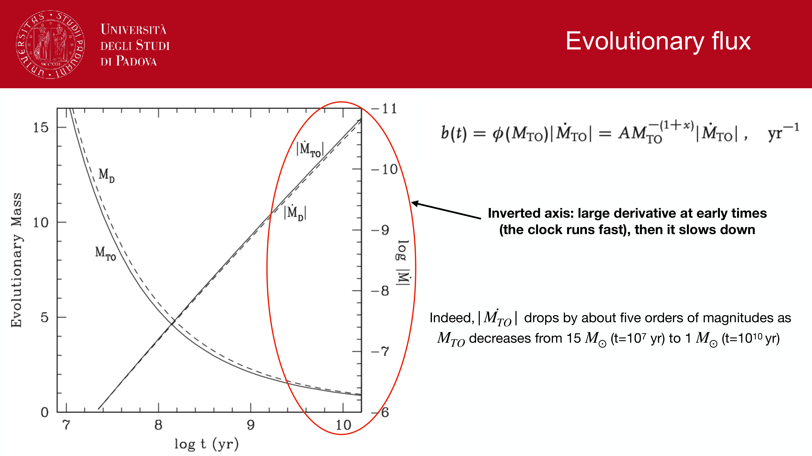
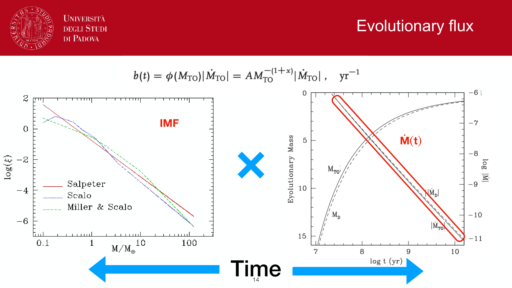
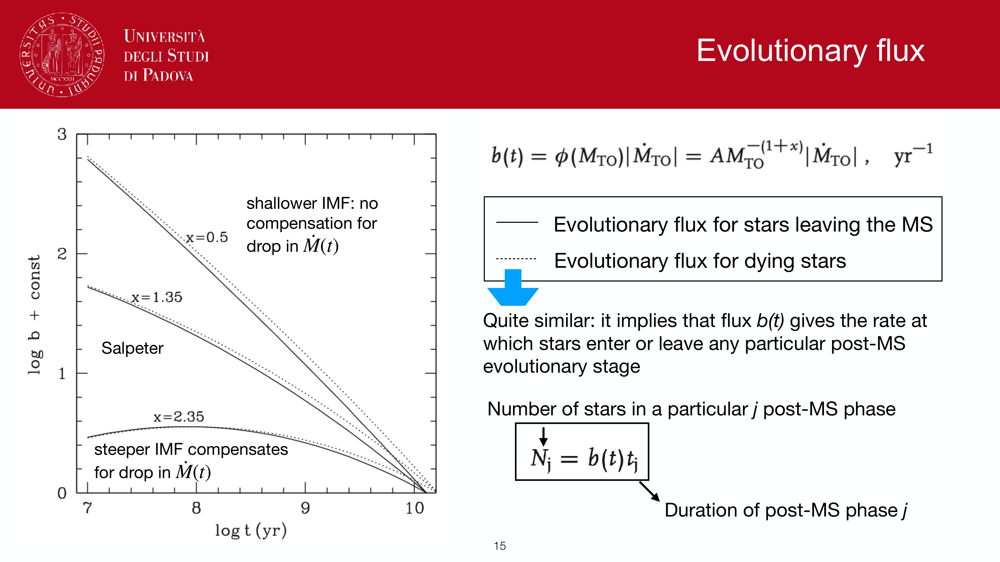
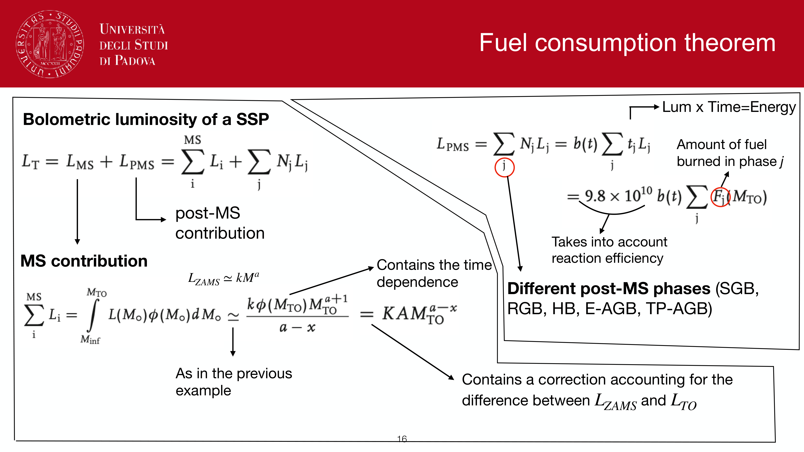
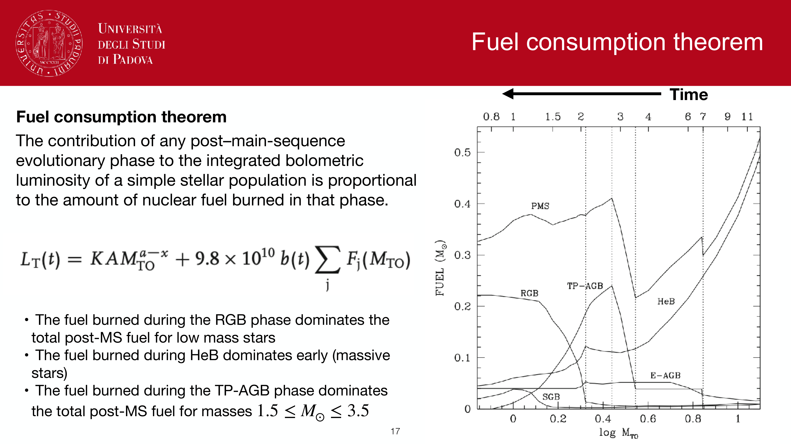
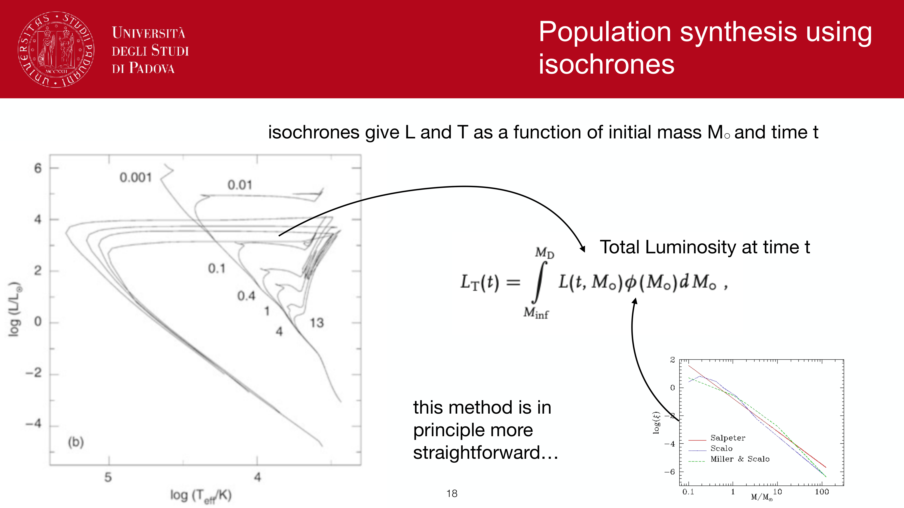

a **single stellar population (SSP)** is an idealized assembly of coeval stars formed instantaneously at $t = 0$ from gas of uniform chemical composition. It represents the elementary "basis function" of **stellar population synthesis (SPS)**: any complex star formation history in an unresolved galaxy can be synthesized by integrating a linear combination of SSPs over time and metallicity.

---

### physical definition

an SSP is governed by three fundamental parameters:
1. **age** $\tau$: the elapsed time since the star formation burst.
2. **chemical composition**: initial metallicity $Z$ (or $[\mathrm{Fe}/\mathrm{H}]$ and $[\alpha/\mathrm{Fe}]$), helium abundance $Y$.
3. **initial mass function (IMF)**: $\xi(M) = dN/dM$, specifying the birth distribution of stellar masses.

once these parameters are fixed, the subsequent evolution of the population is uniquely determined by stellar evolution along **isochrones** in the Hertzsprung-Russell diagram $(T_{\rm eff}, \log g, L_{\rm bol})$.

---

### mathematical construction

the monochromatic luminosity of an SSP of age $\tau$ and initial formed mass $M_0$ is given by integrating over all stars that remain alive at that age:

$$L_\lambda^{\rm SSP}(\tau, Z) = M_0 \int_{M_{\rm min}}^{M_{\rm max}(\tau)} \xi(M)\, f_\lambda(M, \tau, Z)\, dM + L_{\lambda, \rm post-MS}^{\rm SSP}(\tau, Z)$$

where:
- $f_\lambda(M, \tau, Z)$ is the spectral energy distribution of an individual star of initial mass $M$ at evolutionary age $\tau$.
- $M_{\rm min} \approx 0.08\,M_\odot$ is the hydrogen-burning limit.
- $M_{\rm max}(\tau)$ is the **turn-off mass** ($M_{\rm TO} \approx (t_{\rm MS} / 10\,{\rm Gyr})^{-0.4}\,M_\odot$), above which stars have completed their main-sequence lifespans.
- $L_{\lambda, \rm post-MS}^{\rm SSP}$ integrates luminous post-main sequence evolutionary phases (RGB, Red Clump / horizontal branch, AGB, TP-AGB, and white dwarfs).

---

### stellar mass loss and return fraction

stars do not retain their initial birth mass. High-mass stars explode as core-collapse supernovae, and intermediate-mass stars expel their envelopes during the AGB phase, returning processed gas to the interstellar medium (ISM).

the surviving stellar mass $M_*(\tau)$ at age $\tau$ is:

$$M_*(\tau) = M_0 \left[ 1 - R(\tau) \right]$$

where $R(\tau)$ is the **returned mass fraction**:
- for a standard Chabrier (2003) or Kroupa (2001) IMF, $R(\tau) \approx 0.30$ at $\tau = 100$ Myr, reaching $R(\tau) \approx 0.40\text{--}0.45$ by $\tau = 10$ Gyr.
- for a Salpeter (1955) IMF with its excess of low-mass stars, $R(\tau) \approx 0.28\text{--}0.32$ at 10 Gyr.
- accounting for $R(\tau)$ is essential when distinguishing between **formed stellar mass** $M_{\rm form} \equiv \int \psi(t) dt$ and **current surviving stellar mass** $M_*$.

---

### spectral evolution across cosmic time

as an SSP ages, the turn-off moves toward lower masses, causing the integrated light to undergo severe dimming and progressive reddening:

| age $\tau$ | turn-off mass $M_{\rm TO}$ | dominant luminous phase | key spectral diagnostics | representative astrophysical object |
|---|---|---|---|---|
| $1\text{--}5$ Myr | $\sim 40\text{--}60\,M_\odot$ | O and early B dwarfs / supergiants | Intense Lyman continuum ($h\nu \ge 13.6$ eV), P-Cygni UV lines ($\mathrm{C\,IV}$, $\mathrm{Si\,IV}$), flat UV continuum | Young H II regions, intense starbursts |
| $10\text{--}50$ Myr | $\sim 8\text{--}15\,M_\odot$ | Late B and early A stars, red supergiants (RSG) | Vanishing ionizing flux, optical metal lines emerge, RSG NIR molecular bands | Young open clusters, post-starburst regions |
| $100\text{--}800$ Myr | $\sim 2\text{--}5\,M_\odot$ | A-type main-sequence stars | **Balmer break** at $3646$ Å reaches maximum strength; deep Balmer absorption lines ($\mathrm{H}\delta, \mathrm{H}\gamma$) | "E+A" / post-starburst galaxies |
| $1\text{--}2$ Gyr | $\sim 1.5\text{--}2\,M_\odot$ | Intermediate-mass AGB / **TP-AGB** | Strong NIR continuum peak ($1.6\,\mu\mathrm{m}$ $H$-band bump), carbon-star molecular features | Intermediate-age Magellanic Cloud clusters |
| $> 3$ Gyr | $\le 1.1\,M_\odot$ | Red giant branch (RGB), Horizontal branch, G/K dwarfs | **$4000$ Å break** ($D_n4000 \gtrsim 1.7$), deep metal absorption ($\mathrm{Ca\,II\ H+K}$, $\mathrm{Mg}_b$, $\mathrm{Fe5270}$) | Globular clusters, giant elliptical galaxies |

---

### evolution of mass-to-light ratio $\Upsilon$

the bolometric and bandpass luminosity of an SSP drops sharply with age, whereas mass decreases only modestly:

$$\Upsilon_\lambda(\tau) \equiv \frac{M_*(\tau)}{L_\lambda(\tau)}$$

- **optical bands ($U, B, V$)**: $\Upsilon_V$ increases by more than a factor of $\sim 100$ between $10$ Myr and $10$ Gyr ($\Upsilon_V \propto \tau^{0.7\text{--}0.9}$). Optical light is completely dominated by the youngest stellar generation present.
- **near-infrared ($K$-band, $2.2\,\mu\mathrm{m}$)**: in old populations ($\tau \gtrsim 2$ Gyr), $L_K$ is dominated by the light of low-mass red giant branch stars, whose luminosity density tracks the total surviving stellar mass. $\Upsilon_K$ varies by less than $\sim 30\%$ over the age range $2\text{--}10$ Gyr, making NIR photometry the most robust tracer of galaxy stellar mass.

---

### composite stellar populations (CSPs)

real galaxies undergo extended star formation histories $\psi(t)$ and progressive chemical enrichment $Z(t)$. The integrated composite SED is computed as a continuous convolution over the single stellar population library:

$$L_\lambda^{\rm CSP}(t) = \int_0^t \psi(t - \tau)\,L_\lambda^{\rm SSP}(\tau, Z(\tau))\,d\tau$$

---

## see also

- [[Observational_Astrophysics_MOC]]
- [[Stellar_Astrophysics_MOC]]
- [[Stellar population synthesis]]
- [[SPS code families]]
- [[Initial mass function]]
- [[Stellar populations I II III]]
- [[Color-magnitude diagrams of clusters]]
- [[Cluster ages from CMD turnoff]]
- [[Lick indices]]
- [[Age-metallicity degeneracy]]
- [[Star formation history of a population]]
- [[Mass-luminosity relation]]
- [[Stellar mass estimation in unresolved populations]]

---

## observational astrophysics course slides (Prof. Paolo Cassata)

*Simple Stellar Population (SSP): single coeval generation of stars with uniform metallicity.*

*Mathematical SSP definition: L_lambda,SSP(t, Z) = int_M_min^M_max(t) L_lambda(M, t, Z) * xi(M) dM.*

*Three fundamental pillars of an SSP model: Isochrone grid, Stellar spectral library, IMF.*

*Theoretical stellar atmospheres (Kurucz ATLAS9, MARCS) vs empirical libraries (MILES, ELODIE).*

*Empirical library advantages (real stellar physics, accurate line profiles) and limitations (solar neighborhood bias).*

*Evolution of SSP spectrum from 1 Myr to 14 Gyr.*

## Linked References

- [[Age estimation in unresolved populations]]
- [[Age-metallicity degeneracy]]
- [[Age-metallicity relation of Galactic GCs]]
- [[Asymptotic giant branch AGB]]
- [[Binary stars in CMD]]
- [[Blue stragglers in star clusters]]
- [[CMD constraints on disk vs halo populations]]
- [[Calcium and CaII H+K]]
- [[Calcium population vs T]]
- [[Dust attenuation in synthetic populations]]
- [[Extended main sequence turn-off eMSTO]]
- [[Extragalactic star clusters]]
- [[Globular clusters as SSP laboratories]]
- [[H-alpha SFR tracer]]
- [[IMF from cluster luminosity functions]]
- [[Initial mass function]]
- [[Initial vs present-day mass function]]
- [[Interstellar reddening and the reddening vector]]
- [[Isochrones and isochrone fitting]]
- [[Lick indices]]
- [[Mass-luminosity relation]]
- [[Metallicity and chemical evolution]]
- [[Multiple populations in GCs discovery]]
- [[Open clusters as young SSP laboratories]]
- [[Photometric redshifts]]
- [[Resolved vs unresolved stellar populations]]
- [[SED fitting basics]]
- [[SPS code families]]
- [[Star cluster types]]
- [[Star formation history of a population]]
- [[Stellar evolutionary phases on the CMD]]
- [[Stellar mass estimation in unresolved populations]]
- [[Stellar mass function xi(M)]]
- [[Stellar population synthesis]]
- [[Thermal continuum from stellar photosphere]]
- [[Observational_Astrophysics_MOC]]
- [[Stellar_Astrophysics_MOC]]

