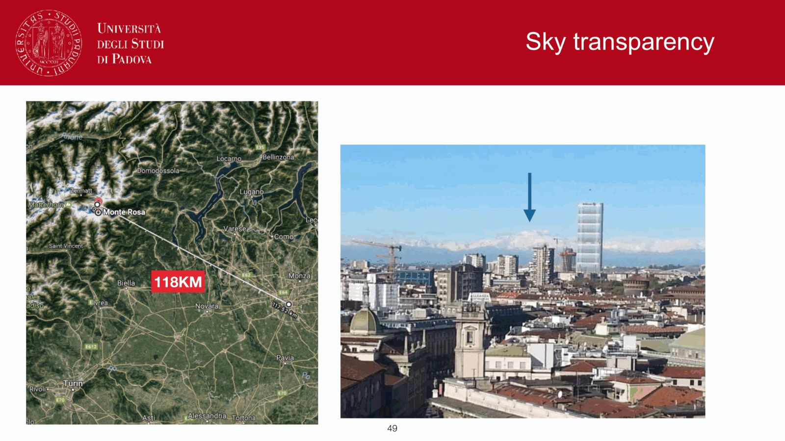
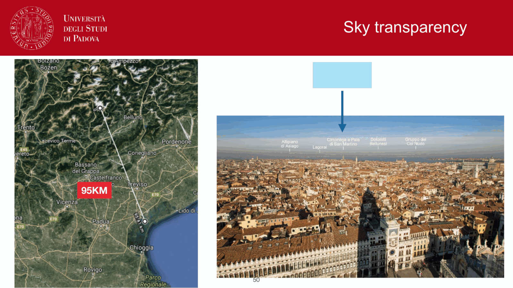

the night sky is **not black**. several physical sources contribute background photons that show up in every astronomical exposure. understanding sky brightness sets exposure-time calculations and decides whether faint-source science is feasible.

## the components

| source | dominant band | character |
|---|---|---|
| **moonlight** | optical (especially blue) | scaled with lunar phase, scattered by atmosphere |
| **airglow** | NIR + visible | atmospheric chemiluminescence |
| **zodiacal light** | visible + NIR | sunlight scattered by interplanetary dust |
| **thermal sky** | mid-IR + sub-mm | $\sim 270$ K ambient atmosphere |
| **diffuse Galactic light** | UV + visible | starlight scattered by ISM dust |
| **light pollution** | optical | urban Hg, Na, LED lamps; site-specific |

## moonlight

the Moon's reflected sunlight is scattered by the atmosphere into the sight line, brightening the entire night sky. depends on:
- **phase**: full moon $\Delta V \sim 4$ mag/arcsec$^2$ brighter than dark sky; new moon negligible.
- **angular separation** from target: closer = brighter contamination.
- **wavelength**: scattering is bluer; moonlight fattens U and B bands more than R, I.

practical rule: schedule deep imaging of faint targets near new moon, bright targets like $z < 0.3$ galaxies near full moon if needed.

## airglow

upper-atmosphere chemiluminescence, mainly:
- **OH bands** at $\sim 1$ to $2.5\,\mu$m (the dominant NIR sky line forest).
- **sodium D** at $589$ nm.
- $[OI]$ green line at $557.7$ nm and red lines at $630$ nm.
- N$_2$ first-positive bands.

emitted from the mesosphere ($\sim 90$ km) and varies with solar activity, latitude, and time of night. for NIR ground-based work, OH lines are the **dominant noise source** between filters. inter-OH "windows" are exploited for high-precision NIR spectroscopy.

## zodiacal light

sunlight scattered by interplanetary dust ($\sim 0.1$ to $100\,\mu$m grains) lying near the ecliptic plane. surface brightness $\sim 22$ to $24$ mag/arcsec$^2$ at the ecliptic, decreasing with ecliptic latitude.
- minimum at ecliptic poles: best fields for deep imaging.
- thermal emission from the same dust dominates mid-IR $\sim 10$ to $30\,\mu$m sky background.

## thermal sky

at $\lambda > 2.5\,\mu$m the atmosphere itself glows like a blackbody at $\sim 270$ K. by Wien, the peak is around $11\,\mu$m; in the K-band $(2.2\,\mu$m$)$ this is already significant. consequences:
- **K-band noise floor** is set by thermal emission of the telescope + atmosphere. cold telescopes (cooled mirrors, cold instruments) help.
- **mid-IR** is hopeless from the ground without cryogenic instruments.
- **far-IR** is hopeless from anywhere except space.

## typical numbers

dark site, no moon, in V band: $\mu_V \approx 21.7$ mag/arcsec$^2$. in B: $\mu_B \approx 22.7$. in K: $\mu_K \approx 13.5$ mag/arcsec$^2$ (thermal!).

light-polluted urban: $\mu_V \approx 18$ mag/arcsec$^2$, **about $30\times$ brighter** than dark.

at Mauna Kea, Cerro Paranal, La Palma: $\mu_V \approx 21.7$ to $22.0$ mag/arcsec$^2$, dark moonless conditions.

## practical consequence: sky-limited regime

for faint sources, photon noise from sky pixels dominates the noise budget (see [CCD detectors and SNR](CCD%20detectors%20and%20SNR.html) and [The CCD equation](The%20CCD%20equation.html)). the signal-to-noise ratio is then
$${\rm SNR} \approx \frac{N_*}{\sqrt{n_{\rm pix} N_{\rm sky}}}$$
which says:
- a darker sky (fewer $N_{\rm sky}$ photons per pixel per second) gives higher SNR at fixed $t$.
- a smaller PSF (fewer $n_{\rm pix}$ in the aperture) gives higher SNR.

so at faint magnitudes a small telescope at a dark site can outperform a big one in a city, especially for surface-brightness-limited science (low-surface-brightness galaxies, integrated cluster flux).

## see also

- [Earth atmosphere for observations](Earth%20atmosphere%20for%20observations.html)
- [CCD detectors and SNR](CCD%20detectors%20and%20SNR.html)
- [The CCD equation](The%20CCD%20equation.html)
- [Atmospheric layers](interf/Atmospheric%20layers.html)
- [Atmospheric transparency windows](interf/Atmospheric%20transparency%20windows.html)
- [Filter systems and bandpasses](Filter%20systems%20and%20bandpasses.html)
- [Ecliptic system](Ecliptic%20system.html) — zodiacal light

---

## observational astrophysics course slides (Prof. Paolo Cassata)

*Night sky brightness components: airglow, zodiacal light, integrated starlight, moonlight.*

*Sky background brightness in mag/arcsec^2 across UBVRIJHK passbands.*

  <h4 class="backlinks-title">Linked References (12)</h4>
  <ul class="backlinks-list">
    <li class="backlink-item-wrap"><a href="Aperture%20photometry.html" class="backlink-item">Aperture photometry</a></li>
    <li class="backlink-item-wrap"><a href="Atmospheric%20layers.html" class="backlink-item">Atmospheric layers</a></li>
    <li class="backlink-item-wrap"><a href="Atmospheric%20scintillation.html" class="backlink-item">Atmospheric scintillation</a></li>
    <li class="backlink-item-wrap"><a href="Atmospheric%20transparency%20windows.html" class="backlink-item">Atmospheric transparency windows</a></li>
    <li class="backlink-item-wrap"><a href="CCD%20noise%20sources.html" class="backlink-item">CCD noise sources</a></li>
    <li class="backlink-item-wrap"><a href="Earth%20atmosphere%20for%20observations.html" class="backlink-item">Earth atmosphere for observations</a></li>
    <li class="backlink-item-wrap"><a href="Spectrum%20reduction%20pipeline.html" class="backlink-item">Spectrum reduction pipeline</a></li>
    <li class="backlink-item-wrap"><a href="The%20CCD%20equation.html" class="backlink-item">The CCD equation</a></li>
    <li class="backlink-item-wrap"><a href="interf/Atmospheric%20layers.html" class="backlink-item">Atmospheric layers</a></li>
    <li class="backlink-item-wrap"><a href="interf/Atmospheric%20scintillation.html" class="backlink-item">Atmospheric scintillation</a></li>
    <li class="backlink-item-wrap"><a href="interf/Atmospheric%20transparency%20windows.html" class="backlink-item">Atmospheric transparency windows</a></li>
    <li class="backlink-item-wrap"><a href="../../04_Atlas/Observational_Astrophysics_MOC.html" class="backlink-item">Observational_Astrophysics_MOC</a></li>
  </ul>

