
these are the four fundamental radiometric quantities, ranked from most local (intensity) to most global (luminosity). every observational measurement is one of them, dressed up in some practical unit.

## specific intensity $I_\nu$

energy per unit area per unit time per unit solid angle per unit frequency:
$$I_\nu = \frac{dE}{dA\, dt\, d\Omega\, d\nu}$$

units: erg s$^{-1}$ cm$^{-2}$ sr$^{-1}$ Hz$^{-1}$.

the most fundamental: it specifies the radiation field at a point in a direction at a frequency. crucially, **$I_\nu$ is conserved along a ray** in vacuum:
$$\frac{dI_\nu}{ds} = 0\quad\text{in free space}$$
this is why surface brightness of a resolved object is *independent of distance* in Euclidean space (in cosmology, redshift breaks this: $I_\nu^{\rm obs} = I_\nu^{\rm rest}/(1+z)^4$, see [Surface brightness dimming](./Surface%20brightness%20dimming.html)).

## flux $F_\nu$ and bolometric flux $F$

energy per unit area per unit time per unit frequency:
$$F_\nu = \int I_\nu \cos\theta\, d\Omega$$

units: erg s$^{-1}$ cm$^{-2}$ Hz$^{-1}$, or jansky ($1$ Jy $= 10^{-23}$ erg s$^{-1}$ cm$^{-2}$ Hz$^{-1}$).

bolometric flux (integrated over frequency):
$$F = \int_0^\infty F_\nu\, d\nu$$
units: erg s$^{-1}$ cm$^{-2}$ or W m$^{-2}$.

flux is what a small detector measures. it depends on the source distance via $F \propto 1/d^2$ for isotropic emission.

## luminosity $L$

total power radiated by a source:
$$L = \int F\, dA$$
integrated over a closed surface around the source.

units: erg s$^{-1}$ or W.

intrinsic property of the source. the relation to flux:
$$\boxed{\, F = \frac{L}{4\pi d^2} \,}$$
the inverse-square law for isotropic emission. used everywhere.

## radiation density $u_\nu$

energy per unit volume per unit frequency:
$$u_\nu = \frac{4\pi}{c} \langle I_\nu\rangle$$
relevant for thermodynamic problems (CMB, stellar interiors). the bolometric:
$$u = \int u_\nu\, d\nu$$
for a blackbody, $u = aT^4$ with $a = 4\sigma_{SB}/c$. see [Blackbody radiation and Stefan-Boltzmann](./Blackbody%20radiation%20and%20Stefan-Boltzmann.html).

## a worked relation

for a uniformly emitting spherical source of radius $R$ at temperature $T$, surface brightness $B_\nu(T)$:
$$L_\nu = 4\pi R^2 \cdot \pi B_\nu(T) = 4\pi^2 R^2 B_\nu(T)$$
$$L = \int L_\nu d\nu = 4\pi R^2 \sigma_{SB} T^4$$
this is **the** stellar luminosity formula. flux at distance $d$:
$$F = \frac{L}{4\pi d^2} = \left(\frac{R}{d}\right)^2 \sigma_{SB} T^4$$

## summary table

| quantity | symbol | units | depends on distance? |
|---|---|---|---|
| specific intensity | $I_\nu$ | erg/s/cm$^2$/sr/Hz | no (in vacuum, no cosmology) |
| flux density | $F_\nu$ | erg/s/cm$^2$/Hz | yes, $\propto 1/d^2$ |
| flux (bolometric) | $F$ | erg/s/cm$^2$ | yes, $\propto 1/d^2$ |
| luminosity | $L$ | erg/s | no, intrinsic |
| radiation density | $u_\nu$ | erg/cm$^3$/Hz | depends |

## see also

- [Blackbody radiation and Stefan-Boltzmann](./Blackbody%20radiation%20and%20Stefan-Boltzmann.html)
- [Magnitudes and photometric systems](./Magnitudes%20and%20photometric%20systems.html)
- [Distance modulus](./Distance%20modulus.html)
- [Luminosity distance](./Luminosity%20distance.html) — the cosmological generalisation
- [Surface brightness dimming](./Surface%20brightness%20dimming.html)
- [Electromagnetic radiation basics](./Electromagnetic%20radiation%20basics.html)
- [Luminosity and Flux for -Instrumentations](./Luminosity%20and%20Flux%20for%20-Instrumentations.html)

---

## observational astrophysics course slides (Prof. Paolo Cassata)

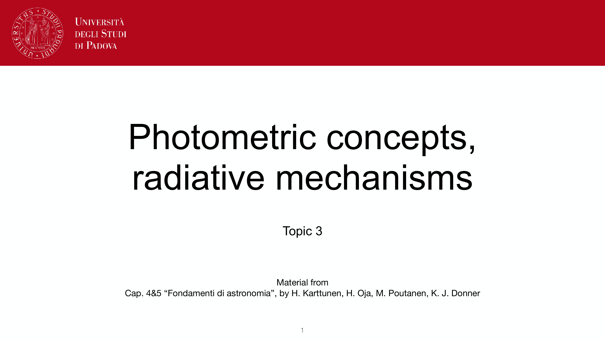
*Lecture 3: Photometric concepts and radiative mechanisms.*

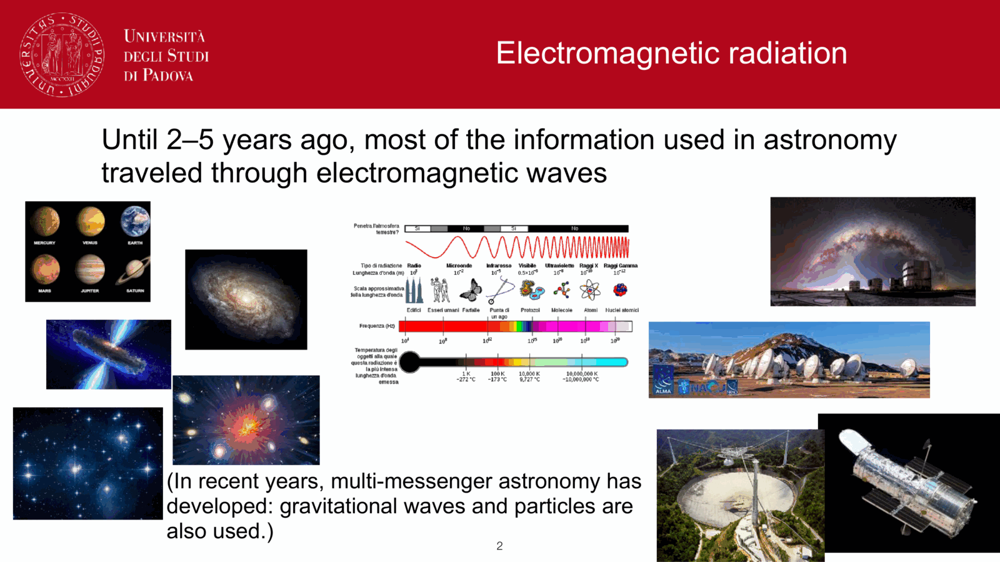
*Specific intensity I_nu: definition per unit area, time, frequency, solid angle.*

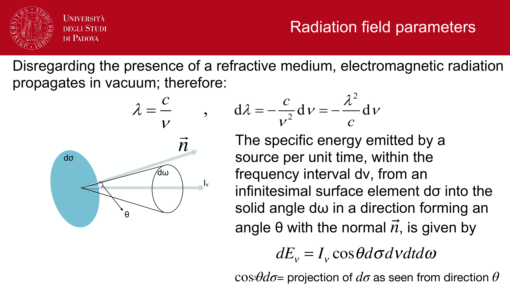
*Conservation of specific intensity along rays in vacuum: d I_nu / d s = 0.*

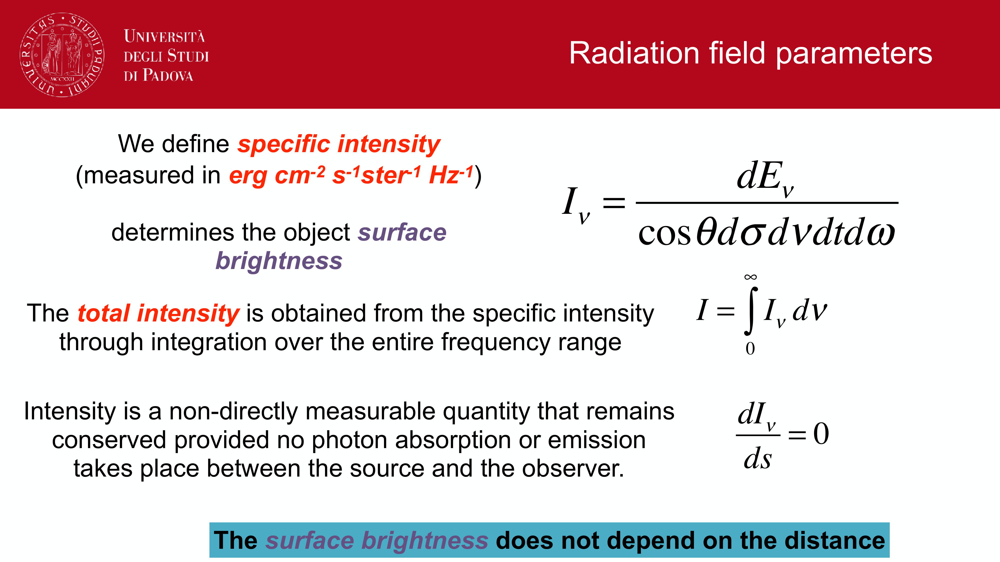
*Flux F_nu: integral of specific intensity over hemisphere, F_nu = int I_nu cos theta d Omega.*

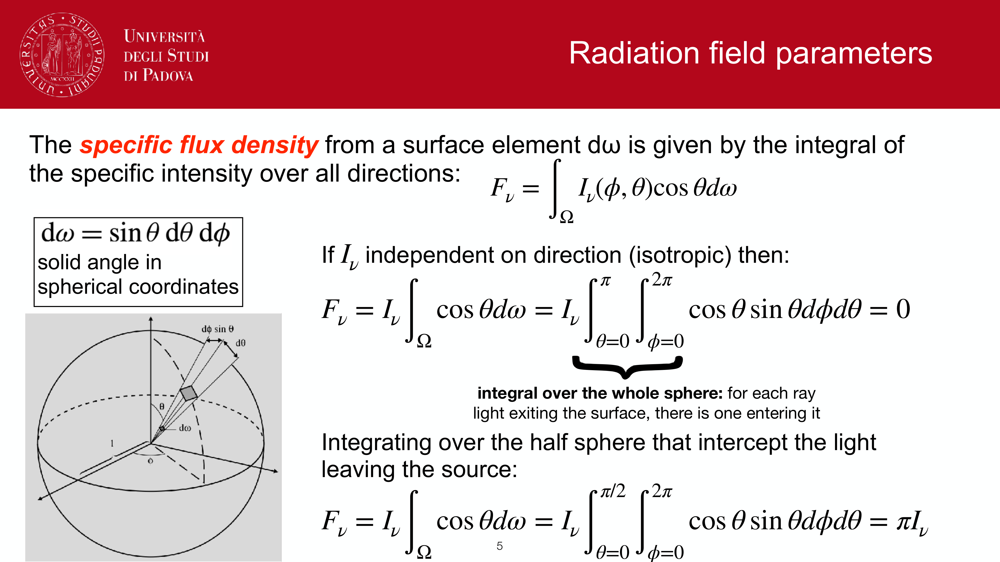
*Luminosity L: total radiated power across closed bounding surface.*

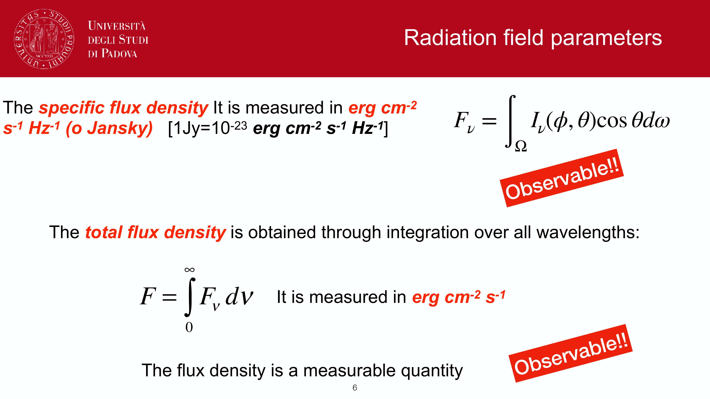
*Inverse square law: F = L / (4 pi d^2) for isotropic sources.*

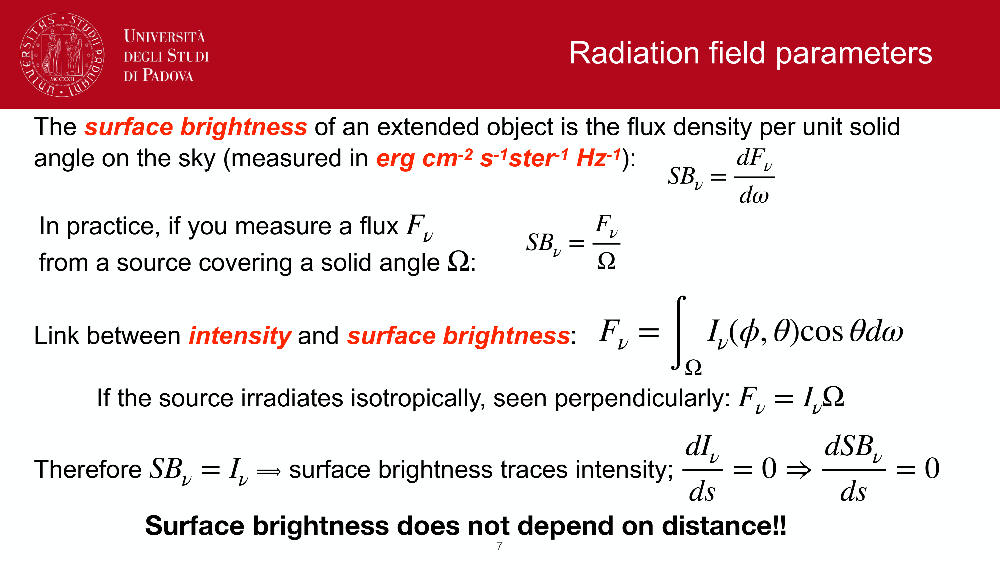
*Surface brightness and independence of distance for resolved sources.*

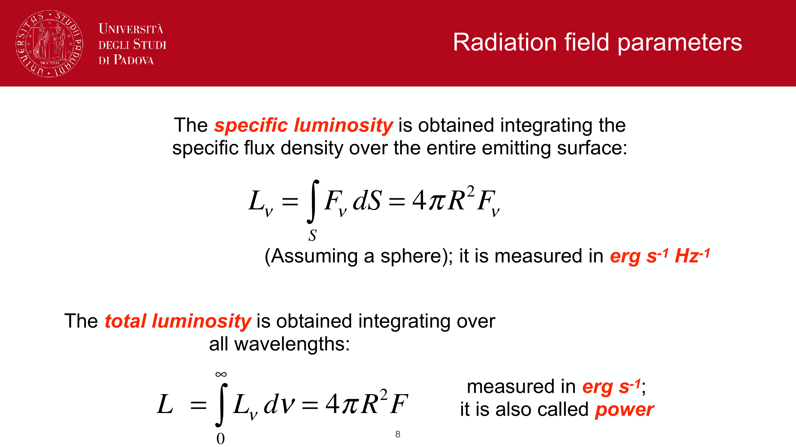
*Mean intensity J_nu: angle-averaged intensity.*

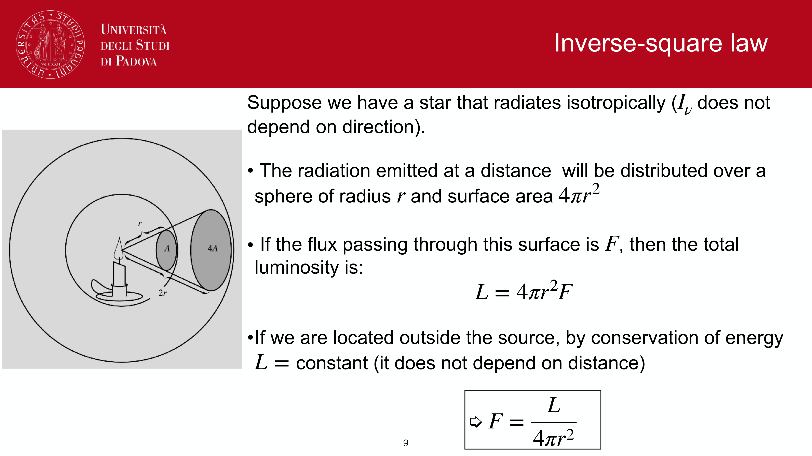
*Radiation pressure P_rad = (1/c) int I_nu cos^2 theta d Omega.*

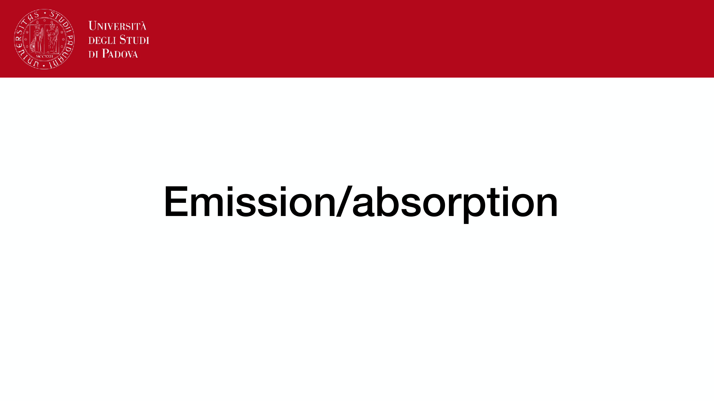
*Energy density u_nu = (1/c) int I_nu d Omega.*

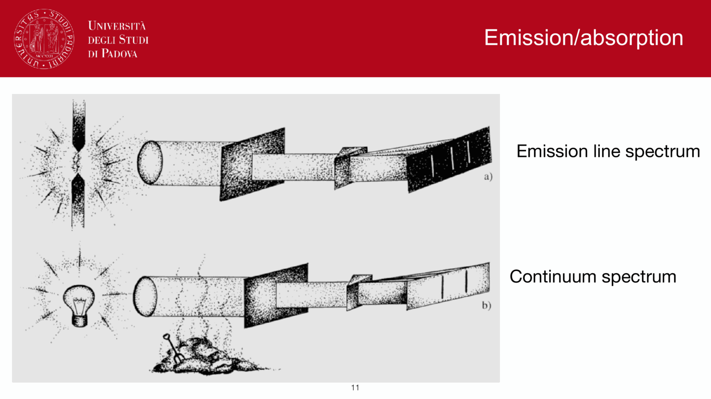
*Radiation field tensors and moments.*

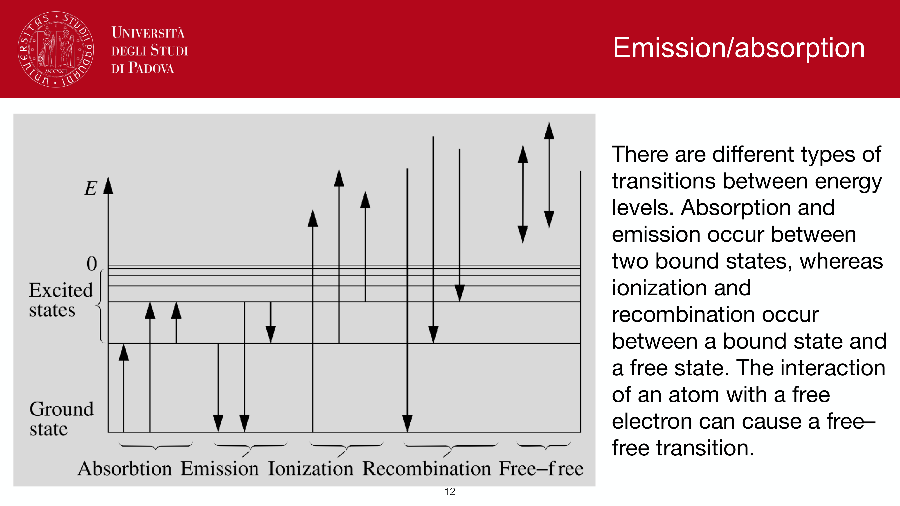
*Emission coefficient j_nu and absorption coefficient alpha_nu.*

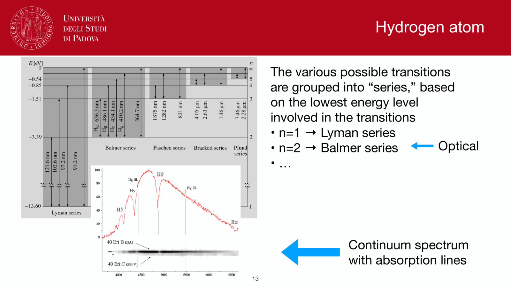
*Source function S_nu = j_nu / alpha_nu.*

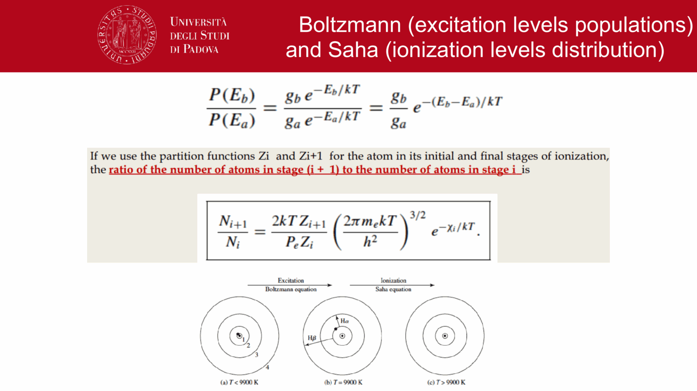
*Radiative transfer equation: d I_nu / d tau_nu = I_nu - S_nu.*

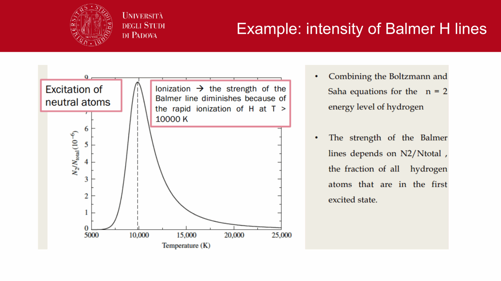
*Formal solution of radiative transfer equation.*

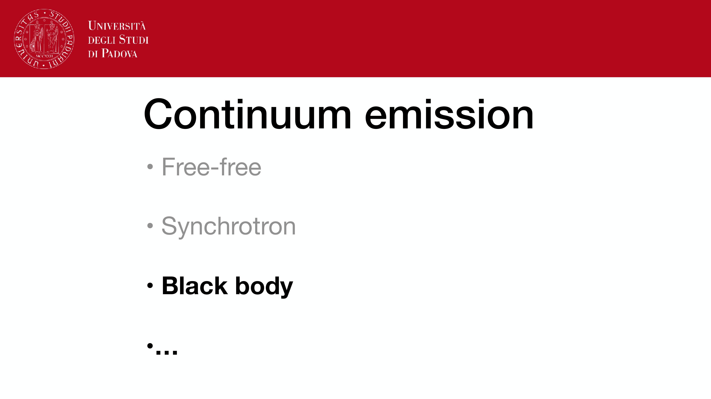
*Optically thin (tau << 1) vs optically thick (tau >> 1) limits.*


  <h4 class="backlinks-title">Linked References (6)</h4>
  <ul class="backlinks-list">
    <li class="backlink-item-wrap"><a href="./Bolometric%20correction%20and%20effective%20temperature.html" class="backlink-item">Bolometric correction and effective temperature</a></li>
    <li class="backlink-item-wrap"><a href="./Dilution%20factor.html" class="backlink-item">Dilution factor</a></li>
    <li class="backlink-item-wrap"><a href="./Equation%20of%20radiative%20transfer.html" class="backlink-item">Equation of radiative transfer</a></li>
    <li class="backlink-item-wrap"><a href="../../04_Atlas/Observational_Astrophysics_MOC.html" class="backlink-item">Observational_Astrophysics_MOC</a></li>
    <li class="backlink-item-wrap"><a href="./Planck%20law%20Wien%20Stefan-Boltzmann.html" class="backlink-item">Planck law Wien Stefan-Boltzmann</a></li>
    <li class="backlink-item-wrap"><a href="./Pogson%20magnitudes%20and%20flux%20relation.html" class="backlink-item">Pogson magnitudes and flux relation</a></li>
  </ul>

