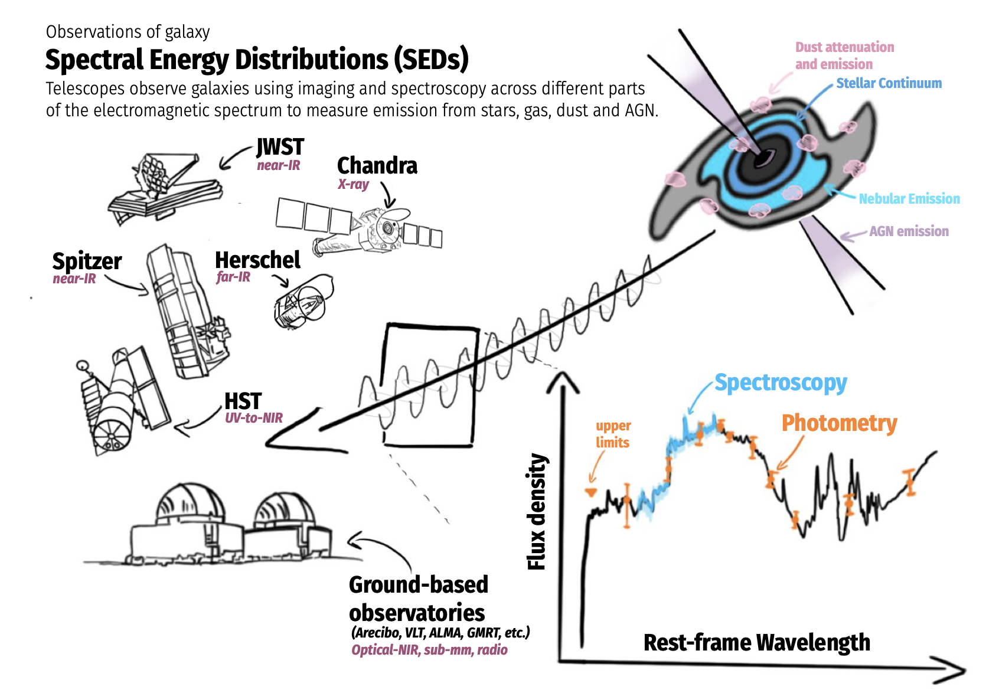
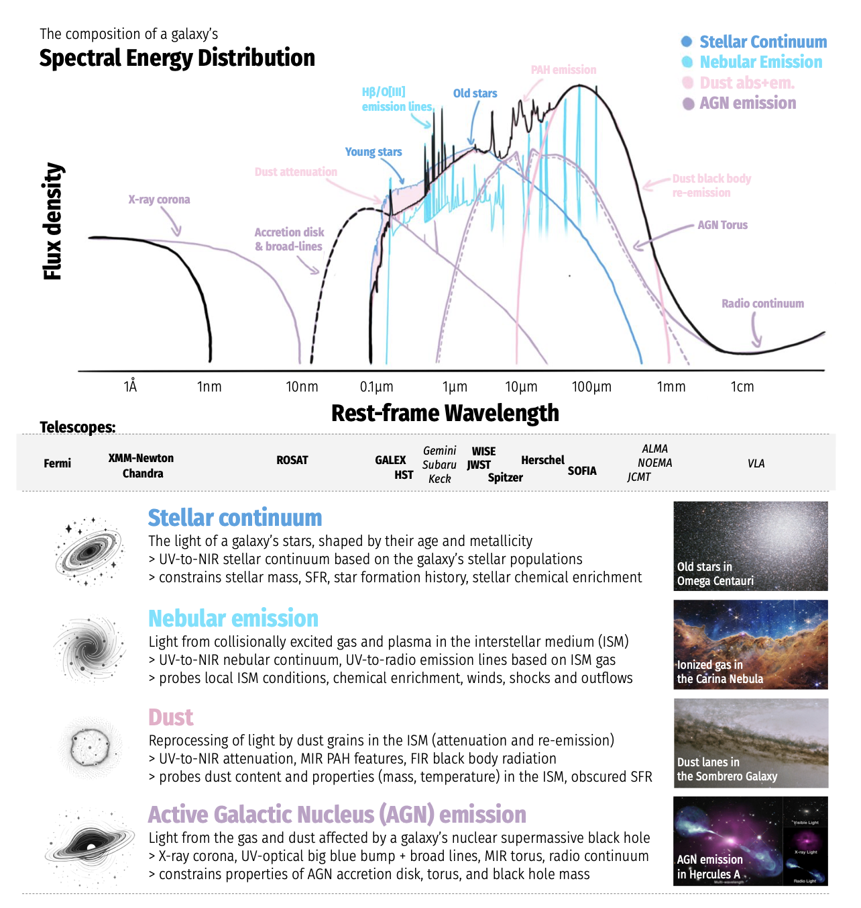


[Spectral Energy Distribution (SED)](./Spectral%20Energy%20Distribution%20%28SED%29.html)
	is a low-resolution spectrum
		made by Photometric data
			obtained in different intervals of the Electromagnetic Spectrum 

*The SED of a galaxy measures its flux density as a function of frequency or wavelength. A variety of ground- and space-based telescopes are used to observe the light from galaxies across a wide range of wavelengths and redshifts. Astronomers use the compiled spectroscopic and photometric data to infer the physical properties of galaxies and study their evolution.*

*Top: A schematic of a galaxy’s pan-chromatic SED, broken down by source of emission at different wavelengths. Bottom: image credits (from top to bottom): Carina Nebula (NASA, ESA, CSA, and STScI), Omega Centauri (ESO), Sombrero Galaxy (NASA and the Hubble Heritage Team, STScI/AURA), and Hercules A (X-ray: NASA/CXC/SAO; visual: NASA/STScI; radio: NSF/NRAO/VLA).*


  <h4 class="backlinks-title">Linked References (3)</h4>
  <ul class="backlinks-list">
    <li class="backlink-item-wrap"><a href="./Flux%20calibration.html" class="backlink-item">Flux calibration</a></li>
    <li class="backlink-item-wrap"><a href="interf/Flux%20calibration.html" class="backlink-item">Flux calibration</a></li>
    <li class="backlink-item-wrap"><a href="./Luminosity%20and%20Flux%20for%20-Instrumentations.html" class="backlink-item">Luminosity and Flux for -Instrumentations</a></li>
  </ul>

