
in distant galaxies, telescopes cannot resolve individual stars: we only observe the integrated, composite light of billions of stars blended together. **Stellar Population Synthesis (SPS)** is the powerful theoretical and computational framework that allows astronomers to reconstruct the physical properties of distant galaxies—their **stellar mass $M_*$**, **star formation rate (SFR)**, **mean age**, **metallicity $Z$**, and **dust extinction $A_V$**—by modeling their **Spectral Energy Distributions (SEDs)**.

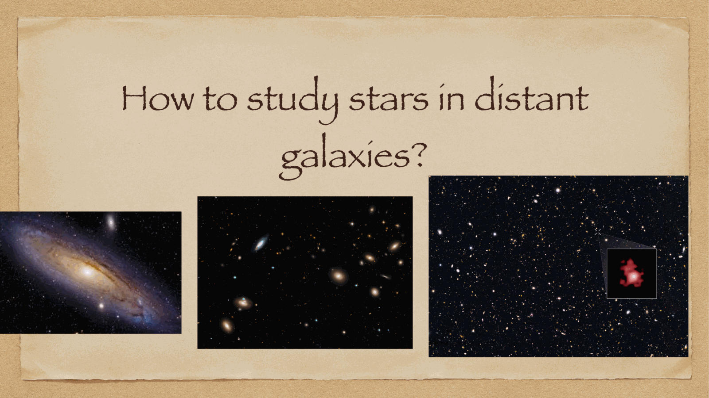

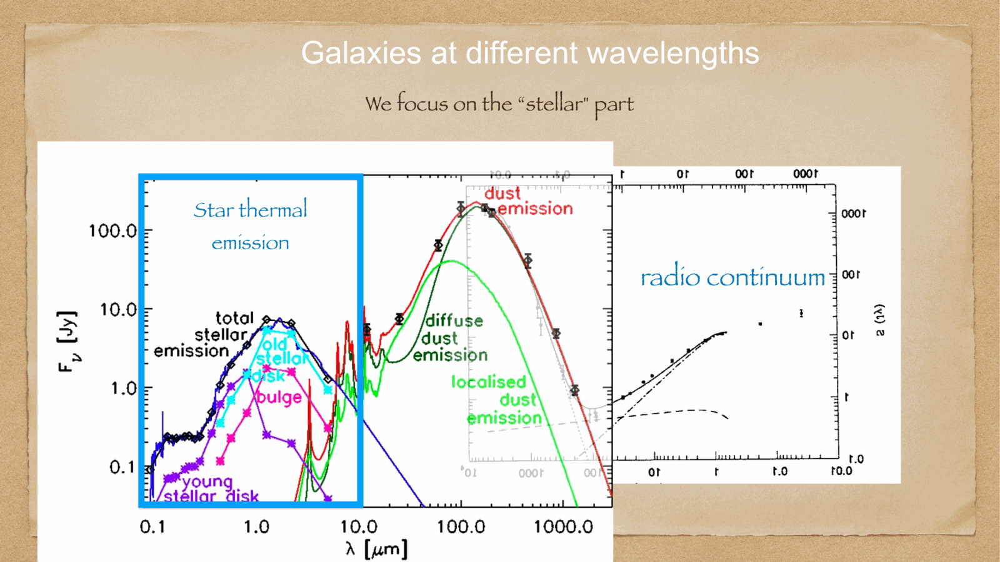

---

## the founding principle of evolutionary population synthesis

the light of a galaxy originates from its constituent stars (plus nebular emission from gas and thermal re-radiation from dust). Beatrice Tinsley (1978) established that the total integrated monochromatic luminosity of a galaxy at wavelength $\lambda$ and time $t$ is the linear superposition of the spectra of all stars currently shining in that galaxy:

$$\boxed{\, L_\lambda^{\text{gal}}(t) = \iint \ell_\lambda(M, t', Z) \, \xi(M) \, \text{SFR}(t - t') \, dM \, dt' \,}$$

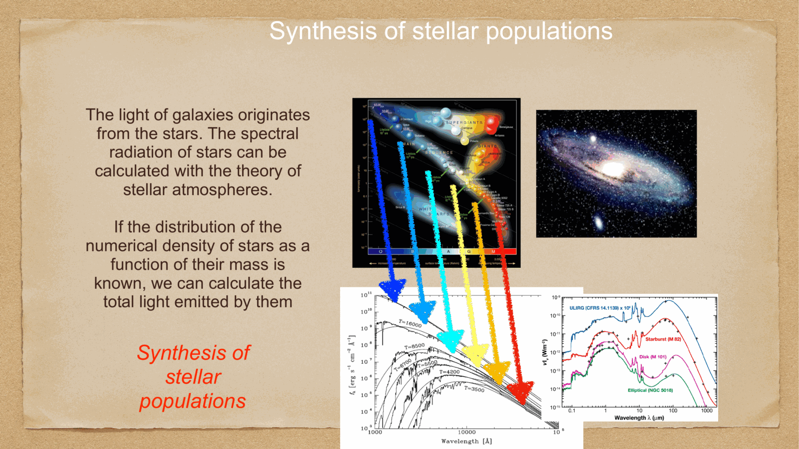

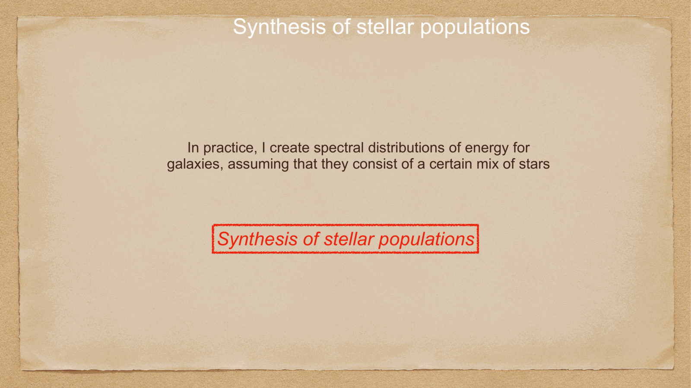

---

## 1. the Initial Mass Function (IMF) $\xi(M)$

the **Initial Mass Function (IMF)** specifies the relative number of stars born per mass interval in a single starburst:
$$\xi(M) \equiv \frac{dN}{dM}$$

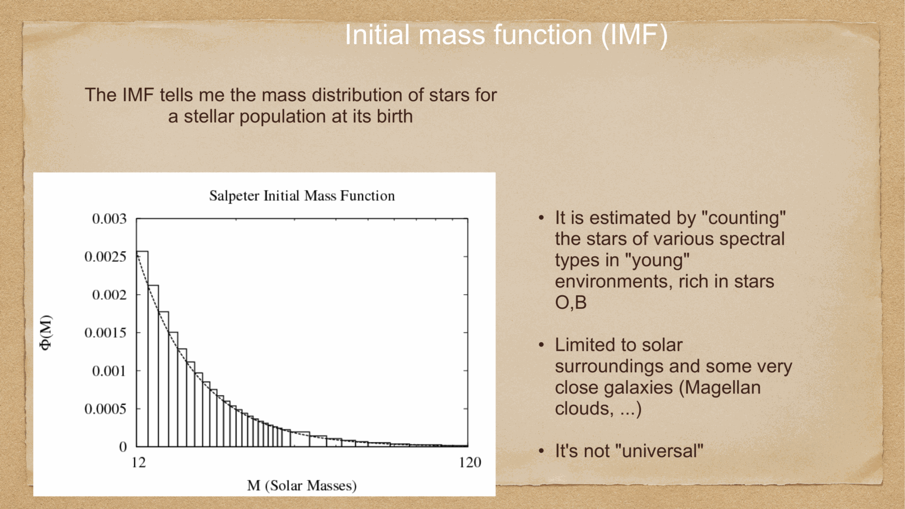

### standard IMF formulations:
1. **Salpeter IMF (1955)**:
   a single power law across all stellar masses ($0.1 M_\odot \le M \le 100 M_\odot$):
   $$\xi(M) \propto M^{-\alpha}, \qquad \alpha = 2.35$$
   in logarithmic mass: $dN/d\log M \propto M^{-1.35}$. 
   *limitation*: overpredicts the number of low-mass stars ($M < 0.5 M_\odot$), leading to an inflated total stellar mass.
2. **Kroupa IMF (2001)**:
   a broken power-law with flattening at low masses:
   - $\alpha_1 = 0.3$ for $M < 0.08 M_\odot$ (brown dwarfs)
   - $\alpha_2 = 1.3$ for $0.08 M_\odot \le M < 0.5 M_\odot$
   - $\alpha_3 = 2.3$ for $M \ge 0.5 M_\odot$
3. **Chabrier IMF (2003)**:
   a log-normal distribution below $1 M_\odot$ with a Salpeter power-law tail at high masses:
   $$\xi(M) \propto \frac{1}{M} \exp\left[-\frac{(\ln M - \ln M_c)^2}{2\sigma^2}\right] \quad (M \le 1 M_\odot)$$
   with $M_c \approx 0.08 M_\odot$ and $\sigma \approx 0.69$. modern extragalactic astrophysics standard.

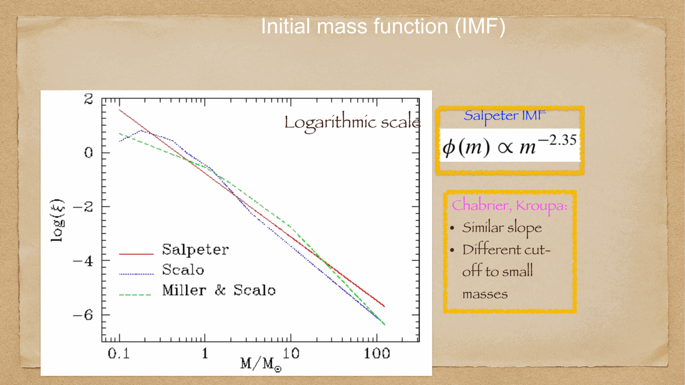

---

## 2. the Simple Stellar Population (SSP)

a **Simple Stellar Population (SSP)** is an idealized single-burst stellar population: a group of stars born at the exact same instant ($t = 0$), from gas of uniform initial metallicity $Z$, with stellar masses distributed according to the IMF.

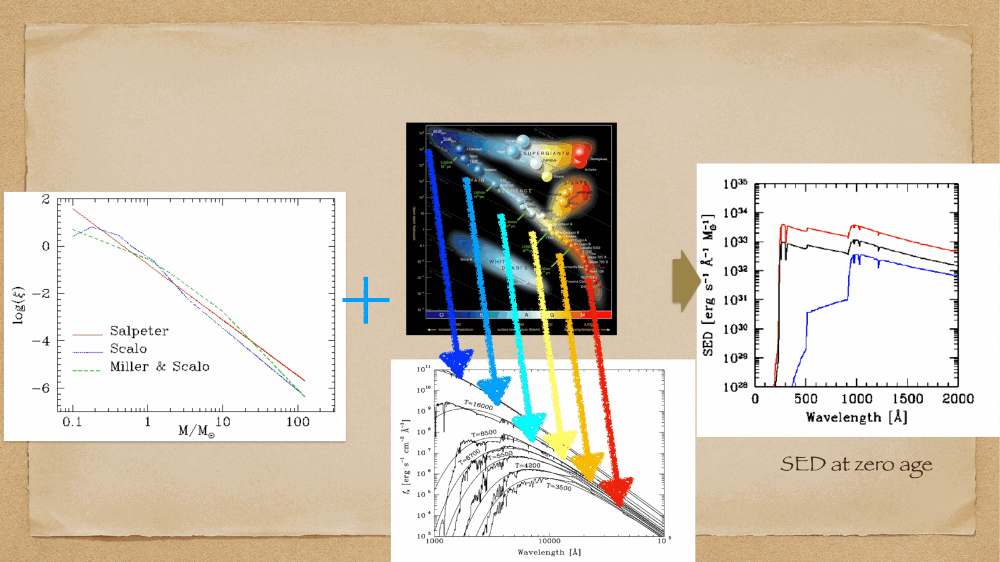

### constructing an SSP:
1. take theoretical stellar evolutionary tracks (isochrones, e.g. PARSEC, Padova, MIST) giving $(L, T_{\text{eff}}, \log g)$ as a function of initial mass $M$ at age $t$.
2. assign to each point on the isochrone a synthetic or empirical stellar spectrum $\ell_\lambda(T_{\text{eff}}, \log g, Z)$ from stellar spectral libraries (e.g. BaSeL, MILES).
3. integrate across the IMF:
   $$L_\lambda^{\text{SSP}}(t, Z) = \int_{M_{\text{lower}}}^{M_{\text{upper}}} \ell_\lambda(M, t, Z) \, \xi(M) \, dM$$

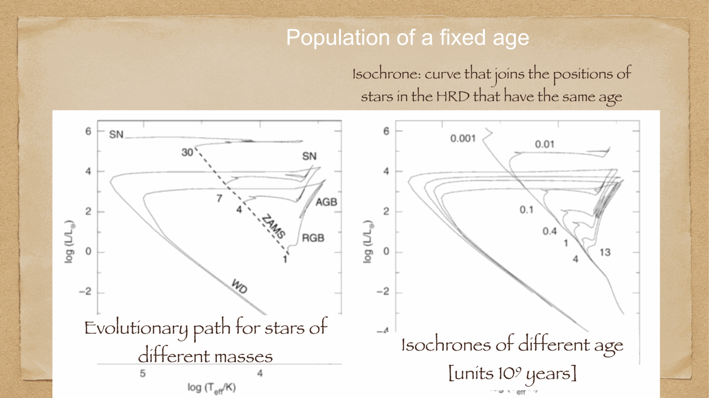

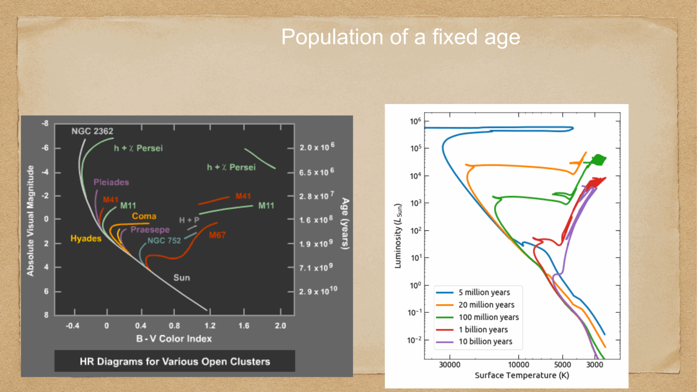

### spectral evolution of an SSP:
- **at young ages ($t < 10$ Myr)**: dominated by hot O and B stars; spectrum is extremely blue and luminous in the ultraviolet.
- **at intermediate ages ($t \sim 100$ Myr $- 1$ Gyr)**: O and B stars have died; A and F stars dominate, producing a prominent **Balmer jump at $364.6$ nm**.
- **at ancient ages ($t > 5$ Gyr)**: only stars with $M \le 1 M_\odot$ survive; light is dominated by cool K/M red giants; spectrum develops a strong **$4000$ Å break ($D_{4000}$)** caused by heavy metal absorption lines (Fe, Ca) in cool stellar atmospheres.

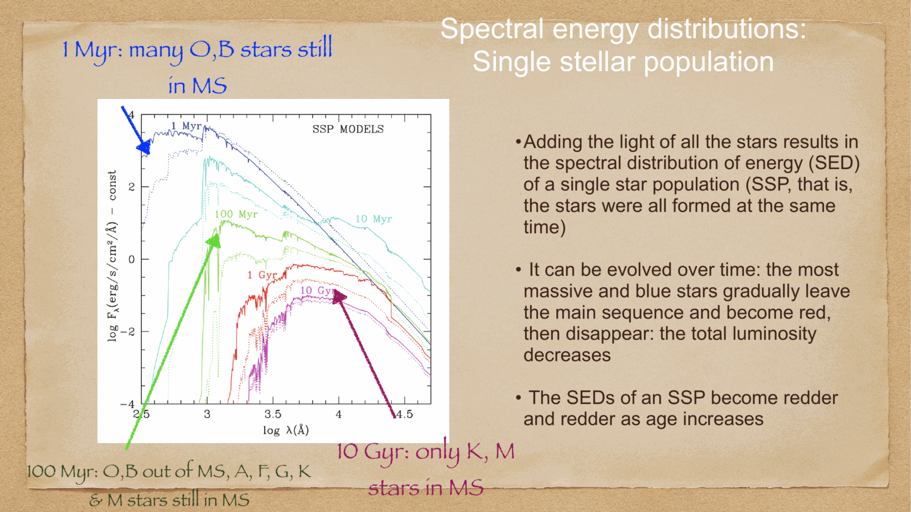

---

## 3. Composite Stellar Populations and Star Formation History (SFH)

real galaxies are not simple single bursts: they form stars continuously or episodically over billions of years. a real galaxy is a **composite stellar population**:

$$L_\lambda^{\text{gal}}(t) = \int_0^t \text{SFR}(t') \, L_\lambda^{\text{SSP}}(t - t', Z) \, dt'$$

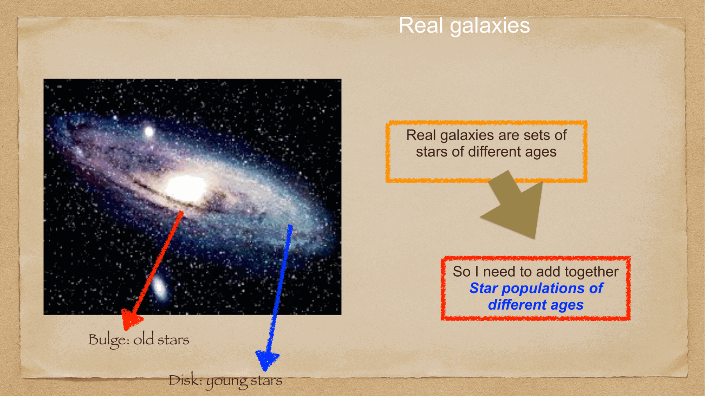

### standard parameterized Star Formation Histories $\text{SFR}(t)$:
- **exponentially declining ($\tau$-models)**: $\text{SFR}(t) = \text{SFR}_0 \, e^{-t/\tau}$. with small $\tau \sim 0.5-1$ Gyr, reproduces passive early-type galaxies.
- **constant SFR**: $\text{SFR}(t) = \text{constant}$, characteristic of late-type star-forming spirals.
- **delayed-burst / rising models**: $\text{SFR}(t) \propto t \, e^{-t/\tau}$, typical of high-redshift galaxies growing rapidly.

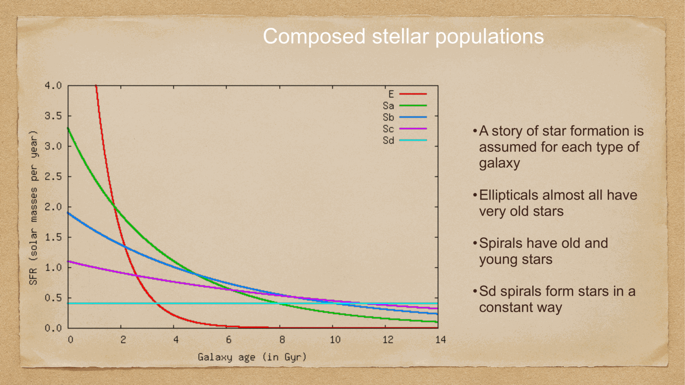

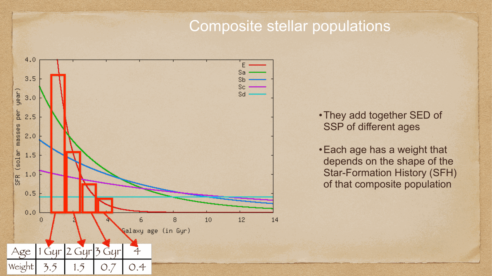

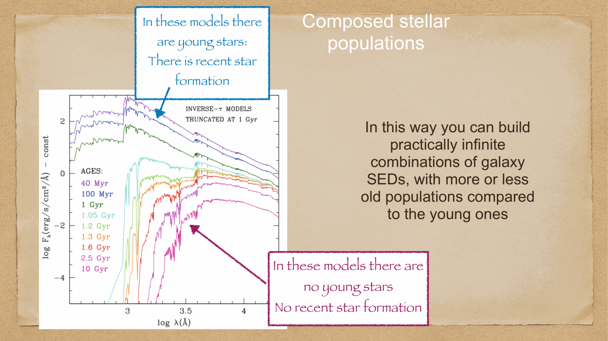

---

## 4. dust attenuation and multi-band SED fitting

interstellar dust absorbs UV and optical photons and re-emits them in the infrared. population synthesis models attenuate synthetic spectra using dust attenuation curves $A_\lambda = k(\lambda) E(B-V)$ (e.g. the **Calzetti attenuation law** for starburst galaxies or the Charlot & Fall two-component dust model).

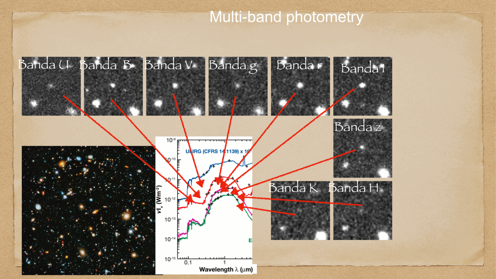

### SED fitting with multi-band photometry:
astronomers observe galaxies through calibrated filter sets spanning from UV to near-infrared (e.g. $u, g, r, i, z, J, H, K_s$).
synthetic models project the synthetic SED through the filter response functions $S_i(\lambda)$:
$$F_i^{\text{model}} = \frac{\int L_\lambda^{\text{gal}} \, S_i(\lambda) \, d\lambda}{4\pi d_L^2 \int S_i(\lambda) \, d\lambda}$$

using $\chi^2$ minimization or Markov Chain Monte Carlo (MCMC) Bayesian inference (codes like **FAST**, **CIGALE**, **Prospector**), the observed photometry is inverted to uniquely determine:
- **Stellar Mass $M_*$**: accuracy $\sim 0.1-0.2$ dex.
- **Star Formation Rate (SFR)**.
- **Dust Extinction $A_V$**.
- **Mean Stellar Age** and **Metallicity $Z$**.

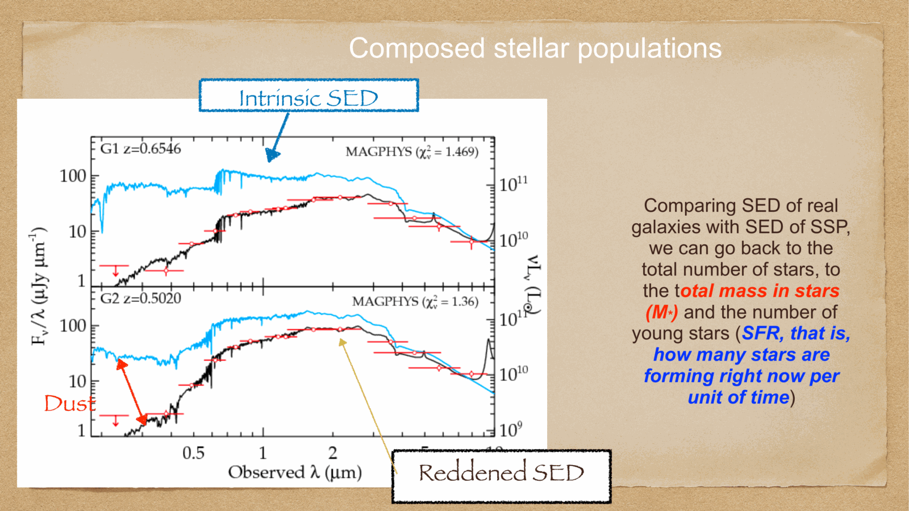

---

## SED extremes: normal galaxies vs ULIRGs

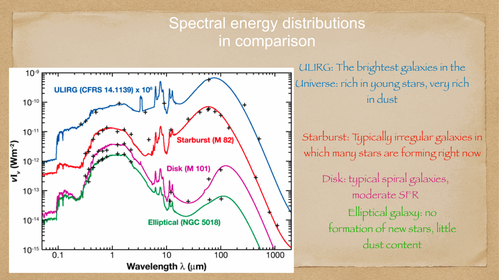

- **normal spirals**: roughly balanced energy budget between direct optical starlight and infrared dust emission.
- **Ultra-Luminous Infrared Galaxies (ULIRGs)**: defined by $L_{\text{IR}}(8-1000\,\mu\text{m}) > 10^{12} L_\odot$. triggered by violent major mergers (e.g. Arp 220); extreme nuclear starbursts are completely smothered in dense dust clouds: **over $99\%$ of their total bolometric luminosity emerges in the far-infrared!**

---

## galaxy spectroscopy and emission line diagnostics (BPT diagram)

measuring optical emission line ratios isolates the ionizing mechanism powering a galaxy:
- Baldwin, Phillips, & Terlevich (1981) introduced the **BPT diagram**: plotting $[\text{O III}]\lambda 5007 / H\beta$ versus $[\text{N II}]\lambda 6584 / H\alpha$.
- separates thermal photoionization by massive OB stars (**star-forming galaxies**) from hard non-thermal power-law photoionization by supermassive black hole accretion disks (**Active Galactic Nuclei, AGN: Seyferts and LINERs**).

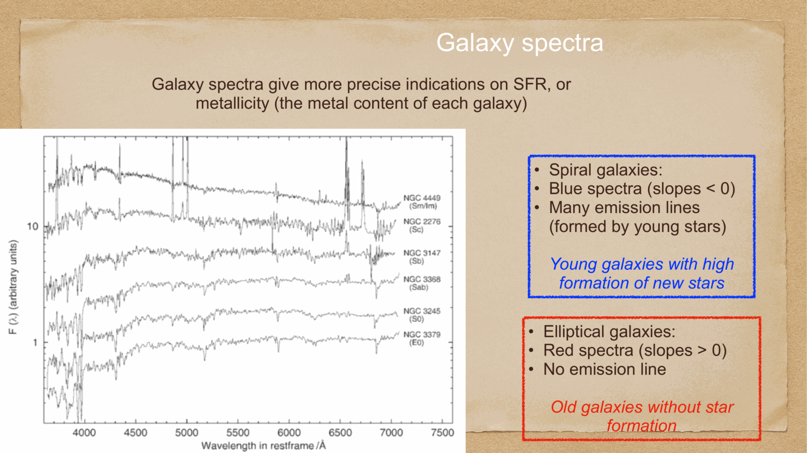

---

## see also

- [Fundamentals_Astrophysics_Cosmology_MOC](../../04_Atlas/Fundamentals_Astrophysics_Cosmology_MOC.html)
- [Galaxies across wavelengths](./Galaxies%20across%20wavelengths.html)
- [Galaxy morphology vs physical properties](./Galaxy%20morphology%20vs%20physical%20properties.html)
- [Stellar nucleosynthesis](./Stellar%20nucleosynthesis.html)
- [Interstellar absorption](./Interstellar%20absorption.html)


  <h4 class="backlinks-title">Linked References (5)</h4>
  <ul class="backlinks-list">
    <li class="backlink-item-wrap"><a href="../../04_Atlas/Fundamentals_Astrophysics_Cosmology_MOC.html" class="backlink-item">Fundamentals_Astrophysics_Cosmology_MOC</a></li>
    <li class="backlink-item-wrap"><a href="./Galaxies%20across%20wavelengths.html" class="backlink-item">Galaxies across wavelengths</a></li>
    <li class="backlink-item-wrap"><a href="./Galaxy%20clusters%20and%20overview%20of%20evolution.html" class="backlink-item">Galaxy clusters and overview of evolution</a></li>
    <li class="backlink-item-wrap"><a href="./Galaxy%20morphology%20vs%20physical%20properties.html" class="backlink-item">Galaxy morphology vs physical properties</a></li>
    <li class="backlink-item-wrap"><a href="./Hubble%20morphological%20sequence.html" class="backlink-item">Hubble morphological sequence</a></li>
  </ul>

