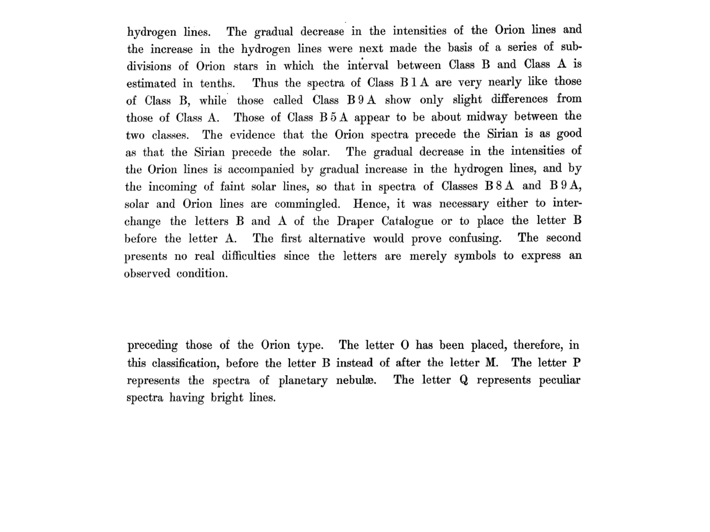
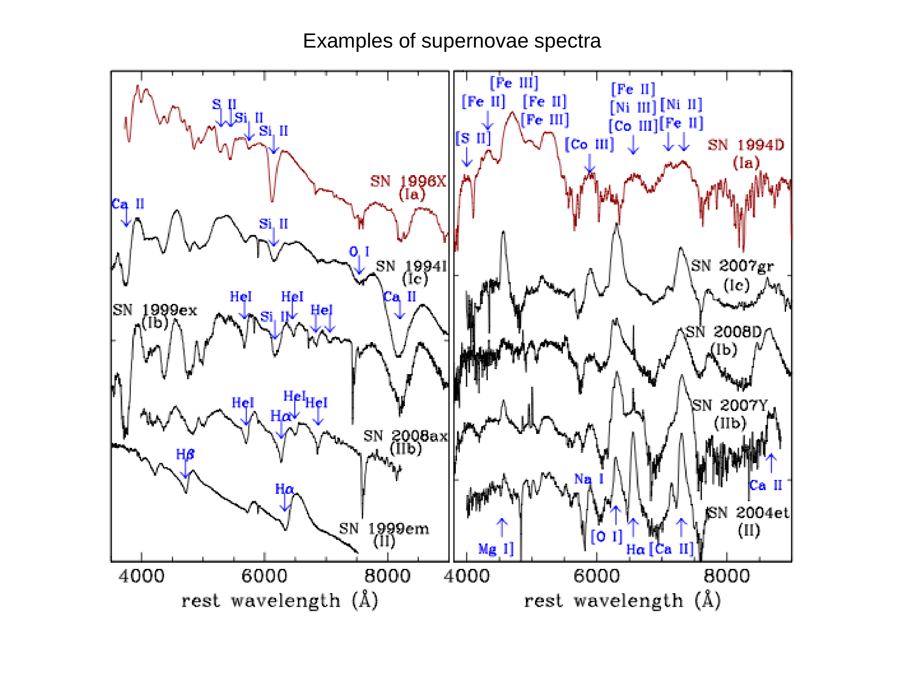


a spectrograph has five essential components in this order: **slit, collimator, dispersing element (grating), camera, detector**. understanding each role is necessary to follow the resolution + dispersion derivations and to build a sensible instrument.

## the optical layout (Boller & Chivens classical layout)

light path:
1. **telescope** focuses an image of the source onto the **slit** at the focal plane.
2. **slit** truncates the angular field to a narrow strip of width $s$.
3. **collimator** (focal length $f_{\rm coll}$, diameter $D_{\rm coll}$) renders the diverging beam parallel.
4. **grating** disperses the parallel beam by wavelength.
5. **camera** (focal length $f_{\rm cam}$, diameter $D_{\rm cam}$) refocuses the dispersed beam.
6. **detector** (CCD) records the image of the slit at each wavelength as a 2D image.

the result on the CCD: along one axis, **wavelength** ($\propto x$); along the orthogonal axis, **spatial position along the slit** ($\propto y$).

## key parameters per element

- **slit width** $s = \alpha\, f_{\rm tel}$ where $\alpha$ is the angular slit width on the sky and $f_{\rm tel}$ is the telescope focal length. typical $\alpha = 1''$ to $3''$, matched to seeing.
- **collimator focal length** $f_{\rm coll}$: fixed by mechanical layout. typical $\sim 200$ to $500$ mm.
- **collimator beam size** $D_{\rm coll} = f_{\rm coll}/F_{\rm tel} \cdot D_{\rm tel}$ where $F_{\rm tel} = f_{\rm tel}/D_{\rm tel}$ is the telescope focal ratio. typical $\sim 50$ to $200$ mm.
- **grating size** $W$: the width of the illuminated grating, $\sim D_{\rm coll}$. determines $R$ via $R = \rho m W$.
- **grating $\rho$**: lines per mm, typical $50$ to $1200$ for first-order; very high for echelle.
- **camera focal length** $f_{\rm cam}$: typical similar to or smaller than $f_{\rm coll}$.
- **detector pixel size** $\Delta x$: typical $15\,\mu$m. pixel scale = $f_{\rm cam}^{-1}$ in radians/pixel.

## sampling the slit on the detector

the slit image at the detector has size:
$$s' = s\,(f_{\rm cam}/f_{\rm coll})$$

this is the **width of a spectral line** on the detector (in mm). divided by the dispersion (in Å/mm), it gives the spectral linewidth $\Delta\lambda$.

Nyquist sampling: $s'$ should span $\ge 2$ pixels. if narrower, the spectrum is undersampled and interpolation can introduce aliasing.

## the F-number matching

an efficient spectrograph has $F_{\rm coll} = F_{\rm tel}$, so the collimator captures the full beam from the telescope. this is the **F-number matching condition**. when satisfied, $D_{\rm coll}$ is just the projected pupil of the telescope at the slit.

## throughput (efficiency)

end-to-end throughput is the product:
$$\eta_{\rm tot} = \eta_{\rm slit} \cdot \eta_{\rm coll} \cdot \eta_{\rm grat} \cdot \eta_{\rm cam} \cdot \eta_{\rm CCD}$$

typical values:
- $\eta_{\rm slit} \approx 0.5$ to $0.8$ (depending on slit width vs seeing).
- $\eta_{\rm coll}, \eta_{\rm cam} \approx 0.8$ each (anti-reflection coatings).
- $\eta_{\rm grat} \approx 0.6$ at blaze.
- $\eta_{\rm CCD} \approx 0.9$ with modern back-illuminated.

so $\eta_{\rm tot} \approx 0.2$ to $0.3$ at peak. spectrographs are inefficient compared to imaging, since the slit alone throws away most of the photons.

## examples

- **Boller & Chivens** at Asiago T120: classical low-resolution longslit, $R \sim 1000$ to $5000$.
- **DOLORES** at TNG: longslit + multi-object, $R \sim 1000$ to $4000$.
- **X-shooter** at VLT: simultaneous UV-VIS-NIR longslit echelle, $R \sim 4000$ to $10\,000$.
- **HARPS** at La Silla: high-resolution echelle for radial velocities, $R = 115\,000$.
- **MUSE** at VLT: panoramic IFU, $R \sim 1700$ to $3500$, $1' \times 1'$ field.

## see also

- [Grating equation](./Grating%20equation.html)
- [Dispersion and spectral resolution](./Dispersion%20and%20spectral%20resolution.html)
- [Spectrograph types](./Spectrograph%20types.html)
- [Echelle spectroscopy](./Echelle%20spectroscopy.html)
- [Multi-object spectroscopy MOS](./Multi-object%20spectroscopy%20MOS.html)
- [Integral-field spectroscopy IFU](./Integral-field%20spectroscopy%20IFU.html)
- [Wavelength calibration](./Wavelength%20calibration.html)
- [Flux calibration](interf/Flux%20calibration.html)
- [Spectrum reduction pipeline](./Spectrum%20reduction%20pipeline.html)
- [Atmospheric seeing](interf/Atmospheric%20seeing.html) — what sets the slit width
- [CCD detectors and SNR](./CCD%20detectors%20and%20SNR.html)

---

### Astronomical Spectroscopy Diagnostic Panels

*Classical slit spectrograph optical layout: entrance slit, collimator mirror/lens, diffraction grating, camera optics, and detector array.*

*Echelle spectrograph architecture: high-blaze coarse grating ($R2/R4$) operated in high orders ($m \sim 30-100$) cross-dispersed with a prism or grism.*


  <h4 class="backlinks-title">Linked References (15)</h4>
  <ul class="backlinks-list">
    <li class="backlink-item-wrap"><a href="../../04_Atlas/Astronomical_Spectroscopy_MOC.html" class="backlink-item">Astronomical_Spectroscopy_MOC</a></li>
    <li class="backlink-item-wrap"><a href="../../04_Atlas/Astrophysics_of_Galaxies_MOC.html" class="backlink-item">Astrophysics_of_Galaxies_MOC</a></li>
    <li class="backlink-item-wrap"><a href="./Blazed%20gratings.html" class="backlink-item">Blazed gratings</a></li>
    <li class="backlink-item-wrap"><a href="./Dispersion%20and%20spectral%20resolution.html" class="backlink-item">Dispersion and spectral resolution</a></li>
    <li class="backlink-item-wrap"><a href="./Echelle%20spectroscopy.html" class="backlink-item">Echelle spectroscopy</a></li>
    <li class="backlink-item-wrap"><a href="./Flux%20calibration.html" class="backlink-item">Flux calibration</a></li>
    <li class="backlink-item-wrap"><a href="interf/Flux%20calibration.html" class="backlink-item">Flux calibration</a></li>
    <li class="backlink-item-wrap"><a href="./Grating%20equation.html" class="backlink-item">Grating equation</a></li>
    <li class="backlink-item-wrap"><a href="./Integral-field%20spectroscopy%20IFU.html" class="backlink-item">Integral-field spectroscopy IFU</a></li>
    <li class="backlink-item-wrap"><a href="./Multi-object%20spectroscopy%20MOS.html" class="backlink-item">Multi-object spectroscopy MOS</a></li>
    <li class="backlink-item-wrap"><a href="./N-slit%20interference%20and%20gratings.html" class="backlink-item">N-slit interference and gratings</a></li>
    <li class="backlink-item-wrap"><a href="./Single%20slit%20diffraction.html" class="backlink-item">Single slit diffraction</a></li>
    <li class="backlink-item-wrap"><a href="./Spectrograph%20types.html" class="backlink-item">Spectrograph types</a></li>
    <li class="backlink-item-wrap"><a href="./Spectrum%20reduction%20pipeline.html" class="backlink-item">Spectrum reduction pipeline</a></li>
    <li class="backlink-item-wrap"><a href="./Wavelength%20calibration.html" class="backlink-item">Wavelength calibration</a></li>
  </ul>

