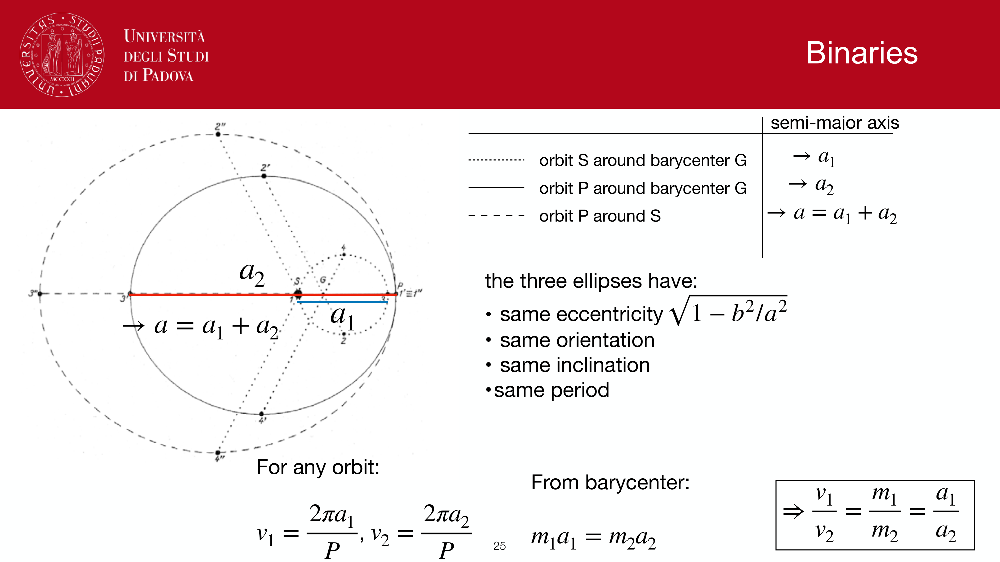
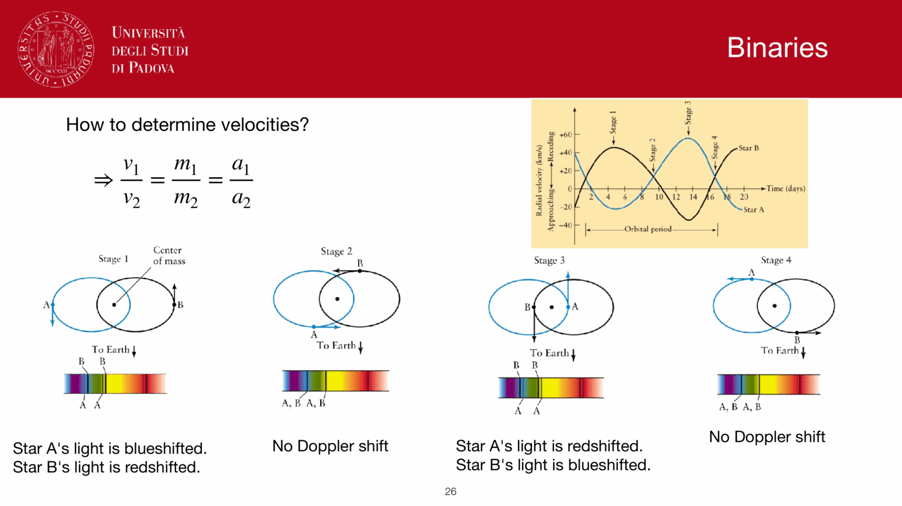
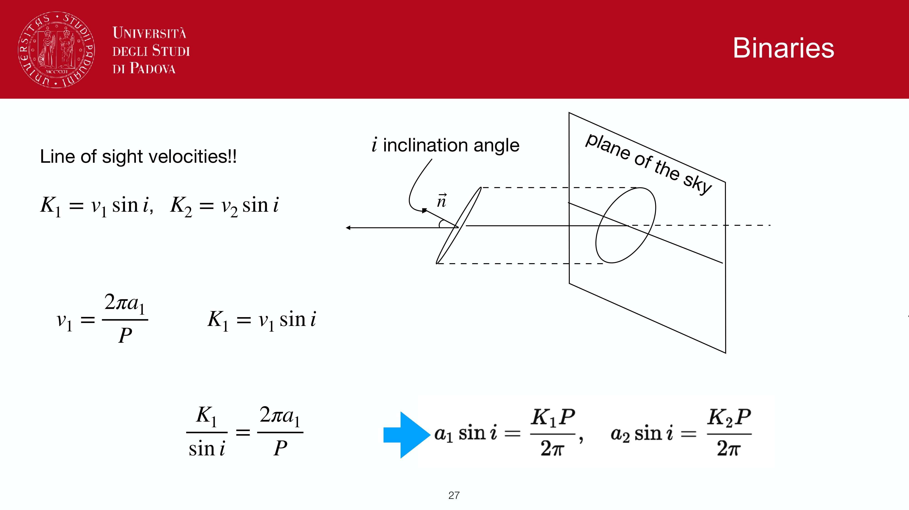
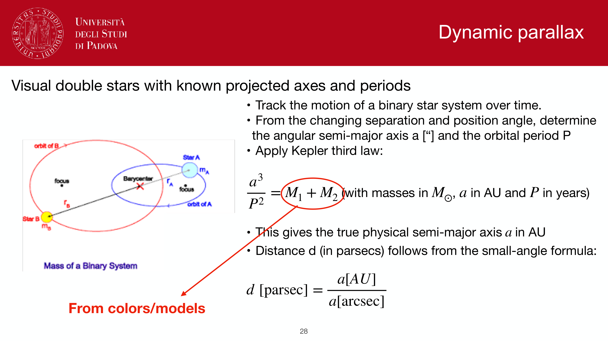
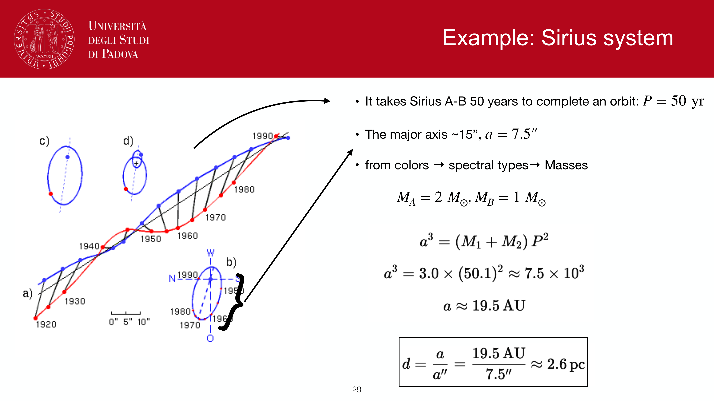
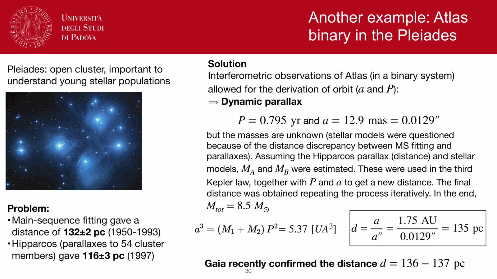


**spectroscopic parallax** is a misleading name (it has nothing to do with parallax geometrically). it is the technique of inferring a star's distance from its spectral type, which gives $M$, combined with its observed $m$. **main-sequence fitting** is the same idea applied to stellar clusters.

## spectroscopic parallax (single stars)

procedure:
1. take a spectrum of the star.
2. classify it on the [Stellar spectra and spectral classification](./Stellar%20spectra%20and%20spectral%20classification.html) OBAFGKM scheme + luminosity class (I to V from line widths / strengths).
3. look up the absolute magnitude $M$ for that spectral type and luminosity class (e.g. from Allen's *Astrophysical Quantities*, or Pickles 1998 templates).
4. measure the apparent magnitude $m$, correct for dust to get $m_0$.
5. solve the distance modulus: $\mu = m_0 - M = 5\log_{10}(d_{\rm pc}) - 5$.

range: $\sim 100$ pc to $\sim 100$ kpc, depending on the spectral type used.

precision: $\sim 0.3$ to $0.5$ mag in $M$, hence $\sim 15$ to $25\%$ in distance. limited by:
- intrinsic scatter in $M$ at fixed spectral type ($\sim 0.3$ mag for MS, larger for evolved stars).
- spectral classification uncertainty.
- dust correction uncertainty.

## main-sequence fitting (clusters)

for an open or globular cluster:
1. measure $V$ and $B-V$ for cluster stars, plot the **observed CMD**: $V$ vs $B - V$.
2. compare with a **calibrated absolute CMD**: $M_V$ vs $(B-V)_0$ from a reference cluster (e.g. Hyades, distance known from parallax) or theoretical isochrone.
3. shift the cluster CMD vertically to overlay; the vertical shift is $\mu = m_V - M_V$.
4. read off the distance.

advantages over single-star spectroscopic parallax:
- many stars contribute, beating down the per-star scatter as $1/\sqrt{N}$.
- the *shape* of the main sequence acts as a fingerprint, robust to small classification errors.

caveats:
- **metallicity**: lower $Z$ gives a bluer, fainter main sequence at given color. metal-poor halo subdwarfs are systematically below the Hyades MS.
- **age**: in young clusters, MS-turnoff and pre-main-sequence stars complicate the fit.
- **dust**: cluster reddening must be known and uniform.

## the Hyades anchor

the Hyades cluster ($d \approx 46$ pc) is the historical zero-point: its main sequence was defined by Hipparcos parallaxes for individual stars, and every other open cluster's MS-fit distance is referenced to it. modern: Gaia parallaxes of $\sim 100$ Hyades members give $\sim 0.5\%$ distance precision, anchoring everything downstream.

## isochrone fitting

a generalisation: fit a theoretical **stellar isochrone** (e.g. PARSEC, BaSTI, Y$^2$, MIST) to the cluster CMD, simultaneously fitting age, metallicity, distance modulus, and reddening. this works when the cluster has both a turnoff and a giant branch. used universally for globular cluster ages.

## see also

- [Distance ladder derivations](./Distance%20ladder%20derivations.html)
- [Distance modulus](./Distance%20modulus.html)
- [Annual stellar parallax](./Annual%20stellar%20parallax.html)
- [HR diagram](./HR%20diagram.html)
- [Color-magnitude diagrams of clusters](./Color-magnitude%20diagrams%20of%20clusters.html)
- [Cluster ages from CMD turnoff](./Cluster%20ages%20from%20CMD%20turnoff.html)
- [Stellar spectra and spectral classification](./Stellar%20spectra%20and%20spectral%20classification.html)
- [Main sequence, giants, supergiants, white dwarfs](./Main%20sequence%2C%20giants%2C%20supergiants%2C%20white%20dwarfs.html)

---

## observational astrophysics course slides (Prof. Paolo Cassata)

*Spectroscopic parallax concept: determine spectral type and luminosity class, read M_V from HR diagram.*

*Uncertainties in spectroscopic parallax (~0.3-0.5 mag in M_V, ~15-25% in distance).*

*Main Sequence (MS) fitting for open star clusters: comparing observed CMD with calibrated ZAMS.*

*Hyades and Pleiades clusters as zero-age main sequence calibrators.*

*Metallicity dependence of main sequence position: metal-poor stars are bluer and fainter.*

*Extinction and reddening vector alignment during MS fitting.*


  <h4 class="backlinks-title">Linked References (5)</h4>
  <ul class="backlinks-list">
    <li class="backlink-item-wrap"><a href="./AU%20calibration%20parallax%20and%20parsec.html" class="backlink-item">AU calibration parallax and parsec</a></li>
    <li class="backlink-item-wrap"><a href="./Color-magnitude%20diagrams%20of%20clusters.html" class="backlink-item">Color-magnitude diagrams of clusters</a></li>
    <li class="backlink-item-wrap"><a href="./MK%20luminosity%20classes.html" class="backlink-item">MK luminosity classes</a></li>
    <li class="backlink-item-wrap"><a href="./Moving%20cluster%20method.html" class="backlink-item">Moving cluster method</a></li>
    <li class="backlink-item-wrap"><a href="../../04_Atlas/Observational_Astrophysics_MOC.html" class="backlink-item">Observational_Astrophysics_MOC</a></li>
  </ul>

