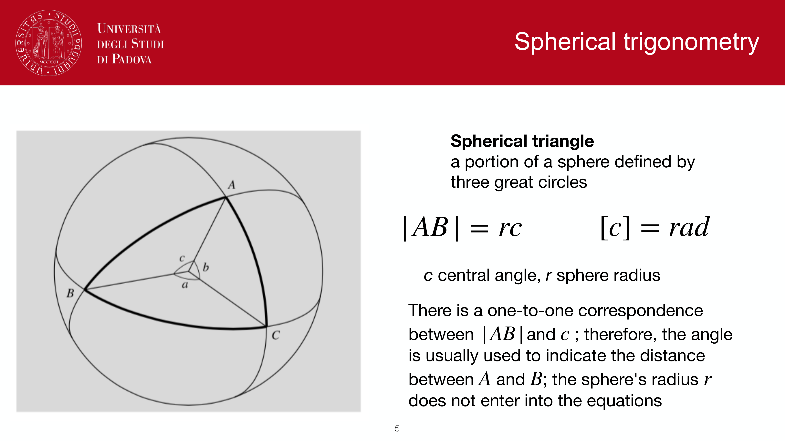
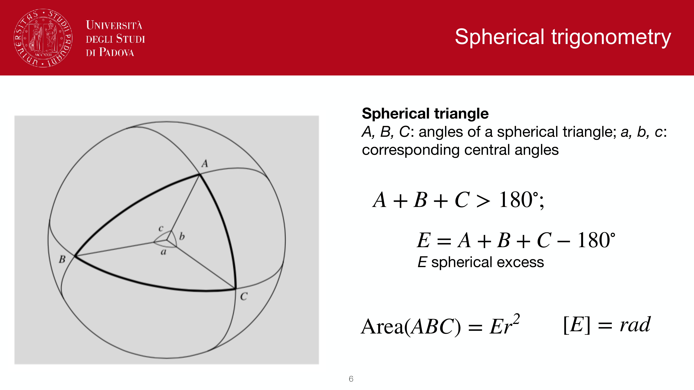
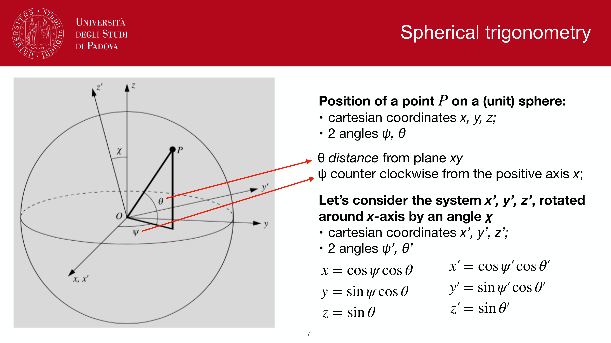
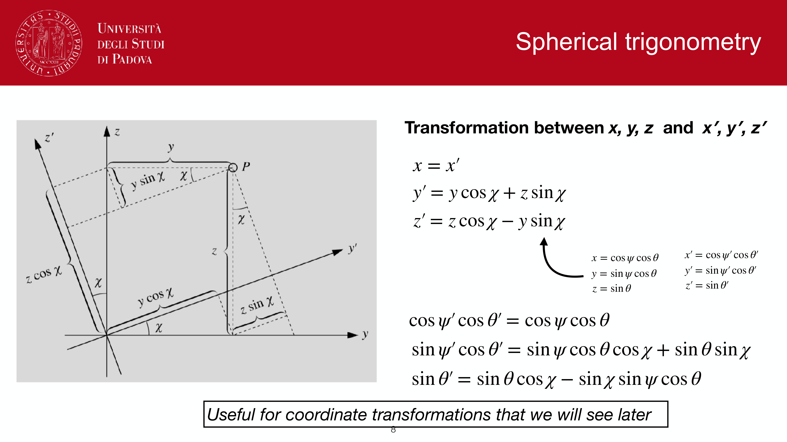
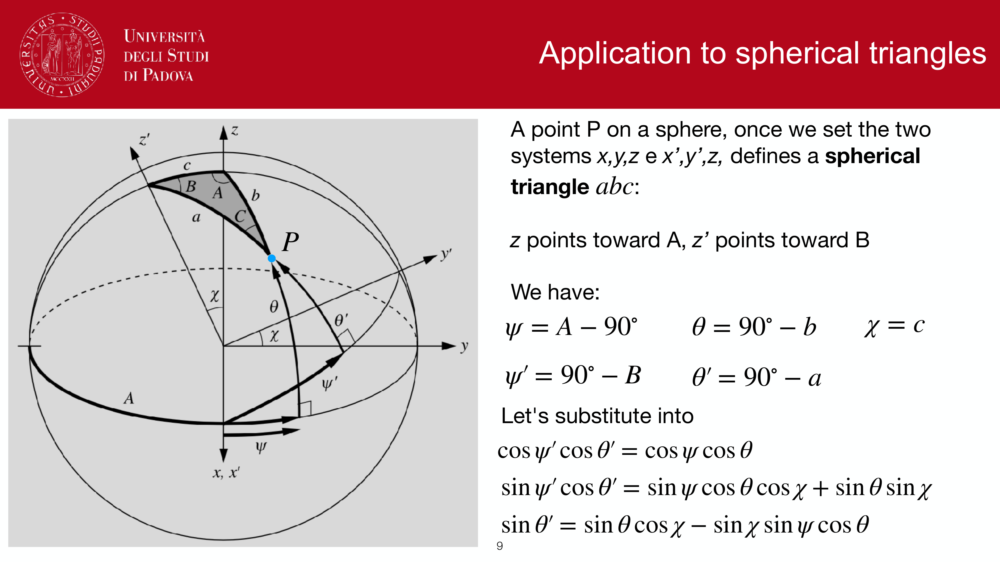
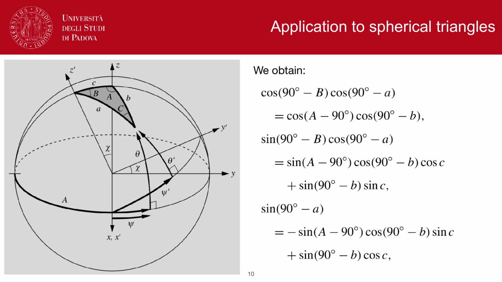


spherical trigonometry is the toolkit for transforming between two angular coordinate systems on the same sphere. every equatorial-to-altazimuthal transformation, every rise/set computation, every angular-distance calculation in the rest of astronomy is just a special case of the three master equations below.

---

## position of a point in two coordinate systems

a point $P$ on a unit sphere can be parametrized by two angles:
- $\theta$: distance from the $xy$-plane (i.e. elevation), positive northward
- $\psi$: counter-clockwise angle from the positive $x$-axis along the equatorial plane

so on a unit sphere
$$x = \cos\psi\cos\theta, \quad y = \sin\psi\cos\theta, \quad z = \sin\theta$$

now consider a second system $(x', y', z')$ obtained by rotating around the $x$-axis by an angle $\chi$:

---

## the cartesian rotation around the x-axis

rotating around the $x$-axis by $\chi$:
$$x' = x, \qquad y' = y\cos\chi + z\sin\chi, \qquad z' = z\cos\chi - y\sin\chi$$

substituting the angular form of $(x, y, z)$:
$$x' = \cos\psi'\cos\theta' = \cos\psi\cos\theta$$
$$y' = \sin\psi'\cos\theta' = \sin\psi\cos\theta\cos\chi + \sin\theta\sin\chi$$
$$z' = \sin\theta' = \sin\theta\cos\chi - \sin\chi\sin\psi\cos\theta$$

these are the **three master equations** of spherical trigonometry. every rotation in spherical astronomy is one of these three lines:

$$\boxed{\,\cos\psi'\cos\theta' = \cos\psi\cos\theta\,}$$
$$\boxed{\,\sin\psi'\cos\theta' = \sin\psi\cos\theta\cos\chi + \sin\theta\sin\chi\,}$$
$$\boxed{\,\sin\theta' = \sin\theta\cos\chi - \sin\chi\sin\psi\cos\theta\,}$$

useful for coordinate transformations.

---

## applied to a spherical triangle

now reinterpret the same setup as a spherical triangle on the celestial sphere, with $z$ pointing at vertex $A$ and $z'$ pointing at vertex $B$:

reading the triangle:
$$\psi = A - 90°, \qquad \theta = 90° - b, \qquad \chi = c$$
$$\psi' = 90° - B, \qquad \theta' = 90° - a$$

substituting into the master equations and using $\cos(90° - x) = \sin x$, $\sin(90° - x) = \cos x$:

$$\cos(90° - B)\cos(90° - a) = \cos(A - 90°)\cos(90° - b)$$
$$\sin(90° - B)\cos(90° - a) = \sin(A - 90°)\cos(90° - b)\cos c + \sin(90° - b)\sin c$$
$$\sin(90° - a) = -\sin(A - 90°)\cos(90° - b)\sin c + \sin(90° - b)\cos c$$

cleaning up:

$$\sin B \sin a = \sin A \sin b$$
$$\cos B \sin a = -\cos A \sin b \cos c + \cos b \sin c$$
$$\cos a = \cos A \sin b \sin c + \cos b \cos c$$

---

## the sine rule on the sphere

permuting the indices of the first equation gives
$$\sin C \sin b = \sin B \sin c, \qquad \sin A \sin c = \sin C \sin a$$

stitching them together:
$$\boxed{\,\frac{\sin a}{\sin A} = \frac{\sin b}{\sin B} = \frac{\sin c}{\sin C}\,}$$

this is the spherical analog of the planar sine rule. useful for computing distances (i.e. arc lengths) between points on the sphere when the angles are known.

---

## the cosine rule on the sphere

the third equation,
$$\cos a = \cos A \sin b \sin c + \cos b \cos c$$

is the **spherical cosine rule**. by permuting indices we can produce two more variants:
$$\cos b = \cos B \sin a \sin c + \cos a \cos c$$
$$\cos c = \cos C \sin a \sin b + \cos a \cos b$$

useful for computing angular distance between two points whose angular position is known in some shared frame.

---

## why this is the only toolkit I need

every later operation in spherical astronomy reduces to one of these:
- **alt-azimuth ↔ equatorial**: a single rotation by $\chi = 90° - \phi$, see [Alt-azimuth ↔ equatorial transformations](./Alt-azimuth%20%E2%86%94%20equatorial%20transformations.html)
- **distance between two points on Earth**: spherical cosine rule, see [Earth coordinates](./Earth%20coordinates.html)
- **rise and set conditions**: the third master equation evaluated at $a = 0$, see Culmination and rise/set
- **culmination height**: the third master equation evaluated at $h = 0$ or $h = 12$h

so once I know the three master equations and the sine rule, everything else is just substituting the right angles.

---

## see also

- [Fundamentals_Astrophysics_Cosmology_MOC](../../04_Atlas/Fundamentals_Astrophysics_Cosmology_MOC.html)
- [Spherical_astronomy_complete](./Spherical_astronomy_complete.html) — comprehensive narrative
- [Celestial sphere and great circles](./Celestial%20sphere%20and%20great%20circles.html)
- [Earth coordinates](./Earth%20coordinates.html)
- [Alt-azimuth ↔ equatorial transformations](./Alt-azimuth%20%E2%86%94%20equatorial%20transformations.html)

---

## observational astrophysics course slides (Prof. Paolo Cassata)

*Spherical triangle definition and vertices.*

*Spherical law of cosines for sides: cos a = cos b cos c + sin b sin c cos A.*

*Spherical law of sines: sin a / sin A = sin b / sin B = sin c / sin C.*

*Spherical law of cosines for angles: cos A = -cos B cos C + sin B sin C cos a.*

*Coordinate rotation by angle chi on spherical surfaces.*

*Working rotation equations for transformation between spherical frames.*


  <h4 class="backlinks-title">Linked References (8)</h4>
  <ul class="backlinks-list">
    <li class="backlink-item-wrap"><a href="./Alt-azimuth%20equatorial%20transformations.html" class="backlink-item">Alt-azimuth equatorial transformations</a></li>
    <li class="backlink-item-wrap"><a href="./Alt-azimuth%20%E2%86%94%20equatorial%20transformations.html" class="backlink-item">Alt-azimuth ↔ equatorial transformations</a></li>
    <li class="backlink-item-wrap"><a href="./Celestial%20sphere%20and%20great%20circles.html" class="backlink-item">Celestial sphere and great circles</a></li>
    <li class="backlink-item-wrap"><a href="./Earth%20coordinates.html" class="backlink-item">Earth coordinates</a></li>
    <li class="backlink-item-wrap"><a href="./Ecliptic%20system.html" class="backlink-item">Ecliptic system</a></li>
    <li class="backlink-item-wrap"><a href="../../04_Atlas/Fundamentals_Astrophysics_Cosmology_MOC.html" class="backlink-item">Fundamentals_Astrophysics_Cosmology_MOC</a></li>
    <li class="backlink-item-wrap"><a href="../../04_Atlas/Observational_Astrophysics_MOC.html" class="backlink-item">Observational_Astrophysics_MOC</a></li>
    <li class="backlink-item-wrap"><a href="./Precession%20nutation%20aberration%20parallax.html" class="backlink-item">Precession nutation aberration parallax</a></li>
  </ul>

