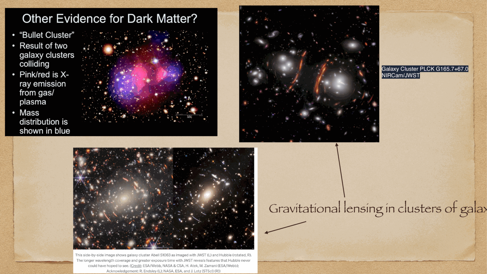
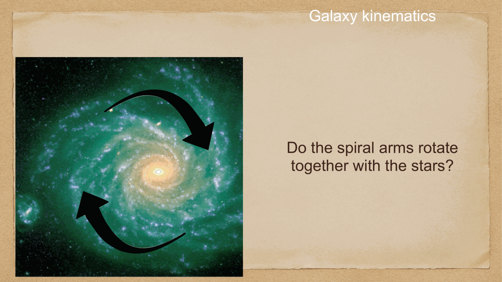
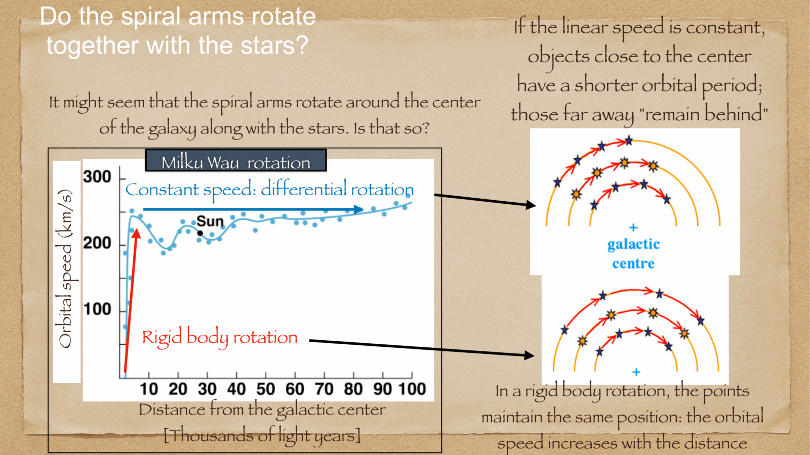
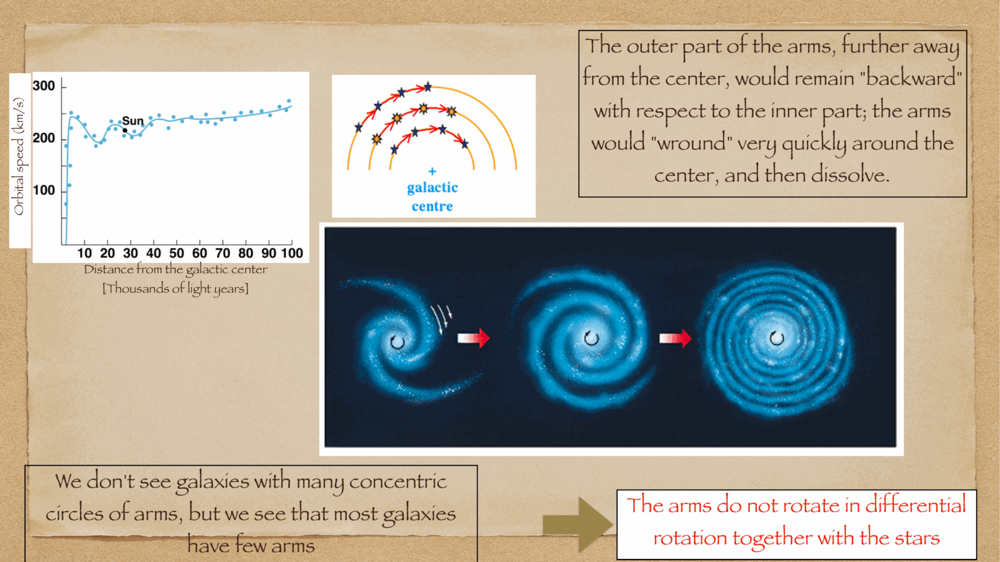
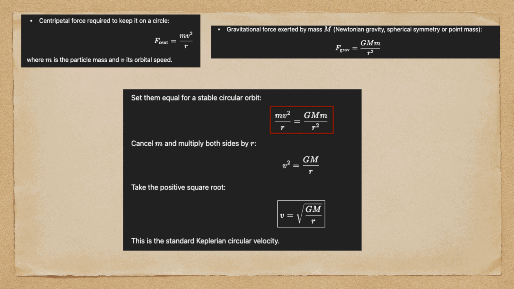
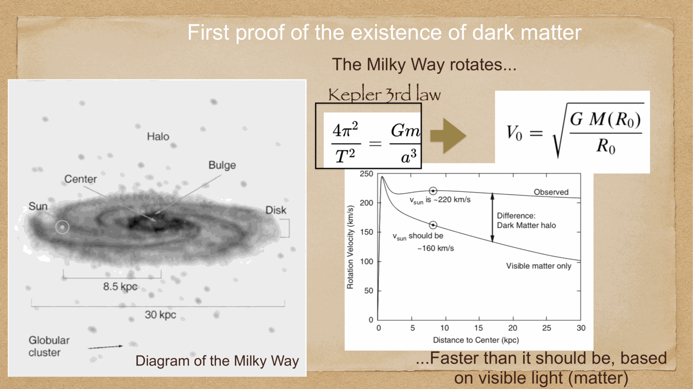
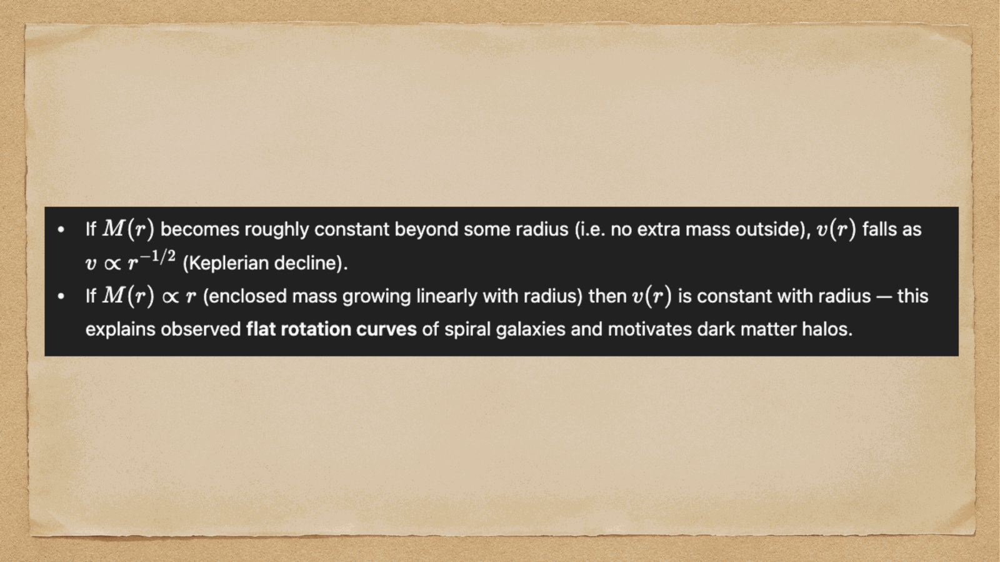
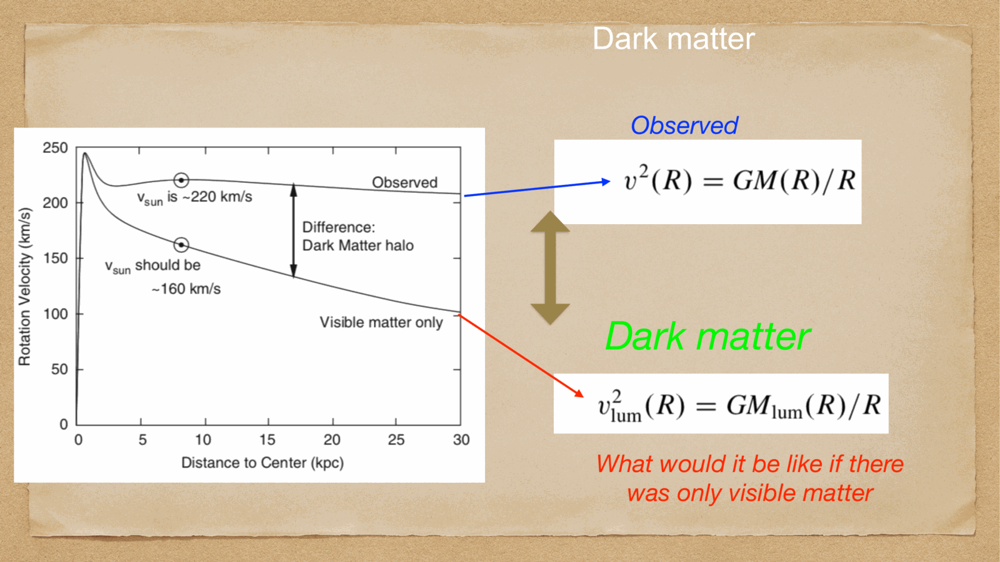
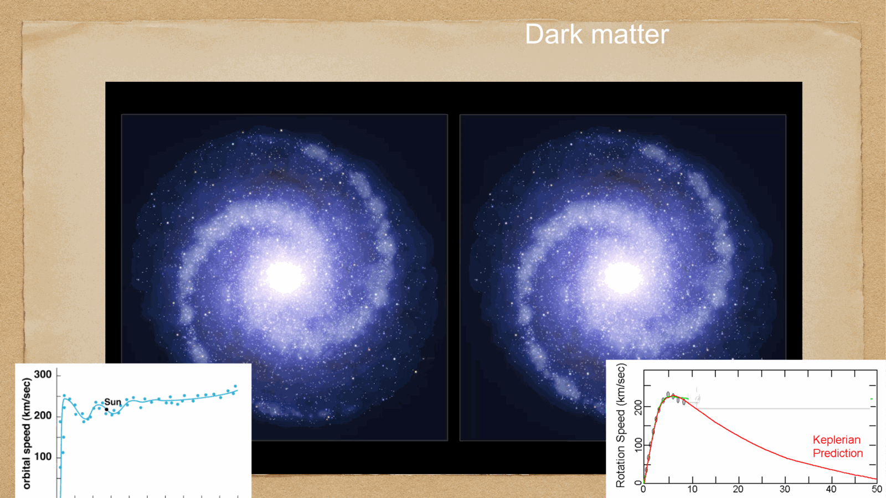


spiral arms are the most visually stunning features of disc galaxies like the Milky Way. tracing them and understanding their physical persistence requires analyzing the **kinematics of Galactic differential rotation** and the physics of **density waves**.

---

## the winding problem (il problema dell'avvolgimento)

in a disk galaxy undergoing differential rotation, the angular velocity $\Omega(R) = V(R)/R$ decreases with radius.
if spiral arms were material structures (composed of the same stars and gas perpetually bound together), the inner parts of the arm would rotate much faster than the outer parts:

$$\Delta\theta(R, t) = [\Omega(R) - \Omega(R_0)] \, t$$

with $V(R) \approx 220$ km/s, the rotation period at $R = 5$ kpc is $\sim 140$ Myr, whereas at $R = 10$ kpc it is $\sim 280$ Myr. in less than 2-3 Galactic rotations ($\sim 500$ Myr $\ll 10$ Gyr), differential rotation would wind the arms into an unrecognizable, tightly wrapped concentric spiral!

yet grand-design spirals with open, loosely wound arms are ubiquitous. this paradox proved that **spiral arms cannot be material entities**.

---

## the Lin-Shu Density Wave Theory (1964)

Chia-Chiao Lin and Frank Shu resolved the winding paradox by proposing that spiral arms are **quasistatic gravitational density waves** propagating through the disk:
- the stars and gas do **not** stay in the arms; they orbit through the arms!
- the spiral pattern rotates rigidly with a constant angular pattern speed $\Omega_p$.
- stars and gas in the inner disk orbit faster than the wave pattern ($\Omega(R) > \Omega_p$), overtake the spiral wave, enter the arm, slow down in the gravitational potential trough, compress, and exit on the other side.

### the star formation trigger:
interstellar gas is compressible. as cold molecular clouds plunge into the gravitational potential minimum of the density wave, the gas experiences a supersonic shock, compressing by factors of $5-10$. 
this compression triggers **Jeans gravitational instability**: clouds collapse and initiate massive starbursts.
- hot, massive O and B stars ($M > 10 M_\odot$) are born inside the arms.
- because their lifetimes are extremely brief ($t_{\text{MS}} \sim 3-10$ Myr), they die in supernovae **before they have time to drift out of the spiral arm**!
- lower-mass stars (like the Sun) live for billions of years, completing multiple passes in and out of spiral arms.
consequence: spiral arms appear brilliantly bright because they are lit up by short-lived O/B stars and fluorescent HII regions, even though the underlying stellar mass enhancement is only $\sim 10-20\%$!

---

## differential rotation and Oort's constants

in the solar neighborhood ($R_0 \approx 8$ kpc, $V_0 \approx 220$ km/s), Jan Oort (1927) derived the radial velocity $v_r$ and proper motion $\mu_l$ of stars relative to the Sun:

$$v_r = A \, d \, \sin(2l) \, \cos^2 b$$
$$v_t = [A \, \cos(2l) + B] \, d \, \cos b$$

where $l$ is Galactic longitude, $d$ is distance, and $A$ and $B$ are the fundamental **Oort Constants**:

$$\boxed{\, A \equiv -\frac{1}{2} R_0 \left(\frac{d\Omega}{dR}\right)_0 = \frac{1}{2} \left(\frac{V_0}{R_0} - \left.\frac{dV}{dR}\right\rvert_0\right) \approx +15 \text{ km s}^{-1}\text{ kpc}^{-1} \,}$$
$$\boxed{\, B \equiv -\frac{1}{2} \left[R_0 \left(\frac{d\Omega}{dR}\right)_0 + 2\Omega_0\right] = -\frac{1}{2} \left(\frac{V_0}{R_0} + \left.\frac{dV}{dR}\right\rvert_0\right) \approx -12 \text{ km s}^{-1}\text{ kpc}^{-1} \,}$$

### physical meaning:
1. $A$ measures **local shear** (differential rotation). if the Galaxy rotated as a rigid body ($V \propto R$), $A = 0$.
2. $B$ measures **local vorticity** (angular momentum gradient).
3. the difference $A - B = \frac{V_0}{R_0} = \Omega_0 \approx 27$ km s$^{-1}$ kpc$^{-1}$ gives the local angular velocity of the Sun.

---

## measuring the Galactic Rotation Curve: the tangent-point method

using radio 21 cm observations of neutral hydrogen (HI), astronomers map the rotation curve $V(R)$ within the solar circle ($R < R_0$, $\lvert l\rvert < 90^\circ$):

along a line of sight at Galactic longitude $l$, the distance from the Galactic Center is $R^2 = R_0^2 + d^2 - 2 R_0 d \cos l$. the closest approach to the center is the **tangent point**, where the line of sight is strictly tangent to the circular orbit:
$$R_{\text{min}} = R_0 \sin l$$

at this tangent point, the entire circular velocity vector points directly toward or away from the Sun, producing the **maximum radial velocity** $v_{r,\text{max}}$ along that sightline:
$$\boxed{\, V(R) = v_{r,\text{max}} + V_0 \sin l \,}$$

by measuring $v_{r,\text{max}}(l)$ as a function of Galactic longitude $l$, radio astronomers directly trace the complete rotation curve $V(R)$ from $R \sim 2$ kpc out to $R_0 = 8$ kpc.

---

## see also

- [Fundamentals_Astrophysics_Cosmology_MOC](../../04_Atlas/Fundamentals_Astrophysics_Cosmology_MOC.html)
- [Milky Way structure](./Milky%20Way%20structure.html)
- [Dark matter on galactic scales](./Dark%20matter%20on%20galactic%20scales.html)
- [Interstellar medium components and gas cycle](./Interstellar%20medium%20components%20and%20gas%20cycle.html)


  <h4 class="backlinks-title">Linked References (6)</h4>
  <ul class="backlinks-list">
    <li class="backlink-item-wrap"><a href="./Dark%20matter%20on%20galactic%20scales.html" class="backlink-item">Dark matter on galactic scales</a></li>
    <li class="backlink-item-wrap"><a href="./Dark%20matter%20rotation%20curves.html" class="backlink-item">Dark matter rotation curves</a></li>
    <li class="backlink-item-wrap"><a href="../../04_Atlas/Fundamentals_Astrophysics_Cosmology_MOC.html" class="backlink-item">Fundamentals_Astrophysics_Cosmology_MOC</a></li>
    <li class="backlink-item-wrap"><a href="./Galactic%20coordinate%20system.html" class="backlink-item">Galactic coordinate system</a></li>
    <li class="backlink-item-wrap"><a href="./Interstellar%20medium%20components%20and%20gas%20cycle.html" class="backlink-item">Interstellar medium components and gas cycle</a></li>
    <li class="backlink-item-wrap"><a href="./Milky%20Way%20structure.html" class="backlink-item">Milky Way structure</a></li>
  </ul>

