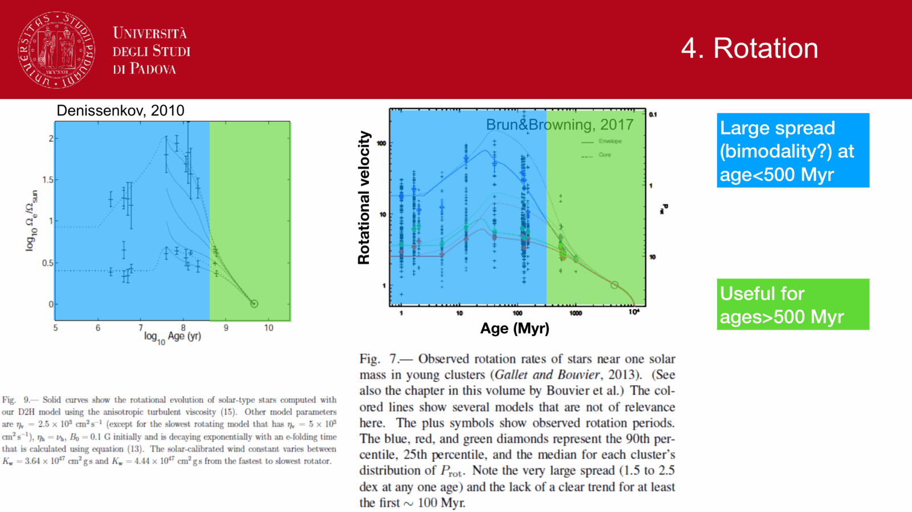
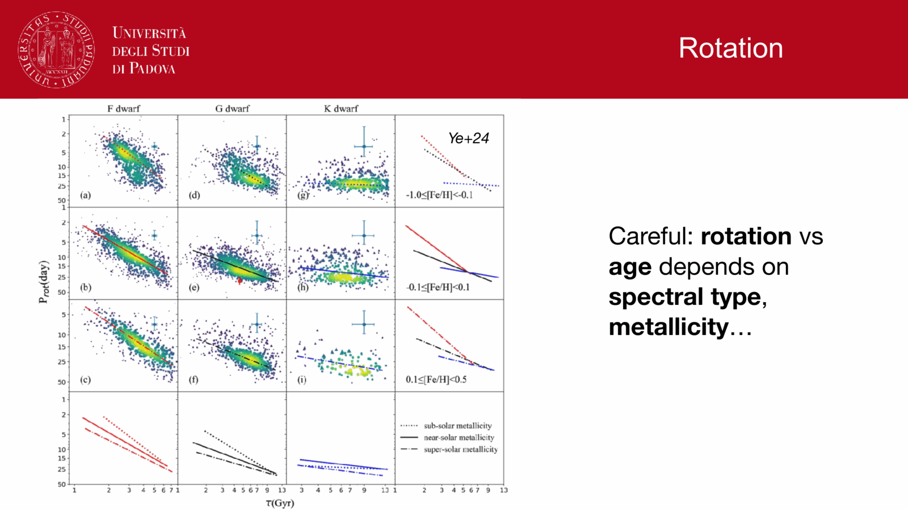
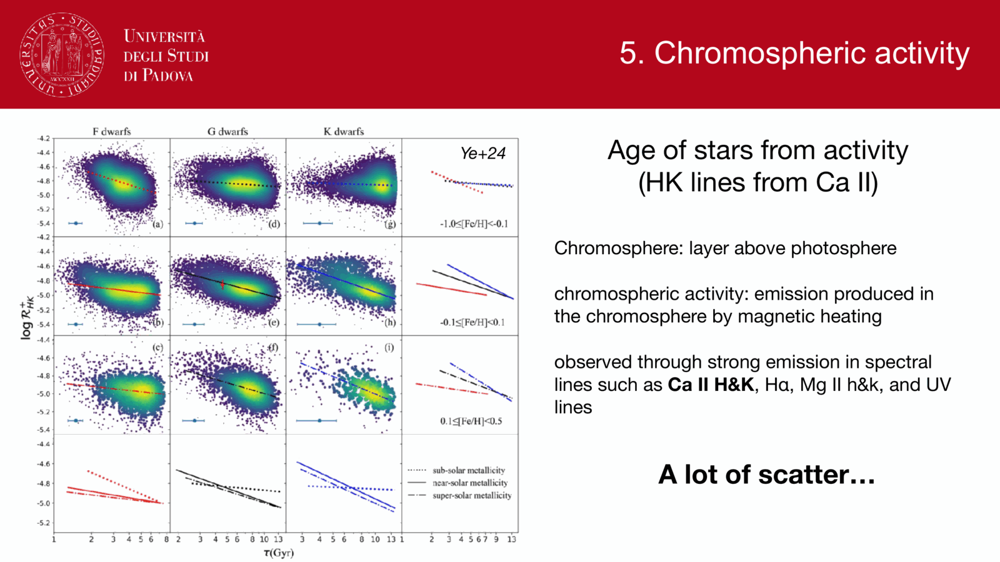
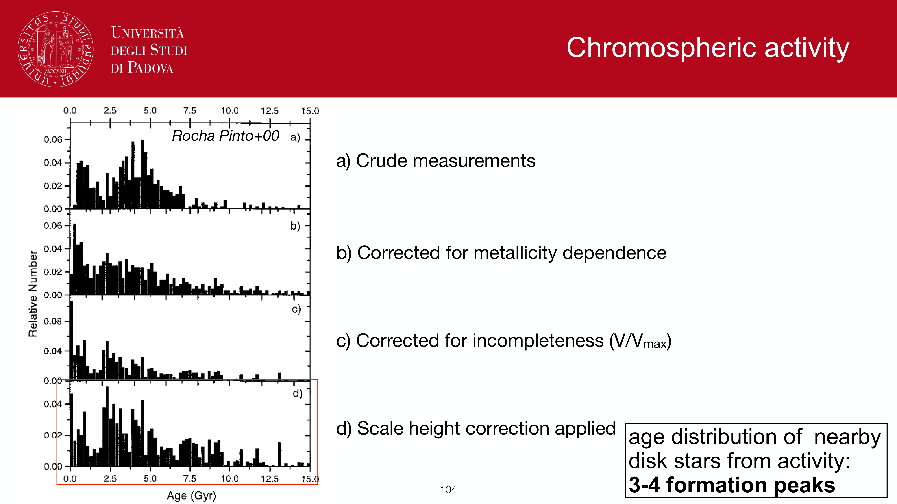
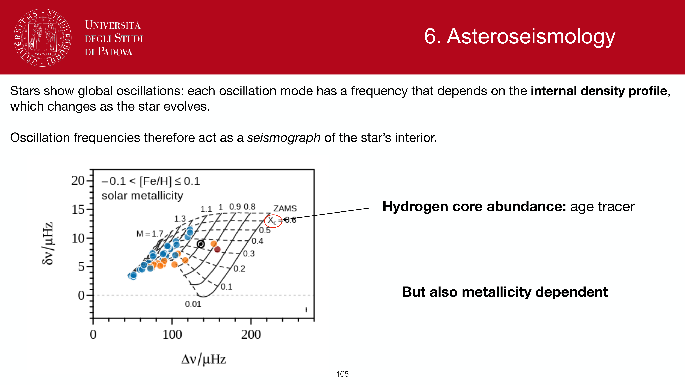
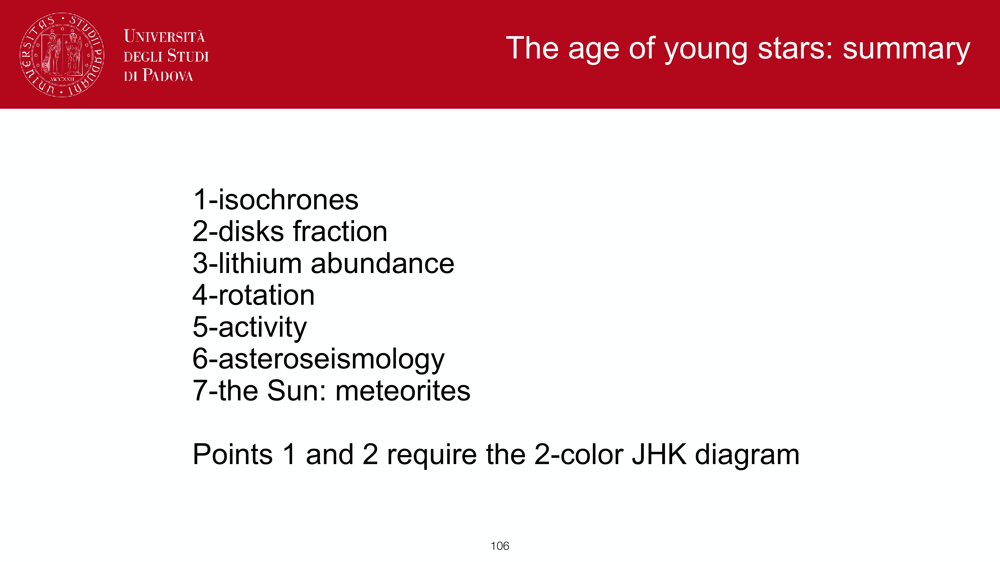

the **star formation history (SFH)** of a galaxy or stellar system is the time-dependent rate of star creation:
$$\psi(t) \equiv \frac{dM_*}{dt} \quad [M_\odot/\text{yr}]$$
as a function of cosmic time $t$ (or lookback time). in unresolved stellar population synthesis, the integrated spectral energy distribution of a galaxy is modeled as the convolution of its SFH with a library of coeval, single-metallicity **single stellar populations (SSPs)**:

$$L_\lambda^{\rm gal}(t) = \int_0^t \psi(t - t')\,L_\lambda^{\rm SSP}(t', Z(t'))\,e^{-\tau_\lambda^{\rm dust}(t')}\,dt'$$

where $t'$ is the age of an individual generation, $Z(t')$ is the chemical enrichment history, and $\tau_\lambda^{\rm dust}(t')$ represents age-dependent dust attenuation.

## mathematical models of SFH

### 1. single stellar population (instantaneous burst)
$$\psi(t) = M_*\,\delta(t - t_0)$$
all stars form at a single epoch $t_0$. this is the fundamental mathematical building block (the Green's function) of population synthesis. it provides an accurate description of star clusters and ancient monolithic ellipticals.

### 2. constant star formation
$$\psi(t) = \psi_0 = \text{const}$$
applicable to late-type spiral and irregular galaxies in dynamic steady state, where gas inflow balances star formation. predicts an SED with persistent, strong rest-frame ultraviolet flux and prominent nebular recombination lines.

### 3. exponentially declining ($\tau$-model)
$$\psi(t) = \frac{M_*}{\tau}\,e^{-t/\tau}$$
where $\tau$ is the characteristic e-folding star-formation timescale. as $\tau \to 0$, it approaches an instantaneous SSP; as $\tau \to \infty$, it approaches constant star formation. historically used as the standard parametrization for early-type galaxies experiencing monotonic gas exhaustion.

### 4. delayed-$\tau$ model
$$\psi(t) = A\,t\,\exp(-t/\tau)$$
rises linearly at early times, peaks at $t = \tau$, and decays exponentially thereafter. physically superior to simple $\tau$-models because it captures the initial growth and gas accumulation phase of proto-galaxies before quenching.

### 5. non-parametric SFH (modern Bayesian approach)
modern SED-fitting pipelines (e.g. Prospector [Leja et al. 2019], BAGPIPES [Carnall et al. 2018]) abandon rigid analytical formulas in favor of flexible step functions:
$$\psi(t) = \sum_{k=1}^{N_{\rm bins}} \psi_k\,\Pi_k(t)$$
where the SFR $\psi_k$ is fit across $N_{\rm bins} \sim 6\text{--}14$ lookback-time bins. Bayesian priors (such as the **continuity prior** penalizing sharp jumps in $\Delta \log \psi$, or **Dirichlet priors**) prevent overfitting while capturing episodic bursts, rejuvenation events, and sharp quenching timescales without model bias.

## multi-wavelength probes and observational timescales

different wavebands probe star formation over vastly different lookback timescales set by the main-sequence lifetimes of the dominating stars:

| observational tracer | waveband | stellar source | active timescale | dust sensitivity |
|---|---|---|---|---|
| **Lyman continuum** | $< 912$ Å | massive O stars ($M \ge 30\,M_\odot$) | $\lesssim 3\text{--}5$ Myr | severe (absorbed by H I) |
| **$\mathrm{H}\alpha$ emission** | $6563$ Å | photoionized H II nebulae around O stars | $\lesssim 10$ Myr | moderate ($A_{\mathrm{H}\alpha} \approx 0.8\,A_V$) |
| **far-UV continuum** | $1500\text{--}2800$ Å | O and early B stars ($M \ge 5\,M_\odot$) | $\sim 10\text{--}100$ Myr | high ($A_{\rm FUV} \approx 2.5\text{--}3\,A_V$) |
| **far-infrared (FIR)** | $8\text{--}1000\,\mu$m | thermal dust re-radiation of young star UV | $\sim 10\text{--}100$ Myr | unobscured tracer (probes dust) |
| **optical continuum** | $4000\text{--}8000$ Å | A, F, G stars | $\sim 100\text{--}1000$ Myr | moderate |
| **near-infrared (NIR)** | $1\text{--}2.5\,\mu$m (K-band) | evolved red giants and low-mass MS stars | integrated cosmic time ($\sim 10$ Gyr) | minimal ($A_K \approx 0.1\,A_V$) |

a robust reconstruction of $\psi(t)$ requires panchromatic coverage combining UV, optical, and infrared data to resolve both recent bursts and underlying ancient mass.

## specific star formation rate and galaxy taxonomy

the ratio of current star formation to accumulated stellar mass defines the **specific star formation rate (sSFR)**:
$$\mathrm{sSFR} \equiv \frac{\mathrm{SFR}}{M_*} \quad [\text{yr}^{-1}]$$
the inverse of sSFR is the **doubling timescale** $t_{\rm double} = 1/\mathrm{sSFR}$. in the local universe:
- **star-forming main sequence (SFMS)**: $\mathrm{sSFR} \sim 10^{-10}\,\text{yr}^{-1}$ ($t_{\rm double} \sim 10$ Gyr, comparable to the Hubble time).
- **starbursts**: $\mathrm{sSFR} \gtrsim 10^{-9}\,\text{yr}^{-1}$ ($t_{\rm double} \lesssim 1$ Gyr).
- **quiescent / quenched galaxies**: $\mathrm{sSFR} \lesssim 10^{-11}\,\text{yr}^{-1}$ ($t_{\rm double} \gg t_H$).

## connection to the cosmic star formation rate density

integrating individual galaxy SFHs over cosmological volumes generates the **cosmic star formation history (CSFH)** (Madau & Dickinson 2014):
$$\rho_{\rm SFR}(z) = 0.015\,\frac{(1+z)^{2.7}}{1 + [(1+z)/2.9]^{5.6}} \quad [M_\odot\,\text{yr}^{-1}\,\text{Mpc}^{-3}]$$
the cosmic star formation rate density peaked at $z \approx 1.9$ ("cosmic noon", $\sim 10$ Gyr ago) and declined by an order of magnitude toward $z = 0$.

## see also

- [[Observational_Astrophysics_MOC]]
- [[Stellar_Astrophysics_MOC]]
- [[Stellar population synthesis]]
- [[Single stellar population SSP]]
- [[SPS code families]]
- [[Initial mass function]]
- [[SED fitting basics]]
- [[SFR tracers from population synthesis]]
- [[Stellar mass estimation in unresolved populations]]
- [[Age estimation in unresolved populations]]

---

## observational astrophysics course slides (Prof. Paolo Cassata)

*Star Formation History (SFH) psi(t): star formation rate as a function of cosmic time.*

*Parametric SFH models: exponentially declining tau-models psi(t) proportional to exp(-t/tau).*

*Delayed tau-models: psi(t) proportional to t * exp(-t/tau) matching early growth and late quenching.*

*Constant star formation and instantaneous burst (delta-function) models.*

*Specific Star Formation Rate (sSFR = SFR / M_*) and galaxy star-forming main sequence.*

*Summary of stellar population synthesis foundations.*

## Linked References

- [[Age estimation in unresolved populations]]
- [[H-alpha SFR tracer]]
- [[IR SFR tracer]]
- [[Photometric redshifts]]
- [[SED fitting basics]]
- [[SFR tracers from population synthesis]]
- [[SPS code families]]
- [[Single stellar population SSP]]
- [[Stellar mass estimation in unresolved populations]]
- [[Stellar population synthesis]]
- [[UV SFR tracer]]
- [[Observational_Astrophysics_MOC]]

