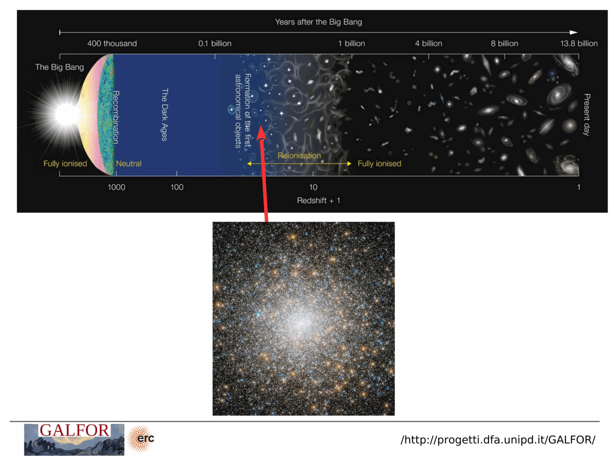
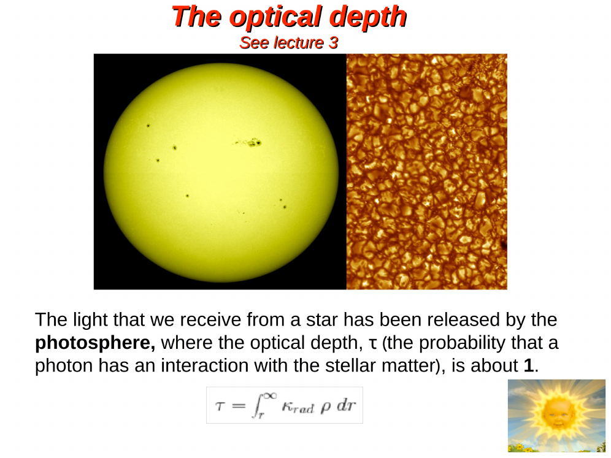
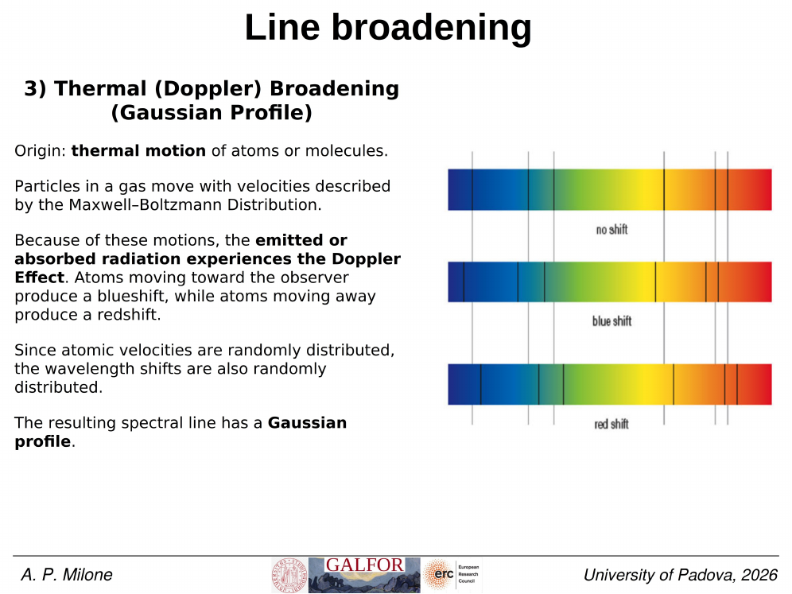
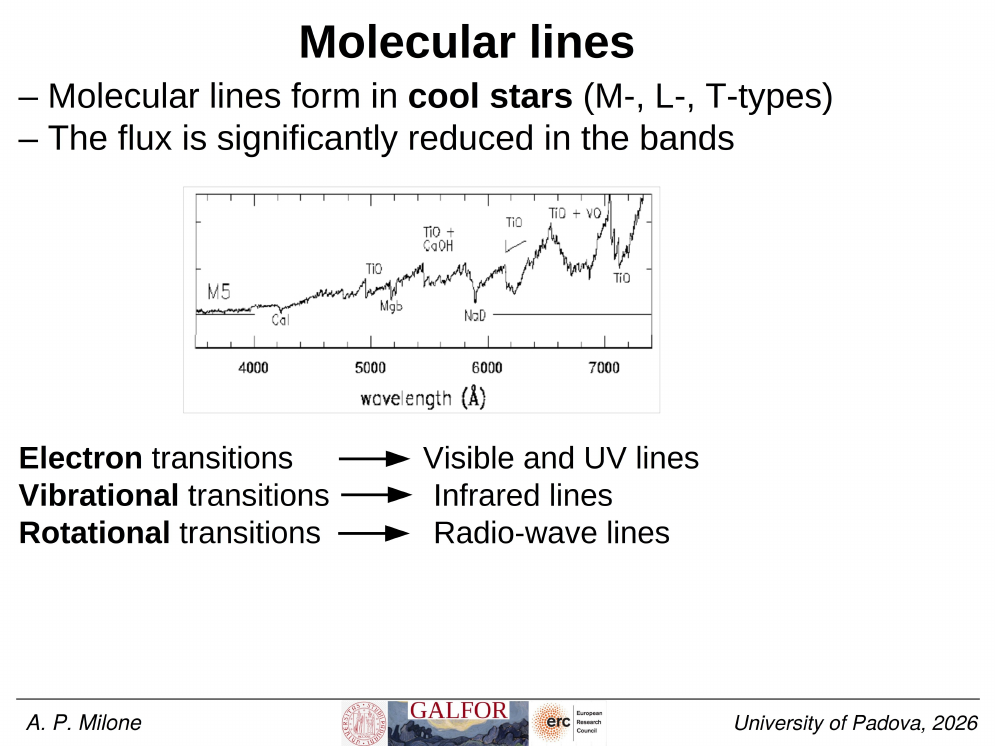
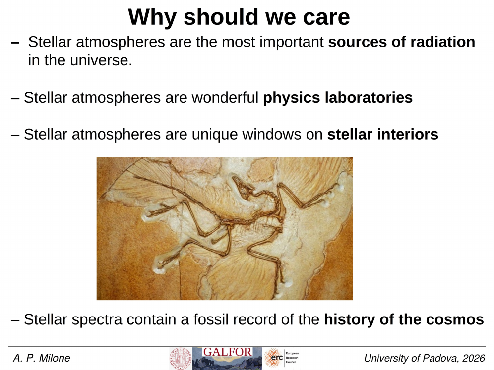


the **stellar atmosphere** is the thin layer where photons are emitted. its $T(\tau)$ profile sets the spectrum. understanding the standard structure (photosphere $\to$ chromosphere $\to$ transition $\to$ corona) gives essential context for any line-formation problem.

## the layers, from deep to shallow

| layer | $\tau$ range | $T$ behaviour | spectrum role |
|---|---|---|---|
| **convection zone / interior** | $\tau \gg 1$ | rises with depth | not seen directly |
| **photosphere** | $\tau \sim 0.001$ to $1$ | smooth $T(\tau)$, declining outward | continuum + most absorption lines |
| **chromosphere** | $\tau \sim 10^{-6}$ to $10^{-4}$ | $T$ rises (counter-intuitive!) | Ca II H+K cores in emission, H$\alpha$ partially in emission |
| **transition region** | $\tau \sim 10^{-7}$ | very steep $T$ rise, $10^4$ to $10^6$ K in $\sim 100$ km | UV emission lines (Si IV, C IV, N V) |
| **corona** | $\tau \sim 10^{-10}$ | $\sim 10^6$ K, very tenuous | X-ray emission, radio bursts |
| **wind / mass loss** | $\tau \to 0$ | various | stellar wind P-Cygni profiles |

## why $T$ rises in the chromosphere

the surprising fact: above the photosphere where $T \sim 6000$ K, the gas gets **hotter** to $\sim 8000$ K (chromosphere) and then $\sim 10^6$ K (corona). this is **non-radiative heating** from:
- **acoustic waves** generated by convection, dissipating in the upper atmosphere.
- **magnetic-wave heating**: Alfvén and slow-mode MHD waves dissipating in coronal loops.
- **magnetic reconnection** in active regions.

the **coronal heating problem** remains a major open problem in solar physics; multiple mechanisms contribute.

## what controls the photosphere

the photosphere is the layer where $\tau \sim 1$ in the continuum. its structure is set by:
- **hydrostatic equilibrium**: $dP/dz = -\rho g$. pressure balances gravity.
- **radiative transfer**: photons carry the energy outward, set $T(\tau)$.
- **chemical composition**: changes opacity, hence $T(\tau)$.
- **convection**: in cool stars, turbulent mixing sets the lower boundary. modelled with mixing-length theory.

modern atmospheric codes (ATLAS9, MARCS, PHOENIX) solve all this self-consistently in 1D plane-parallel or 1D spherical geometry; 3D radiative-MHD codes (Bifrost, CO5BOLD) are state-of-the-art for solar work.

## solar example numbers

| location | $T$ (K) | $n_e$ (cm$^{-3}$) | $\tau$ |
|---|---|---|---|
| photosphere base | 6500 | $10^{14}$ | $1$ |
| photosphere top | 4500 | $10^{12}$ | $10^{-3}$ |
| temperature minimum | 4400 | $10^{11}$ | $10^{-4}$ |
| chromosphere | 10\,000 | $10^{11}$ | $10^{-5}$ |
| transition region | $10^5$ | $10^9$ | $10^{-7}$ |
| corona | $2\times 10^6$ | $10^8$ | $10^{-10}$ |

## what each layer contributes to the spectrum

- **photosphere**: continuum + the bulk of absorption lines.
- **chromosphere**: emission cores in the deepest absorption lines (Ca II H+K, Mg II h+k, H$\alpha$). seen in the Sun in the famous bright cores of Ca II.
- **transition region**: UV resonance lines of intermediate ions (Si IV, C IV, N V).
- **corona**: very high-ionisation forbidden lines ([Fe XIV] $5303$ Å green line, X-ray lines) + thermal X-ray bremsstrahlung.

so a single star's spectrum carries information from many layers: continuum from the photosphere base, line cores from the chromosphere, UV from the transition region, X-rays from the corona.

## the case of the Sun

unique because we can spatially resolve the surface. observations show:
- granulation: convective cells $\sim 1000$ km across.
- spicules and supergranulation: magnetic structures.
- prominences and flares: chromospheric features.
- coronal loops: magnetic loops at $\sim 10^6$ K.

other stars are point sources, but Sun-as-a-star spectroscopy + interferometric resolution of bright stars (Betelgeuse, Antares) extends the picture.

## see also

- [Equation of radiative transfer](./Equation%20of%20radiative%20transfer.html)
- [Optical depth](./Optical%20depth.html)
- [Source function](./Source%20function.html)
- [Eddington-Barbier approximation](./Eddington-Barbier%20approximation.html)
- [Local thermodynamic equilibrium LTE](./Local%20thermodynamic%20equilibrium%20LTE.html)
- [Limb darkening](./Limb%20darkening.html)
- [Continuum opacity sources](./Continuum%20opacity%20sources.html)
- [Stellar structure equations](./Stellar%20structure%20equations.html)
- [Stellar populations I II III](./Stellar%20populations%20I%20II%20III.html)
- [Stellar evolution timescales](./Stellar%20evolution%20timescales.html)

---

## Complete Lecture Slide Panels & Observational Evidence (Lecture 07 — Stellar Spectroscopy I: Atmospheres & Radiative Transfer)

> **Context**: *Stellar atmospheric stratification, optical depth tau, hydrostatic equilibrium, source function, LTE assumption, Boltzmann excitation, and Saha ionization.*

The following slides from Prof. Antonino Milone's lecture series provide the direct observational, photometric, and theoretical foundations for this topic:

*Figure P07-01: LAntonino_p07_01.png — Observational data, CMD morphology, and diagnostics from Lecture 07 — Stellar Spectroscopy I: Atmospheres & Radiative Transfer.*

*Figure P07-02: LAntonino_p07_02.png — Observational data, CMD morphology, and diagnostics from Lecture 07 — Stellar Spectroscopy I: Atmospheres & Radiative Transfer.*

*Figure P07-03: LAntonino_p07_03.png — Observational data, CMD morphology, and diagnostics from Lecture 07 — Stellar Spectroscopy I: Atmospheres & Radiative Transfer.*

*Figure P07-04: LAntonino_p07_04.png — Observational data, CMD morphology, and diagnostics from Lecture 07 — Stellar Spectroscopy I: Atmospheres & Radiative Transfer.*

*Figure P07-05: LAntonino_p07_05.png — Observational data, CMD morphology, and diagnostics from Lecture 07 — Stellar Spectroscopy I: Atmospheres & Radiative Transfer.*

*Figure P07-06: LAntonino_p07_06.png — Observational data, CMD morphology, and diagnostics from Lecture 07 — Stellar Spectroscopy I: Atmospheres & Radiative Transfer.*

*Figure P07-07: LAntonino_p07_07.png — Observational data, CMD morphology, and diagnostics from Lecture 07 — Stellar Spectroscopy I: Atmospheres & Radiative Transfer.*

*Figure P07-08: LAntonino_p07_08.png — Observational data, CMD morphology, and diagnostics from Lecture 07 — Stellar Spectroscopy I: Atmospheres & Radiative Transfer.*

*Figure P07-09: LAntonino_p07_09.png — Observational data, CMD morphology, and diagnostics from Lecture 07 — Stellar Spectroscopy I: Atmospheres & Radiative Transfer.*

*Figure P07-10: LAntonino_p07_10.png — Observational data, CMD morphology, and diagnostics from Lecture 07 — Stellar Spectroscopy I: Atmospheres & Radiative Transfer.*

*Figure P07-11: LAntonino_p07_11.png — Observational data, CMD morphology, and diagnostics from Lecture 07 — Stellar Spectroscopy I: Atmospheres & Radiative Transfer.*

*Figure P07-12: LAntonino_p07_12.png — Observational data, CMD morphology, and diagnostics from Lecture 07 — Stellar Spectroscopy I: Atmospheres & Radiative Transfer.*

*Figure P07-13: LAntonino_p07_13.png — Observational data, CMD morphology, and diagnostics from Lecture 07 — Stellar Spectroscopy I: Atmospheres & Radiative Transfer.*

*Figure P07-14: LAntonino_p07_14.png — Observational data, CMD morphology, and diagnostics from Lecture 07 — Stellar Spectroscopy I: Atmospheres & Radiative Transfer.*

*Figure P07-15: LAntonino_p07_15.png — Observational data, CMD morphology, and diagnostics from Lecture 07 — Stellar Spectroscopy I: Atmospheres & Radiative Transfer.*

*Figure P07-16: LAntonino_p07_16.png — Observational data, CMD morphology, and diagnostics from Lecture 07 — Stellar Spectroscopy I: Atmospheres & Radiative Transfer.*

*Figure P07-17: LAntonino_p07_17.png — Observational data, CMD morphology, and diagnostics from Lecture 07 — Stellar Spectroscopy I: Atmospheres & Radiative Transfer.*

*Figure P07-18: LAntonino_p07_18.png — Observational data, CMD morphology, and diagnostics from Lecture 07 — Stellar Spectroscopy I: Atmospheres & Radiative Transfer.*

*Figure P07-19: LAntonino_p07_19.png — Observational data, CMD morphology, and diagnostics from Lecture 07 — Stellar Spectroscopy I: Atmospheres & Radiative Transfer.*

*Figure P07-20: LAntonino_p07_20.png — Observational data, CMD morphology, and diagnostics from Lecture 07 — Stellar Spectroscopy I: Atmospheres & Radiative Transfer.*

*Figure P07-21: LAntonino_p07_21.png — Observational data, CMD morphology, and diagnostics from Lecture 07 — Stellar Spectroscopy I: Atmospheres & Radiative Transfer.*

*Figure P07-22: LAntonino_p07_22.png — Observational data, CMD morphology, and diagnostics from Lecture 07 — Stellar Spectroscopy I: Atmospheres & Radiative Transfer.*

*Figure P07-23: LAntonino_p07_23.png — Observational data, CMD morphology, and diagnostics from Lecture 07 — Stellar Spectroscopy I: Atmospheres & Radiative Transfer.*

*Figure P07-24: LAntonino_p07_24.png — Observational data, CMD morphology, and diagnostics from Lecture 07 — Stellar Spectroscopy I: Atmospheres & Radiative Transfer.*

*Figure P07-25: LAntonino_p07_25.png — Observational data, CMD morphology, and diagnostics from Lecture 07 — Stellar Spectroscopy I: Atmospheres & Radiative Transfer.*

*Figure P07-26: Lecture07_p15-15.png — Observational data, CMD morphology, and diagnostics from Lecture 07 — Stellar Spectroscopy I: Atmospheres & Radiative Transfer.*

*Figure P07-27: Lecture07_p25-25.png — Observational data, CMD morphology, and diagnostics from Lecture 07 — Stellar Spectroscopy I: Atmospheres & Radiative Transfer.*

*Figure P07-28: Lecture07_p35-35.png — Observational data, CMD morphology, and diagnostics from Lecture 07 — Stellar Spectroscopy I: Atmospheres & Radiative Transfer.*

*Figure P07-29: Lecture07_p5-05.png — Observational data, CMD morphology, and diagnostics from Lecture 07 — Stellar Spectroscopy I: Atmospheres & Radiative Transfer.*


  <h4 class="backlinks-title">Linked References (19)</h4>
  <ul class="backlinks-list">
    <li class="backlink-item-wrap"><a href="../../04_Atlas/Astronomical_Spectroscopy_MOC.html" class="backlink-item">Astronomical_Spectroscopy_MOC</a></li>
    <li class="backlink-item-wrap"><a href="interf/Atmospheric%20parameters%20Teff%20log%20g%20feh%20vmicro.html" class="backlink-item">Atmospheric parameters Teff log g feh vmicro</a></li>
    <li class="backlink-item-wrap"><a href="./Atmospheric%20parameters%20Teff%20log%20g%20feh%20vmicro.html" class="backlink-item">Atmospheric parameters Teff log g feh vmicro</a></li>
    <li class="backlink-item-wrap"><a href="./Collisional%20pressure%20broadening.html" class="backlink-item">Collisional pressure broadening</a></li>
    <li class="backlink-item-wrap"><a href="./Continuum%20opacity%20sources.html" class="backlink-item">Continuum opacity sources</a></li>
    <li class="backlink-item-wrap"><a href="./Curve%20of%20growth%20abundance%20analysis.html" class="backlink-item">Curve of growth abundance analysis</a></li>
    <li class="backlink-item-wrap"><a href="./Eddington-Barbier%20approximation.html" class="backlink-item">Eddington-Barbier approximation</a></li>
    <li class="backlink-item-wrap"><a href="./Equation%20of%20radiative%20transfer.html" class="backlink-item">Equation of radiative transfer</a></li>
    <li class="backlink-item-wrap"><a href="./Helium%20spread%20in%20GCs.html" class="backlink-item">Helium spread in GCs</a></li>
    <li class="backlink-item-wrap"><a href="./Limb%20darkening.html" class="backlink-item">Limb darkening</a></li>
    <li class="backlink-item-wrap"><a href="./Local%20thermodynamic%20equilibrium%20LTE.html" class="backlink-item">Local thermodynamic equilibrium LTE</a></li>
    <li class="backlink-item-wrap"><a href="./Optical%20depth.html" class="backlink-item">Optical depth</a></li>
    <li class="backlink-item-wrap"><a href="./Photometric%20chromosome%20maps.html" class="backlink-item">Photometric chromosome maps</a></li>
    <li class="backlink-item-wrap"><a href="./Source%20function.html" class="backlink-item">Source function</a></li>
    <li class="backlink-item-wrap"><a href="./Spectroscopic%20determination%20of%20log%20g.html" class="backlink-item">Spectroscopic determination of log g</a></li>
    <li class="backlink-item-wrap"><a href="./Stark%20broadening.html" class="backlink-item">Stark broadening</a></li>
    <li class="backlink-item-wrap"><a href="./Stellar%20rotation%20v%20sini.html" class="backlink-item">Stellar rotation v sini</a></li>
    <li class="backlink-item-wrap"><a href="../../04_Atlas/Stellar_Astrophysics_MOC.html" class="backlink-item">Stellar_Astrophysics_MOC</a></li>
    <li class="backlink-item-wrap"><a href="./Thermal%20continuum%20from%20stellar%20photosphere.html" class="backlink-item">Thermal continuum from stellar photosphere</a></li>
  </ul>

