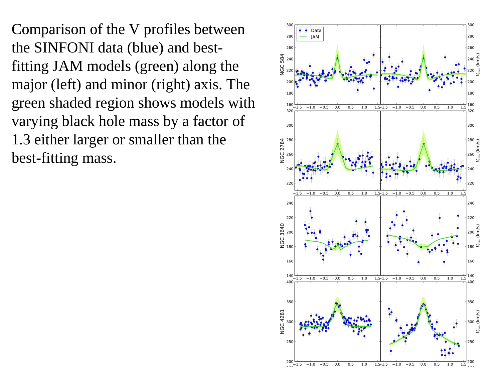
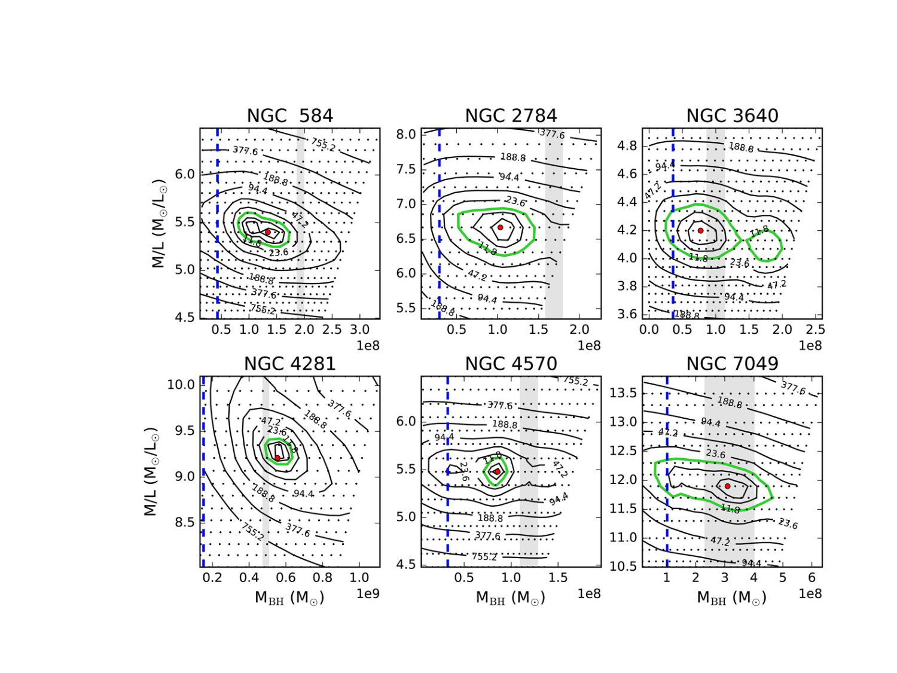
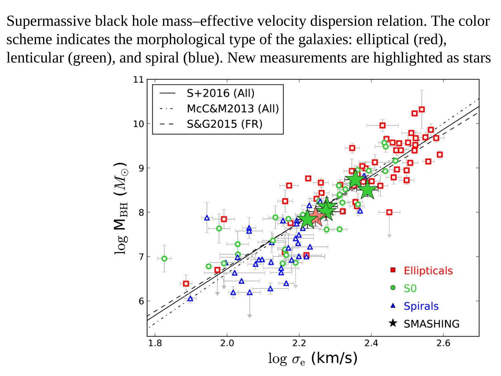
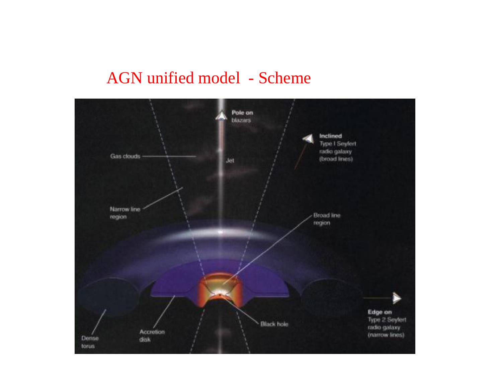
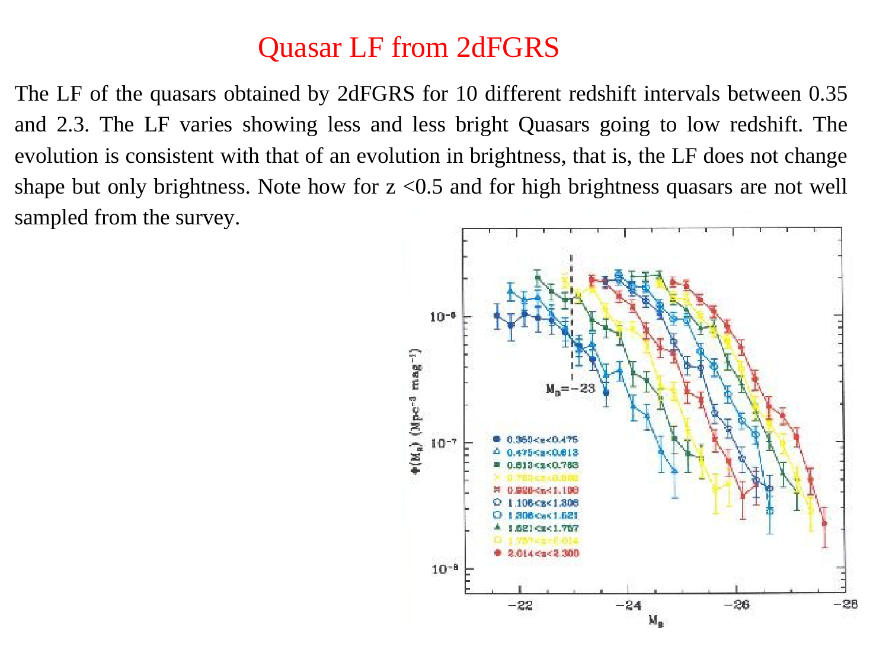
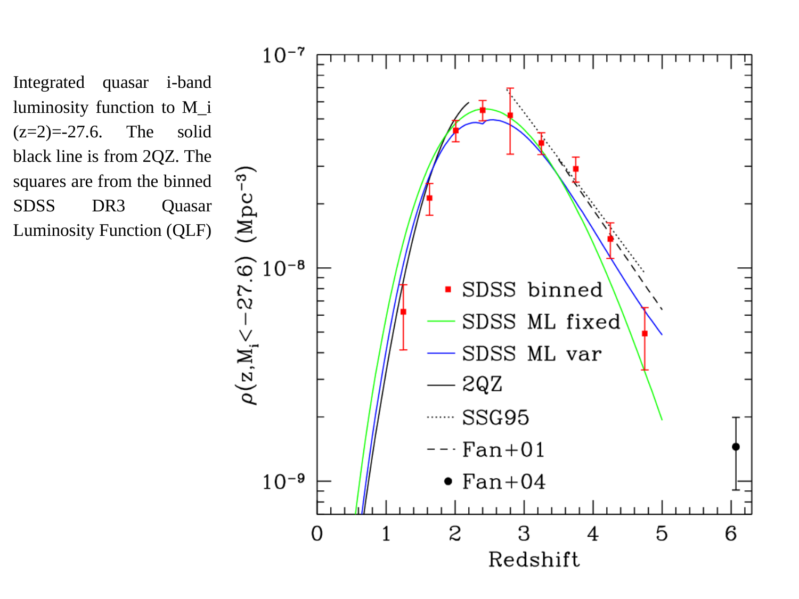
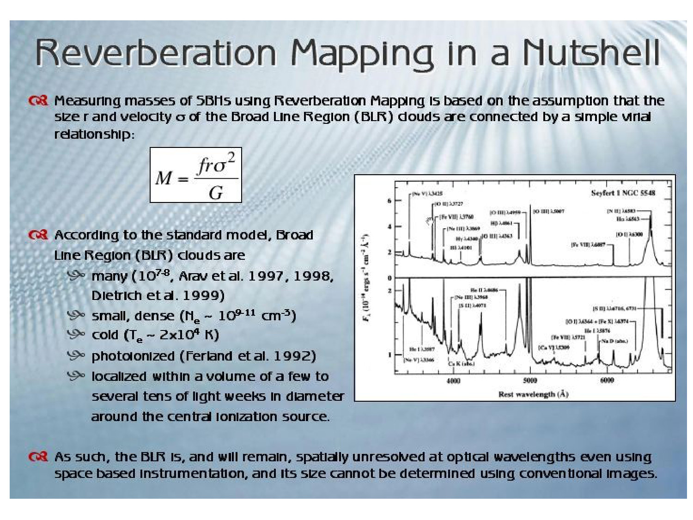
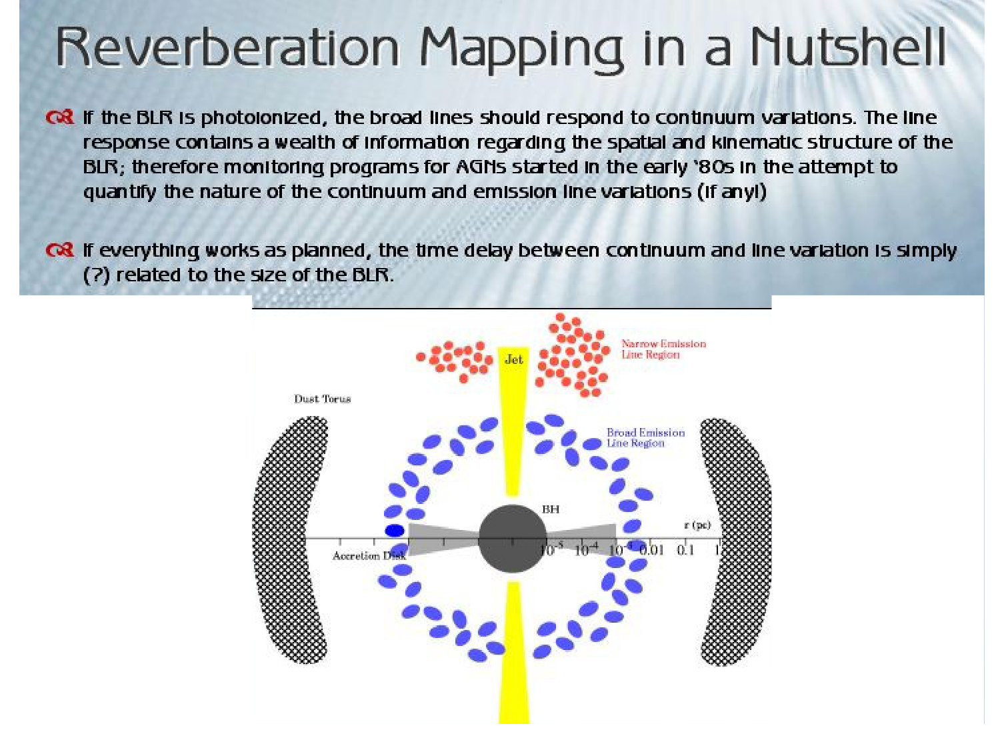

# Stellar Dynamics SMBH Masses

Parent [[Astrophysics_of_Galaxies_MOC]] · [[LOSVD]] · [[M sigma relation]]

## 1. Physical Principle and Gravitational Sphere of Influence

Measuring supermassive black hole (SMBH) masses via stellar dynamics relies on modeling the gravitational influence of a central dark point mass on the orbits of surrounding stars in galactic nuclei.

In the core of a galaxy, the total gravitational potential $\Phi_{\text{tot}}(\mathbf{r})$ is generated by three components
$$\Phi_{\text{tot}}(\mathbf{r}) = \Phi_*(\mathbf{r}) + \Phi_{\text{DM}}(\mathbf{r}) - \frac{G M_{\text{BH}}}{r}$$
where $\Phi_*(\mathbf{r})$ is the potential of the stellar distribution, $\Phi_{\text{DM}}(\mathbf{r})$ is the dark matter halo potential (typically negligible in the inner tens of parsecs), and $-G M_{\text{BH}} / r$ is the Keplerian point-mass potential of the supermassive black hole.

### The Sphere of Influence Resolution Requirement

The gravitational sphere of influence $r_{\text{infl}}$ demarcates the physical boundary within which the gravity of the black hole exceeds the gravitational potential of the distributed nuclear stars.

Following the standard kinematic definition, the sphere of influence is defined by
$$r_{\text{infl}} \equiv \frac{G M_{\text{BH}}}{\sigma_*^2}$$
where $\sigma_*$ represents the one-dimensional stellar velocity dispersion of the host galaxy bulge outside the immediate influence of the black hole.

Evaluating this relation in convenient astronomical units yields
$$r_{\text{infl}} \approx 10.75 \text{ pc} \left(\frac{M_{\text{BH}}}{10^8 M_\odot}\right) \left(\frac{\sigma_*}{200 \text{ km s}^{-1}}\right)^{-2}$$

At a distance $D$ from Earth, the corresponding angular radius subtended on the sky is
$$\theta_{\text{infl}} = \frac{r_{\text{infl}}}{D} \approx 0.111'' \left(\frac{M_{\text{BH}}}{10^8 M_\odot}\right) \left(\frac{\sigma_*}{200 \text{ km s}^{-1}}\right)^{-2} \left(\frac{D}{20 \text{ Mpc}}\right)^{-1}$$

Resolution criterion for unambiguous detection - To infer $M_{\text{BH}}$ reliably without catastrophic systematics, the observational spatial resolution (effective point spread function full-width at half-maximum, $\text{FWHM}$) must resolve the sphere of influence
$$\text{FWHM} \lesssim r_{\text{infl}}$$

If the observations do not resolve $r_{\text{infl}}$, the kinematic signature of the black hole is heavily diluted by foreground and background stars orbiting in the stellar potential, leading to severe degeneracies between $M_{\text{BH}}$ and the stellar mass-to-light ratio $M/L_*$.

Representative spheres of influence across cosmic distance
- Sagittarius A* in the Milky Way - $M_{\text{BH}} \approx 4.3 \times 10^6 M_\odot$, $\sigma_* \approx 100 \text{ km s}^{-1}$, $D \approx 8.2 \text{ kpc}$, yielding $r_{\text{infl}} \approx 1.8 \text{ pc}$ (angular size $\theta_{\text{infl}} \approx 45''$, fully resolved).
- Andromeda (M31) - $M_{\text{BH}} \approx 1.4 \times 10^8 M_\odot$, $\sigma_* \approx 160 \text{ km s}^{-1}$, $D \approx 0.78 \text{ Mpc}$, yielding $r_{\text{infl}} \approx 23 \text{ pc}$ (angular size $\theta_{\text{infl}} \approx 6.1''$, fully resolved).
- Messier 87 (NGC 4486) - $M_{\text{BH}} \approx 6.5 \times 10^9 M_\odot$, $\sigma_* \approx 320 \text{ km s}^{-1}$, $D \approx 16.8 \text{ Mpc}$, yielding $r_{\text{infl}} \approx 280 \text{ pc}$ (angular size $\theta_{\text{infl}} \approx 3.4''$, fully resolved by HST and ground-based AO).

## 2. Mathematical Derivation of the Spherical Jeans Modeling

Stars in elliptical galaxies and bulges constitute a collisionless system governed by the Collisionless Boltzmann Equation (CBE)
$$\frac{\partial f}{\partial t} + \mathbf{v} \cdot \nabla f - \nabla \Phi_{\text{tot}} \cdot \frac{\partial f}{\partial \mathbf{v}} = 0$$
where $f(\mathbf{x}, \mathbf{v}, t)$ is the phase-space distribution function.

In steady state ($\partial f / \partial t = 0$) and spherical symmetry, the distribution function depends only on spherical coordinates $(r, v_r, v_\theta, v_\phi)$. Multiplying the CBE by radial velocity $v_r$ and integrating over all velocity space $\int d^3\mathbf{v}$ yields the fundamental radial Jeans equation
$$\frac{d}{dr}\left(\nu \sigma_r^2\right) + \frac{2\beta(r)}{r} \nu \sigma_r^2 = -\nu \frac{d\Phi_{\text{tot}}}{dr} = -\frac{G \nu(r) M(r)}{r^2}$$

Here the physical quantities are defined as
- $\nu(r)$ is the 3D tracer luminosity density (or stellar number density), obtained by deprojecting the observed surface brightness profile $I(R)$ via the Abel inversion integral.
- $\sigma_r^2(r) = \langle v_r^2 \rangle$ is the radial velocity dispersion.
- $M(r) = M_*(r) + M_{\text{BH}}$ is the total enclosed mass within sphere of radius $r$.
- $\beta(r)$ is Binney's velocity anisotropy parameter
$$\beta(r) \equiv 1 - \frac{\sigma_\theta^2(r) + \sigma_\phi^2(r)}{2\sigma_r^2(r)} = 1 - \frac{\sigma_t^2(r)}{\sigma_r^2(r)}$$
where $\sigma_t = \sqrt{(\sigma_\theta^2 + \sigma_\phi^2)/2}$ is the tangential velocity dispersion.

The anisotropy parameter characterizes orbital geometry
- $\beta = 0$ corresponds to an isotropic velocity distribution ($\sigma_r = \sigma_\theta = \sigma_\phi$).
- $\beta > 0$ corresponds to radially biased orbits (in the extreme limit $\beta = 1$, purely radial trajectories).
- $\beta < 0$ corresponds to tangentially biased orbits (in the extreme limit $\beta \to -\infty$, circular trajectories).

### Unbroken Integration of the Radial Jeans Equation

To solve the differential equation for the radial stress $\nu \sigma_r^2$, we employ the method of integrating factors.

First, write the linear first-order differential equation in standard form
$$\frac{d}{dr}\left(\nu \sigma_r^2\right) + P(r) \left(\nu \sigma_r^2\right) = Q(r)$$
where
$$P(r) = \frac{2\beta(r)}{r}, \quad Q(r) = -\frac{G \nu(r) M(r)}{r^2}$$

Define the integrating factor $\mu(r)$
$$\mu(r) = \exp\left(\int_{r_0}^r P(r') dr'\right) = \exp\left(\int_{r_0}^r \frac{2\beta(r')}{r'} dr'\right)$$

Multiplying both sides of the differential equation by $\mu(r)$ transforms the left-hand side into an exact total derivative
$$\frac{d}{dr} \left[ \mu(r) \nu(r) \sigma_r^2(r) \right] = \mu(r) Q(r) = -\mu(r) \frac{G \nu(r) M(r)}{r^2}$$

Now integrate both sides from radius $r$ to infinity $\infty$
$$\int_r^\infty \frac{d}{dr'} \left[ \mu(r') \nu(r') \sigma_r^2(r') \right] dr' = -\int_r^\infty \mu(r') \frac{G \nu(r') M(r')}{r'^2} dr'$$

Evaluating the definite integral on the left-hand side yields
$$\left[ \mu(r') \nu(r') \sigma_r^2(r') \right]_r^\infty = \lim_{r' \to \infty} \mu(r') \nu(r') \sigma_r^2(r') - \mu(r) \nu(r) \sigma_r^2(r)$$

Applying the physical boundary condition for bound, isolated stellar systems, the stellar density falls rapidly at infinity so that $\lim_{r' \to \infty} \nu(r') \sigma_r^2(r') = 0$.

Therefore, the equation simplifies to
$$- \mu(r) \nu(r) \sigma_r^2(r) = -\int_r^\infty \mu(r') \frac{G \nu(r') M(r')}{r'^2} dr'$$

Dividing through by $-\mu(r)$ yields the exact unbroken solution for the 3D radial velocity dispersion
$$\nu(r) \sigma_r^2(r) = \frac{1}{\mu(r)} \int_r^\infty \mu(r') \frac{G \nu(r') M(r')}{r'^2} dr'$$

In the special case of constant anisotropy $\beta = \text{const}$, the integrating factor simplifies analytically
$$\mu(r) = \exp\left(2\beta \int_{r_0}^r \frac{dr'}{r'}\right) = \exp(2\beta [\ln r - \ln r_0]) = \left(\frac{r}{r_0}\right)^{2\beta}$$

Substituting this back into the solution cancels the arbitrary scale $r_0$
$$\nu(r) \sigma_r^2(r) = r^{-2\beta} \int_r^\infty r'^{2\beta} \frac{G \nu(r') M(r')}{r'^2} dr'$$

When a central black hole is present, $M(r') = M_*(r') + M_{\text{BH}}$. Splitting the integral reveals the specific contribution from the central point mass
$$\nu(r) \sigma_r^2(r) = r^{-2\beta} \int_r^\infty r'^{2\beta} \frac{G \nu(r') M_*(r')}{r'^2} dr' + G M_{\text{BH}} r^{-2\beta} \int_r^\infty \nu(r') r'^{2\beta - 2} dr'$$

### Projection Along the Line of Sight

Astronomers do not observe $\sigma_r(r)$ directly. Instead, spectroscopy measures the line-of-sight velocity dispersion $\sigma_{\text{LOS}}(R)$ projected at projected radius $R$ on the sky plane.

Integrating the velocity dispersion components along the line of sight $z = \sqrt{r^2 - R^2}$ with line element $dz = r dr / \sqrt{r^2 - R^2}$ gives
$$I(R) \sigma_{\text{LOS}}^2(R) = 2 \int_R^\infty \left(1 - \beta(r) \frac{R^2}{r^2}\right) \nu(r) \sigma_r^2(r) \frac{r dr}{\sqrt{r^2 - R^2}}$$
where $I(R) = 2 \int_R^\infty \nu(r) \frac{r dr}{\sqrt{r^2 - R^2}}$ is the projected surface brightness.

## 3. The Mass-Anisotropy Degeneracy and the M87 Paradox

The Jeans equation reveals a fundamental ambiguity known as the mass-anisotropy degeneracy.

Because $\sigma_{\text{LOS}}(R)$ depends on both the mass profile $M(r)$ and the anisotropy parameter $\beta(r)$ under two nested integrals, mathematically distinct physical combinations of $M(r)$ and $\beta(r)$ can produce identical projected line-of-sight velocity dispersion profiles $\sigma_{\text{LOS}}(R)$.

In particular, a steep rise in $\sigma_{\text{LOS}}(R)$ toward the center can be generated by either
1. A true central point mass $M_{\text{BH}}$ with an isotropic velocity distribution ($\beta \approx 0$).
2. No central mass at all ($M_{\text{BH}} = 0$), but with strongly radially biased stellar orbits ($\beta > 0$) in the nucleus. Radially biased stars plunge deep into the core on eccentric orbits, projecting their high periastron radial velocities along the line of sight when viewed near the center.

### Historical Demonstration. The M87 Controversy

This degeneracy played a celebrated role in the history of SMBH discovery in Messier 87 (NGC 4486)
- Sargent et al. (1978) obtained long-slit spectroscopy showing that $\sigma_{\text{LOS}}$ rises sharply from $280 \text{ km s}^{-1}$ at $R = 10''$ to over $400 \text{ km s}^{-1}$ in the inner $1''$. Assuming an isotropic distribution ($\beta = 0$), they concluded that M87 hosts a central black hole with mass $M_{\text{BH}} \approx 5 \times 10^9 M_\odot$.
- Binney and Mamon (1982) demonstrated mathematically that one can set $M_{\text{BH}} = 0$ exactly and reproduce the identical observed $\sigma_{\text{LOS}}(R)$ profile by adopting an anisotropic model where $\beta(r)$ shifts from isotropic in the outer parts to radially anisotropic ($\beta \sim 0.5 - 0.7$) in the core.
- van der Marel (1994) reanalyzed all existing one-dimensional long-slit data and proved rigorously that long-slit spectroscopy alone cannot distinguish between a black hole model and an anisotropic no-black-hole model.

Conclusion - One-dimensional long-slit spectroscopy measuring only $\sigma_{\text{LOS}}(R)$ is mathematically insufficient to prove the existence of a black hole. Higher-dimensional kinematic data are mandatory.

## 4. Breaking the Degeneracy. IFU Spectroscopy and Advanced Modeling

To break the mass-anisotropy degeneracy, modern astrophysics employs two complementary advances.

### Advance 1. Line-of-Sight Velocity Distribution (LOSVD) Higher Moments

Instead of measuring only the root-mean-square dispersion $\sigma_{\text{LOS}}$, modern pixel-fitting algorithms (such as pPXF) extract the full non-Gaussian shape of the absorption line profiles using a Gauss-Hermite expansion
$$\mathcal{L}(v) = \frac{e^{-y^2/2}}{\sqrt{2\pi}\sigma} \left[ 1 + h_3 H_3(y) + h_4 H_4(y) \right]$$
where $y = (v - V) / \sigma$, and $H_3, H_4$ are the Hermite polynomials.

The fourth Gauss-Hermite moment $h_4$ quantifies the symmetric deviation from a Gaussian (kurtosis)
- Radial orbital anisotropy ($\beta > 0$) causes a pronounced peak with extended broad wings, producing a positive kurtosis ($h_4 > 0$).
- Tangential orbital anisotropy ($\beta < 0$) produces a flat-topped or boxy velocity distribution, resulting in a negative kurtosis ($h_4 < 0$).
- A central black hole with isotropic orbits increases $\sigma$ while maintaining near-zero or slightly negative $h_4$ in the core.

Measuring $h_4(R)$ alongside $\sigma(R)$ provides the mathematical leverage to separate radial anisotropy from a central gravitational point mass.

### Advance 2. Schwarzschild's Orbit Superposition Method

Schwarzschild's (1979) method represents the gold standard for stellar dynamical mass determination. It does not rely on ad-hoc assumptions about the velocity anisotropy $\beta(r)$.

The step-by-step Schwarzschild procedure operates as follows
1. Deproject the surface brightness - Construct an axisymmetric or triaxial 3D stellar luminosity density $\nu(\mathbf{r})$ from high-resolution HST and ground-based imaging.
2. Formulate the trial gravitational potential - Compute the total potential $\Phi(\mathbf{r}) = (M/L)_* \Phi_*(\mathbf{r}) + \Phi_{\text{DM}}(\mathbf{r}) - G M_{\text{BH}} / r$ for fixed trial values of $(M_{\text{BH}}, (M/L)_*)$.
3. Integrate the orbit library - Numerically integrate a comprehensive library of tens of thousands of individual stellar orbits (spanning box orbits, tube orbits, and chaotic orbits) in the trial potential over thousands of orbital periods.
4. Calculate orbital observables - For each orbit $k$, determine the fraction of time spent in each spatial grid cell $i$ and each line-of-sight velocity bin $j$, generating the orbital kinematic matrix $B_{ijk}$.
5. Solve for non-negative weights - Find non-negative orbital weights $w_k \ge 0$ that reproduce both the stellar density and the observed kinematic observables ($V, \sigma, h_3, h_4$) by minimizing
$$\chi^2 = \sum_{\text{apertures}} \left[ \frac{\text{Data} - \sum_k w_k \text{Model}_k}{\text{Error}} \right]^2$$
subject to the physical constraint $w_k \ge 0$ using quadratic programming.
6. Grid search - Repeat the optimization over a two-dimensional parameter grid of $(M_{\text{BH}}, (M/L)_*)$ to construct $\chi^2$ confidence contours. The minimum of $\chi^2(M_{\text{BH}}, M/L_*)$ uniquely determines the best-fit black hole mass and its statistical uncertainty.

### Advance 3. Jeans Anisotropic Modeling (JAM)

Developed by Michele Cappellari (2008), the JAM method solves the two-dimensional axisymmetric Jeans equations by parameterizing the surface brightness with a Multi-Gaussian Expansion (MGE).

JAM provides rapid, robust modeling of two-dimensional integral-field unit (IFU) stellar kinematics from facilities like VLT/MUSE, VLT/SINFONI, Keck/OSIRIS, and Gemini/NIFS, verifying Schwarzschild masses while exploring large galaxy samples (such as the ATLAS3D survey).

## 5. Blackboard Observational Graphs and Sketches

### Graph 1. Central Velocity Dispersion Profile and the Anisotropy Dilemma

```
  sigma_LOS (km/s)
     ^
 450 |            *  *
     |          *        *   True SMBH Model (M_BH = 5 x 10^9 M_sun, beta = 0)
 400 |        *            * [Keplerian rise inside r_infl - sigma propto r^(-1/2)]
     |       *               *
 350 |      * . . . . . . . . . * Degenerate Model (M_BH = 0, beta_radial > 0)
     |     *                     *
 300 |    *                       *
     |   *                         *==========================================
 250 |  *                           Flat stellar velocity dispersion of bulge
     +========================================================================>
       0.01          0.1           1.0            10            100  R (arcsec)
                      ^
                      |
              r_infl ~ 1.5'' (M87)
```

Blackboard presentation notes
- Inside $r_{\text{infl}}$ - The Keplerian point-mass potential accelerates stars, driving a steep rise $\sigma(r) \propto r^{-1/2}$.
- Degeneracy - A model without a black hole but with strong radial anisotropy ($\beta > 0$) can mimic this exact $\sigma_{\text{LOS}}$ curve in long-slit data.
- The discriminator - Measuring the fourth Gauss-Hermite moment $h_4$ breaks this degeneracy cleanly. The radial anisotropy model produces $h_4 \gg 0$, whereas the SMBH model yields $h_4 \approx 0$ or $h_4 < 0$.

### Graph 2. The $\chi^2$ Parameter Space Ellipse Breaking the Degeneracy

```
   M_BH (10^9 M_sun)
       ^
   8.0 |                . - - - - .
       |            . '             ' .
   6.5 |           (     x  Best Fit   )   <=== 2D IFU data (Schwarzschild / JAM)
       |            . '             ' .         Tight closed 1-sigma contour
   5.0 |                ' - - - - '
       |
       |      / / / / / / / / / / / / / / / / /   <=== 1D Long-slit data
   0.0 |=====/================================/===     Degenerate banana extending
       +=========================================>     all the way to M_BH = 0
       4.0          5.0          6.0         7.0   (M/L)* (Solar units)
```

Key quantitative takeaways for the blackboard
- Long-slit spectroscopy yields open, elongated banana contours where $(M/L)_*$ trades off directly against $M_{\text{BH}}$, often consistent with $M_{\text{BH}} = 0$ within 2 sigma.
- Two-dimensional IFU stellar kinematics from adaptive optics tightly constrain $(M/L)_*$ at large radii while isolating $M_{\text{BH}}$ within $r_{\text{infl}}$, generating closed, compact $\chi^2$ confidence ellipses.

## 6. Exact Course Citations and Literature Provenance

- Binney, James, and Scott Tremaine (2008), Galactic Dynamics, Second Edition, Princeton University Press
  - Chapter 4 Equilibria of Collisionless Systems, Section 4.2 The Jeans Equations, pages 347 to 354 - Complete derivation of the spherical and axisymmetric Jeans equations from the CBE.
  - Section 4.8 Mass Modeling of Spheroids and Black Holes, pages 380 to 395 - Orbit superposition, Schwarzschild's method, and the mathematical origin of the mass-anisotropy degeneracy.
- Mo, Houjun, Frank van den Bosch, and Simon White (2010), Galaxy Formation and Evolution, Cambridge University Press
  - Chapter 13 Equilibrium of Collisionless Systems, Section 13.2 The Jeans Equations, pages 608 to 620 - Derivations, integrating factor solutions, and anisotropic systems.
  - Chapter 14 Supermassive Black Holes, Section 14.1 Observational Evidence for SMBHs, pages 645 to 654 - Stellar dynamical modeling, sphere of influence criteria, and comparison across methods.
- Binney, James, and Gary A. Mamon (1982), Monthly Notices of the Royal Astronomical Society, volume 200, pages 361 to 370 - Proof of the mass-anisotropy degeneracy in the nucleus of M87.
- Sargent, W. L. W., et al. (1978), The Astrophysical Journal, volume 221, pages 731 to 744 - First dynamical detection of the dark mass in M87 under the assumption of isotropic orbits.
- Cappellari, Michele (2008), Monthly Notices of the Royal Astronomical Society, volume 390, pages 71 to 86 - Jeans Anisotropic Modeling (JAM) of axisymmetric galaxies.
- Course lecture notes and slides (Prof. Alessandro Pizzella)
  - Dispensa dispense_smbh_20_eng.pdf (Supermassive Black Holes in Galaxies)
    - Section 4 Stellar Dynamics and Spherical Jeans Modeling, pages 17 to 20 - Exact equations, integrating factor solution, and sphere of influence derivation.
    - Section 5 Schwarzschild's Orbit Superposition Method, pages 21 to 24 - Step-by-step numerical workflow and IFU kinematics.
  - Student course document SMBH_in_Galaxies.tex
    - Section 6 Stellar Kinematics and the Jeans Equation, pages 10 to 14 - Detailed student lecture summary including the spherical Jeans equation, mass-anisotropy degeneracy, M87 case study, VLT/SINFONI survey, and JAM modeling.
  - Lecture slide file Astrophysic_gal_8_BH-1.pdf
    - Slides 46 to 53 - Long-slit vs IFU stellar velocity fields, Gauss-Hermite moments, and dynamical mass fits.

---

## Connections

- Core dynamics - [[LOSVD]], [[Stellar kinematics measurements]]
- Scaling relations - [[M sigma relation]], [[Magorrian relation]]
- Complementary SMBH methods - [[Ionized gas SMBH masses]], [[Water maser BH masses]]

---

## Lecture Slides and Reference Figures (Prof. Alessandro Pizzella)


















## Linked References

- [[Galactic Center Sgr A and S-stars]]
- [[Ionized gas SMBH masses]]
- [[LOSVD]]
- [[M sigma relation]]
- [[Magorrian relation]]
- [[Reverberation mapping]]
- [[Stellar kinematics measurements]]
- [[Water maser BH masses]]
- [[Astrophysics_of_Galaxies_MOC]]


