stellar evolution is governed by the hierarchical interplay of three fundamentally distinct physical timescales spanning from seconds to billions of years: the **dynamical timescale**, the **thermal (Kelvin-Helmholtz) timescale**, and the **nuclear timescale**.

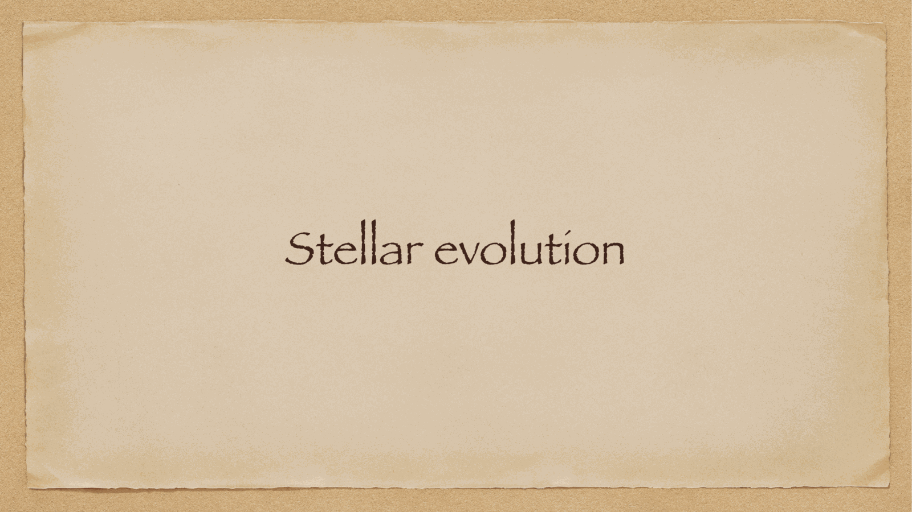

---

## 1. the dynamical timescale $t_{\text{dyn}}$

the timescale over which a star responds mechanically to a sudden disruption of hydrostatic equilibrium (e.g. if pressure were suddenly removed). it is approximately equal to the free-fall timescale:

$$t_{\text{dyn}} \approx \sqrt{\frac{R^3}{G M}} \approx \frac{1}{\sqrt{G \bar{\rho}}}$$

for the Sun:
$$t_{\text{dyn},\odot} \approx \sqrt{\frac{(6.96 \times 10^8\text{ m})^3}{(6.674 \times 10^{-11}) (1.989 \times 10^{30}\text{ kg})}} \approx 1600 \text{ s} \approx 27 \text{ minutes} \sim \text{tens of minutes}$$

- for a white dwarf ($\bar\rho \sim 10^6$ g/cm$^3$): $t_{\text{dyn}} \sim 1$ second.
- for a neutron star ($\bar\rho \sim 10^{14}$ g/cm$^3$): $t_{\text{dyn}} \sim 0.1$ millisecond.
- for a red supergiant ($\bar\rho \sim 10^{-7}$ g/cm$^3$): $t_{\text{dyn}} \sim \text{months to a year}$.

consequence: stars re-establish hydrostatic equilibrium almost instantaneously compared to their evolutionary lifetimes. any unbalance manifests as rapid pulsation (e.g. Cepheids) or catastrophic explosion (supernovae).

---

## 2. the thermal (Kelvin-Helmholtz) timescale $t_{\text{KH}}$

the time required for a star to radiate away its entire internal gravitational potential energy at its current luminosity, in the absence of nuclear reactions:

$$t_{\text{KH}} \approx \frac{\lvert E_{\text{grav}}\rvert}{L} \approx \frac{G M^2}{R L}$$

for the Sun:
$$t_{\text{KH},\odot} \approx \frac{(6.674 \times 10^{-11}) (1.989 \times 10^{30})^2}{(6.96 \times 10^8) (3.828 \times 10^{26})} \approx 9.9 \times 10^{14} \text{ s} \approx 3 \times 10^7 \text{ years}$$

- governs pre-main-sequence contraction (Hayashi and Henyey tracks).
- governs rapid transition phases between core nuclear burning stages (e.g. crossing the Hertzsprung gap from the main sequence to the red giant branch).

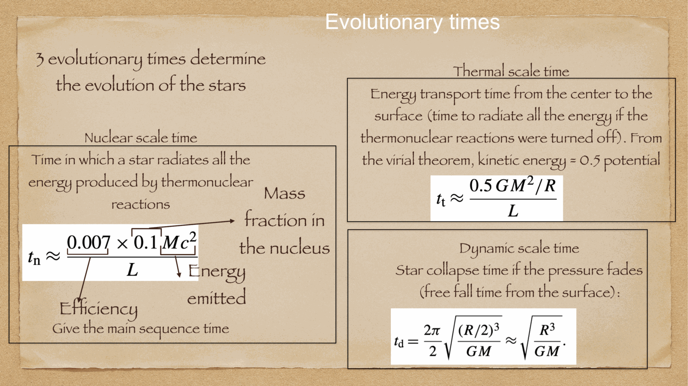

---

## 3. the nuclear timescale $t_{\text{nuc}}$

the total time a star can shine at its current luminosity powered by nuclear fusion. for hydrogen burning, fusing $4p \to {}^4\text{He}$ converts $\eta = 0.007$ ($0.7\%$) of mass into energy. assuming $\sim 10\%$ of the star's hydrogen is in the core available for fusion:

$$E_{\text{nuc}} \approx 0.1 \times 0.007 \, M c^2 = 7 \times 10^{-4} M c^2$$
$$\boxed{\, t_{\text{nuc}} = \frac{E_{\text{nuc}}}{L} \approx 10^{10} \left(\frac{M}{M_\odot}\right) \left(\frac{L}{L_\odot}\right)^{-1} \approx 10^{10} \left(\frac{M}{M_\odot}\right)^{-2.5} \text{ yr} \,}$$

for the Sun:
$$t_{\text{nuc},\odot} \approx 10^{10} \text{ years} = 10 \text{ Gyr}$$

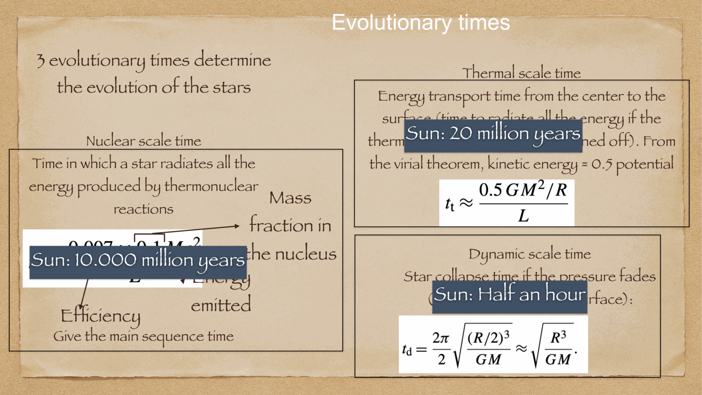

---

## the fundamental hierarchy of timescales

$$\boxed{\, t_{\text{dyn}} \ll t_{\text{KH}} \ll t_{\text{nuc}} \,}$$

$$\sim 30\text{ minutes} \quad \ll \quad \sim 3 \times 10^7\text{ years} \quad \ll \quad \sim 10^{10}\text{ years}$$

because $t_{\text{nuc}}$ exceeds $t_{\text{KH}}$ by a factor of 300, and exceeds $t_{\text{dyn}}$ by a factor of $10^{14}$, stars spend $90\%$ of their lives in serene, quasi-static, thermally balanced equilibrium on the main sequence.

---

## see also

- [Fundamentals_Astrophysics_Cosmology_MOC](../../04_Atlas/Fundamentals_Astrophysics_Cosmology_MOC.html)
- [Stellar scaling relations](Stellar%20scaling%20relations.html)
- [Stellar structure equations](Stellar%20structure%20equations.html)
- [Solar evolution and final stages](Solar%20evolution%20and%20final%20stages.html)
- [Pre-main sequence evolution and protostars](Pre-main%20sequence%20evolution%20and%20protostars.html)

---

## observational astrophysics course slides (Prof. Paolo Cassata)

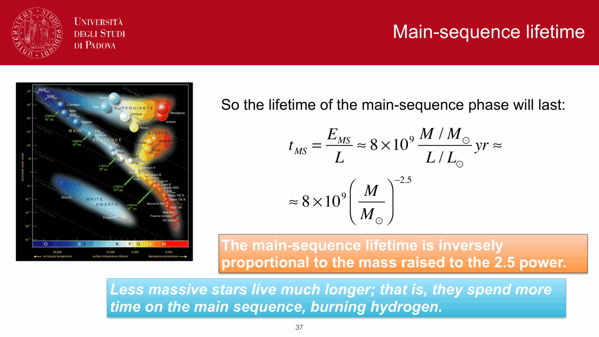
*Main sequence lifetime derivation: tau_MS proportional to M / L proportional to M^(-2.5).*

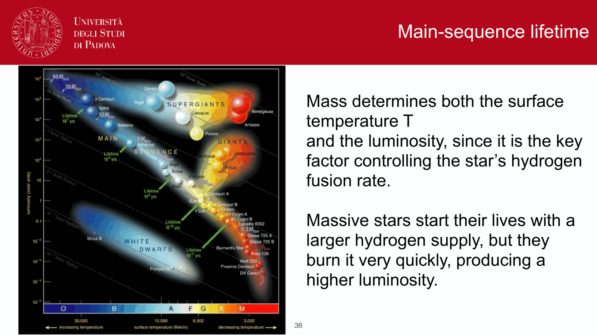
*Nuclear fuel available: E_nuc = 0.007 * (M_core / M) * M * c^2 ~ 0.1 * 0.007 * M c^2.*

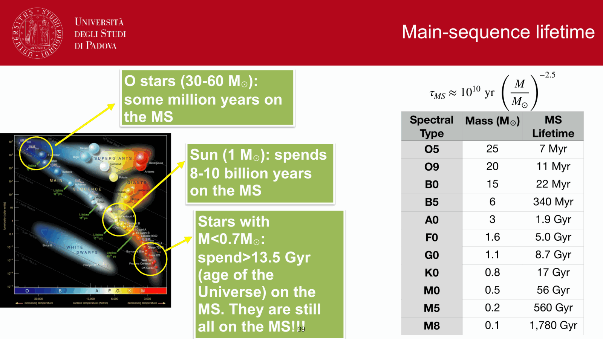
*Main sequence lifetime formula: tau_MS ~ 10^10 * (M / M_Sun)^(-2.5) yr.*

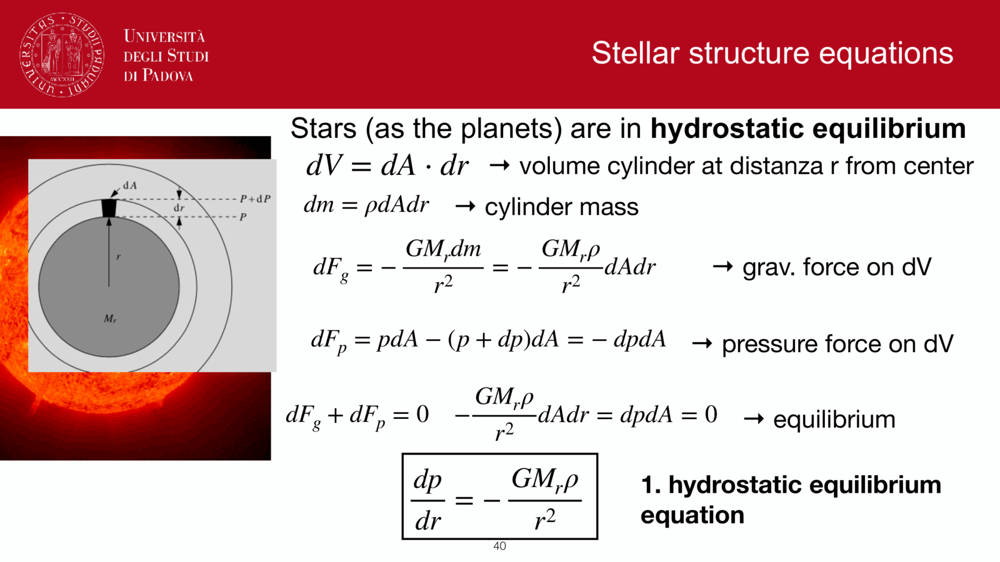
*Lifetimes across stellar masses: 20 M_Sun star lives ~10 Myr; 1 M_Sun star lives ~10 Gyr; 0.1 M_Sun star lives ~trillion yr.*

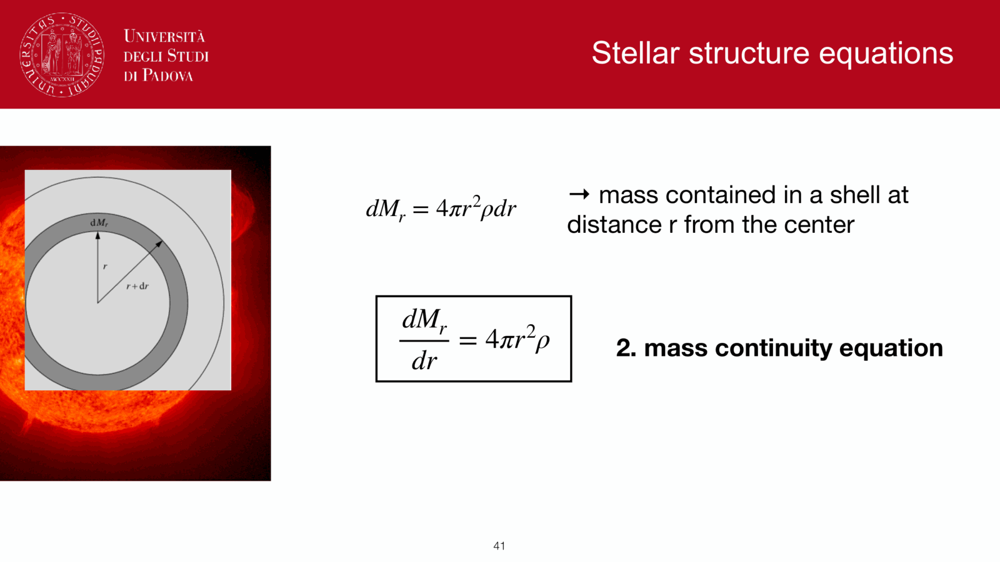
*Dynamical timescale: t_dyn = 1 / sqrt(G rho) ~ 30 min for the Sun.*

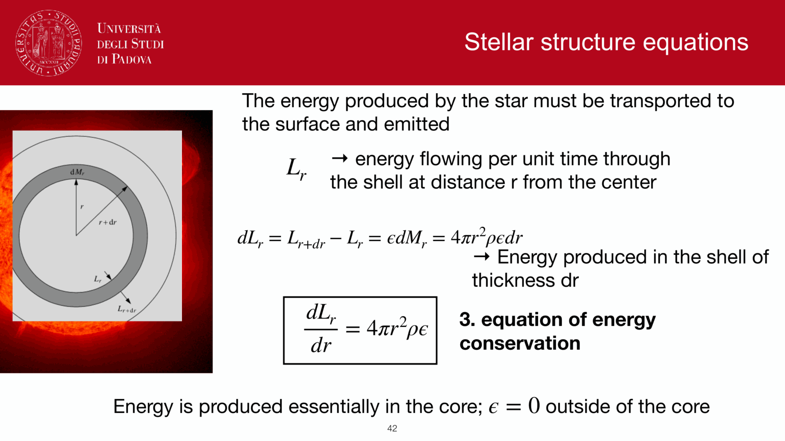
*Thermal (Kelvin-Helmholtz) timescale: t_KH = G M^2 / (R L) ~ 30 Myr for the Sun.*

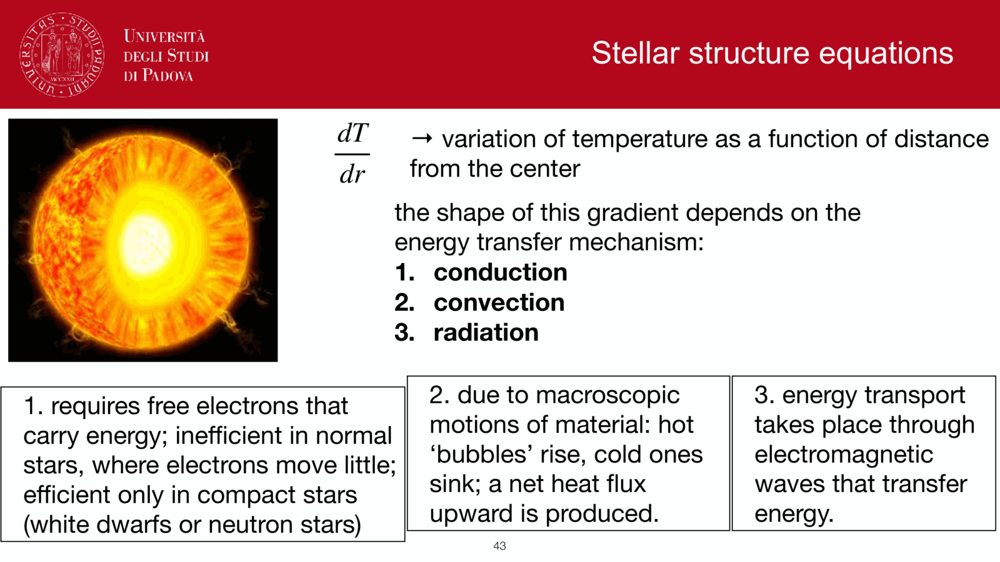
*Hierarchy of stellar timescales: t_dyn << t_KH << t_nuc.*

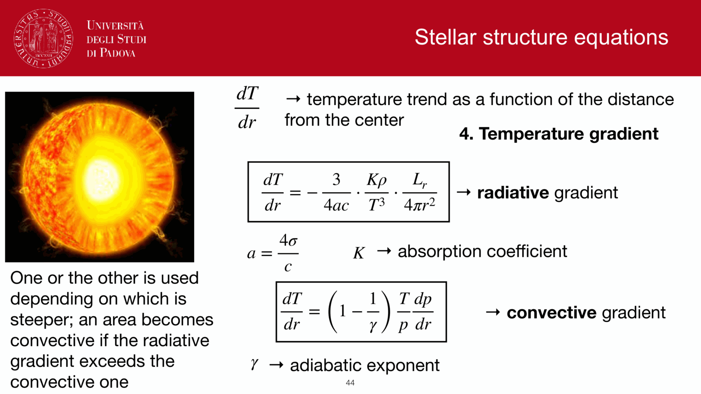
*Implications for stellar interior equilibrium and CMD morphology.*

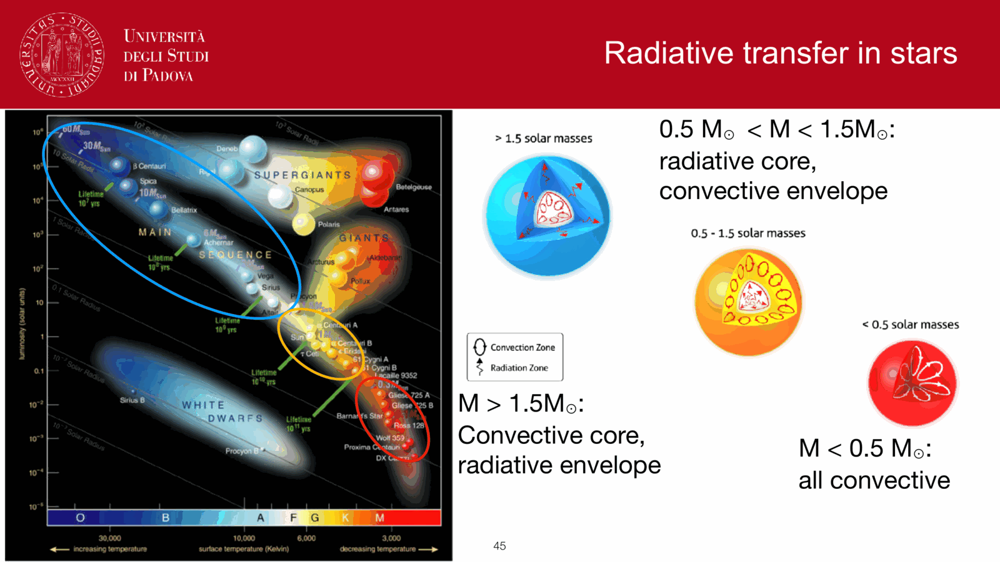
*Post-MS evolutionary phase durations proportional to nuclear energy yields.*

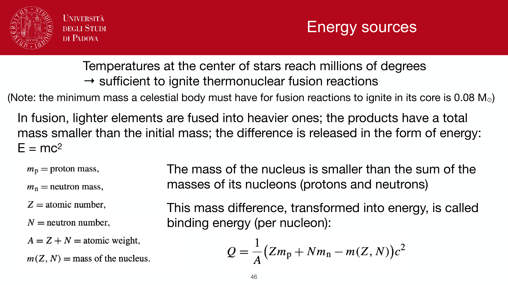
*Helium burning phase duration ~ 10% of main sequence lifetime.*

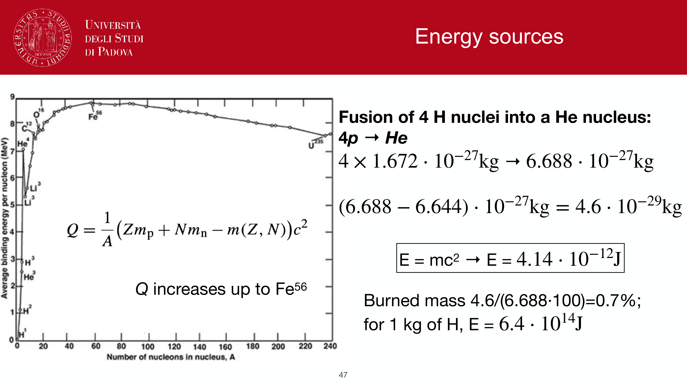
*Advanced burning stages (C, Ne, O, Si) lasting from years down to days.*

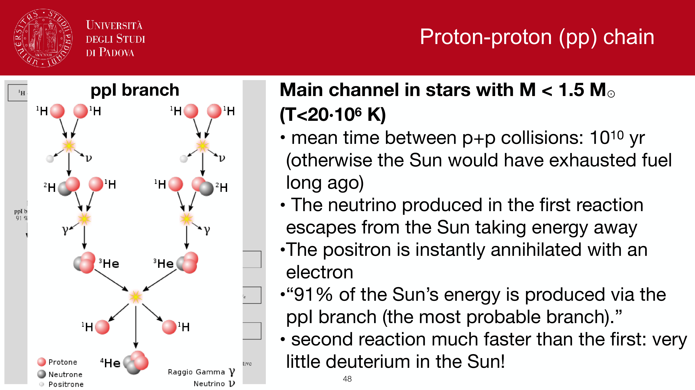
*Timescales summary table.*

  <h4 class="backlinks-title">Linked References (12)</h4>
  <ul class="backlinks-list">
    <li class="backlink-item-wrap"><a href="Color-magnitude%20diagrams%20of%20clusters.html" class="backlink-item">Color-magnitude diagrams of clusters</a></li>
    <li class="backlink-item-wrap"><a href="M-dwarf%20discontinuity%20and%20convective%20merging%20instability.html" class="backlink-item">M-dwarf discontinuity and convective merging instability</a></li>
    <li class="backlink-item-wrap"><a href="Mass-luminosity%20relation.html" class="backlink-item">Mass-luminosity relation</a></li>
    <li class="backlink-item-wrap"><a href="Planetary%20nebula%20spectroscopy.html" class="backlink-item">Planetary nebula spectroscopy</a></li>
    <li class="backlink-item-wrap"><a href="Pre-main%20sequence%20evolution%20and%20protostars.html" class="backlink-item">Pre-main sequence evolution and protostars</a></li>
    <li class="backlink-item-wrap"><a href="Radiative%20transport.html" class="backlink-item">Radiative transport</a></li>
    <li class="backlink-item-wrap"><a href="Stellar%20atmosphere%20structure.html" class="backlink-item">Stellar atmosphere structure</a></li>
    <li class="backlink-item-wrap"><a href="Stellar%20nucleosynthesis.html" class="backlink-item">Stellar nucleosynthesis</a></li>
    <li class="backlink-item-wrap"><a href="Stellar%20scaling%20relations.html" class="backlink-item">Stellar scaling relations</a></li>
    <li class="backlink-item-wrap"><a href="Stellar%20structure%20equations.html" class="backlink-item">Stellar structure equations</a></li>
    <li class="backlink-item-wrap"><a href="../../04_Atlas/Fundamentals_Astrophysics_Cosmology_MOC.html" class="backlink-item">Fundamentals_Astrophysics_Cosmology_MOC</a></li>
    <li class="backlink-item-wrap"><a href="../../04_Atlas/Observational_Astrophysics_MOC.html" class="backlink-item">Observational_Astrophysics_MOC</a></li>
  </ul>

