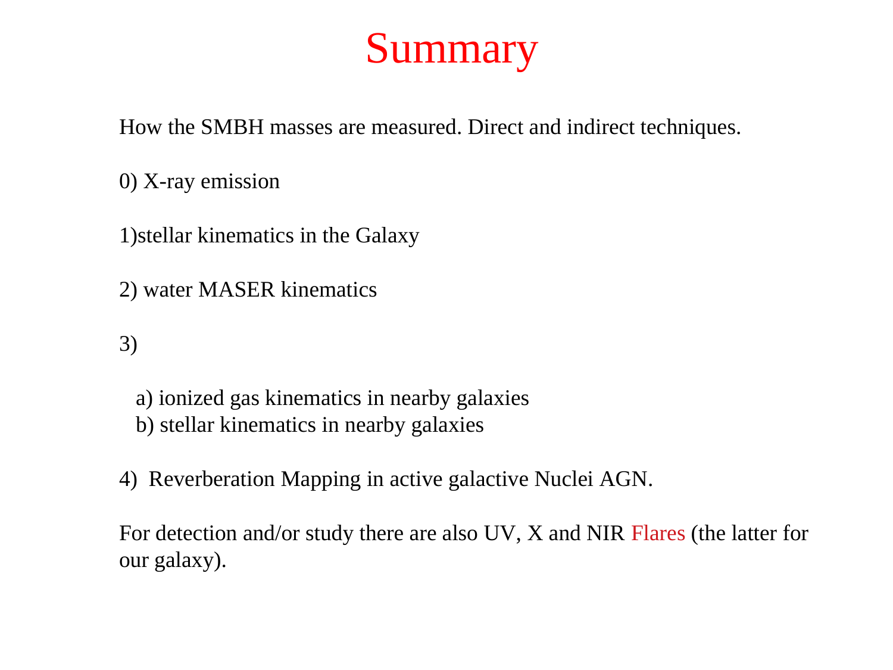
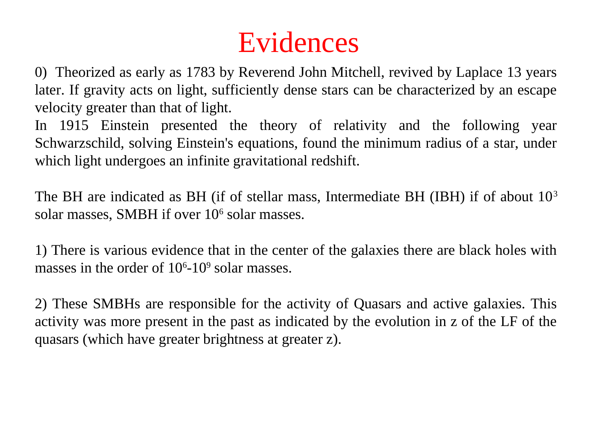
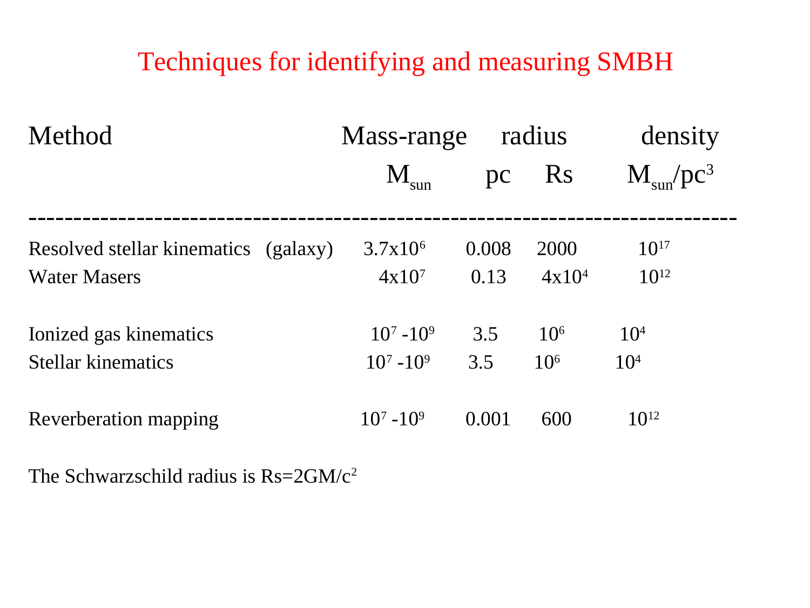


measuring stellar kinematics in galaxies = extracting velocity, dispersion, and higher moments of the LOSVD from observed spectra. central technique of galaxy dynamics.

## the procedure

modern technique: **penalised pixel fitting (pPXF)** by Cappellari + Emsellem (2004):

1. **observe** a galaxy spectrum (longslit or IFU spaxel).
2. **choose a stellar template library** (e.g. MILES, ELODIE, Indo-US): high-S/N spectra of individual stars covering F-K-M types.
3. **fit** the observed galaxy spectrum as a linear combination of template stars convolved with a parameterised LOSVD ($v, \sigma, h_3, h_4$).
4. **iterate** to find best-fit LOSVD parameters + template weights.
5. **penalise** large $h_3, h_4$ to avoid overfitting noise.

## what you measure per spaxel

1. **$v$**: line-of-sight velocity (from line centroid shift).
2. **$\sigma$**: velocity dispersion (from broadening).
3. **$h_3$**: Gauss-Hermite skewness (asymmetry).
4. **$h_4$**: Gauss-Hermite kurtosis (non-Gaussianity).

## requirements

for accurate kinematics:
- **resolution**: $R \gtrsim 1500$ to resolve $\sigma > 100$ km/s. higher for smaller $\sigma$.
- **S/N**: $> 30$ per pixel for $v + \sigma$; $> 100$ for higher moments.
- **wavelength range**: $\sim 4000$ to $5500$ Å covers Mg + Fe + H + Na lines (good kinematic features).
- **stellar templates**: must match galaxy stellar population (use MILES for old galaxies, etc.).

## IFU surveys

modern integral-field surveys provide kinematic maps of $\sim 10^4$ galaxies:
- **SAURON**: pioneering, $\sim 100$ nearby ellipticals.
- **ATLAS3D**: $\sim 260$ ellipticals + S0s.
- **CALIFA**: $\sim 600$ galaxies covering Hubble sequence.
- **MaNGA**: $\sim 10^4$ galaxies, the largest IFU sample.
- **SAMI**: $\sim 3000$ galaxies, complementary to MaNGA.

each spaxel gets its own $v + \sigma + h_3 + h_4$ measurement.

## the main observables

from kinematic maps, derive:

### rotation curve
$v(R)$ along the major axis. for spirals: rises to plateau (rotation-supported disk).

### velocity-dispersion profile
$\sigma(R)$ vs radius. for ellipticals: declines outward; for some bulges, peaked.

### specific angular momentum $\lambda_R$
$\lambda_R = \langle R |v|\rangle/\langle R\sqrt{v^2 + \sigma^2}\rangle$. measures rotation vs dispersion. galaxies separated into:
- **fast rotators** ($\lambda_R > 0.3$): mostly rotation-supported. typical low-mass ellipticals + spiral bulges.
- **slow rotators** ($\lambda_R < 0.3$): mostly dispersion-supported. massive ellipticals.

distinction strongly correlates with merger history: slow rotators are major-merger remnants; fast rotators are gas-rich spiral remnants.

### kinematically distinct cores (KDCs)
$v$ field changes sign in the centre, indicating a counter-rotating component. signature of past minor mergers.

### misaligned axes
photometric major axis $\ne$ kinematic major axis. signals triaxiality + accretion history.

## from kinematics to mass

dynamical mass via Jeans equation:
$$M(R) \sim \frac{(\sigma^2 + V^2/2)R}{G}$$

(approximate). more careful: solve full Jeans + Schwarzschild orbit modelling. modern codes: JAM, M2M, MGE.

useful for:
- **galaxy total masses** including dark matter.
- **central SMBH masses**: high-resolution central kinematics + stellar dynamical models.
- **galactic morphology + assembly history**.

## see also

- [LOSVD](./LOSVD.html)
- [Velocity dispersion from line width](./Velocity%20dispersion%20from%20line%20width.html)
- [Faber-Jackson relation](./Faber-Jackson%20relation.html)
- [Fundamental plane of ellipticals](./Fundamental%20plane%20of%20ellipticals.html)
- [Tully-Fisher relation](./Tully-Fisher%20relation.html)
- [Stellar dynamics SMBH masses](./Stellar%20dynamics%20SMBH%20masses.html)
- [Integral-field spectroscopy IFU](./Integral-field%20spectroscopy%20IFU.html)
- [MaNGA survey](./MaNGA%20survey.html)
- [Astrophysics_of_Galaxies_MOC](../../04_Atlas/Astrophysics_of_Galaxies_MOC.html)

---

## astrophysics of galaxies figures and slides (Prof. Alessandro Pizzella)

*Penalized Pixel-Fitting (pPXF) method (Cappellari & Emsellem 2004).*

*Convolving stellar template libraries with Gauss-Hermite parameterized LOSVD.*

*Gauss-Hermite moments: V (mean velocity), sigma (velocity dispersion), h3 (asymmetry/skewness), h4 (kurtosis/peakedness).*


  <h4 class="backlinks-title">Linked References (10)</h4>
  <ul class="backlinks-list">
    <li class="backlink-item-wrap"><a href="../../04_Atlas/Astrophysics_of_Galaxies_MOC.html" class="backlink-item">Astrophysics_of_Galaxies_MOC</a></li>
    <li class="backlink-item-wrap"><a href="./Dark%20matter%20in%20elliptical%20galaxies.html" class="backlink-item">Dark matter in elliptical galaxies</a></li>
    <li class="backlink-item-wrap"><a href="./Datacube%20redshift%20measurement.html" class="backlink-item">Datacube redshift measurement</a></li>
    <li class="backlink-item-wrap"><a href="./Ionized%20gas%20kinematics.html" class="backlink-item">Ionized gas kinematics</a></li>
    <li class="backlink-item-wrap"><a href="./LOSVD.html" class="backlink-item">LOSVD</a></li>
    <li class="backlink-item-wrap"><a href="./MUSE%20datacubes.html" class="backlink-item">MUSE datacubes</a></li>
    <li class="backlink-item-wrap"><a href="./MaNGA%20survey.html" class="backlink-item">MaNGA survey</a></li>
    <li class="backlink-item-wrap"><a href="./Mass-radius%20and%20mass-velocity%20relations.html" class="backlink-item">Mass-radius and mass-velocity relations</a></li>
    <li class="backlink-item-wrap"><a href="./Proper%20motion%20and%20stellar%20kinematics.html" class="backlink-item">Proper motion and stellar kinematics</a></li>
    <li class="backlink-item-wrap"><a href="./Stellar%20dynamics%20SMBH%20masses.html" class="backlink-item">Stellar dynamics SMBH masses</a></li>
  </ul>

