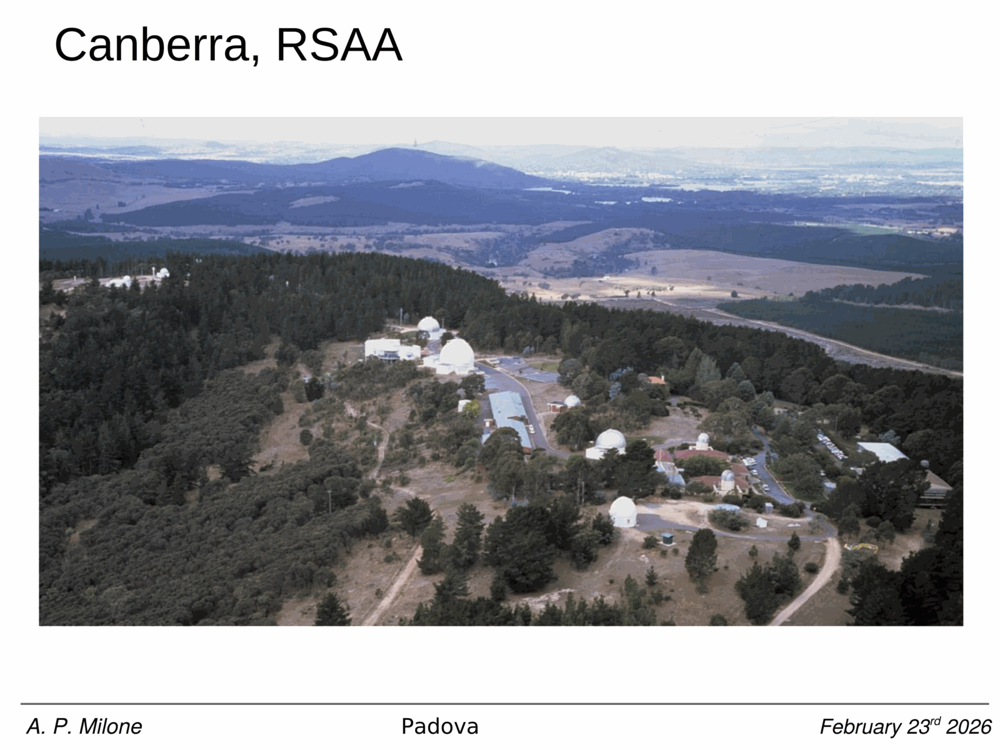
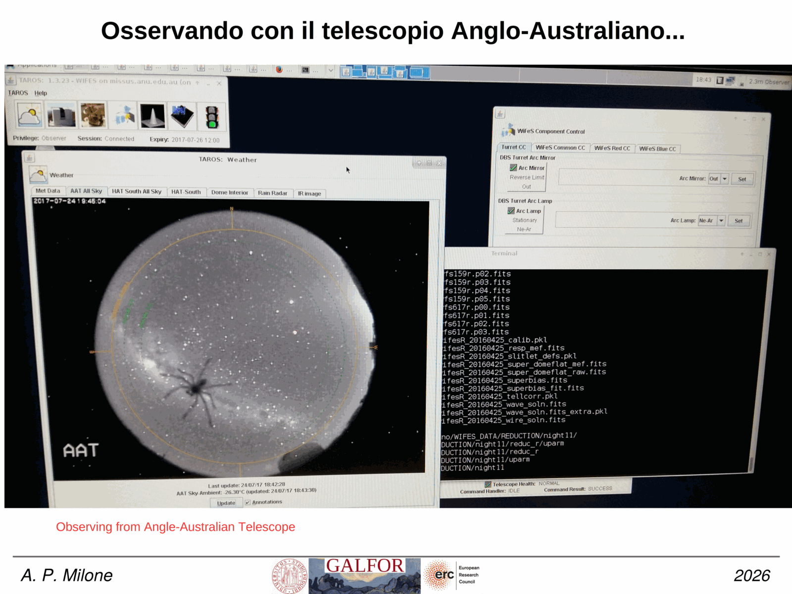
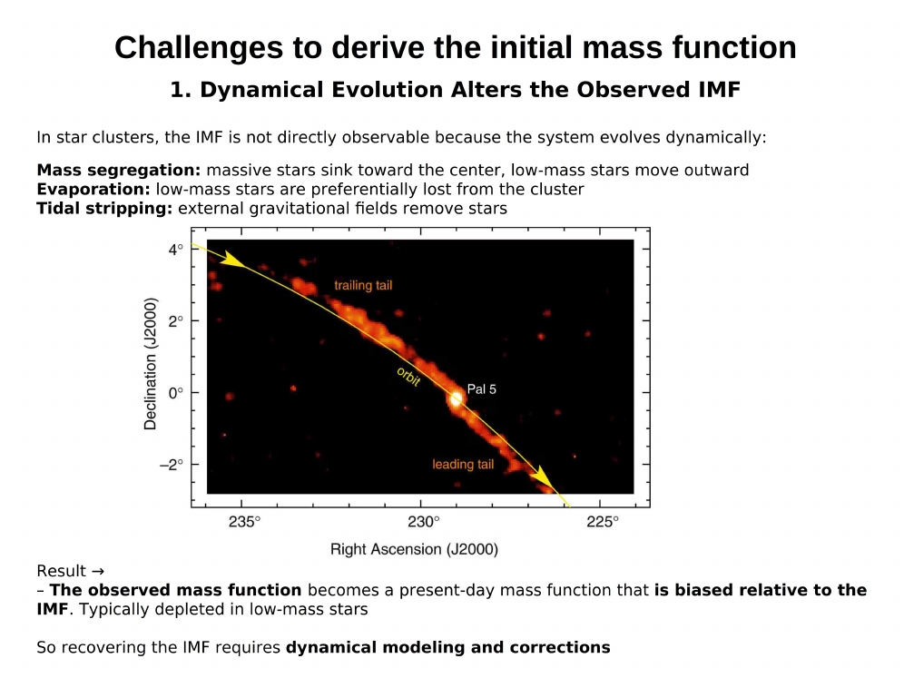
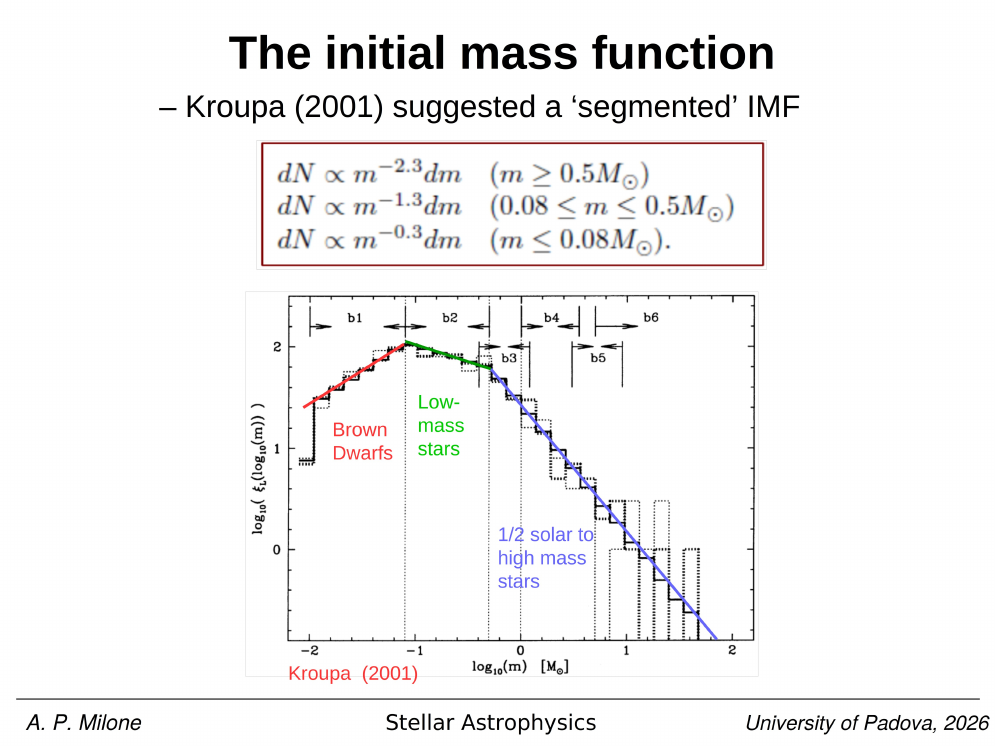


the **stellar mass function** $\xi(M)$ is the number of stars per unit mass interval. it is the single most important statistic linking star formation to galaxy and [cluster](./Globular%20Clusters.html) evolution, because almost every observable (luminosity, colour, chemical yield, supernova rate, [black hole](./Black%20holes%20in%20globular%20clusters.html) population) depends on how many stars formed at each mass.

(note: this zettel covers the stellar IMF $\xi(M)$. for the integrated galaxy stellar-mass distribution $\phi(M_*)$, see [Stellar mass function](./Stellar%20mass%20function.html) (Schechter form for galaxies); the two are distinct objects with similar names.)

**linear and logarithmic forms**

the linear mass function is

$$\xi(M)\,dM = \frac{dN}{dM}\,dM,$$

the number of stars per linear mass interval. observers often work in logarithmic mass because the mass range covered by the MS spans $\sim 4$ decades, $0.08 \lesssim M/M_\odot \lesssim 100$. defining

$$\xi_L(\log M)\,d\log M = \frac{dN}{d\log M}\,d\log M,$$

the two are related by

$$\xi_L(\log M) = M\, \ln(10)\, \xi(M).$$

a single power-law $\xi(M) \propto M^{-\alpha}$ becomes $\xi_L(\log M) \propto M^{-(\alpha - 1)} = M^{-\Gamma}$, where $\Gamma = \alpha - 1$ is the slope in the log form (the [salpeter slope](./Salpeter%20Kroupa%20Chabrier%20IMFs.html) is $\Gamma_{\text{Sal}} = 1.35$ in this convention).

**IMF vs PDMF**

an absolutely critical distinction:

- the **initial mass function** (IMF) is the distribution at the moment of star formation, before any star has evolved off the MS,
- the **present-day mass function** (PDMF) is what we observe now, after some stars have died, others have evolved into WDs / NSs / BHs, and (in clusters) some have escaped via tidal evaporation.

for a cluster of age $t$, all stars with $M > M_{\text{TO}}(t)$ have left the MS, so the PDMF on the MS is truncated above $M_{\text{TO}}$. dynamical evaporation in [Globular Clusters](./Globular%20Clusters.html) preferentially removes the **lowest-mass** stars (because they have higher velocities at given energy, and they migrate to the outskirts via Mass segregation), making the PDMF flatter at low mass than the IMF. see [Initial vs present-day mass function](./Initial%20vs%20present-day%20mass%20function.html) for the full account.

so observed cluster PDMFs cannot be naively interpreted as IMFs. recovering the IMF requires forward-modelling stellar and dynamical evolution.

**why we care about the IMF**

- determines the **total number of supernovae and remnants** per unit star formation,
- sets the **mass-to-light ratio** $M/L$ used to convert observed luminosities to stellar masses for galaxies,
- controls **chemical yields** (massive stars produce $\alpha$-elements; intermediate-mass stars produce s-process and CN),
- controls the [cosmic SFH](./Cosmic%20star%20formation%20history.html) inversion from luminosity functions.

**universality (or not)**

the IMF appears roughly universal across galactic environments at $\gtrsim 0.5\,M_\odot$, well described by [Salpeter, Kroupa, or Chabrier](./Salpeter%20Kroupa%20Chabrier%20IMFs.html) forms. variations are debated for:

- **segmented open-cluster IMF (Cordoni et al. 2023)**: analyzed Gaia DR3 data for 78 open clusters, observing a "segmented" IMF that differs slightly from standard universal profiles. they found:
  * $\frac{dN}{dM} \propto M^{-2.5}$ for masses larger than 1 $M_\odot$.
  * $\frac{dN}{dM} \propto M^{-1.5}$ for masses smaller than 1 $M_\odot$.
- ultra-faint and dwarf galaxies (possibly bottom-light at lower [metallicity](./Stellar%20populations%20I%20II%20III.html)),
- very early universe ([Pop III](./Population%20III%20stars.html) expected top-heavy due to absence of metal cooling),
- starburst galaxies (some claims of top-heavy IMF, controversial).

precision tests use [cluster LFs](./IMF%20from%20cluster%20luminosity%20functions.html), integrated galaxy spectra, and direct counts in nearby resolved populations.

## reference papers

- **Salpeter 1955, ApJ 121, 161** — original power-law IMF.
- **Kroupa 2001, MNRAS 322, 231** — broken power-law IMF.
- **Chabrier 2003, PASP 115, 763** — lognormal IMF.
- **Cordoni et al. 2023, A&A 677, A30** — segmented IMF in 78 Gaia DR3 open clusters.

## see also
- [Stellar_Astrophysics_MOC](../../04_Atlas/Stellar_Astrophysics_MOC.html)
- [Salpeter Kroupa Chabrier IMFs](./Salpeter%20Kroupa%20Chabrier%20IMFs.html)
- [Initial vs present-day mass function](./Initial%20vs%20present-day%20mass%20function.html)
- [IMF from cluster luminosity functions](./IMF%20from%20cluster%20luminosity%20functions.html)
- [Single stellar population SSP](./Single%20stellar%20population%20SSP.html)
- [Population III stars](./Population%20III%20stars.html)

---

## Complete Lecture Slide Panels & Observational Evidence (Lecture 13 — Stellar Mass Function & Black Holes)

> **Context**: *Initial Mass Function (IMF) vs Present Day Mass Function (PDMF), Salpeter/Kroupa/Chabrier slopes, dynamical evaporation of low-mass stars, and hunting stellar/IMBHs.*

The following slides from Prof. Antonino Milone's lecture series provide the direct observational, photometric, and theoretical foundations for this topic:

*Figure P13-01: LAntonino_p13_01.png — Observational data, CMD morphology, and diagnostics from Lecture 13 — Stellar Mass Function & Black Holes.*

*Figure P13-02: LAntonino_p13_02.png — Observational data, CMD morphology, and diagnostics from Lecture 13 — Stellar Mass Function & Black Holes.*

*Figure P13-03: LAntonino_p13_03.png — Observational data, CMD morphology, and diagnostics from Lecture 13 — Stellar Mass Function & Black Holes.*

*Figure P13-04: LAntonino_p13_04.png — Observational data, CMD morphology, and diagnostics from Lecture 13 — Stellar Mass Function & Black Holes.*

*Figure P13-05: LAntonino_p13_05.png — Observational data, CMD morphology, and diagnostics from Lecture 13 — Stellar Mass Function & Black Holes.*

*Figure P13-06: LAntonino_p13_06.png — Observational data, CMD morphology, and diagnostics from Lecture 13 — Stellar Mass Function & Black Holes.*

*Figure P13-07: LAntonino_p13_07.png — Observational data, CMD morphology, and diagnostics from Lecture 13 — Stellar Mass Function & Black Holes.*

*Figure P13-08: LAntonino_p13_08.png — Observational data, CMD morphology, and diagnostics from Lecture 13 — Stellar Mass Function & Black Holes.*

*Figure P13-09: LAntonino_p13_09.png — Observational data, CMD morphology, and diagnostics from Lecture 13 — Stellar Mass Function & Black Holes.*

*Figure P13-10: LAntonino_p13_10.png — Observational data, CMD morphology, and diagnostics from Lecture 13 — Stellar Mass Function & Black Holes.*

*Figure P13-11: LAntonino_p13_11.png — Observational data, CMD morphology, and diagnostics from Lecture 13 — Stellar Mass Function & Black Holes.*

*Figure P13-12: LAntonino_p13_12.png — Observational data, CMD morphology, and diagnostics from Lecture 13 — Stellar Mass Function & Black Holes.*

*Figure P13-13: LAntonino_p13_13.png — Observational data, CMD morphology, and diagnostics from Lecture 13 — Stellar Mass Function & Black Holes.*

*Figure P13-14: LAntonino_p13_14.png — Observational data, CMD morphology, and diagnostics from Lecture 13 — Stellar Mass Function & Black Holes.*

*Figure P13-15: LAntonino_p13_15.png — Observational data, CMD morphology, and diagnostics from Lecture 13 — Stellar Mass Function & Black Holes.*

*Figure P13-16: LAntonino_p13_16.png — Observational data, CMD morphology, and diagnostics from Lecture 13 — Stellar Mass Function & Black Holes.*

*Figure P13-17: LAntonino_p13_17.png — Observational data, CMD morphology, and diagnostics from Lecture 13 — Stellar Mass Function & Black Holes.*

*Figure P13-18: LAntonino_p13_18.png — Observational data, CMD morphology, and diagnostics from Lecture 13 — Stellar Mass Function & Black Holes.*

*Figure P13-19: LAntonino_p13_19.png — Observational data, CMD morphology, and diagnostics from Lecture 13 — Stellar Mass Function & Black Holes.*

*Figure P13-20: LAntonino_p13_20.png — Observational data, CMD morphology, and diagnostics from Lecture 13 — Stellar Mass Function & Black Holes.*

*Figure P13-21: LAntonino_p13_21.png — Observational data, CMD morphology, and diagnostics from Lecture 13 — Stellar Mass Function & Black Holes.*

*Figure P13-22: LAntonino_p13_22.png — Observational data, CMD morphology, and diagnostics from Lecture 13 — Stellar Mass Function & Black Holes.*

*Figure P13-23: LAntonino_p13_23.png — Observational data, CMD morphology, and diagnostics from Lecture 13 — Stellar Mass Function & Black Holes.*

*Figure P13-24: LAntonino_p13_24.png — Observational data, CMD morphology, and diagnostics from Lecture 13 — Stellar Mass Function & Black Holes.*

*Figure P13-25: LAntonino_p13_25.png — Observational data, CMD morphology, and diagnostics from Lecture 13 — Stellar Mass Function & Black Holes.*

*Figure P13-26: Lecture13_p15-15.png — Observational data, CMD morphology, and diagnostics from Lecture 13 — Stellar Mass Function & Black Holes.*

*Figure P13-27: Lecture13_p5-05.png — Observational data, CMD morphology, and diagnostics from Lecture 13 — Stellar Mass Function & Black Holes.*


  <h4 class="backlinks-title">Linked References (5)</h4>
  <ul class="backlinks-list">
    <li class="backlink-item-wrap"><a href="./IMF%20from%20cluster%20luminosity%20functions.html" class="backlink-item">IMF from cluster luminosity functions</a></li>
    <li class="backlink-item-wrap"><a href="./Initial%20mass%20function.html" class="backlink-item">Initial mass function</a></li>
    <li class="backlink-item-wrap"><a href="./Initial%20vs%20present-day%20mass%20function.html" class="backlink-item">Initial vs present-day mass function</a></li>
    <li class="backlink-item-wrap"><a href="./Salpeter%20Kroupa%20Chabrier%20IMFs.html" class="backlink-item">Salpeter Kroupa Chabrier IMFs</a></li>
    <li class="backlink-item-wrap"><a href="../../04_Atlas/Stellar_Astrophysics_MOC.html" class="backlink-item">Stellar_Astrophysics_MOC</a></li>
  </ul>

