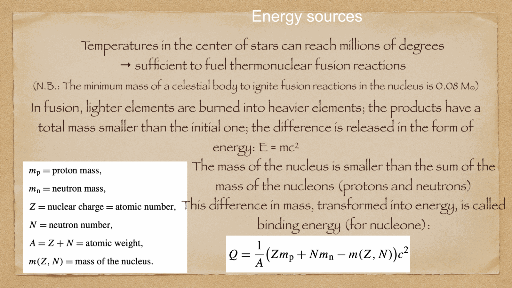
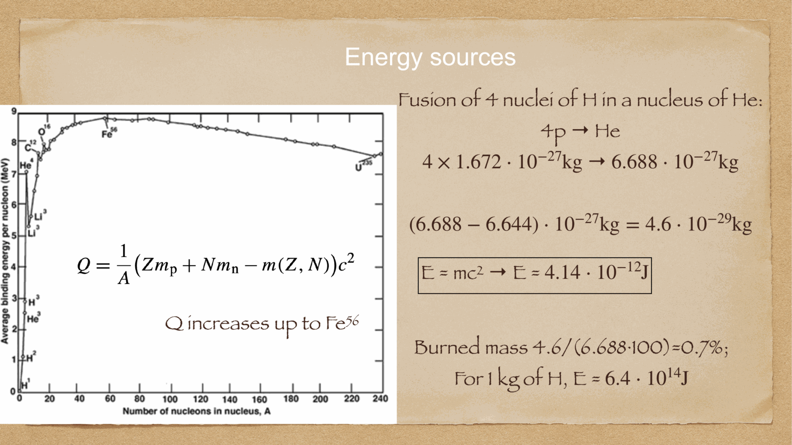
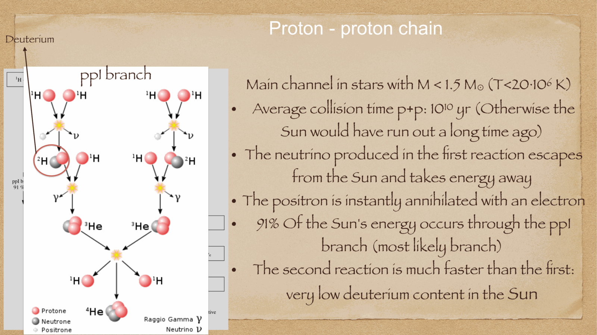
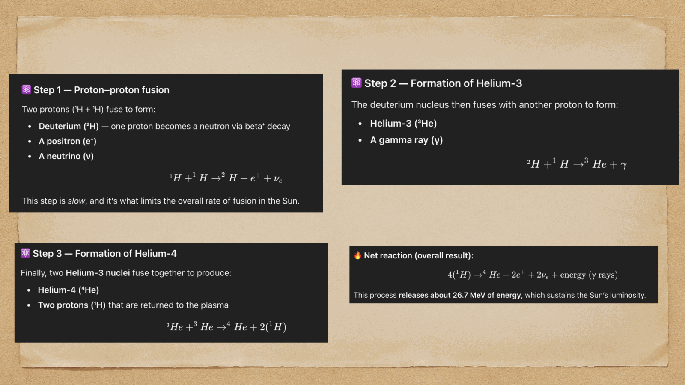
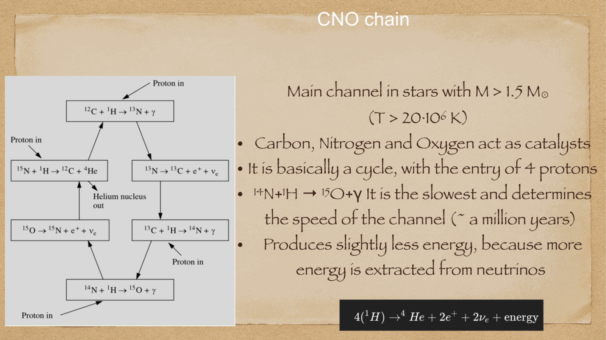
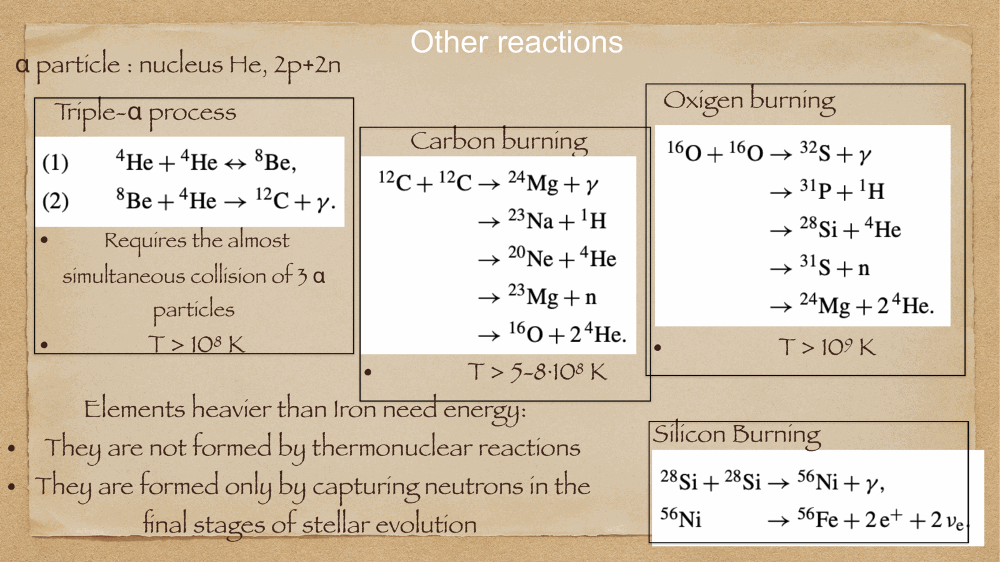
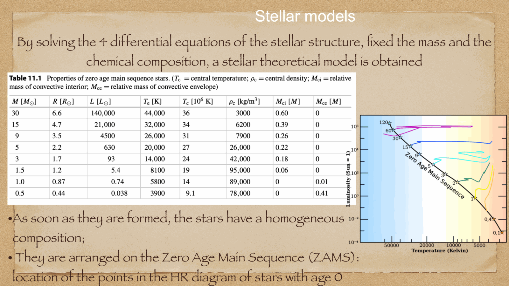

stars are the nuclear crucibles of the cosmos. through thermonuclear fusion in their searing cores, stars synthesize heavy elements from primordial hydrogen and helium, releasing the binding energy that powers stellar luminosity and halts gravitational collapse.

---

## the Coulomb barrier and quantum tunneling

atomic nuclei are positively charged ($+Ze$). for two nuclei to fuse, they must overcome the repulsive Coulomb electrostatic potential:
$$V_C = \frac{Z_1 Z_2 e^2}{4\pi\varepsilon_0 r}$$

classically, the kinetic energy required requires temperatures of $T \sim 10^{10}$ K. in real stars, central temperatures are only $T \sim 10^7 - 10^8$ K. fusion occurs entirely via **quantum mechanical tunneling** through the Coulomb barrier (the Gamow factor):
$$P_{\text{tunnel}} \propto e^{-\sqrt{E_G / E}}, \qquad E_G = 2 m_r c^2 (\pi \alpha Z_1 Z_2)^2$$

the convolution of the Maxwell-Boltzmann energy distribution with the quantum tunneling probability produces a narrow energy window where reactions occur: the **Gamow peak**.

---

## 1. hydrogen burning: the Proton-Proton (p-p) chain

dominant in low-mass and solar-type stars ($M \lesssim 1.5 M_\odot$, $T_c \lesssim 1.8 \times 10^7$ K).
energy generation rate: $\epsilon_{pp} \propto \rho X_H^2 T^4$.

all branches begin with the rate-limiting weak interaction step:
$$p + p \to {}^2\text{H} + e^+ + \nu_e \quad (Q = 1.442 \text{ MeV})$$
(because this requires a simultaneous weak decay $p \to n + e^+ + \nu_e$ during a proton collision, the mean lifetime of a proton in the Sun against fusion is $\sim 10^{10}$ years!).

followed immediately by rapid proton capture:
$${}^2\text{H} + p \to {}^3\text{He} + \gamma \quad (Q = 5.49 \text{ MeV})$$

from ${}^3\text{He}$, the reaction branches into three pathways:
- **pp-I branch ($\sim 85\%$ in Sun)**:
  $${}^3\text{He} + {}^3\text{He} \to {}^4\text{He} + 2p \quad (Q = 12.86 \text{ MeV})$$
- **pp-II branch ($\sim 15\%$ in Sun)**:
  $${}^3\text{He} + {}^4\text{He} \to {}^7\text{Be} + \gamma$$
  $${}^7\text{Be} + e^- \to {}^7\text{Li} + \nu_e$$
  $${}^7\text{Li} + p \to 2\,{}^4\text{He}$$
- **pp-III branch ($< 0.02\%$ in Sun, but produces high-energy solar neutrinos detected on Earth)**:
  $${}^7\text{Be} + p \to {}^8\text{B} + \gamma$$
  $${}^8\text{B} \to {}^8\text{Be}^* + e^+ + \nu_e \quad (E_\nu \le 14 \text{ MeV})$$
  $${}^8\text{Be}^* \to 2\,{}^4\text{He}$$

**net result of all branches**:
$$\boxed{\, 4p \to {}^4\text{He} + 2e^+ + 2\nu_e + 2\gamma \,}$$
total energy released: $Q = 26.73$ MeV (about $0.7\%$ of the rest mass converted into energy via $E = \Delta m c^2$).

---

## 2. hydrogen burning: the CNO catalytic cycle

discovered independently by Carl Friedrich von Weizsäcker (1938) and Hans Bethe (1939). dominant in massive stars ($M \gtrsim 1.5 M_\odot$, $T_c > 2 \times 10^7$ K).

Carbon, Nitrogen, and Oxygen nuclei act as pure nuclear catalysts:
$${}^{12}\text{C} + p \to {}^{13}\text{N} + \gamma$$
$${}^{13}\text{N} \to {}^{13}\text{C} + e^+ + \nu_e$$
$${}^{13}\text{C} + p \to {}^{14}\text{N} + \gamma$$
$${}^{14}\text{N} + p \to {}^{15}\text{O} + \gamma \quad (\text{slowest, bottleneck step})$$
$${}^{15}\text{O} \to {}^{15}\text{N} + e^+ + \nu_e$$
$${}^{15}\text{N} + p \to {}^{12}\text{C} + {}^4\text{He}$$

**net result**: identical to pp-chain: $4p \to {}^4\text{He} + 2e^+ + 2\nu_e + \gamma$ ($Q = 26.73$ MeV).
**extreme temperature sensitivity**:
$$\boxed{\, \epsilon_{\text{CNO}} \propto \rho X_H X_{\text{CNO}} \, T^{16 - 18} \,}$$
a slight increase in core temperature causes an enormous surge in energy output, driving intense core convection.

---

## 3. helium burning: the triple-alpha process

when core hydrogen is exhausted, the core contracts until $T_c \sim 10^8$ K and $\rho_c \sim 10^4$ g/cm$^3$. at this point, Coulomb repulsion between alpha particles ($Z=2$) is overcome.

because ${}^8\text{Be}$ is wildly unstable (decaying back into two alphas in $10^{-16}$ s), helium fusion requires an almost simultaneous 3-body collision:
1. ${}^4\text{He} + {}^4\text{He} \rightleftharpoons {}^8\text{Be} - 92 \text{ keV}$ (unstable equilibrium concentration).
2. ${}^8\text{Be} + {}^4\text{He} \to {}^{12}\text{C}^* \to {}^{12}\text{C} + \gamma$ ($Q = 7.27$ MeV).

Fred Hoyle (1954) famously predicted that this reaction would be impossibly slow unless ${}^{12}\text{C}$ possessed an excited nuclear resonance state at exactly $7.65$ MeV (the **Hoyle state**), which was subsequently confirmed experimentally by Willy Fowler.

further alpha capture produces oxygen:
$${}^{12}\text{C} + \alpha \to {}^{16}\text{O} + \gamma \quad (Q = 7.16 \text{ MeV})$$
**temperature sensitivity**: $\epsilon_{3\alpha} \propto \rho^2 Y^3 T^{40}$!

---

## 4. advanced burning stages in massive stars

in stars with $M \ge 8 M_\odot$, the carbon-oxygen core contracts to trigger successively heavier burning stages:
- **Carbon burning ($T \sim 6-8 \times 10^8$ K)**: ${}^{12}\text{C} + {}^{12}\text{C} \to {}^{20}\text{Ne} + \alpha, \; {}^{23}\text{Na} + p, \; {}^{23}\text{Mg} + n$.
- **Neon burning ($T \sim 1.5 \times 10^9$ K)**: photodisintegration and alpha capture producing ${}^{24}\text{Mg}$.
- **Oxygen burning ($T \sim 2 \times 10^9$ K)**: ${}^{16}\text{O} + {}^{16}\text{O} \to {}^{28}\text{Si} + \alpha, \; {}^{31}\text{P} + p, \; {}^{31}\text{S} + n$.
- **Silicon burning ($T \sim 3-4 \times 10^9$ K)**: nuclear statistical equilibrium (photodisintegration rearrangement) building elements up to the iron peak (${}^{56}\text{Ni} \to {}^{56}\text{Co} \to {}^{56}\text{Fe}$).

### the iron endpoint:
${}^{56}\text{Fe}$ has the maximum binding energy per nucleon ($\approx 8.8$ MeV/nucleon). nuclear fusion beyond iron is **endothermic** (absorbs energy rather than releasing it). when an iron core forms, the star runs out of nuclear fuel, precipitating catastrophic gravitational collapse.

---

## see also

- [Fundamentals_Astrophysics_Cosmology_MOC](../../04_Atlas/Fundamentals_Astrophysics_Cosmology_MOC.html)
- [Stellar structure equations](Stellar%20structure%20equations.html)
- [Stellar evolution timescales](Stellar%20evolution%20timescales.html)
- [Solar evolution and final stages](Solar%20evolution%20and%20final%20stages.html)
- [Supernovae and compact remnants](Supernovae%20and%20compact%20remnants.html)
- [BBN_overview](BBN_overview.html)

  <h4 class="backlinks-title">Linked References (8)</h4>
  <ul class="backlinks-list">
    <li class="backlink-item-wrap"><a href="Alpha-Fe%20enhancement.html" class="backlink-item">Alpha-Fe enhancement</a></li>
    <li class="backlink-item-wrap"><a href="BBN_overview.html" class="backlink-item">BBN_overview</a></li>
    <li class="backlink-item-wrap"><a href="Radiative%20transport.html" class="backlink-item">Radiative transport</a></li>
    <li class="backlink-item-wrap"><a href="Solar%20evolution%20and%20final%20stages.html" class="backlink-item">Solar evolution and final stages</a></li>
    <li class="backlink-item-wrap"><a href="Spectral%20energy%20distributions.html" class="backlink-item">Spectral energy distributions</a></li>
    <li class="backlink-item-wrap"><a href="Stellar%20structure%20equations.html" class="backlink-item">Stellar structure equations</a></li>
    <li class="backlink-item-wrap"><a href="Supernovae%20and%20compact%20remnants.html" class="backlink-item">Supernovae and compact remnants</a></li>
    <li class="backlink-item-wrap"><a href="../../04_Atlas/Fundamentals_Astrophysics_Cosmology_MOC.html" class="backlink-item">Fundamentals_Astrophysics_Cosmology_MOC</a></li>
  </ul>

