
**stellar population synthesis (SPS)** is the theoretical and computational forward-modeling technique used to interpret the integrated light of unresolved stellar systems. Because individual stars cannot be resolved in distant galaxies, their spectral energy distributions (SEDs) must be synthesized from fundamental stellar evolution theory: isochrone grids, stellar atmospheric libraries, and an assumed initial mass function.

---

### mathematical formulation

the fundamental building block of all synthesis models is the **single stellar population (SSP)**: a coeval, chemically homogeneous ensemble of stars formed in an instantaneous burst at $t = 0$ with initial metallicity $Z$.

the monochromatic luminosity of an SSP of age $\tau$ and initial metallicity $Z$ normalized to total initial formed mass $M_0 = 1\,M_\odot$ is:

$$L_\lambda^{\rm SSP}(\tau, Z) = \int_{M_{\rm min}}^{M_{\rm max}(\tau)} f_\lambda(M, \tau, Z)\,\xi(M)\,dM + \sum_{j} L_{\lambda, j}^{\rm post-MS}(\tau, Z)$$

where:
- $\xi(M) = dN/dM$ is the **initial mass function (IMF)** normalized to $\int M\xi(M)\,dM = 1\,M_\odot$.
- $f_\lambda(M, \tau, Z)$ is the synthetic or empirical stellar spectrum corresponding to a star of initial mass $M$ at age $\tau$, whose effective temperature $T_{\rm eff}$, surface gravity $\log g$, and bolometric luminosity $L_{\rm bol}$ are dictated by stellar evolutionary tracks or isochrones.
- $M_{\rm max}(\tau)$ is the maximum surviving stellar mass still on the main sequence (the turn-off mass $M_{\rm TO}$).
- The summation accounts for short-lived post-main sequence phases (RGB tip, core helium burning / horizontal branch, AGB, and planetary nebulae).

a composite stellar population (**CSP**), representing a realistic galaxy with an extended **star formation history (SFH)** $\psi(t)$ and chemical enrichment history $Z(t)$, is computed as a convolution over the SSP basis:

$$L_\lambda^{\rm gal}(t) = \int_0^t \psi(t - \tau)\,L_\lambda^{\rm SSP}(\tau, Z(\tau))\,d\tau$$

when including **interstellar dust attenuation** and **nebular emission**, the emergent flux observed at luminosity distance $d_L$ and redshift $z$ becomes:

$$F_\nu^{\rm obs}(\nu_{\rm obs}) = \frac{1+z}{4\pi d_L^2} \left[ L_{\nu_{\rm rest}}^{\rm gal}(t) \cdot 10^{-0.4\,A_{\nu_{\rm rest}}} + L_{\nu_{\rm rest}}^{\rm neb}(t) \right]_{\nu_{\rm rest} = \nu_{\rm obs}(1+z)}$$

---

### core ingredients of SPS models

any SPS code relies on four interdependent modular components:

```
[ Stellar Evolution (Isochrones) ]  --> (T_eff, log g, L_bol)
                                            |
[ Stellar Spectral Libraries ]     -->  f_lambda(T_eff, log g, Z)
                                            |
[ Initial Mass Function (IMF) ]    -->  dN/dM weighting
                                            |
                                            v
                                 [ SSP Grid L_lambda(tau, Z) ]
                                            |
[ SFH psi(t) + Chemical Z(t) ]   -->  Convolution
                                            |
[ Dust Attenuation + Nebular ]    -->  Emergent Galaxy SED
```

1. **stellar evolutionary tracks and isochrones**:
   - map initial mass $M$ and age $\tau$ into physical surface parameters $(T_{\rm eff}, \log g, L_{\rm bol})$.
   - major grids: **Padova / PARSEC** (Bressan et al. 2012), **MIST / MESA** (Choi et al. 2016), **BaSTI** (Pietrinferni et al. 2004), and **Geneva** (Ekström et al. 2012; including rotation).
   - critical uncertainties: convective core overshooting, mass-loss rates on the RGB and AGB, rotational mixing, and boundary conditions of stellar interiors.

2. **stellar atmospheric spectral libraries**:
   - convert physical parameters $(T_{\rm eff}, \log g, Z)$ into monochromatic flux $f_\lambda$.
   - **empirical libraries**: observed spectra of real Milky Way stars (e.g., **STELIB** $R \approx 2000$, **MILES** $R \approx 2000$, **Indo-U.S.**, **X-shooter**). Advantage: contains real, unapproximated stellar physics and molecular lines. Disadvantage: biased to solar-neighborhood abundance ratios ($[\alpha/\mathrm{Fe}] \approx 0$ at solar $Z$) and incomplete coverage in $T_{\rm eff}$–$\log g$ parameter space.
   - **synthetic libraries**: calculated from model atmospheres and radiative transfer codes (e.g., **Kurucz / ATLAS9**, **PHOENIX**, **MARCS**). Advantage: arbitrary chemical compositions, coverage of rare extreme phases, infinite spectral resolution. Disadvantage: incomplete atomic/molecular line lists, 1D LTE approximations.

3. **the initial mass function (IMF)**:
   - dictates the relative number of stars across mass: Salpeter ($\alpha = 2.35$), Kroupa, or Chabrier.
   - massive stars ($M \gtrsim 8\,M_\odot$) dominate the UV continuum and ionizing flux ($Q \propto M^{3.5}$).
   - low-mass stars ($M \lesssim 0.8\,M_\odot$) contribute negligible light at young ages but dominate the total surviving stellar mass $M_*$ and NIR light in old systems.

4. **thermally pulsing AGB (TP-AGB) phase**:
   - during the TP-AGB phase ($\tau \sim 0.2\text{--}2$ Gyr), stars undergo thermal helium shell pulses and third dredge-up.
   - highly luminous in the near-infrared (NIR $J, H, K$ bands).
   - models using the fuel consumption theorem (Maraston 2005) assign up to $80\%$ of NIR light to TP-AGB stars, whereas Padova-based models (BC03, PARSEC) predict a lower contribution. This creates a factor $\sim 2$ systematic discrepancy in derived stellar masses for galaxies at $z \sim 1\text{--}3$.

5. **nebular emission (lines + continuum)**:
   - young, massive O/B stars emit hydrogen-ionizing photons ($h\nu \ge 13.6$ eV) at rate $Q(\mathrm{H}^0) = \int_{\nu_0}^\infty (L_\nu / h\nu) d\nu$.
   - under Case B recombination, this produces strong nebular continuum (free-free, free-bound, two-photon) and recombination/collisionally-excited emission lines ($\mathrm{H}\alpha$, $\mathrm{H}\beta$, $[\mathrm{O\,III}]$, $[\mathrm{O\,II}]$, $[\mathrm{N\,II}]$).
   - integrated into SPS via photoionization codes like **CLOUDY** or **MAPPINGS** (e.g., Starburst99, FSPS, BPASS).

---

### spectral evolution of an SSP

an instantaneous burst evolves across distinct, chronologically ordered regimes:

| age $\tau$ | dominant stars | diagnostic spectral features | physical regime |
|---|---|---|---|
| $< 10$ Myr | O and early B stars ($M > 20\,M_\odot$) | Flat UV continuum, strong He II, P-Cygni wind features, high $Q(\mathrm{H}^0)$ | Extreme ionizing output, H II regions |
| $10\text{--}100$ Myr | Late B and early A stars | UV continuum fades, Wolf-Rayet features vanish, core He-burning supergiants appear | Post-starburst phase |
| $100\text{--}1000$ Myr | A and F main-sequence stars | **Balmer break** ($3646$ Å) peaks, strong high-order Balmer absorption lines ($\mathrm{H}\delta, \mathrm{H}\gamma$) | A-star dominated ("E+A" / post-starburst) |
| $1\text{--}2$ Gyr | Turn-off near $M \sim 1.5\text{--}2\,M_\odot$, TP-AGB | NIR peak in $JHK$, molecular bands ($\mathrm{C}_2$, $\mathrm{CN}$, $\mathrm{TiO}$), carbon stars | Intermediate-age population |
| $> 2$ Gyr | G, K, M dwarfs + RGB / Red Clump / HB | **$4000$ Å break** ($D_n4000$) strongly developed, metal lines ($\mathrm{Mg}_b$, Fe5270, Ca II H+K) | Old, quiescent population |

---

### diagnostic approaches: lick indices vs full SED fitting

two primary methodologies are employed to compare models to observational data:

1. **lick/IDS absorption line indices**:
   - measures pseudo-equivalent widths of targeted stellar absorption features within defined bandpasses.
   - pairs an age-sensitive Balmer index ($\mathrm{H}\beta$, $\mathrm{H}\delta_A$, $\mathrm{H}\gamma_A$) against a metallicity-sensitive composite index ($[\mathrm{MgFe}]' = \sqrt{\mathrm{Mg}_b (0.72\,\mathrm{Fe5270} + 0.28\,\mathrm{Fe5335})}$).
   - decouples the **age-metallicity degeneracy** and directly measures $[\alpha/\mathrm{Fe}]$ overabundance in early-type galaxies.
2. **full spectrum / broadband SED fitting**:
   - fits photometric fluxes from UV to far-IR or pixel-by-pixel spectroscopy against SPS grids.
   - infers simultaneous posterior probability distributions for $M_*$, SFR, age, metallicity $Z$, and dust optical depth $A_V$ (e.g., via MCMC or nested sampling).

---

### systematic uncertainties

- **binary stellar interactions**: standard SPS codes traditionally assume single-star evolution. Incorporating mass transfer, common envelope phases, and mergers (e.g., **BPASS**) prolongs the production of ionizing photons up to $\sim 100$ Myr, suppresses the required SFR, and alters Wolf-Rayet populations.
- **chemical abundance patterns ($[\alpha/\mathrm{Fe}]$)**: stars in massive ellipticals are enriched in $\alpha$-elements ($[\alpha/\mathrm{Fe}] > 0$) due to rapid star formation quenched before Type Ia SNe exploded. Fitting these galaxies with solar-scaled empirical libraries causes biased ages and metallicities.
- **dust-geometry degeneracies**: the spatial distribution of dust relative to young vs old stars (Charlot & Fall 2000 two-component model) heavily modulates the inferred UV slope $\beta$ and stellar mass.

---

## see also

- [Observational_Astrophysics_MOC](../../04_Atlas/Observational_Astrophysics_MOC.html)
- [Stellar_Astrophysics_MOC](../../04_Atlas/Stellar_Astrophysics_MOC.html)
- [Single stellar population SSP](./Single%20stellar%20population%20SSP.html)
- [SPS code families](./SPS%20code%20families.html)
- [Lick indices](./Lick%20indices.html)
- [Age-metallicity degeneracy](./Age-metallicity%20degeneracy.html)
- [SED fitting basics](./SED%20fitting%20basics.html)
- [Initial mass function](./Initial%20mass%20function.html)
- [Star formation history of a population](./Star%20formation%20history%20of%20a%20population.html)
- [Dust attenuation in synthetic populations](./Dust%20attenuation%20in%20synthetic%20populations.html)
- [Stellar mass estimation in unresolved populations](./Stellar%20mass%20estimation%20in%20unresolved%20populations.html)
- [Age estimation in unresolved populations](./Age%20estimation%20in%20unresolved%20populations.html)
- [SFR tracers from population synthesis](./SFR%20tracers%20from%20population%20synthesis.html)

---

## observational astrophysics course slides (Prof. Paolo Cassata)

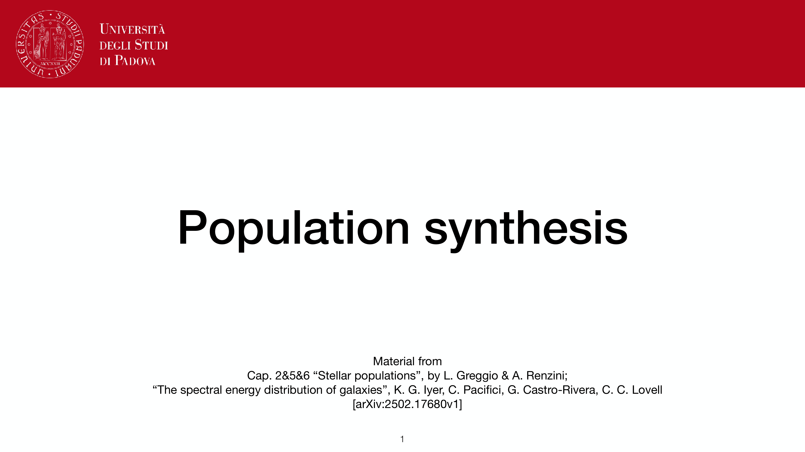
*Lecture 7: Stellar Population Synthesis (SPS) (Prof. Paolo Cassata).*

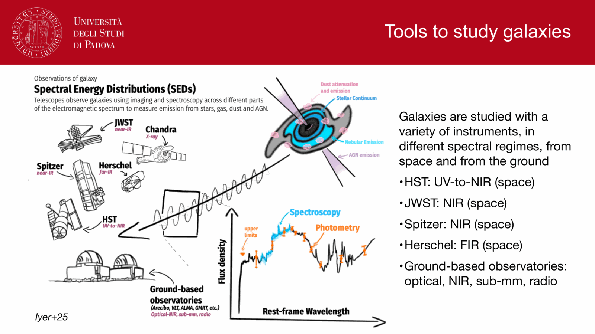
*The forward problem of population synthesis: convolving star formation and chemical history.*

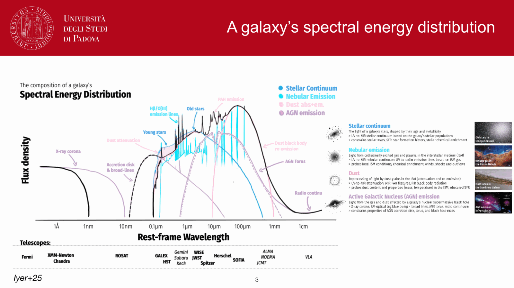
*Master convolution equation: L_lambda(t) = int_0^t psi(t - tau) * L_lambda,SSP(tau, Z(t - tau)) d tau.*


*Resolved stellar populations (CMD analysis) vs unresolved populations (integrated SED).*

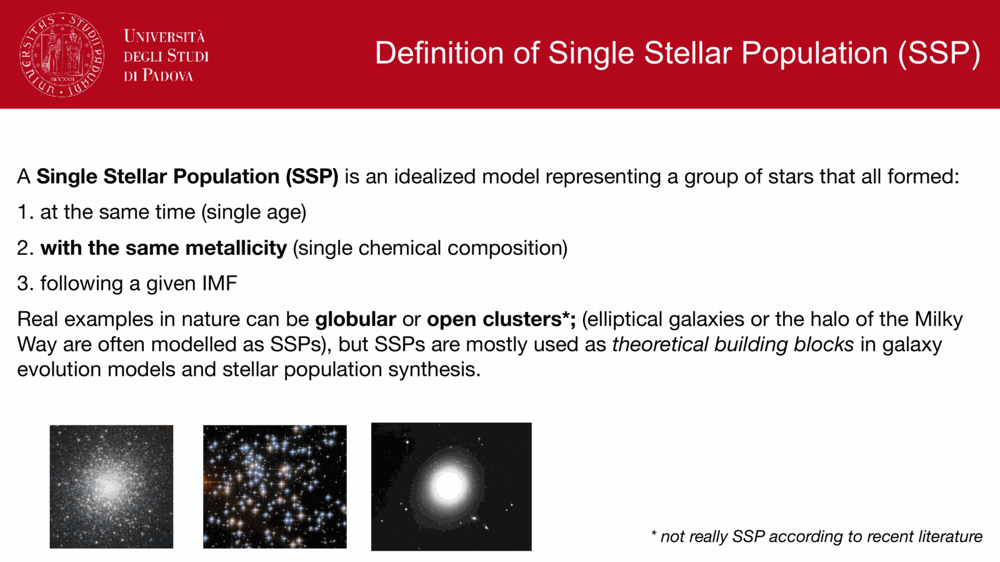
*Spectral energy distribution (SED) features: 4000 A break (D_4000) and Balmer break (3646 A).*

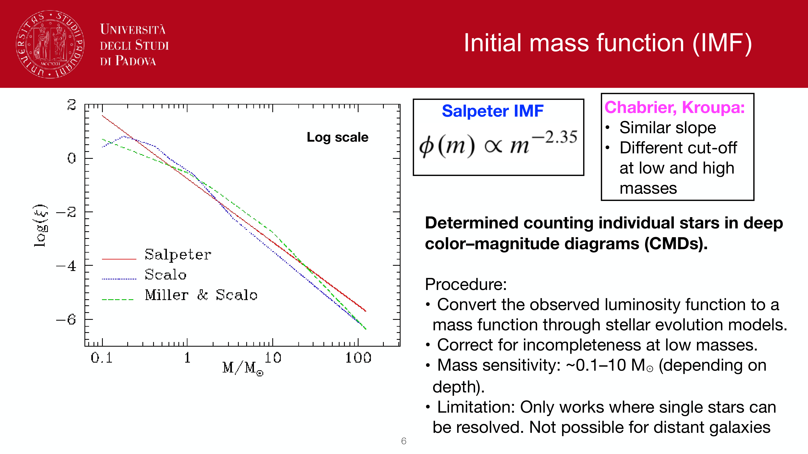
*D_4000 as age and metallicity diagnostic in early-type galaxies.*

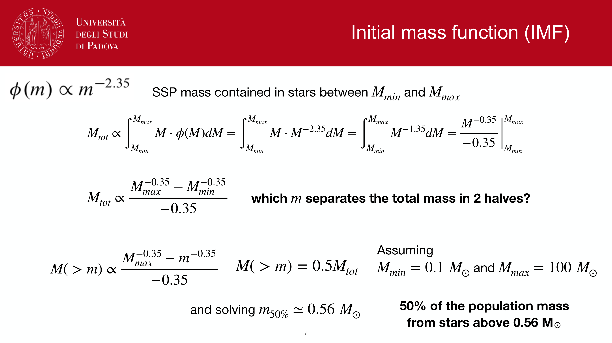
*Balmer break strength in post-starburst (A-type star dominated) galaxies.*

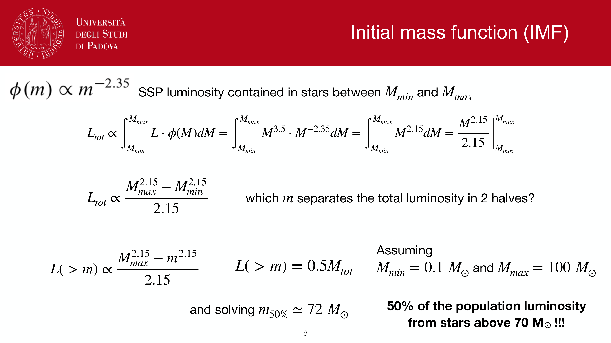
*UV continuum slope beta (f_lambda proportional to lambda^beta) as tracer of dust and young stars.*

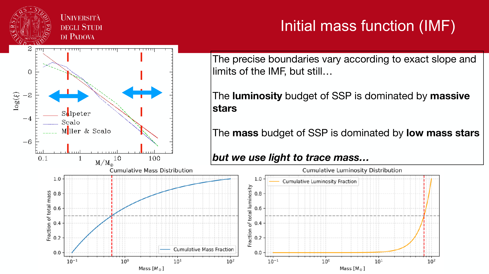
*Optical-to-NIR color evolution as stars age along the isochrones.*

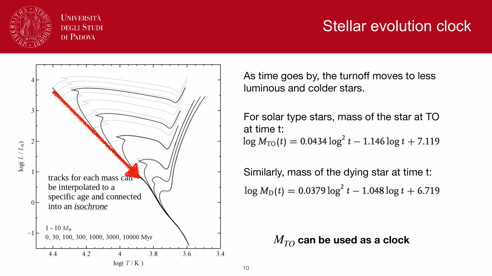
*Mass return fraction R(t): gas returned to ISM via stellar winds and supernovae (~30-40%).*

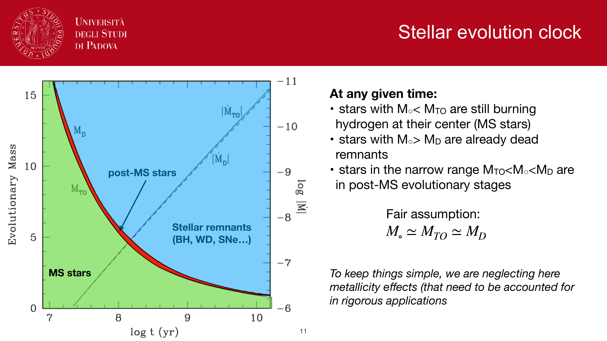
*Remnant mass fraction in white dwarfs, neutron stars, and black holes.*

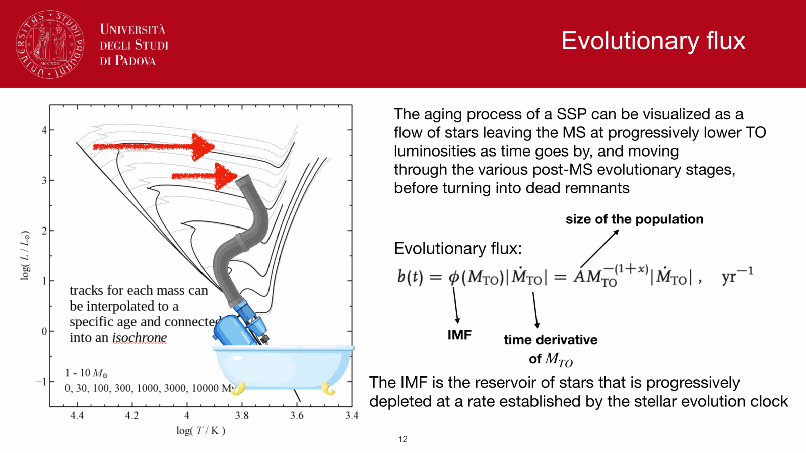
*Panchromatic galaxy SED: stellar continuum, dust absorption, nebular emission lines, FIR emission.*


<div class="backlinks-section">
  <h4 class="backlinks-title">Linked References (24)</h4>
  <ul class="backlinks-list">
    <li class="backlink-item-wrap"><a href="./Age%20estimation%20in%20unresolved%20populations.html" class="backlink-item">Age estimation in unresolved populations</a></li>
    <li class="backlink-item-wrap"><a href="./Age-metallicity%20degeneracy.html" class="backlink-item">Age-metallicity degeneracy</a></li>
    <li class="backlink-item-wrap"><a href="./Alpha-Fe%20enhancement.html" class="backlink-item">Alpha-Fe enhancement</a></li>
    <li class="backlink-item-wrap"><a href="./Chemical%20evolution%20of%20galaxies.html" class="backlink-item">Chemical evolution of galaxies</a></li>
    <li class="backlink-item-wrap"><a href="./Dust%20attenuation%20and%20extinction%20curves.html" class="backlink-item">Dust attenuation and extinction curves</a></li>
    <li class="backlink-item-wrap"><a href="./Dust%20attenuation%20in%20synthetic%20populations.html" class="backlink-item">Dust attenuation in synthetic populations</a></li>
    <li class="backlink-item-wrap"><a href="./Galaxy%20spectroscopy%20by%20type.html" class="backlink-item">Galaxy spectroscopy by type</a></li>
    <li class="backlink-item-wrap"><a href="./Initial%20mass%20function.html" class="backlink-item">Initial mass function</a></li>
    <li class="backlink-item-wrap"><a href="./Lick%20indices.html" class="backlink-item">Lick indices</a></li>
    <li class="backlink-item-wrap"><a href="./Metallicity%20and%20chemical%20evolution.html" class="backlink-item">Metallicity and chemical evolution</a></li>
    <li class="backlink-item-wrap"><a href="../../04_Atlas/Observational_Astrophysics_MOC.html" class="backlink-item">Observational_Astrophysics_MOC</a></li>
    <li class="backlink-item-wrap"><a href="../../04_Atlas/Observational_Cosmology_MOC.html" class="backlink-item">Observational_Cosmology_MOC</a></li>
    <li class="backlink-item-wrap"><a href="./PCA%20spectral%20classification%20of%20galaxies.html" class="backlink-item">PCA spectral classification of galaxies</a></li>
    <li class="backlink-item-wrap"><a href="../../02_Literature/Lectures/Observational_Cosmology/Pablo_03_Star_formation_in_galaxies.html" class="backlink-item">Pablo_03_Star_formation_in_galaxies</a></li>
    <li class="backlink-item-wrap"><a href="./Photometric%20redshifts.html" class="backlink-item">Photometric redshifts</a></li>
    <li class="backlink-item-wrap"><a href="./SED%20fitting%20basics.html" class="backlink-item">SED fitting basics</a></li>
    <li class="backlink-item-wrap"><a href="./SED%20fitting%20for%20SFH.html" class="backlink-item">SED fitting for SFH</a></li>
    <li class="backlink-item-wrap"><a href="./SFH%20from%20resolved%20CMDs.html" class="backlink-item">SFH from resolved CMDs</a></li>
    <li class="backlink-item-wrap"><a href="./SPS%20code%20families.html" class="backlink-item">SPS code families</a></li>
    <li class="backlink-item-wrap"><a href="./Single%20stellar%20population%20SSP.html" class="backlink-item">Single stellar population SSP</a></li>
    <li class="backlink-item-wrap"><a href="./Star%20formation%20history%20of%20a%20population.html" class="backlink-item">Star formation history of a population</a></li>
    <li class="backlink-item-wrap"><a href="./Star%20formation%20history%20parametrizations.html" class="backlink-item">Star formation history parametrizations</a></li>
    <li class="backlink-item-wrap"><a href="./Stellar%20mass%20estimation%20in%20unresolved%20populations.html" class="backlink-item">Stellar mass estimation in unresolved populations</a></li>
    <li class="backlink-item-wrap"><a href="./Why%20hot%20massive%20stars%20dominate%20luminosity.html" class="backlink-item">Why hot massive stars dominate luminosity</a></li>
  </ul>
</div>
