in 1944, during wartime blackouts in California, **Walter Baade** used the 100-inch Mount Wilson telescope to resolve individual stars in the central regions of the Andromeda Galaxy (M31) and its companion dwarf ellipticals. he made the profound discovery that stars in galaxies divide into two distinct kinematic and chemical families: **Population I** and **Population II**.

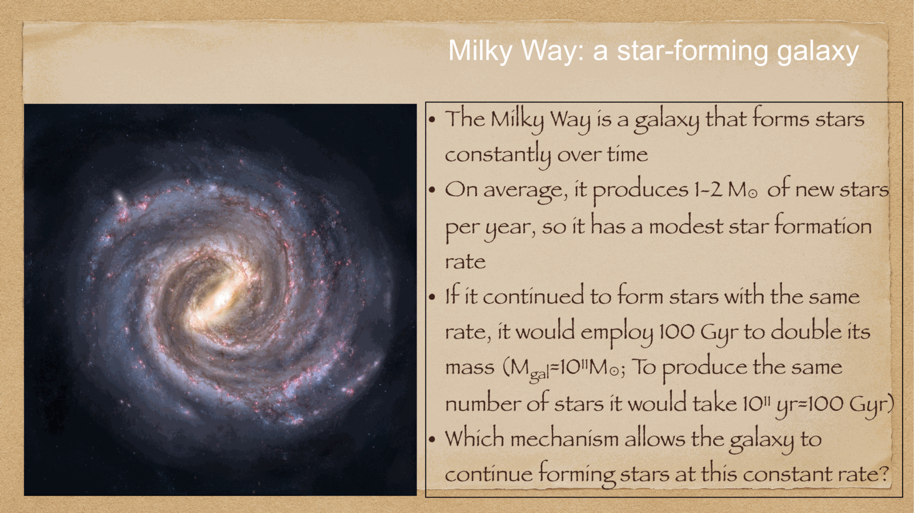

---

## characteristics of Population I and Population II

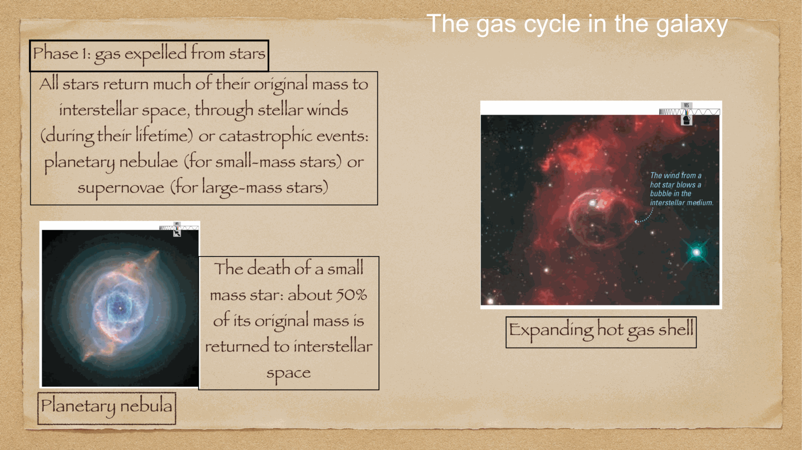

| property | Population I (Disk Population) | Population II (Halo & Globular Cluster Population) |
|---|---|---|
| **age** | young to intermediate ($0 - 9$ Gyr) | ancient ($10 - 13.5$ Gyr) |
| **spatial distribution** | confined strictly to the **thin disk** ($h_z \approx 300$ pc) and spiral arms | distributed throughout the **spheroidal halo**, globular clusters, and bulge |
| **kinematics** | ordered circular orbits in the disk plane; low vertical velocity dispersion ($\sigma_z \sim 15-20$ km/s) | chaotic, highly inclined, eccentric orbits plunging through the disk; high velocity dispersion ($\sigma_v \sim 150$ km/s) |
| **metallicity** $[\text{Fe}/\text{H}]$ | metal-rich: $[\text{Fe}/\text{H}] \approx -0.3 \text{ to } +0.3$ ($Z \sim 0.01-0.03$) | metal-poor: $[\text{Fe}/\text{H}] \approx -1.0 \text{ to } -4.0$ ($Z < 0.002$) |
| **interstellar gas/dust** | embedded in gas-rich molecular clouds; active star formation | virtually gas-free; no ongoing star formation |
| **brightest stars** | luminous blue supergiants (O and B stars) | luminous cool red giants and asymptotic giant branch (AGB) stars |
| **representative objects** | the Sun, Pleiades, open clusters, Orion nebula | M13, M92, halo subdwarfs, globular clusters |

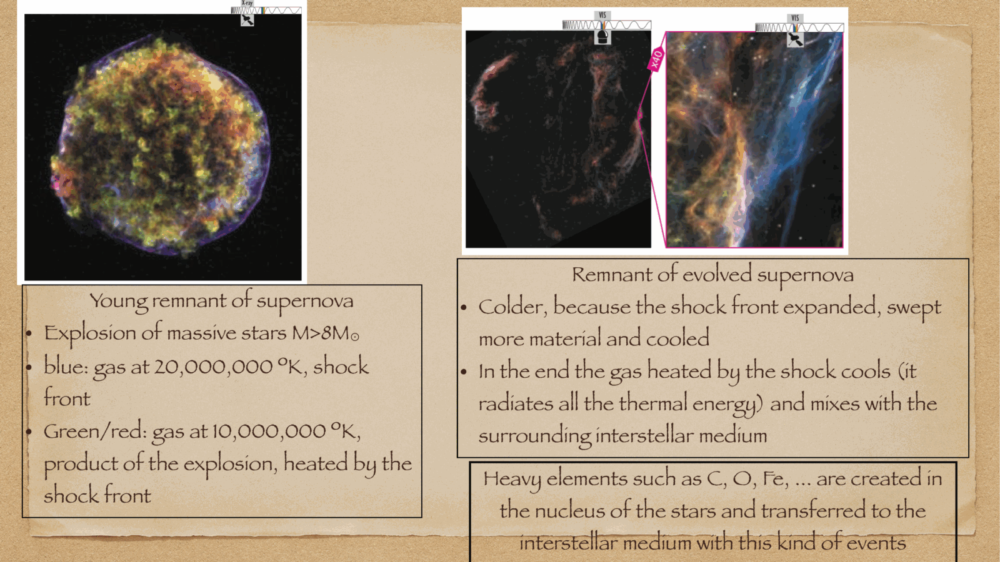

---

## kinematics and orbital differences

measuring stellar velocity dispersions demonstrates that the two populations have completely distinct dynamical support:
- **Population I (rotation-supported)**: ordered disk rotation speed $v_{\text{rot}} \approx 220$ km/s dwarfs the random velocity dispersion $\sigma \sim 20$ km/s ($v_{\text{rot}}/\sigma \gg 1$).
- **Population II (pressure-supported)**: net rotation is very low ($v_{\text{rot}} \sim 0-40$ km/s), while random velocity dispersion is massive ($\sigma \sim 120-150$ km/s, $v_{\text{rot}}/\sigma \ll 1$).

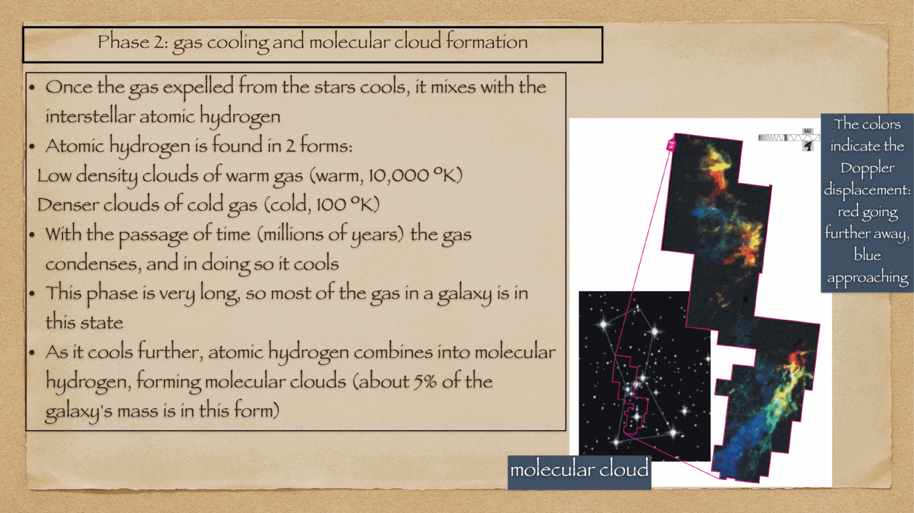

---

## cosmic chemical evolution and Population III

metallicity is defined astrophysically as the mass fraction of all elements heavier than Helium ($Z \equiv M_{\text{metals}}/M_{\text{total}}$):
$$[\text{Fe}/\text{H}] \equiv \log_{10}\left(\frac{N_{\text{Fe}}}{N_{\text{H}}}\right)_* - \log_{10}\left(\frac{N_{\text{Fe}}}{N_{\text{H}}}\right)_\odot$$

because Big Bang nucleosynthesis produced strictly Hydrogen ($75\%$) and Helium ($25\%$) with only trace Lithium ($Z = 0$), the chemical enrichment of the Universe proceeds unidirectionally via stellar nucleosynthesis:

$$\boxed{\, \textbf{Pop III} \; (Z = 0) \;\to\; \textbf{Pop II} \; (Z < 0.002) \;\to\; \textbf{Pop I} \; (Z \sim 0.02) \,}$$

1. **Population III stars**: the hypothetical first generation of stars formed from primordial zero-metallicity gas at $z \sim 20-30$. without metal lines or dust for cooling, the Jeans mass was huge ($M \sim 100-300 M_\odot$). they lived fast ($< 3$ Myr) and died in hypernovae or pair-instability supernovae, seeding the cosmos with its very first metals.
2. **Population II stars**: formed from the slightly enriched gas ejected by Pop III stars. their low metallicity permitted the formation of long-lived, low-mass stars ($M \sim 0.8 M_\odot$) that survive today in globular clusters.
3. **Population I stars**: formed from gas recycled through generations of supernovae, planetary nebulae, and AGB stellar winds, accumulating heavy elements sufficient for rocky planets and life.

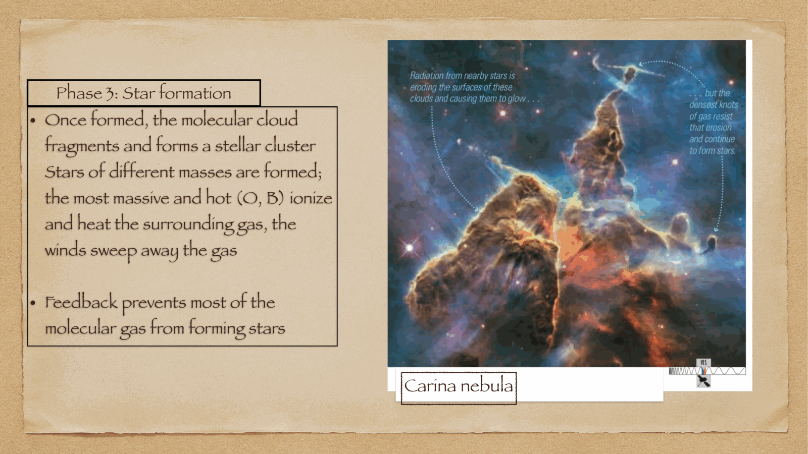

---

## see also

- [Fundamentals_Astrophysics_Cosmology_MOC](../../04_Atlas/Fundamentals_Astrophysics_Cosmology_MOC.html)
- [Milky Way structure](Milky%20Way%20structure.html)
- [Interstellar medium components and gas cycle](Interstellar%20medium%20components%20and%20gas%20cycle.html)
- [Cluster ages from CMD turnoff](Cluster%20ages%20from%20CMD%20turnoff.html)
- [BBN_overview](BBN_overview.html)

---

## observational astrophysics course slides (Prof. Paolo Cassata)

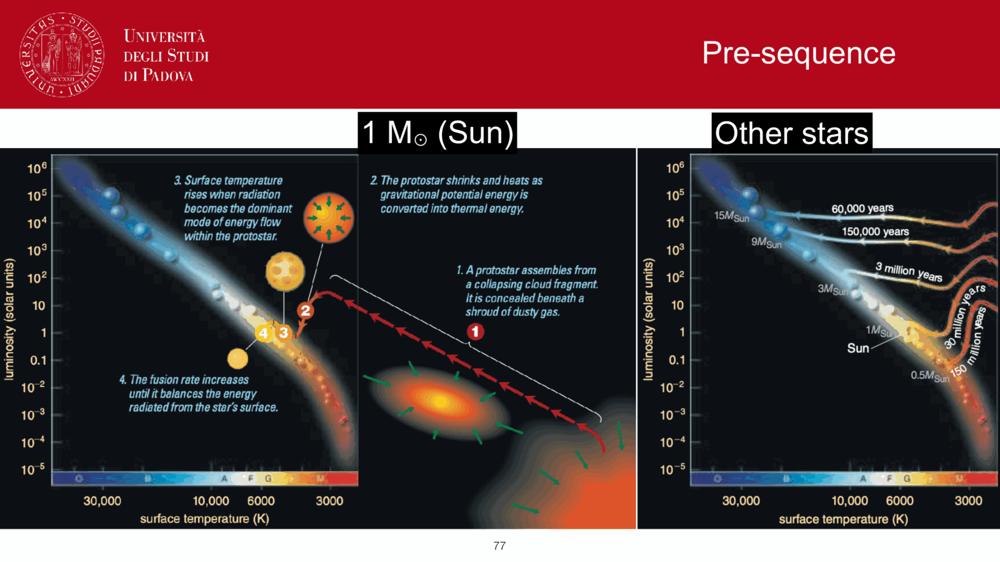
*Walter Baade 1944 discovery: resolution of stars in M31 and satellites into Population I and II.*

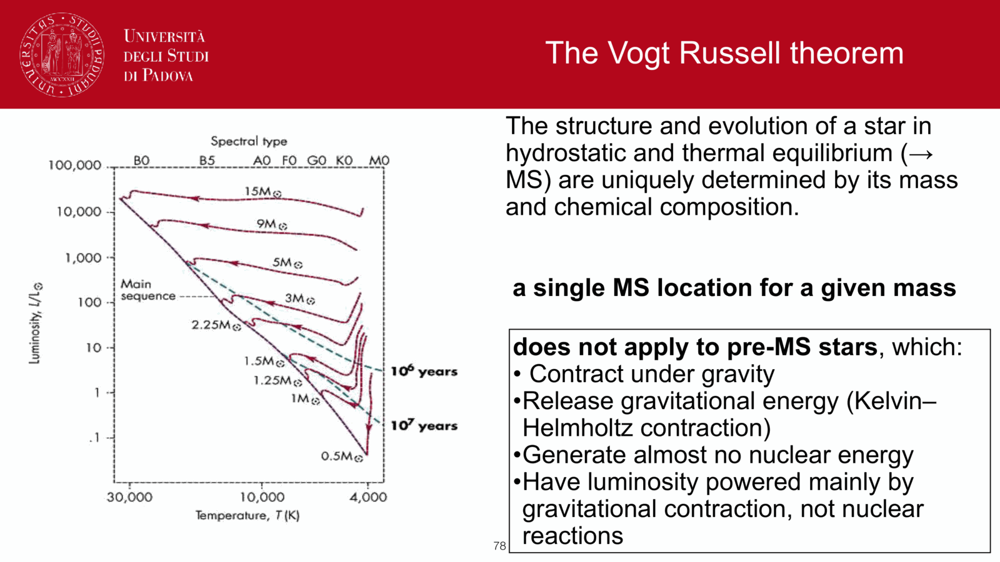
*Population I: young stars, open clusters, gas and dust, metal-rich (Z ~ 0.014-0.03), circular planar orbits.*

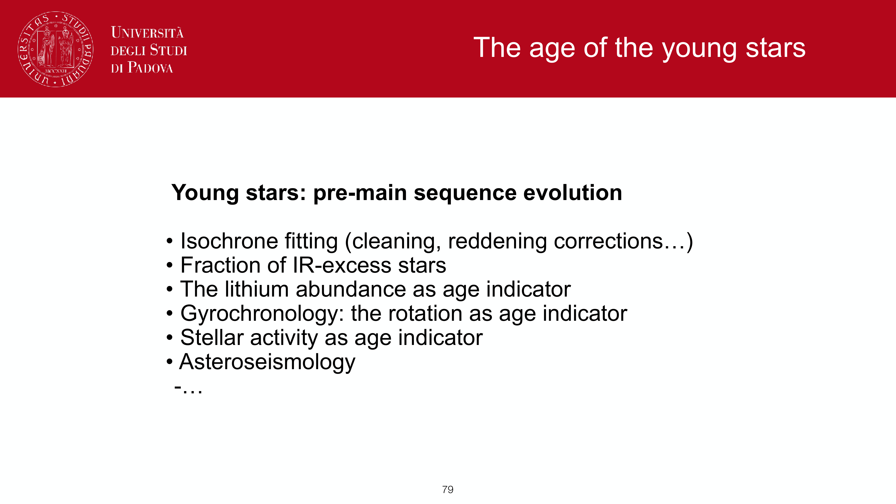
*Population II: ancient stars, globular clusters, metal-poor (Z < 0.001), high-velocity eccentric orbits in halo.*

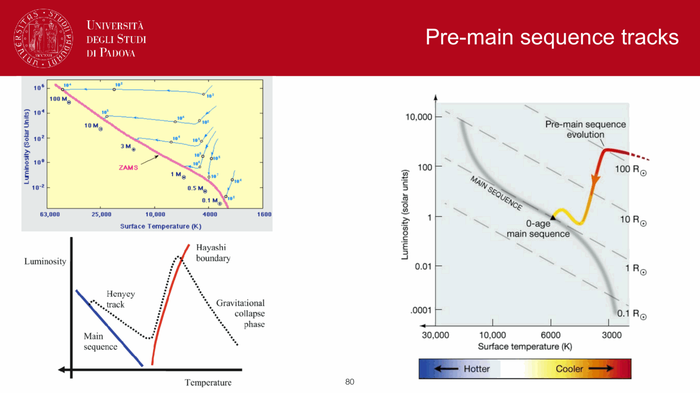
*Kinematics: velocity ellipsoid and velocity dispersion sigma_v of Pop I vs Pop II.*

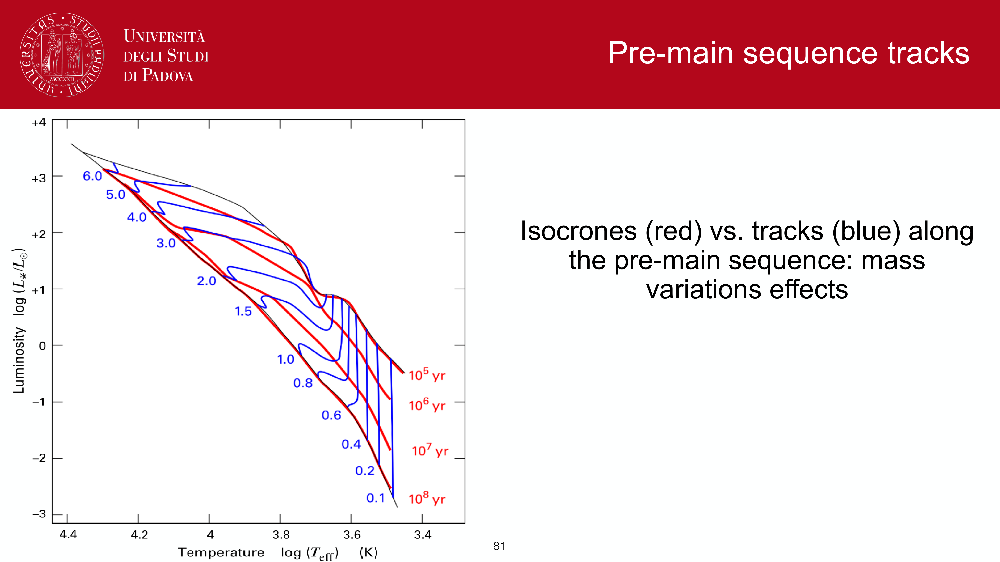
*Eggen, Lynden-Bell & Sandage (ELS 1962) rapid monolithic collapse model of the Milky Way.*

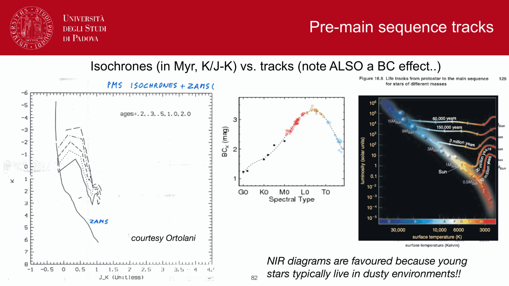
*Searle & Zinn (1978) hierarchical accretion model of galactic halo formation.*

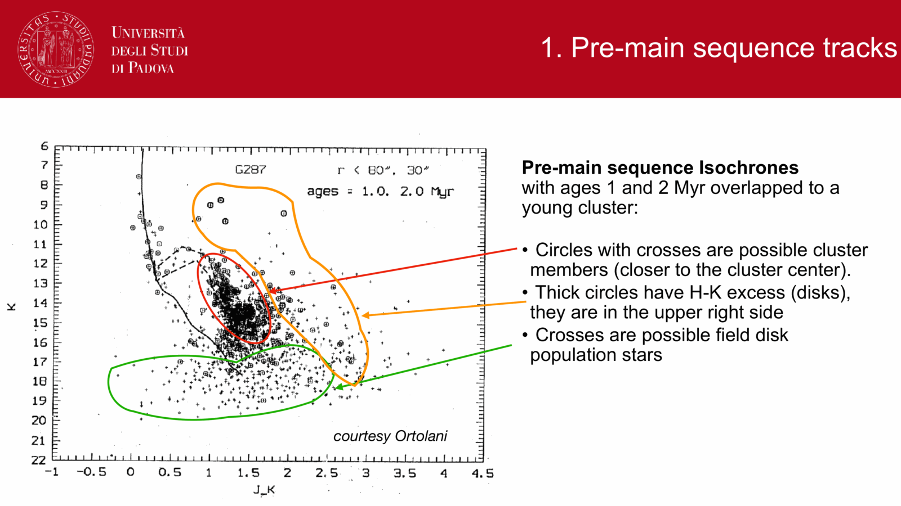
*Thin disk, thick disk, bulge, and halo stellar population taxonomy.*

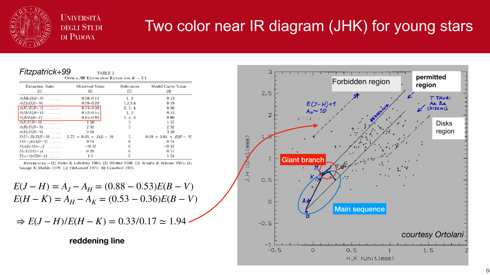
*Thick disk characteristics: intermediate age (8-10 Gyr), [Fe/H] ~ -0.6, scale height z_h ~ 1000 pc.*

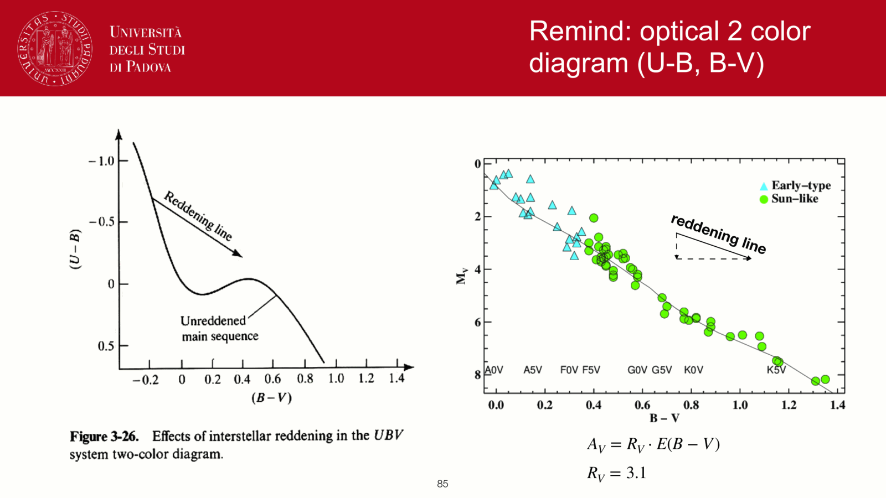
*Bulge stellar populations: predominantly old, metal-rich with wide metallicity spread.*

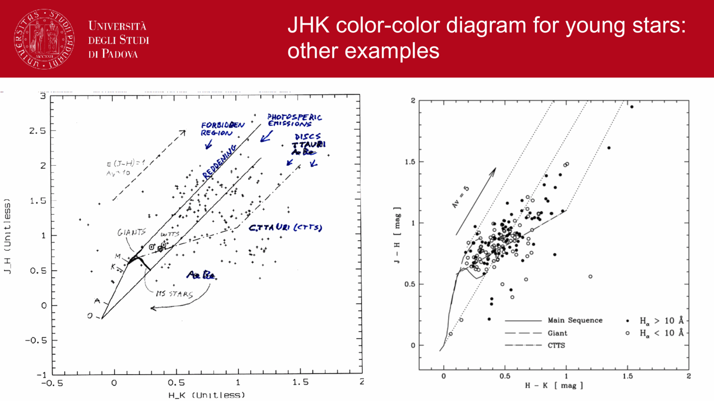
*Population III stars: theoretical first generation formed from primordial pristine gas (Z = 0).*

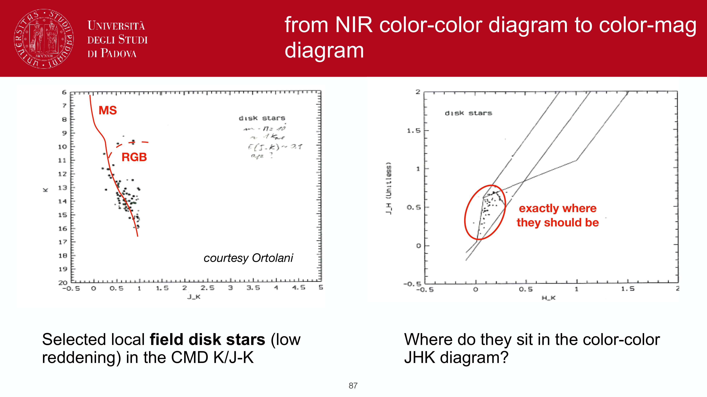
*Cooling in pristine gas dominated by H2 molecules: higher Jeans mass (M ~ 20-100 M_Sun).*

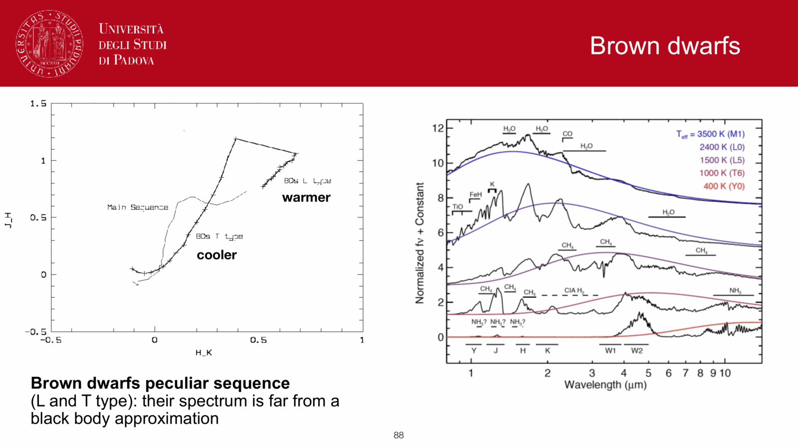
*Pair-instability supernovae (PISN) of Pop III stars (140 M_Sun < M < 260 M_Sun).*

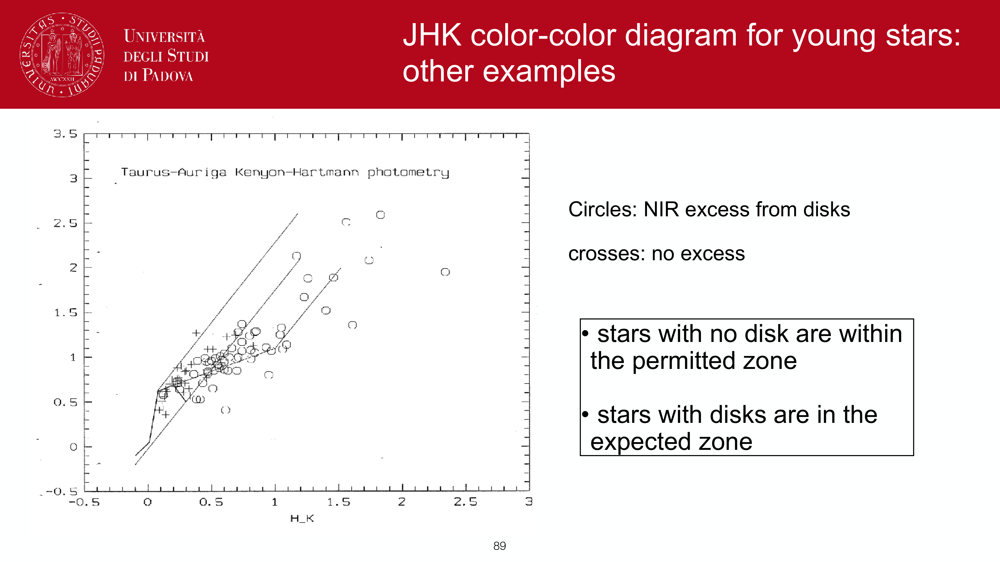
*Cosmic reionization driven by ionizing photons from massive Pop III stars.*

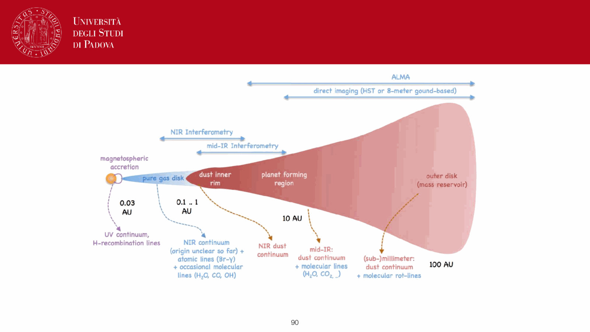
*Search for Pop III survivors and ultra-metal-poor (EMP / UMP) stars in the Galactic halo.*

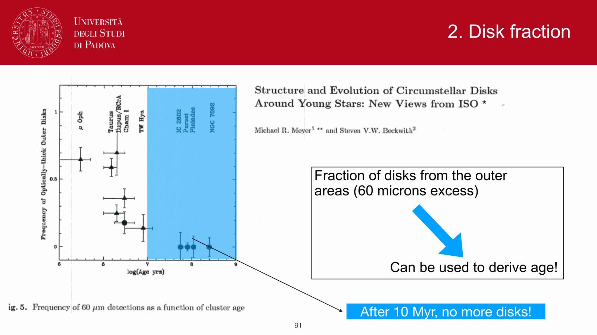
*Extremely metal-poor star SMSS J0313-6708 with [Fe/H] < -7.1.*

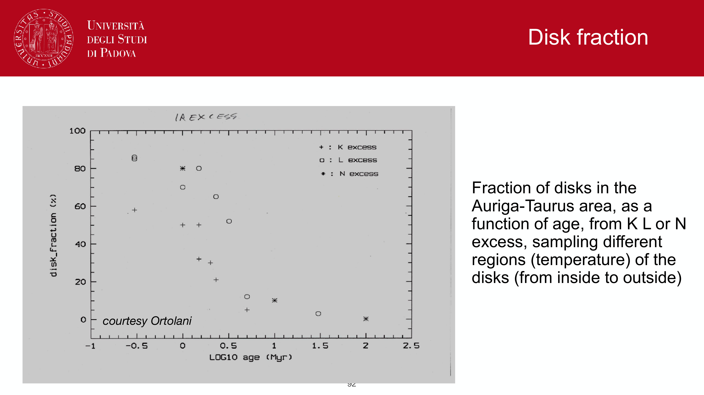
*Summary of stellar population characteristics.*

  <h4 class="backlinks-title">Linked References (34)</h4>
  <ul class="backlinks-list">
    <li class="backlink-item-wrap"><a href="Age%20estimation%20in%20unresolved%20populations.html" class="backlink-item">Age estimation in unresolved populations</a></li>
    <li class="backlink-item-wrap"><a href="CMD%20constraints%20on%20disk%20vs%20halo%20populations.html" class="backlink-item">CMD constraints on disk vs halo populations</a></li>
    <li class="backlink-item-wrap"><a href="CN%20CH%20MgAl%20anticorrelations.html" class="backlink-item">CN CH MgAl anticorrelations</a></li>
    <li class="backlink-item-wrap"><a href="Cluster%20ages%20from%20CMD%20turnoff.html" class="backlink-item">Cluster ages from CMD turnoff</a></li>
    <li class="backlink-item-wrap"><a href="Color-magnitude%20diagrams%20of%20clusters.html" class="backlink-item">Color-magnitude diagrams of clusters</a></li>
    <li class="backlink-item-wrap"><a href="GC%20formation%20models%20with%20MPs.html" class="backlink-item">GC formation models with MPs</a></li>
    <li class="backlink-item-wrap"><a href="Galactic%20halo%20and%20bulge%20formation%20timescales.html" class="backlink-item">Galactic halo and bulge formation timescales</a></li>
    <li class="backlink-item-wrap"><a href="Halo%20accretion%20from%20dwarf%20galaxies.html" class="backlink-item">Halo accretion from dwarf galaxies</a></li>
    <li class="backlink-item-wrap"><a href="IMF%20from%20cluster%20luminosity%20functions.html" class="backlink-item">IMF from cluster luminosity functions</a></li>
    <li class="backlink-item-wrap"><a href="Interstellar%20medium%20components%20and%20gas%20cycle.html" class="backlink-item">Interstellar medium components and gas cycle</a></li>
    <li class="backlink-item-wrap"><a href="MK%20luminosity%20classes.html" class="backlink-item">MK luminosity classes</a></li>
    <li class="backlink-item-wrap"><a href="MaNGA%20survey.html" class="backlink-item">MaNGA survey</a></li>
    <li class="backlink-item-wrap"><a href="Mass%20dependence%20of%20multiple%20populations.html" class="backlink-item">Mass dependence of multiple populations</a></li>
    <li class="backlink-item-wrap"><a href="Metallicity%20and%20chemical%20evolution.html" class="backlink-item">Metallicity and chemical evolution</a></li>
    <li class="backlink-item-wrap"><a href="Milky%20Way%20structure.html" class="backlink-item">Milky Way structure</a></li>
    <li class="backlink-item-wrap"><a href="Multiple%20populations%20in%20GCs%20discovery.html" class="backlink-item">Multiple populations in GCs discovery</a></li>
    <li class="backlink-item-wrap"><a href="Na%20O%20anticorrelation.html" class="backlink-item">Na O anticorrelation</a></li>
    <li class="backlink-item-wrap"><a href="Open%20clusters%20as%20young%20SSP%20laboratories.html" class="backlink-item">Open clusters as young SSP laboratories</a></li>
    <li class="backlink-item-wrap"><a href="Planetary%20nebula%20spectroscopy.html" class="backlink-item">Planetary nebula spectroscopy</a></li>
    <li class="backlink-item-wrap"><a href="Polluter%20scenarios%20for%20second-generation%20GC%20stars.html" class="backlink-item">Polluter scenarios for second-generation GC stars</a></li>
    <li class="backlink-item-wrap"><a href="Pop%20III%20remnants%20in%20UFDGs.html" class="backlink-item">Pop III remnants in UFDGs</a></li>
    <li class="backlink-item-wrap"><a href="Population%20I%20and%20II%20stars.html" class="backlink-item">Population I and II stars</a></li>
    <li class="backlink-item-wrap"><a href="Proper%20motion%20and%20stellar%20kinematics.html" class="backlink-item">Proper motion and stellar kinematics</a></li>
    <li class="backlink-item-wrap"><a href="Single%20stellar%20population%20SSP.html" class="backlink-item">Single stellar population SSP</a></li>
    <li class="backlink-item-wrap"><a href="Stellar%20atmosphere%20structure.html" class="backlink-item">Stellar atmosphere structure</a></li>
    <li class="backlink-item-wrap"><a href="Stellar%20mass%20function%20xi%28M%29.html" class="backlink-item">Stellar mass function xi(M)</a></li>
    <li class="backlink-item-wrap"><a href="Supernova%20spectroscopy.html" class="backlink-item">Supernova spectroscopy</a></li>
    <li class="backlink-item-wrap"><a href="Surface%20brightness%20fluctuations.html" class="backlink-item">Surface brightness fluctuations</a></li>
    <li class="backlink-item-wrap"><a href="Type%20I%20and%20Type%20II%20GCs.html" class="backlink-item">Type I and Type II GCs</a></li>
    <li class="backlink-item-wrap"><a href="UFDG%20star%20formation%20histories.html" class="backlink-item">UFDG star formation histories</a></li>
    <li class="backlink-item-wrap"><a href="Ultra-faint%20dwarf%20galaxies%20definition.html" class="backlink-item">Ultra-faint dwarf galaxies definition</a></li>
    <li class="backlink-item-wrap"><a href="Why%20hot%20massive%20stars%20dominate%20luminosity.html" class="backlink-item">Why hot massive stars dominate luminosity</a></li>
    <li class="backlink-item-wrap"><a href="../../04_Atlas/Fundamentals_Astrophysics_Cosmology_MOC.html" class="backlink-item">Fundamentals_Astrophysics_Cosmology_MOC</a></li>
    <li class="backlink-item-wrap"><a href="../../04_Atlas/Observational_Astrophysics_MOC.html" class="backlink-item">Observational_Astrophysics_MOC</a></li>
  </ul>

